\newpage

# Course Information

## Course Staff

- Coordinator/Lecturer
  * Walter Guttmann
    + 033692451
    + walter.guttmann@canterbury.ac.nz

## Assessments and Grading

**Grading policy**

1. You mist achieve an average grade of at least 50% over all assessment items
2. You mist achieve an average grade of at least 45% over all invigilated assessments

**Assessment Items**

- Quizzes (15%)
- Assignment Superquiz (10%)
- Lab Test (15%)
- Final Exam (60%)

## Textbooks/Resources

No textbooks are required, but see the following book for additional information:

- [Carol Critchlow and David Eck; Foundationals of Computation; version 2.3.1, 2011](https://math.hws.edu/FoundationsOfComputation)

\newpage

# Lectures

## Introduction

**Topic overview of the course**

- pattern matching
  * Regular expressions describe patterns
  * Search using REGEX is supported in many programs
  * Can all patterns be described by regular expressions? 
  * One to one with state diagrams and automata
- Compilers
  * Progreams can be run by an interpreter or by compiling them first 
  * Interpreting may be slow
  * Compiling to machine code avoids much of the overhead
  * Compiler performs analysis, code generation and optimisation
  * How can these tasks be automated for different programming languages?
- Syntax analysis
  * Analyses code to determine if the syntax is correct for compiling, this is done by using
  context free grammers *there are other methods of doing this however this is the main one we
  will look at in this course*
  * *does the syntax conform to the languages grammar?*
  * Ideally we want to generate the parser for our language, we will look into how to manually like are
  parser and how regular expressions and pattern matching can be used to evaluate this behaviour.
- Code generation
  * There are formalisms that exist to generate code in order to create compilers via code generation.

\newpage

## Finite Automata and Regular Languages

### Symbols, Strings and Languages

**Languages**

- An alphabet $\Sigma$ is non-empty finite set of *symbols*/
- A string over $\Sigma$ is a finite sequence of symbols from $\Sigma$
- The length of $|\sigma|$ of a string $\sigma$ is the number of symbols in $\sigma$
- The empty string $\epsilon$ is the unique set of length 0
- $\Sigma^{*}$ is the set of all strings over $\Sigma$
- A language $L$ over $\Sigma$ is a set of strings $L \subseteq \Sigma^{\*}$

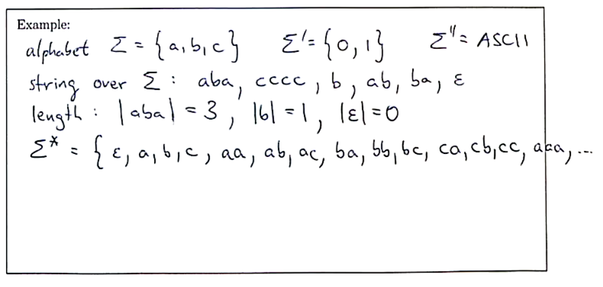

- Note that with a finite alphabet we can have an infinite size for $\Sigma^{\*}$
  * This is because we have not specified a size for our length of elements within $\Sigma^{\*}$

> An example of a set that we might use is the unicode set as Sigma.

For example:

- $python \subset UNICODE$
- $english \subset UNICODE$

Because of this relationship, we can use filtering, searching and `REGEX` in order to
manipulate and set rules around this relationship (or syntax in the case of programming
languages by using comparisons and combination of formalisms.

Let $a, b \in \Sigma$ be symbols and let $x, y, z \in \Sigma^{\*}$ be strings.
- Symbols and strings can be concatenated by writing one after the other
- $xy$ is the concatenated version of $x$ and $y$.
  - Note that concatenation is accociative
- $\epsilon$ is an identity for concatenation $\epsilon x = x = x \epsilon$
- $|xy| = |x| + |y|$

**Lifting to a set**

$Let A,B \subseteq \Sigma^{\*}$ be languages:

- concatenate languages $A$ and $B$ by conciliating each string from $A$ with each from $B$
- $AB = \{xy | x \in A, y \in B\}$
- Language concatenation is associative
- $\{\epsilon\}$ is the identity of language concatenation
  * $x^0 = \epsilon$

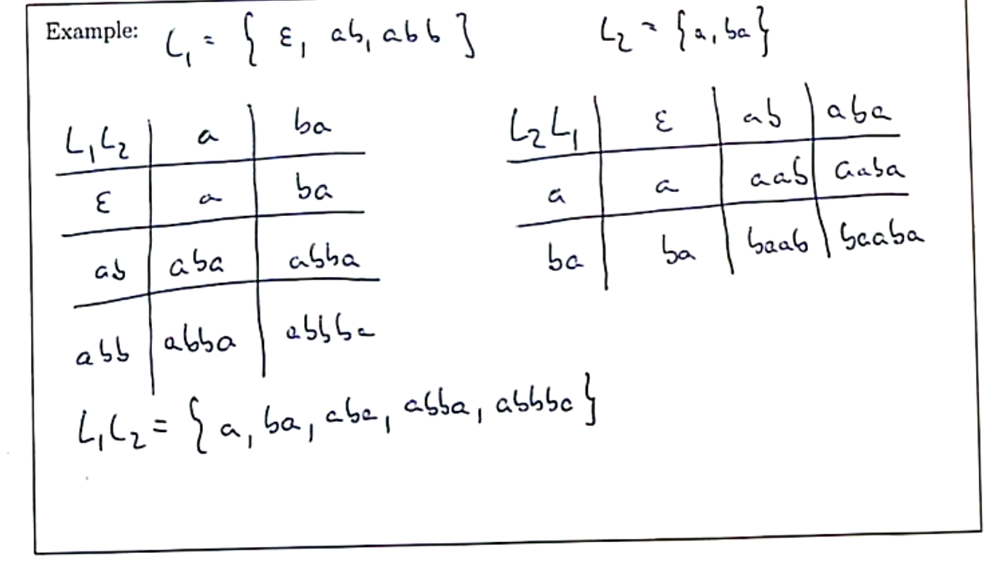

**Concatenation can be iterated**

- $a^n$ is the string comprising $n$ copies of the symbol $a \in \Sigma$
- $x^n$ is the string that concatinates $n$ copies of the string $x \in \Sigma^{\*}$
- These operations are defined *inductively*
- The base case is $x^0 = \epsilon$ 
- The *inductive case* is $x^{n+1} = x^n x$

Example: $a^5 = aaaaa$

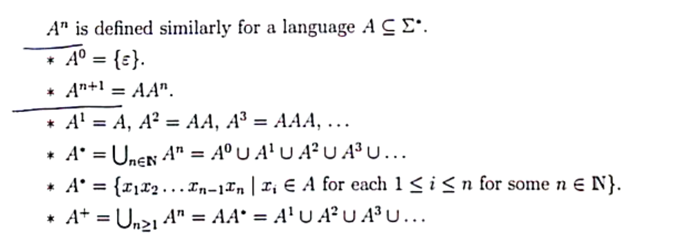

> Take aways, the * symbol means that we have zero or more of something, + means that we have
> one or more of something (this is how we use this notation practically in regex expressions

**Key notation and definitions**

- Sets are languages
- variables are strings
- variables with index are symbols

\newpage

### Deterministic Finite Automata

A *deterministic finite automaton (DFA)* is a structure $M = (Q, \Sigma, \delta, q_0, F)$ where:

- $Q$ is a non-empty finite set, the *states*,
- $\Sigma$ is a non-empty finite set, the *input alphabet*
- $\delta : Q \times \Sigma \rightarrow Q$ is the *transition funtion*
- $q_0 \in Q$ is the *start state*,
- $F \subseteq Q$ is the set of *accept states* or *final states*.

This can be shown in a *transition diagram* for a visual indication of how this might work:

> see lecture 3, 14:00 minutes for information on how to construct these transition diagrams

#### Deterministic Finite Automata Example

Ex 1: The following DFA accepts strings over $\{a,b\}$.

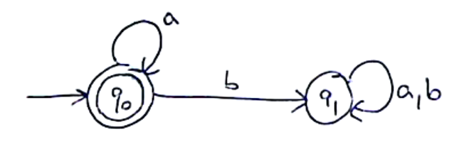{width=50%}


Note, we are trying to conatain an automata that is as least complicated as possible (least nodes).
In the above example, we have this concept of a true state and a false state to the specified condition.
We can also note that state $q_1$ is a *sink state* as once we reach $q_1$ it is impossible to leave that
state (*this is because the condition specifies that we need to contain 0 b's*). 

Ex 2: DFA accepting all strings over $\{a,b\}$ with a number of $a$-symbols that is not a multiple of 4.


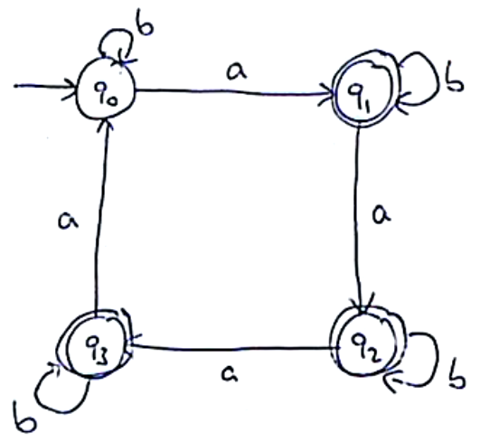{width=50%}


#### Closure of properties of Deterministic Finite Automata

**Exptended transition function**

$$ \hat{\delta} : Q \times \Sigma^{\*} \rightarrow Q$$
$$\hat{\delta}(q, \epsilon) = q$$
$$\hat{\delta}(q, ax) = \hat{\delta}(\delta(q, a), x) \quad where \quad a \in \Sigma, x \in \Sigma^{\*}$$

Now we have seen the basics of DFA's, so how do we get from these basic models to something
that is more complicated? We can use a combination of DFA's in order to define more complicated systems.

**Regular languages are closed under:**

- complement
  * All strings that are not in the set, (generic approach to create such an atomaton)
  * We can get the complement by swapping accepting and non-accepting states
  * If we have a regular language, we know that the complement will always be regular
    + Formal proof provided in `Lecture Four: 27:10`
- intersection *or product automaton*
  * We can combine two automata using an *intersection*, we can use set theory in order
  to satisfy two automata at the same time. We want to check with one automataon to see if
  the string is satisfied
  * $X \cap Y$ is regular if both $X$ and $Y$ are regular
  * Accept states are defined as an acceptance of **both** automata, not just one
  * The product automaton accepting the intersection of the two languages is (*synchronous*):
    * Example found in `Lecture Four: 41:00`
- union
- concatenation
- star

\newpage

### Non-Deterministic Finite Automata

The following automaton accepts strings with a symbol 1 in the third position from the end.
It is not a DFA because there are two 1-transitions in state $q_0$ and no transitions in state 
$q_3$.

- **DFA defined by**: $\delta : Q \times \Sigma \rightarrow Q$
- **NFA defined by**: $\delta : Q \times \Sigma \rightarrow P(Q)$
  * where $P(Q) = \{S | S \subseteq Q\}$, $P(Q)$ is also called the *power set*


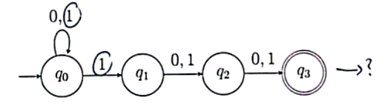


Here is an example of the above transition relation:

| $\delta$     | `         0          ` | `          1          ` |
| ------------ | ------------           | ------------            |
| $q_0$        | {$q_0$}                | {$q_0, q_1$}            |
| $q_1$        | {$q_2$}                | {$q_2$}                 |
| $q_2$        | {$q_3$}                | {$q_3$}                 |
| $q_3$        | {$\emptyset$}          | {$\emptyset$}           |


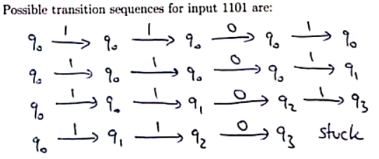

The extended transition relation $\hat{\delta} : Q \times \Sigma^{*} \rightarrow P(Q)$ is

- $\hat{\delta}(q, \epsilon) = \{q\}$
- $\hat{\delta}(q, ax) = \bigcup_{p \in \delta(q,a) \hat{\delta}(p, x)}$ where $a \in \Sigma$ and $x \in \Sigma^{*}$

Example of evaluating this extention can be found in `Friday March 4th Lecture: 8:00`

> The result of this will tell you what states are avalible from the current state (in a recursive nature)  \
> If we check the acceptance criteria for the automaton, we can do this by using this method to get to the last state.

#### The Subset Construction

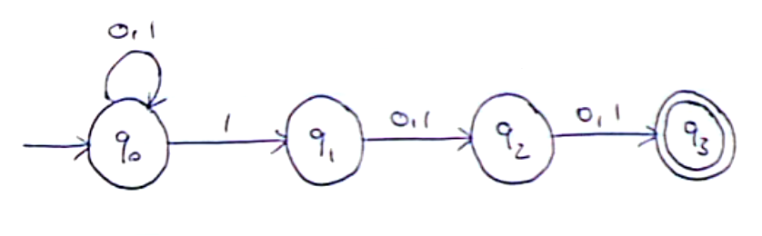

We need to consider all the possible nodes that we can reach from the current state. Below is an
example of how we might do such a traverse on the above automaton. Note that we don't know what 
state we are going to be in, we are considering all possible options at a point in time.

In the following example, the numbers in each node are shorthand notation for the set containing
all possible nodes that we can reach from that value, hence $q_{012} \rightarrow \{q_0, q_1, q_2\}$.

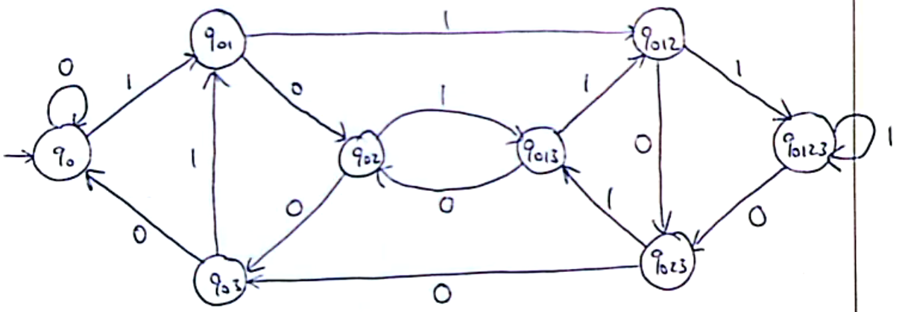

The above construction considers all possibilities of the `non-deterministic automaton`, this allows us to
construct a `deterministic finite automata`, the only change we need to make is to add accpetance states to this construction.

Every language accepted by an `NFA` is accepted by a `DFA`

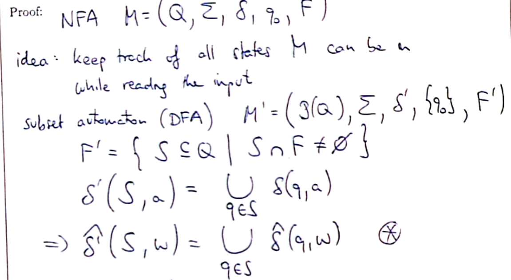
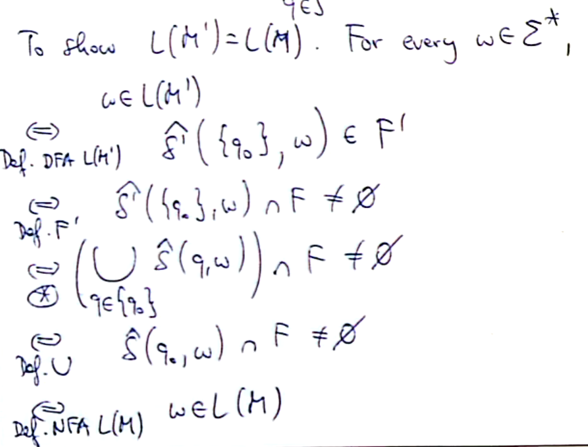

> Through this lecture, we have found an equivilence relation between DFA's and NFA's, meaning that
> we can convert DFA's to NFA's, therefore NFA's accept exactly regular languages. The number of states may grow
> exponentially in the subset construction.

#### Non-Deterministic Finite Automata with $\epsilon$-Transitions

THe following automaton accepts the union of two regular languages. It is not a DFA becuase 
of the $\epsilon$-transitions in state $r_0$.

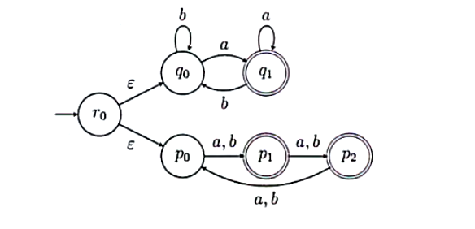

An *NFA* with $\epsilon$ transitions is a structure $M = (Q, \Sigma, \delta, q_0, F)$ where:

- $Q, \Sigma, q_0$ and $F$ are as in a *DFA*,
- $\epsilon$ is a special symbol with $\epsilon \not\in \Sigma$ ,
- $\delta : Q \times (\Sigma \cup \{\epsilon\}) \to P(Q)$ is the transition relation
- $\delta$ may have $\epsilon$-transitions and yields a set of successor states

This is a way to decouple and clarify a set of states and a choice of two transitions in
an automaton, this allows us to clearly identify and mark unions in the automaton.

Here is an example of a *NFA* that is designed in order to check validity of different types of
numbers for a programming language. *Hexadecimal, decimal, octal and binary*.

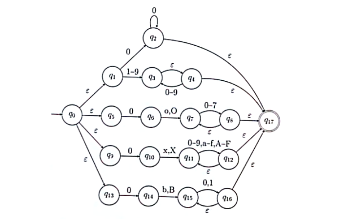

### Regular Expressions

These are partterns that can be used to match substrings in a given string:

- `ls *201?.*` lists files whose name without extension ends in 201 followed by some character
- `ls *a*a*a*` lists any file whose name contains three `a` charaters
- `rm *.log` deletes all log files
- `grep '[A-Z][a-z]\\{3,7\\}'` finds lines with a capital followed by 3-7 lower case letters

Atomic patterns are:

- $a \forall a \in \Sigma$ is matched by the symbol $a$
- $\epsilon$ is matched by the empty string
- $\theta$ is matched by nothing
- `?` is matched by any symbol in $\Sigma$

Compound patterns are formed from patterns *p* and *q* as follows:

- $p|q$ is matched by string $w$ if $w$ matches $p$ or $q$.
- $pq$ is matched by $w$ if $w = xy$ and $x$ matches $p$ and $y$ matches $q$.
- $\not{p}$ matches by $w$ if if $w$ does not match $p$.
- $[p]$ is matched by $w$ if $w$ is empty or matches $p$.

Here are some examples of a compound expression that can be evaluated in order to get its
set of mapped values.

$$L((a | b)) = L(a) \cup L(b) = \{a\} \cup \{b\} = \{a,b\}$$
$$L((a | b)(c | a)) = L(a) \cup L(b) L(c) \cup L(a) = \{a,b\} \cup \{c,a\} = \{ac,aa,bc,ba\}$$

In order to preserve readability, we can ommit parentheses in order to simplify the
expressions. Here is an example: $p|qr* = (p | (q(r)*))$

It is important to realise that we can construct `ANY` regular expression, and all such
expressions will be accepted by a corresponding NFA.

**Creating Automata to only accept single constructs**

For $\epsilon$ construct:

```
    --   E    --
-->|  | ---> |  |
    --        --
```

For $\emptyset$ construct:

```
    --        --
-->|  |      |  |
    --        --
```

More examples can be found in `Lecture 8: 30:00`

> NOTE: include all standard constructs for automatons that are commonly used

The above automatons can be used for formulation of more complicated regular expressions, we simplify
these **at your own risk** as we may be able to save some states (making program more efficent)
however we may find that we are leaving out cases that should be covered by our automaton.

#### Using Regular Expressions as Symbols within Automata

- Transitions may be labelled with regular expressions instead of just symbols from $\Sigma$ or $\epsilon$
- There is just one accept state
- There is at most one transition between any two states
- There are no transtions into the start state or out of the acept state

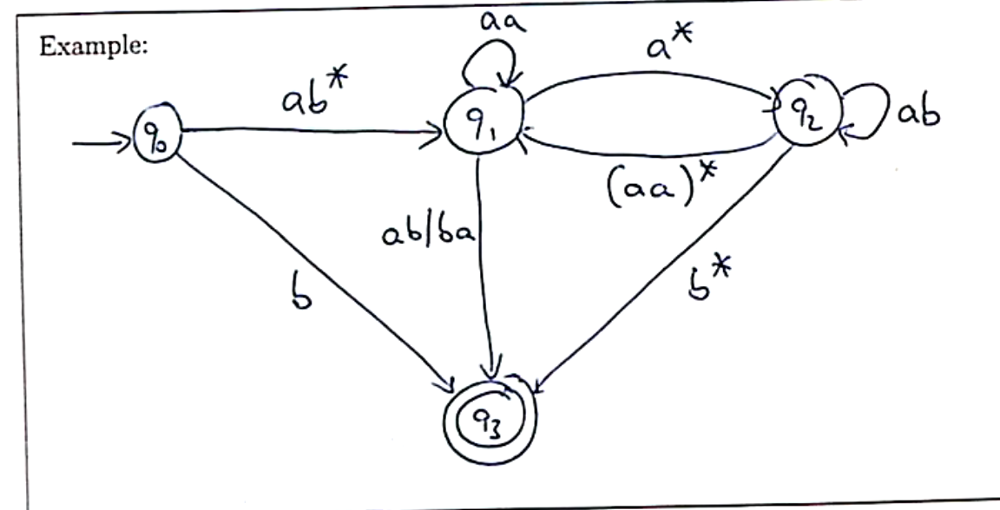

We will see how we can translate any automaton into a regular expression.
The main idea behind how we achieve this is to try to eliminate states from the diagram.

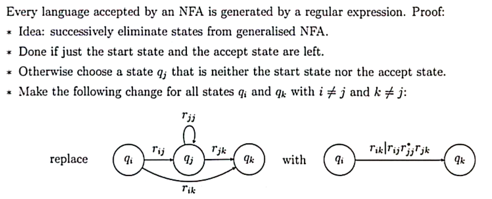

> The hard part of the above process is that we must apply this algorithm to all possible nodes
> and edges, this means that we must apply the same pattern to all possible ways (this is unusual
> and some times difficult).

**Minimisation of Deterministic Finite Automata**

A method to minimise the number of states in a DFA is:

1. Eliminate states which cannot be reached from the start state
2. Find equivalent states
3. Collapse equivilent ststes

The two states are *equivilant* if:

- $\hat{\delta}(p,w) \in F \Longleftrightarrow \hat{\delta}(p,w) \in F \forall w \in \Sigma^{*}$
- The automation accepts the same strings when started in *p* or in *q*.
- Collapsing *p* and *q* does not change the accepted language
- *p* and *q* are *distinguishable* if they are not equivalent

Distringuishable states can be obtained as follows:

- Any $p \in F$ and $q \not\in F$ are distinguishable by $w = \epsilon$
- Let $\delta(p, a) = r$ and $\delta(q,a) = s$ for $a \in \Sigma$
  * If $r$ and $s$ are distinguishable by ($w = x$) then $p$ and $q$ are distinguishable by ($w = ax$)

**Equivilence in finite automata**

We use the notation `p ~ q` if states `p` and `q` are equivilant, the relation `~` has:

- is reflexive: $p \sim p \quad \forall \quad p \in Q$
- is symmetric: $p \sim q$ implies $q \sim p$ for all $p,q \in Q$
- is transitive $p \sim q$ and $q \sim r$ implies $p \sim r$ for each $p,q,r \in Q$

An *equivilence relation* is a relation $\sim \subseteq A \times A$ that is reflexive, symmetric and transitive.

* $[a] = \{b \in A | a \sim b\}$ is the equivalence class of $a \in A$
* $a$ is representative of its equivilence class `[a]`
* $A/\sim = \{[a] | a \in A \}$ is the *quotent* of $A$ by $\sim$
  * This is the set of all equivialence classes

Automaton can start from any nodes that are found in the equivilence class that starting node
$s_0$ is in.

Note that we minimal DFA's are unique up to isomprphism

#### Minimisation algorithm Quotient construction

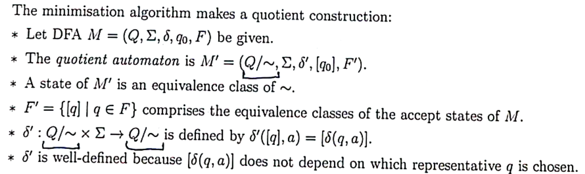

#### Decision Problems for Regular Languages

Simple yes or no problems about the properties of a given set

> See Lecture 10, 24:00 minutes to see how these are done
> Note, Go through these examples and actually implement them for end of year exams [ ]

### Non-Regular Languages

The language $A = {a^n b^n | n \in \mathbb{N}}$ is a non-regular language.

The idea behind this proof is that we can construct a cycle where some iterations of the
cycle are not included in the acceptance state.

* Assume that $A$ is regular, we can prove this by applying contradiction
  * $A = L(M)$ for DFA $M = (Q, \Sigma, \delta, q_0, F)$ with $k$ states
* The transition sequence for input $a^k$ contains $k + 1$ states
* By the pigeonhole principle, a state $q$ is visited twice

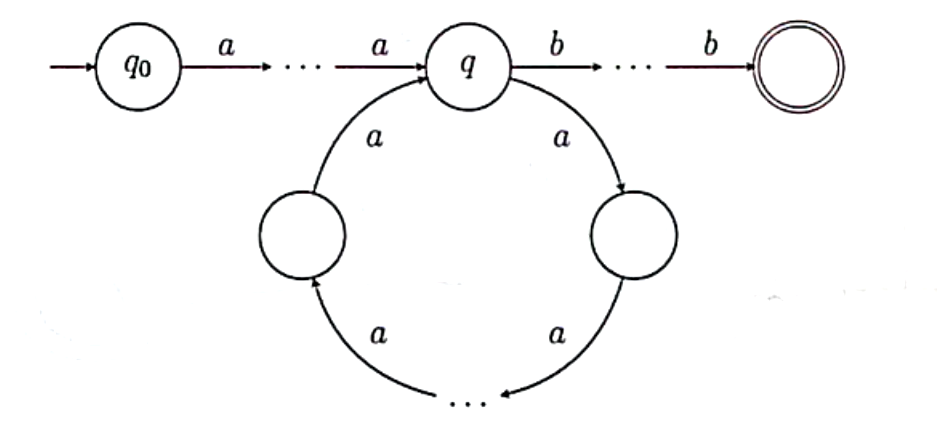

* There are $i, j$ with $- \leq i \leq j \leq k$ and $\hat{\delta}(q_0, a^i) = \hat{\delta}(q_0, a^j)$
* Hence \hat{\delta}(q_0, a^ib^i) = \hat{\delta}(q_0, a^jb^i)$
* But $a^ib^i \in A$ and $a^jb^i \not\in A$, so $a^ib^i \in F$ and $a^jb^i \not\in F$
* This is a contradiction, so the assumption does not hold

#### The Pumping Lemma

The pumping lemma can be used to identify a contradiction to be used in a proof.

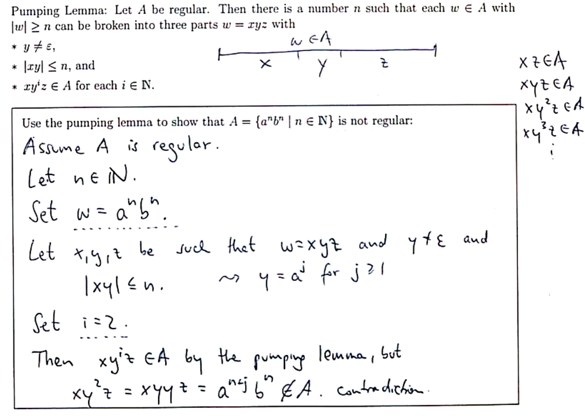

The pumping lemma is an exchange of information between a set of agents, we are able to obtain
certain values from this lemma in order to obtain more information about the problem we are
trying to prove.

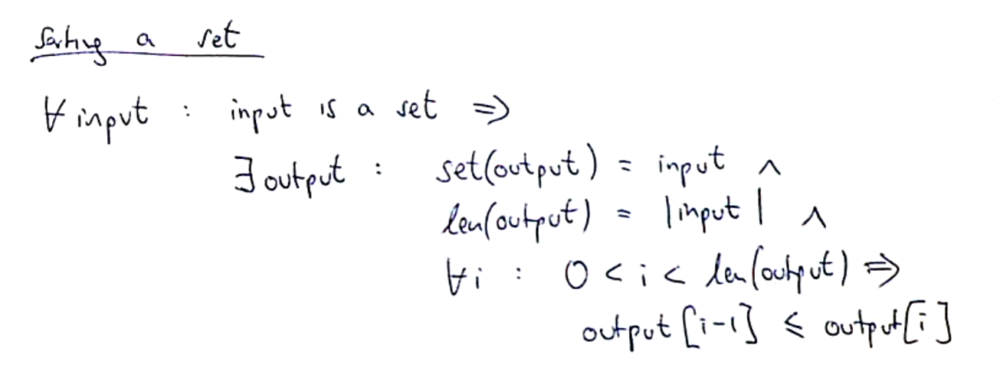

The above figure is displaying how we might solve a programming problem using mathematics and
the pumping lemma, the take away of this is that when we are solving problems in computer science,
we are essentailly proving a mathematical statement. If we can prove the method from this construction,
we do not need to test the output, as we can guarentee that if the proof holds and is the same as the
problem construction, then the program has to work with 100% consistancy.

The pumping lemma shows us that a few languages are non-regular, and if we can map other languages
to the pumping lemma's non-regular languages, then we can determine that that language is also non-
regular

### Modelling Independent Processes

This is a model of concurrency within a program. The *shuffle* operation describes two independent processes:

- The shuffle `x || y` if two strings $x, y \in \Sigma^{*}$ contains all possible interleavings of their symbols 
- For example, `ab||cd = {abcd, acbd, acdb, cabd, cadb, cdab}`
- Shuffle of strings is defined inductively:

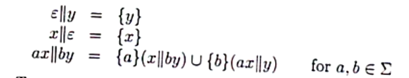


