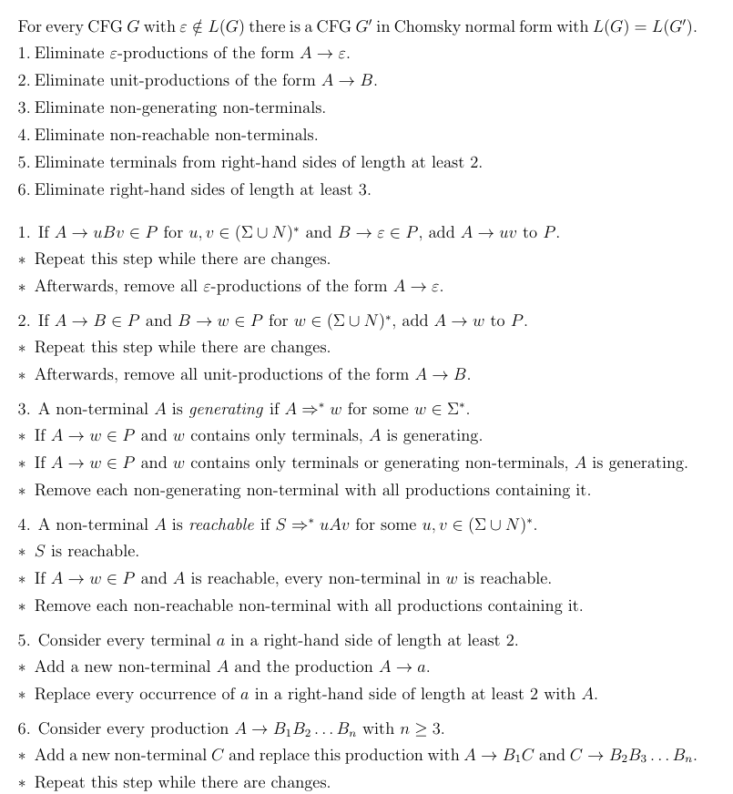
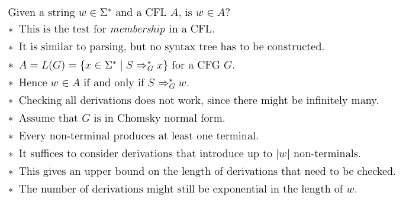
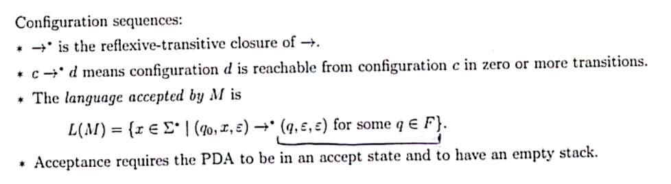
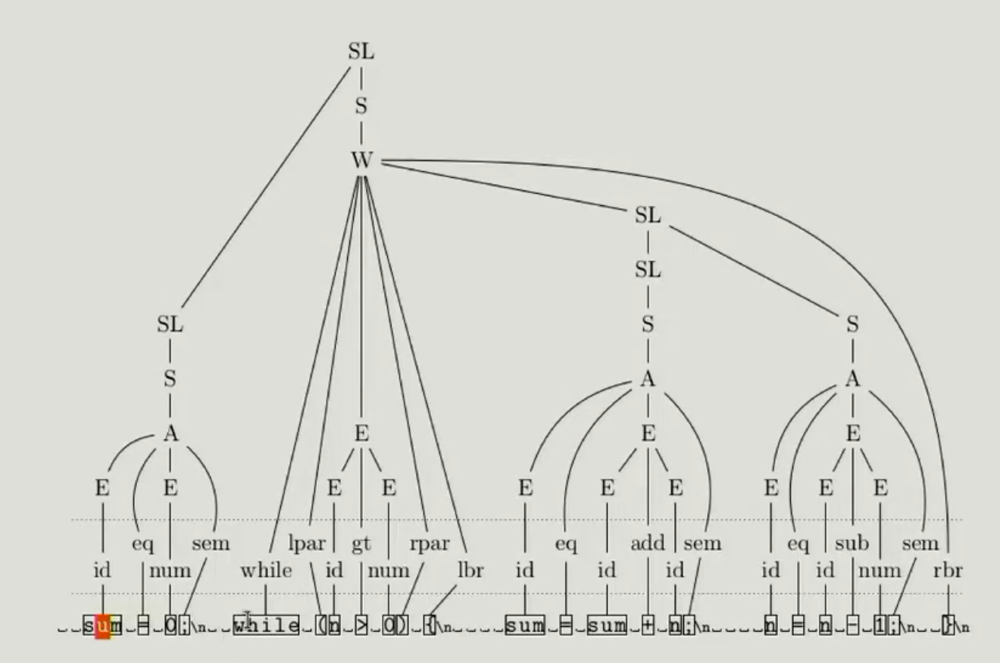
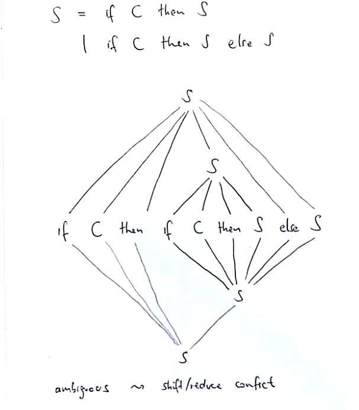

\newpage

# Course Information

## Information about these notes

These notes are meant to be used in conjunction to lecture material provided from COSC261
at the University of Canterbury, there are references and links to particular lectures and
videos about processes that will not be avalible to those reading this later

## Course Staff

- Coordinator/Lecturer
  * Walter Guttmann
    + 033692451
    + walter.guttmann@canterbury.ac.nz

## Assessments and Grading

**Grading policy**

1. You mist achieve an average grade of at least 50% over all assessment items
2. You mist achieve an average grade of at least 45% over all invigilated assessments

**Assessment Items**

- Quizzes (15%)
- Assignment Superquiz (10%)
- Lab Test (35%)
- Final Exam (40%)
    * Held online
    * Covers entire course
    * open book exam

## Textbooks/Resources

No textbooks are required, but see the following book for additional information:

- [Carol Critchlow and David Eck; Foundationals of Computation; version 2.3.1, 2011](https://math.hws.edu/FoundationsOfComputation)

\newpage

# Lectures

## Introduction

**Topic overview of the course**

- pattern matching
  * Regular expressions describe patterns
  * Search using REGEX is supported in many programs
  * Can all patterns be described by regular expressions? 
  * One to one with state diagrams and automata
- Compilers
  * Progreams can be run by an interpreter or by compiling them first 
  * Interpreting may be slow
  * Compiling to machine code avoids much of the overhead
  * Compiler performs analysis, code generation and optimisation
  * How can these tasks be automated for different programming languages?
- Syntax analysis
  * Analyses code to determine if the syntax is correct for compiling, this is done by using
  context free grammers *there are other methods of doing this however this is the main one we
  will look at in this course*
  * *does the syntax conform to the languages grammar?*
  * Ideally we want to generate the parser for our language, we will look into how to manually like are
  parser and how regular expressions and pattern matching can be used to evaluate this behaviour.
- Code generation
  * There are formalisms that exist to generate code in order to create compilers via code generation.

\newpage

## Finite Automata and Regular Languages

### Symbols, Strings and Languages

**Languages**

- An alphabet $\Sigma$ is non-empty finite set of *symbols*/
- A string over $\Sigma$ is a finite sequence of symbols from $\Sigma$
- The length of $|\sigma|$ of a string $\sigma$ is the number of symbols in $\sigma$
- The empty string $\epsilon$ is the unique set of length 0
- $\Sigma^{*}$ is the set of all strings over $\Sigma$
- A language $L$ over $\Sigma$ is a set of strings $L \subseteq \Sigma^{\*}$


- Note that with a finite alphabet we can have an infinite size for $\Sigma^{\*}$
  * This is because we have not specified a size for our length of elements within $\Sigma^{\*}$

> An example of a set that we might use is the unicode set as Sigma.

For example:

- $python \subset UNICODE$
- $english \subset UNICODE$

Because of this relationship, we can use filtering, searching and `REGEX` in order to
manipulate and set rules around this relationship (or syntax in the case of programming
languages by using comparisons and combination of formalisms.

Let $a, b \in \Sigma$ be symbols and let $x, y, z \in \Sigma^{\*}$ be strings.
- Symbols and strings can be concatenated by writing one after the other
- $xy$ is the concatenated version of $x$ and $y$.
  - Note that concatenation is accociative
- $\epsilon$ is an identity for concatenation $\epsilon x = x = x \epsilon$
- $|xy| = |x| + |y|$

**Lifting to a set**

$Let A,B \subseteq \Sigma^{\*}$ be languages:

- concatenate languages $A$ and $B$ by conciliating each string from $A$ with each from $B$
- $AB = \{xy | x \in A, y \in B\}$
- Language concatenation is associative
- $\{\epsilon\}$ is the identity of language concatenation
  * $x^0 = \epsilon$


**Concatenation can be iterated**

- $a^n$ is the string comprising $n$ copies of the symbol $a \in \Sigma$
- $x^n$ is the string that concatinates $n$ copies of the string $x \in \Sigma^{\*}$
- These operations are defined *inductively*
- The base case is $x^0 = \epsilon$ 
- The *inductive case* is $x^{n+1} = x^n x$

Example: $a^5 = aaaaa$


> Take aways, the * symbol means that we have zero or more of something, + means that we have
> one or more of something (this is how we use this notation practically in regex expressions

**Key notation and definitions**

- Sets are languages
- variables are strings
- variables with index are symbols

\newpage

### Deterministic Finite Automata

A *deterministic finite automaton (DFA)* is a structure $M = (Q, \Sigma, \delta, q_0, F)$ where:

- $Q$ is a non-empty finite set, the *states*,
- $\Sigma$ is a non-empty finite set, the *input alphabet*
- $\delta : Q \times \Sigma \rightarrow Q$ is the *transition funtion*
- $q_0 \in Q$ is the *start state*,
- $F \subseteq Q$ is the set of *accept states* or *final states*.

This can be shown in a *transition diagram* for a visual indication of how this might work:

> see lecture 3, 14:00 minutes for information on how to construct these transition diagrams

#### Deterministic Finite Automata Example

Ex 1: The following DFA accepts strings over $\{a,b\}$.

{width=50%}


Note, we are trying to conatain an automata that is as least complicated as possible (least nodes).
In the above example, we have this concept of a true state and a false state to the specified condition.
We can also note that state $q_1$ is a *sink state* as once we reach $q_1$ it is impossible to leave that
state (*this is because the condition specifies that we need to contain 0 b's*). 

Ex 2: DFA accepting all strings over $\{a,b\}$ with a number of $a$-symbols that is not a multiple of 4.


{width=50%}


#### Closure of properties of Deterministic Finite Automata

**Exptended transition function**

$$ \hat{\delta} : Q \times \Sigma^{\*} \rightarrow Q$$
$$\hat{\delta}(q, \epsilon) = q$$
$$\hat{\delta}(q, ax) = \hat{\delta}(\delta(q, a), x) \quad where \quad a \in \Sigma, x \in \Sigma^{\*}$$

Now we have seen the basics of DFA's, so how do we get from these basic models to something
that is more complicated? We can use a combination of DFA's in order to define more complicated systems.

**Regular languages are closed under:**

- complement
  * All strings that are not in the set, (generic approach to create such an atomaton)
  * We can get the complement by swapping accepting and non-accepting states
  * If we have a regular language, we know that the complement will always be regular
    + Formal proof provided in `Lecture Four: 27:10`
- intersection *or product automaton*
  * We can combine two automata using an *intersection*, we can use set theory in order
  to satisfy two automata at the same time. We want to check with one automataon to see if
  the string is satisfied
  * $X \cap Y$ is regular if both $X$ and $Y$ are regular
  * Accept states are defined as an acceptance of **both** automata, not just one
  * The product automaton accepting the intersection of the two languages is (*synchronous*):
    * Example found in `Lecture Four: 41:00`
- union
- concatenation
- star

\newpage

### Non-Deterministic Finite Automata

The following automaton accepts strings with a symbol 1 in the third position from the end.
It is not a DFA because there are two 1-transitions in state $q_0$ and no transitions in state 
$q_3$.

- **DFA defined by**: $\delta : Q \times \Sigma \rightarrow Q$
- **NFA defined by**: $\delta : Q \times \Sigma \rightarrow P(Q)$
  * where $P(Q) = \{S | S \subseteq Q\}$, $P(Q)$ is also called the *power set*


Here is an example of the above transition relation:

| $\delta$     | `         0          ` | `          1          ` |
| ------------ | ------------           | ------------            |
| $q_0$        | {$q_0$}                | {$q_0, q_1$}            |
| $q_1$        | {$q_2$}                | {$q_2$}                 |
| $q_2$        | {$q_3$}                | {$q_3$}                 |
| $q_3$        | {$\emptyset$}          | {$\emptyset$}           |


The extended transition relation $\hat{\delta} : Q \times \Sigma^{*} \rightarrow P(Q)$ is

- $\hat{\delta}(q, \epsilon) = \{q\}$
- $\hat{\delta}(q, ax) = \bigcup_{p \in \delta(q,a) \hat{\delta}(p, x)}$ where $a \in \Sigma$ and $x \in \Sigma^{*}$

Example of evaluating this extention can be found in `Friday March 4th Lecture: 8:00`

> The result of this will tell you what states are avalible from the current state (in a recursive nature)  \
> If we check the acceptance criteria for the automaton, we can do this by using this method to get to the last state.

#### The Subset Construction


We need to consider all the possible nodes that we can reach from the current state. Below is an
example of how we might do such a traverse on the above automaton. Note that we don't know what 
state we are going to be in, we are considering all possible options at a point in time.

In the following example, the numbers in each node are shorthand notation for the set containing
all possible nodes that we can reach from that value, hence $q_{012} \rightarrow \{q_0, q_1, q_2\}$.


The above construction considers all possibilities of the `non-deterministic automaton`, this allows us to
construct a `deterministic finite automata`, the only change we need to make is to add accpetance states to this construction.

Every language accepted by an `NFA` is accepted by a `DFA`


> Through this lecture, we have found an equivilence relation between DFA's and NFA's, meaning that
> we can convert DFA's to NFA's, therefore NFA's accept exactly regular languages. The number of states may grow
> exponentially in the subset construction.

#### Non-Deterministic Finite Automata with $\epsilon$-Transitions

THe following automaton accepts the union of two regular languages. It is not a DFA becuase 
of the $\epsilon$-transitions in state $r_0$.


An *NFA* with $\epsilon$ transitions is a structure $M = (Q, \Sigma, \delta, q_0, F)$ where:

- $Q, \Sigma, q_0$ and $F$ are as in a *DFA*,
- $\epsilon$ is a special symbol with $\epsilon \not\in \Sigma$ ,
- $\delta : Q \times (\Sigma \cup \{\epsilon\}) \to P(Q)$ is the transition relation
- $\delta$ may have $\epsilon$-transitions and yields a set of successor states

This is a way to decouple and clarify a set of states and a choice of two transitions in
an automaton, this allows us to clearly identify and mark unions in the automaton.

Here is an example of a *NFA* that is designed in order to check validity of different types of
numbers for a programming language. *Hexadecimal, decimal, octal and binary*.


### Regular Expressions

These are partterns that can be used to match substrings in a given string:

- `ls *201?.*` lists files whose name without extension ends in 201 followed by some character
- `ls *a*a*a*` lists any file whose name contains three `a` charaters
- `rm *.log` deletes all log files
- `grep '[A-Z][a-z]\\{3,7\\}'` finds lines with a capital followed by 3-7 lower case letters

Atomic patterns are:

- $a \forall a \in \Sigma$ is matched by the symbol $a$
- $\epsilon$ is matched by the empty string
- $\theta$ is matched by nothing
- `?` is matched by any symbol in $\Sigma$

Compound patterns are formed from patterns *p* and *q* as follows:

- $p|q$ is matched by string $w$ if $w$ matches $p$ or $q$.
- $pq$ is matched by $w$ if $w = xy$ and $x$ matches $p$ and $y$ matches $q$.
- $\not{p}$ matches by $w$ if if $w$ does not match $p$.
- $[p]$ is matched by $w$ if $w$ is empty or matches $p$.

Here are some examples of a compound expression that can be evaluated in order to get its
set of mapped values.

$$L((a | b)) = L(a) \cup L(b) = \{a\} \cup \{b\} = \{a,b\}$$
$$L((a | b)(c | a)) = L(a) \cup L(b) L(c) \cup L(a) = \{a,b\} \cup \{c,a\} = \{ac,aa,bc,ba\}$$

In order to preserve readability, we can ommit parentheses in order to simplify the
expressions. Here is an example: $p|qr* = (p | (q(r)*))$

It is important to realise that we can construct `ANY` regular expression, and all such
expressions will be accepted by a corresponding NFA.

**Creating Automata to only accept single constructs**

For $\epsilon$ construct:

```
    --   E    --
-->|  | ---> |  |
    --        --
```

For $\emptyset$ construct:

```
    --        --
-->|  |      |  |
    --        --
```

More examples can be found in `Lecture 8: 30:00`

> NOTE: include all standard constructs for automatons that are commonly used

The above automatons can be used for formulation of more complicated regular expressions, we simplify
these **at your own risk** as we may be able to save some states (making program more efficent)
however we may find that we are leaving out cases that should be covered by our automaton.

#### Using Regular Expressions as Symbols within Automata

- Transitions may be labelled with regular expressions instead of just symbols from $\Sigma$ or $\epsilon$
- There is just one accept state
- There is at most one transition between any two states
- There are no transtions into the start state or out of the acept state


We will see how we can translate any automaton into a regular expression.
The main idea behind how we achieve this is to try to eliminate states from the diagram.


> The hard part of the above process is that we must apply this algorithm to all possible nodes
> and edges, this means that we must apply the same pattern to all possible ways (this is unusual
> and some times difficult).

**Minimisation of Deterministic Finite Automata**

A method to minimise the number of states in a DFA is:

1. Eliminate states which cannot be reached from the start state
2. Find equivalent states
3. Collapse equivilent ststes

The two states are *equivilant* if:

- $\hat{\delta}(p,w) \in F \Longleftrightarrow \hat{\delta}(p,w) \in F \forall w \in \Sigma^{*}$
- The automation accepts the same strings when started in *p* or in *q*.
- Collapsing *p* and *q* does not change the accepted language
- *p* and *q* are *distinguishable* if they are not equivalent

Distringuishable states can be obtained as follows:

- Any $p \in F$ and $q \not\in F$ are distinguishable by $w = \epsilon$
- Let $\delta(p, a) = r$ and $\delta(q,a) = s$ for $a \in \Sigma$
  * If $r$ and $s$ are distinguishable by ($w = x$) then $p$ and $q$ are distinguishable by ($w = ax$)

**Equivilence in finite automata**

We use the notation `p ~ q` if states `p` and `q` are equivilant, the relation `~` has:

- is reflexive: $p \sim p \quad \forall \quad p \in Q$
- is symmetric: $p \sim q$ implies $q \sim p$ for all $p,q \in Q$
- is transitive $p \sim q$ and $q \sim r$ implies $p \sim r$ for each $p,q,r \in Q$

An *equivilence relation* is a relation $\sim \subseteq A \times A$ that is reflexive, symmetric and transitive.

* $[a] = \{b \in A | a \sim b\}$ is the equivalence class of $a \in A$
* $a$ is representative of its equivilence class `[a]`
* $A/\sim = \{[a] | a \in A \}$ is the *quotent* of $A$ by $\sim$
  * This is the set of all equivialence classes

Automaton can start from any nodes that are found in the equivilence class that starting node
$s_0$ is in.

Note that we minimal DFA's are unique up to isomprphism

#### Minimisation algorithm Quotient construction


#### Decision Problems for Regular Languages

Simple yes or no problems about the properties of a given set

> See Lecture 10, 24:00 minutes to see how these are done
> Note, Go through these examples and actually implement them for end of year exams [ ]

## Non-Regular Languages

The language $A = {a^n b^n | n \in \mathbb{N}}$ is a non-regular language.

The idea behind this proof is that we can construct a cycle where some iterations of the
cycle are not included in the acceptance state.

* Assume that $A$ is regular, we can prove this by applying contradiction
  * $A = L(M)$ for DFA $M = (Q, \Sigma, \delta, q_0, F)$ with $k$ states
* The transition sequence for input $a^k$ contains $k + 1$ states
* By the pigeonhole principle, a state $q$ is visited twice


* There are $i, j$ with $- \leq i \leq j \leq k$ and $\hat{\delta}(q_0, a^i) = \hat{\delta}(q_0, a^j)$
* Hence $\hat{\delta}(q_0, a^ib^i) = \hat{\delta}(q_0, a^jb^i)$
* But $a^ib^i \in A$ and $a^jb^i \not\in A$, so $a^ib^i \in F$ and $a^jb^i \not\in F$
* This is a contradiction, so the assumption does not hold

#### The Pumping Lemma

The pumping lemma can be used to identify a contradiction to be used in a proof.


The pumping lemma is an exchange of information between a set of agents, we are able to obtain
certain values from this lemma in order to obtain more information about the problem we are
trying to prove.


The above figure is displaying how we might solve a programming problem using mathematics and
the pumping lemma, the take away of this is that when we are solving problems in computer science,
we are essentailly proving a mathematical statement. If we can prove the method from this construction,
we do not need to test the output, as we can guarentee that if the proof holds and is the same as the
problem construction, then the program has to work with 100% consistancy.

The pumping lemma shows us that a few languages are non-regular, and if we can map other languages
to the pumping lemma's non-regular languages, then we can determine that that language is also non-
regular

### Modelling Independent Processes

This is a model of concurrency within a program. The *shuffle* operation describes two independent processes:

- The shuffle `x || y` if two strings $x, y \in \Sigma^{*}$ contains all possible interleavings of their symbols 
- For example, `ab||cd = {abcd, acbd, acdb, cabd, cadb, cdab}`
- Shuffle of strings is defined inductively:


## Context-Free Languages

### Context-Free Grammars

A *context-free grammar (CFG)* is a structure $G = (N, \Sigma, P, S)$ where

* $N$ is a finite set, the *non-terminals*
* $\Sigma$ is a finite set disjoint from $N$, the *terminals*
* $P \subseteq N \times (N \cup \Sigma)^{*}$ is a finite set of *Productions*
* $S \in N$ is the *start symbol*

Productions are denoted as follows:

* A production $(A,w) \in P$ is written $A \rightarrow w$
* Several productions are written as $A \rightarrow w_1 | ... | w_n$
* THe right-hand side may be empty: an $\epsilon$-production is written $A \rightarrow \epsilon$

Here is an example of $G$ that matches with arithmetic expressions:

$$ \Sigma = \{+,*,(,),n\} $$
$$ N = \{E,T,F\} $$
$$ S = E $$
$$ P = E \rightarrow T | E + T $$
$$ T \rightarrow F | T * F $$
$$ F \rightarrow (E) | n $$

Note that the production notation can be expressed as a piecewise

$$ 
E = \left\{
\begin{array}{ll}
      E \rightarrow T \\
      E \rightarrow E + T \\
\end{array} 
\right.  
$$

This is the same expression as shown above in the example

Using the previous example, we will see how we can compare strings using these `CFG`'s,
see Lecture: `Tue Mar 22 : 16 Minutes`.

#### Chomsky Normal Form

A CFG $G = (N, \Sigma, P, S)$ is in chomsky normal form if every produciton has the form:

- $A \rightarrow BC$ where $B,C \in N$ or,
- $A \rightarrow a$ where $a \in \Sigma$
- The right hand side of each production is either two non-terminals or a terminal



An example of how to convert to Chomsky Normal Form is run through in `Fri Mar 25 Lecture: 20 Minutes`

#### The Cocke-Younger-Kasami Algorithm

This is a recursive algorithm to solve the membership problem $w \in L(G)$, we start by
assuming that $G$ is in chomsky normal form, then we let $n$ be the length of $w$. Mark the
indicies for the symbols in $w$ and then computer between positions *i,j* until we generate
$w_{ij}$. The end result is calculating $N_{ij} = \{A \in N | A \longrightarrow^{*} w_{ij}\}$.



This is a technique to improve running time, it is a specific use of *dynamic programming*
(bottom up approach). It works by creating smaller problems in order to solve bigger problems and avoids repeating calculation of previous smaller problems.

#### Decision Problems For Context-Free Languages

- Membership $x \in \Sigma^{*}$
	* Convert $G$ into chomsky normal form and apply CYK
- Emptiness $L(G) = \emptyset$
	* Check if the start symbol is non-generating
- Finiteness $|L(G)| \in \mathbb{N}$
	* Convert G into Chomsky normal form
	* Construct a graph with:
		+ Nodes: non-terminals
		+ edges: for every $A \rightarrow BC$ add an edge $(A,B)$ and an edge $(A,C)$
- Universality $L(G) = \Sigma^{*}$ and intersection emptiness $L(G) \cap L(G^{'}) = \emptyset$:
	* There are no algorithms to solve this problem
- Equivalence $L(G) = L(G^{'})$
	* There is no algorithm to solve this problem
- Inclusion $L(G) \subseteq L(G')$
	* There is no algorithm to solve this problem

#### Closure properties of Context-Free Languages

CFL's are closed under union:

- Let $L_1 = L(G_1)$ and $L_2 = L(G_2)$
- Assume that $N_1 \cap N_2 = \emptyset$ and let $S \not\in N_1 \cup N_2$.
- Construct $G = (N_1 \cup N_2 \cup \{S\}, \Sigma, P_1 \cup P_2 \cup \{S \rightarrow S_1, S \rightarrow S_2\}, S)$
- Then $L(G) = L_1 \cup L_2$

Similar constructions show that CFL's are closed under concatenation and star. The intersection of a CFL and a regular language is a context free languages. CFL's are **not** closed under intersection.

### Pushdown automata (Stack automaton)

A pushdown automaton is an extension of a finite automaton

- A stach is added in which stack symbols can be storied
- Transitions may depend on symbols at the top of the stack
- Transitions may change the symbols at the top of the stack
- The stack size is unlimited

**PDA definition**

- A PDA is some structure: $M = Q, \Sigma, \Gamma, q_0, F$
- $\Gamma$ is a finite set, the stack *alphabet*
- $\delta : Q \times (\Sigma \cup \{\epsilon\}) \times \Gamma^{*} \rightarrow P(Q \times \Gamma^{*})$ is the transition relation

The transition relation has the following properties:

- As in NFA's with $\epsilon$ transitions, there are two sorces of non-deterministic_finite_automata
- $\delta$ may have $\epsilon$ transitions
- $\delta$ yields a set of successor statesboy
- Extending NFA's the transitions refer to the top symbol of the stack

**The goal of PDA's Acceptance**

This is a little bit different to NFA's and DFA's, the goal of a PDA is that
the stack must be empty at the end of a string in order to be accepted. this
means that anything that is added must be removed in order for the automaton
to accept.



> For this type of automaton, it is worthy to note that the states are not
> as important as the transitions, we often can reduce data to very few states
> with this type of automaton.

**Notes about PDA's**

- We cannot take an abitory PDA and execute an algorithm to get a deterministic PDA that accepts the same language. *This is impossible*.
- We can generate a equivilent context free language for every given PDA.

## Compilers

Interpreters and compilers:

* Assume a high level program $P$ takes input $I$ and produces output $O$.
* An interpreter takes $P$ and $I$ and producese $O$.
* Compiling breaks this process into two parts.
* The compiler takes $P$ and produces low-level machine code $M$.
* The processor takes $M$ and $I$ and produces $O$.
* Matched syntax or strings within a language are called `Token's`

Languages like Java have both an interpreter and a compiler. There is no reason why you cannot do this for any given language, it is mearly a matter of work. Typically compilers go right down to machine code. An example of this is the C language, it does this by using two steps. One to convert C code to assembily and then a second compiling step in order to convert assembily to raw machine code.

### How does a compiler convert these instructions?

We can use expression/syntax trees in order to model the parser. This allows us to see what is happening in the design under the hood.



These trees can be optimised in order to speed up the process. Most of these optimisations can be performed before it is taken down to the target language. The general way this is translated is as follows:

- The machine holds the valuese of variables in a small number of *registers*
- Calculations take place on the *stack*
- The contents of regirsters are pushed and popped from the stack
- The processor executes the code step by step unless instructed to jump

### Lexical Analysis

**The first step of compiling is performed by the scanner:**

* It reads the source code character by character
* It produces a sequence of tokens to be fed to the parser
* White-space and comments are discarded

**There are several kinds of tokens:**

- reserved words
- symbols
- identifiers (such as variable names)
- number constants
- string constants
- Identifiers and constants that have concrete values attached

Each of theses are are described or defined by a regular expression, for reserved words and symbols this might be just a simple string. For other kinds, a sequence of definitions might be used.

When defining these tokens, it is important to follow the following rules:

- Such a sequence of definitions must not be cyclic
- It can be converted into a flat regular expression by repeated substitution
- Character classses abbreviate choices
- The resulting regular expression is converted to a DFA that is used for matching

**Use of the scanner:**

- The scanner will not convert the entire source code at once.
- Typically it is called by the parser to deliver the next token in the source.
- The parser needs *lookahead* that shows the next token without consuming it.

### Scanners and Automata

The scanner recognises several kinds of tokens at the same time. This allows us to group identifiers, symbols and reserve words into groups. To design this, we can construct an NFA in order to easily combine the given automata (using epsilon transitions connecting to each of the converted NFA's for each of the rules).

Once we have our big automaton, we can convert it to a DFA and then minimise in order to get an automaton that we can use.

In order to take the complement of an regex, we can construct a regex, convert it to a DFA and take the complement for a given automaton.

In the lectures `Wed Apr 6` there is an example on how to build a DFA for a C-style comment for a programming language. This can be found at `19:00`.

**Notes**

Terminals used in context free grammars are defined as the tokens found in a programming lagnuage. The non-terminals associated with this context are `Expressions, Statements, Comparisons` as these are the generators of tokens.

### Syntax Trees

The parser constructs a syntax tree from a sequence of tokens

* Every leaf of the syntax tree is labelled with a terminal
* Every inner node of the syntax tree corresponds with the application of a rule
* The inner node is labelled with a non-terminal on the left hand side
* The tree is ordered: the sequence of children matters

We can see how to construct these syntax trees in the `Fri Apr 8` lecture at time `24:00`.
There are two different methods to do this construction. We can use the Top down approach or the bottom up approach (both of these approaches are outlined in this section of the lectures).

### Parsers

#### BNF

Extended BNF has regular expressions as on the right-hand side.

Tese rules for epxressions and terms can be written as:

$$ Expression \quad = \quad (\epsilon | Expression \quad Additive) \quad Term $$
$$ Term \quad = \quad (\epsilon | Term \quad Multiplicitve) \quad Factor $$

Using `[P]` for optional `p`, this is:

$$ Expression \quad = \quad [Expression \quad Additive] \quad Term $$
$$ Term \quad = \quad [Term \quad Multiplicitve] \quad Factor $$

An alternative extended `BNF` is:

$$ Expression \quad = \quad (Additive Term)* $$
$$ Factor \quad = \quad (Multiplicitve Factor)* $$

We can use dynamic programming to create `parsers`, we will be using a top down parser for the assignment, as it is easier to understand than the bottom up `parsers`.

A parser can be implemented as a set of mutually recursive functions, meaning that the set of funcitions is recursive.

For the above, we might have definitions that look like the following:

```python
def expression():

def term():

def factor():
```

> This is explored in full in the `Tues May 3rd Lecture (05:30)`

If elements received from the right hand side of these definitions outlined above, it will be computed and called in the nessacary manner. If the element is not found in the right side, then it is an unknown token and will raise an exception.

`factor()`:

- Will contain conditionals for all types of tokens
- Will call respective functions baised on valid syntax
	- will also find pairings of parentheses for things like expressions

It is important to note that sometimes factors, expressions and symbols may not be all strictly distinguishable. Meaning that there may be some cross over or context might apply.

To deal with this we can use an *abstract symbol tree* allowing us to store the structure of the code. This is an alternative to a *concrete symbol tree* which does not have the context of the symbols.

**Dangling Else Problem**

This describes the issue with defining multiple if statements and then we have to ask what `if` the else is resolving, which one is it being matched to? How can we define this in a programming langauge.



How can we handle this problem?

- We can force the user to use brackets in order to define a range within the codebase.
- We can use indentation rules in order to deal with this.

#### Semantic Analysis

Examples of semantic analyses:

- type checking
- type inference: what type of an expression?
- declaration
- define assignment
- binding: which variable is assigned to what?

##### Type Systems

Many functions are partial, that is they cannot be applied to all arguements

- Add two numbers but not two lists
- Access the first element of a list, but not of a set
- Compare two integers for <=, but not two complex numbers
- Find the shortest path in a graph
- Sort a list of integers but not a list that mixes integers and strings
- Convert an integer to a string

The type of a variable or expressions is the set of possible variables it can take

- A function might declare the type of its parameters and the type of its result
- Search a function can only be applied to expressions with matching type
- Its result can only be used in context with matching type

We can choose two different types of typing, static type checking and run time checking:

- static type: check for types at runtime
- dynamc type: check types at compile time

How does a type system actually work within a compiler?

**Implementing a type for numbers (floats and ints)**

```
typeof(t1, t2) --> int | float
	if t1 and t2 is int --> return int
	else --> return float
op in {+,-,*,/} with A, M

then we construct a gramamr that evaluates types and operands
```

Here is an abstracted example of how this might be used in practice

```
grammar:
	A = '+'
	E = T -> ensuring same type for caclulation
	E = E A T -> including operand

typeof(A.op, E.type, T.type) -> caclulating resulting type
```

It is important to understand the expression type as this can be used later for certain types of optimisation.

#### Machine-Independent optimisation

The fourth step of compiling is to perform optimisation, this is done by the *machine-independent optimiser*

- Optimisation takes place on the syntax tree or another intermediate form
- It does not need to know the target processor

The following example shows constant propagation, constant folding and dead code elimination

- Constants assigned to a variable can be propagated to uses of the variable and substituted
- Constant expressions can be eevaluated and the result substituted (folded)
- Code that does not affect the result can be removed

```
x := 11;
y := 4;
z := 8 * x; --> at compile time becomes z := 8 * 11
				and removed first declaration
```

Note, its not always this simple, as later the variable could be changed or reassigned (we have clever algorithms in order to deal with this). This is the type of optimisation
that makes a large difference to the run time and typically slows down the compile time. We cannot call functions independently as when we make one fold, propagation or other optimisation,
it affects the new code, maybe things can be further optimised after the changes. This means that we need to run them and then rerun in order to get the best results. (This could potentially
be very slow).

#### Computation Models

There are many different computation models:

- TM with multiple tapes
- pushdown automata with two stacks
- Post systems
- Markov algorithms
- Type-0 grammars
- $\lambda$ expressions, prevalent in functional programming languages
- Combinatory logic
- While-programs, a subset of most programming languages

All of these models can acceept the same languages and compute the same functions.

**Church-Turing thesis:**

*The intuitively computable functions are those that are partially computable by a turing machine.* And therefore can be computed by any of these other formalisms.

> There is a mathematical notation that defines this definition, it is a thesis as it does not have a formal definition of what this means to be 'intuatively computable'

We cannot go into all of these topics in the scope of this course, however we will delve further into *typed grammars*

### The Compsky Heirarchy

**Type-0 Grammars**

A *type-0* grammar is a structure $G = (N, \Sigma, P, S)$ where:

- $N$ is a finite set, the *non-terminals*
- $\Sigma$ is a finite set disjoint from $N$, the *terminals*
- $P \subseteq (N \cup \Sigma)^{+} \times (N \cup \Sigma)^{*}$ is a *finite set of productions*
- $S \in N$ is the *start symbol*

Different types of grammars are obtained by restricting the form each production $x \rightarrow y$:

- Type-0 (general): $1 \leq |x|$
- Type-1 (context-sensitive): $1 \leq |x| \leq |y|$
- Type-2 (context-free): $x \in N$
- Type-3 (regular): $x \in N \quad and \quad y \in \Sigma \times N \cup \{\epsilon\}$

These above exclusions are the parameters that define whether or not it is included in the type heirarchy.

**Examples of these grammars**

```
Type-0: AB ->  B
Type-1: AB ->  Bc
Type-2: A ->  BcB
Type-3: A ->  cB
```

Note that the restrictions are increasing the further we go down the heirarchy. This means that each generic are a subset of each other, such that:

$$ Type-3 \subset Type-2 \subset Type-1 \subset Type-0 $$

The following table shows the corespondence between grammars, languages and automata:

| grammar | language | automata |
| type-0 | recuresively enummeral | TM/NTM |
| type-1 | context-sensitive | LBA (memory bounded NFA) |
| type-2 | context-free | PDA |
| type-3 | regular | DFA/NFA |

Why is context-sensitive grammars contained and map directly to the set of `LBA's`?
    * This is considered a very important open problem in the realm of computer science.

#### Undecidable Problems: The Halting Problem

The special halting problem `SHP` is defined as the following:

$$ SHP = \{\langle M \rangle | M \ halts \ on \ input \langle M \rangle\} $$

The above problem is undecidable, `PROOF`:

- Assume to the contrary that SHP is decidable
- Then $SHP = L(M_{SHP})$ for a total $TM$ $M_{SHP}$
- Construct a $TM M^{'}$ that behaves like $M_{SHP}$, but goes into an endless loop if $M_{SHP}$ accepts.
- Then:

Consider the following turing machine $M^{'}$:

```
        -------
       |       | ---> accepts: ---> endless loop
-----> | M SHP |
       |       | ---> rejects:
        -------
```

$M^{'}$ halts on input $\langle M^{} \rangle$ if and only if $M_{SHP} \rightarrow rejects$

by $L(M_{SHP})$, then, $\langle M^{'} \rangle \not\in SHP$

by $SHP$, therefore, $M^{'}$ does not halt on input $\langle M^{'} \rangle$

The statement holds only for its negation, therefore we have a proof by contradiction. Therefore the special halting problem is undecidable.

> This problem is used in the proof to solve the general halting problem

#### Complexity Classes

The running time of programs can be measured using `TM's`:

- Let $t(M,x)$ be the number of steps the `TM` $M$ takes on input $x$ until it halts.
- For a function $f: N\rightarrow N$, the set of languages $T(f)$ is defined by:

$$ T(f) = \{ A \subseteq \Sigma^{\*} | A = L(M) \exists M \ and \ t(M, x) \leq f(|x|) \forall x \in \Sigma^{\*} \} $$

- $f$ is an upper bound on the running time it takes to decide a language in $T(f)$
- This measuers *worse-case* running time
- $f$ gives the bound in terms of the length of the input
- This is similar to running time $O(n log n)$ for sorting a list of length $n$
- $M$ must halt for all inputs

A problem can be solved *efficiently* if it can be solved in *polynomial time*
