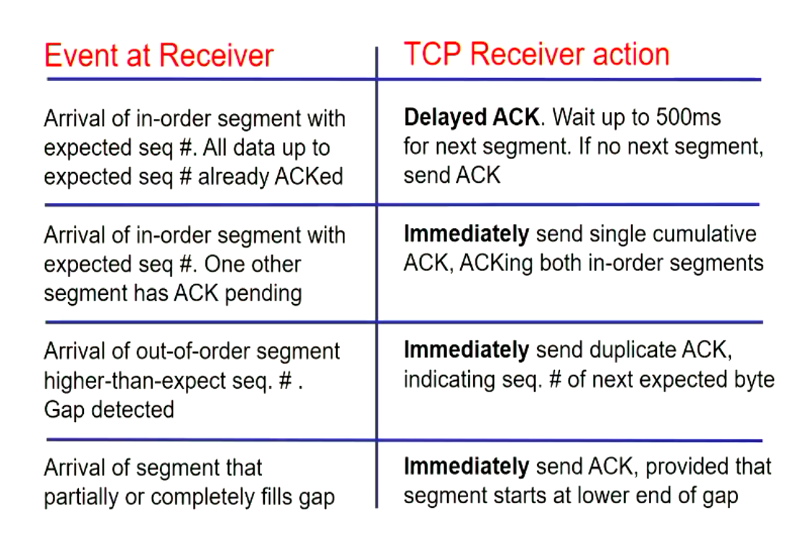

> [TOC]

<center>

# COSC264 Notes - Networking

</center>

### General Info About Course

Note that although a number of assessments are closed-book, we will be permitted to bring an A4 hand written sheet of paper, this can be double sided but must be _hand written_.

#### Grading

- Lab quizzes (16%)
  - Four in first term (2% each)
  - Four in second term (2% each)
- Super quiz on packet processing (7%)
  - Open during week 3
- Socket programming assignment (10%)
  - Due: Sunday, August 16, 2020, 11:59pm
- Mid-term test (25%)
  - 90 minutes
  - Closed-book, mostly electronic
  - Covers all first term content
  - Friday September 11, 2020 7:00 - 8:00pm
- Lab test(17%)
  - 60 minutes
  - closed-book
  - Friday, October 9, 7:00pm
  - Held in Jack Erskine Labs (TBC)
  - Covers material from labs in second term
- Final exam (25%)
  - 90 minutes
  - closed-book
  - time and place to be determined

> In order to pass this course, you must meet the following criteria, an average of 50%
> across all assessments, and an average mark of at least 45% on invigilate assessments
> (mid-term, lab test and final exam).

#### Resources

- [Lecture Notes](https://learn.canterbury.ac.nz/course/view.php?id=9047&section=1)
- [Problem Sheets](https://learn.canterbury.ac.nz/course/view.php?id=9047&section=2)
- Principles of Digital Transmission – With Wireless Applications
  - Sergio Benedetto and Ezio Biglieri
- Principles of Digital Communication
  - Robert G. Gallager
- Data and Computer Communications
  - William Stallings
- Computer Networks.
  - Andrew S. Tanenbaum and David J. Wetherall

### Introduction to Networking

#### Terminology

| Term         | Description                                                                                                       |
| ------------ | ----------------------------------------------------------------------------------------------------------------- |
| End Stations | These are the items connecting to a user ie a computer, servers etc. these are always connected to other stations |
| Network      | A loose term used in many ways, but essentially is a path for information flow                                    |
| Router       | Connects networks together so data can flow from one network to another                                           |

#### First look at the internet

##### Conversion Chart

| Term          | Approximate Size |
| ------------- | ---------------- |
| Byte (B)      | 8 bits           |
| Kilobyte (KB) | 1024 bytes       |
| megabyte (MB) | 1024 KB          |
| Gigabyte (GB) | 1024 MB          |
| Terabyte (TB) | 1024 GB          |
| Petabyte (PB) | 1024 TB          |
| Exabyte (EB)  | 1024 PB          |

**Where do routers send traffic?**

> Routers do not normally generate any traffic of their own, they are there to connect
> networks from point to point, they make routing decisions in order to indicate where
> to send the traffic to.

**How can I connect overseas then?**

> Parts of the internet are owned by service providers. These companies own large cables
> that go overseas to allow companies to connect their networks to the world, service
> providers sell connectivity for a price, your local internet providers will purchase
> access from the largest providers, the top level service providers tend to provide to
> each other, however this tends to not be paid for as it is a mutual benefit for both
> companies to be more connected.

#### Delay - Quality of Service >> Write Types of delay

| Application                          | Data loss     | bandwidth                               | Delay-sensitive   |
| ------------------------------------ | ------------- | --------------------------------------- | ----------------- |
| File Transfer                        | No loss       | Elastic                                 | No                |
| Email                                | No loss       | Elastic                                 | no                |
| Web pages                            | No loss       | Mostly elastic, minimum rate desireable | no                |
| Internet telephony videoconferencing | Loss-tolerant | Audio/Voice: few kbps                   | <= 200 - 250 ms   |
| Streaming audio/video                | Loss-tolerant | same as above                           | a few seconds     |
| interactive games                    | Loss-tolerant | few kbps - 1 mbps                       | few hundred ms    |
| instant messaging                    | No loss       | Elastic                                 | not very, depends |

> The term `elastic` means: these applications have no strict minimum-bandwidth requirements, they are just find with what they get

##### Transmission Delay

This is the time it takes to transmit an entire packet over a link.

The formula for working out transmission delay is as follows $\frac{L}{R}$, where _L = length of packet_ and _R = Data rate_, this is
how we can workout the transmission delay, This is generally denoted as $(T_{d})$

Here is an example of how we could solve for this in python:

```python
def transmission_delay(packetLength_bytes, rate_mbps):
    return packetLength_bytes / rate_mbps / 125000
```

##### Propagation Delay

This is the time it takes to transmit a single bit of a packet over a link.

This is the delay in which it takes to propagate the signal, and is denoted by $(T_{d})$. The way we can calculate propagation delay is
to use the formula $\frac{d}{s}$ where _d = the distance_ and _s = c i.e. the speed of light in copper wire_

### Bitwise operations

**Bitwise `AND` Operation**

The `AND` operation works by multiplying each bit in the first string to the bits in the
second string, in the python interpreter, the symbol `~` denotes the bitwise `AND`. The
following example will multiple two binary numbers.

```python
# Here is a python example of a bitwise AND operation
binary_first = 0b0110110110
binary_second = 0b1100011101

bitwise_first_AND_second = binary_first & binary_second
print(bitwise_first_AND_second)
```

> Result: 01 0001 0100

**Bitwise `OR` Operation**

The `OR` operation works by checking if the bit is equal to _1_, if it is equal to 1 then
put 1, else put 0.

```python
# This is how to preform the bitwise function manually
output = ""
if see == 1:
    output.append(1)
else:
    output.append(0)
print(reversed(output))
```

To actually preform this in python, you would use the `|` operand to denote the `OR` bitwise
function. The following is how to preform this in python.

```python
# Here is a python example of a bitwise OR operation
binary_first = 0b0110110110
binary_second = 0b1100011101

bitwise_first_OR_second = binary_first | binary_second
print(bitwise_first_OR_second)
```

### Communication Patterns

##### Unicast

- Only two nodes in the networks involved
- One is the transmitter, the other the receiver, but the nodes can have both roles
- Goal: reproduce exactly at the chosen reciever the bit stream sent by the transmitter
- Example
  - phone connections
  - viewing a web page

##### Broadcast

- One node as sender, all other as recievers
- Goal: reporiduce exactly at all stations in the network the bit stream is sent by the transmitter
- Example
  - Radio
  - TV

##### Multicast

- One node as sender, several but not all recievers
- Goal: reproduce exxactly at some stations in the network the bit stream is sent by the transmitter
- often, in multicast groups all nodes can act as senders
- Example
  - Internet chat
  - Phone confrence

#### Client Server Paradigm

The server allocates an address to each client connected. The client acts by sending requests and then turns off
when it receives its answer, the server will stay on and wait for requests to enter. Servers need to have powerful
programs for all users, this is why most servers are hosted on multiple machines that act as the same address to
connect on

One server has multiple clients, and the server has to provide a request `n` times for `n` users.

#### Peer-to-Peer Paradigm

- Has no centralised network
  - this means that it avoids a single point of failure

A peer to peer network is a two way street, you have to both provide data in order to benefit by getting your service.

> an example of this is torrents - you have to upload in order to gain the download

#### Circuit and Packet Switching

The design of a network is strongly influenced by the traffic it is supposed to carry, this will shape the netowrk.

##### Circuit Switching

**Voice Traffic**

- In today's POTS voice is transmitted digitally, the analog voice signal is A/D-converted with fixed sampling rates and resolution
  - Data rate: 64kbit/s
- The voice data is generated continously at a fixed rate
  - The provider has to be able to provide this rate continuously by the period or the voice quality will drop dramatically
- This is called a continuous bit rate (CBR) data stream
- No one else's connection is allowed to interfere with our own
- Goal: provide the illusion of having your own connection with the end user
  - this is achieved by the server allocating a certain amount of `bandwidth` to your call
  - at the end of the call, the resources are re-allocated to a new user
- Other examples of CBR data: CBR Video, periodic sensor measurements

> When we are recording audio, we do not take the whole thing, we have a 256 bit storage, and we `sample` the data in order to store it.

**Properties of Circuit Switching**

- A routing descision is only made once
- A connection has its resources guaranteed
- Any bandwidth not used by a connection cannot be re-used by other connections
- Connection setup takes time, it does not pay off when only very little data needs to be transmitted
- Connection setup may fail when no route or insufficient resources are available in the network

##### Packet Switching

- Many data applications naturally have time-varying rates
- called `Variable-bit-rate (VBR)` or `bursty` traffic
- CS-networks are not well suited to VBR traffic

**Properties of Packet Switching**

- Data flows are segmented into packets
- Packets are basic unit of transmission
- Packets consist of:
  - A `packet header` containing meta-information about the packet
  - The `packet payload`
  - Possibly a `packet trailer` for error detection
- Packets are transmitted individually
- There is no notion of a connection, packets can be sent immediately without having to setup any state or resource reservation
- Congestion _To many cars on the highway_ can cause packet loss
  - we allocate _buffer memory_ to back these packets, if we run out of memory, we must drop some of the incoming packets
- The internet is a Packet-Switching network
  _Conequences_
- Lack of resourcse reservation means there are no guarantees for packet delivery - Internet/IP "best effort" service: packet is delivered/not delivered - IP's lack of guarantees is compensated in parts by TCP - **Routers in packet-switched networks perform more complex processing during information transfer than
  switching fabrics in circuit-switched networks**
- Packet size
  - Packet overheads (header, trailer) have fixed size
  - Payload size is variable (within bounds)
  - Tradeoff
    - Small size payload leads to high overhead ratio
    - Small payload size leads to reduced susceptibility to errors
  - Packet size limits can be technology or application driven
    - to long packets might block important packets from being sent for an unacceptable time
- Router will not accept packet until it accepts the whole packet and sees trailer (due to corruption)

**Protocols and Services**

- Packets can get lost, re-ordered, delayed, modified or be tampered with
- Stations (end hosts or routers) can implement procedures to repair these problems
- These procedures run in a distributed fashion (as different stations need to cooperate) and are called **protocols**
- Protocols are rules and procedures underlying data transfer

We need to use sequence numbers in order to keep values in order online (such as if we had
a book, we need to make sure page one is ordered before page two, as if we purely rely on
page one arriving before page two, this will not work as we cannot guarantee that the packet
containing page one will not be lost). This is why we should send timers, and other things included
within the trailer of a packet.

The role of IP in the internet protocol Stack

- IP = Internet Protocol
- There are two protocol versions _4, 6_ here we use _IPv4_
- Everything over IP, IP over everything

**IP Addresses**

- Each host is identified by one or more IP addresses
  - A host has many IP addresses as it has network adapters
  - End hosts usually have only one IP address (as we use the one with widest scope)
- The IP address not only identifies the host but also helps the network find the path to this host
- Humans normally do not work with IP directly but with host names such as www.canterbury.ac.nz
- There exists a special service/protocol called the domain name service (`DNS`) which translates to human-readable host names to IPv4 addresses, the internet itself only works
  with IPv4 addresses
- Suppost to be worldwide unique (not really true anymore)
- unacknowledged (post service does not send back feedback)
- no guaranteed order of packets recieved with IPv4 protocol

### Socket Programming

#### TCP Client - Example Workflow

**Functions**

> **Socket()**
>
> - Create a socket, this allocates resources and assigns a random unused port number
>
> **Connect()**
>
> - Establish a connection with the server
>
> **Read()/Write()**
>
> - Reading and writing from and to the socket, alternatively you could also use **sendto()** or **recvfrom()** which allow you to specify other parameters
>
> **Close()**
>
> - closes the connection to the socket

#### TCP Server - Example Workflow

> **Socket()**
>
> - Create a socket, this allocates resources and assigns a random unused port number
>
> **Bind()**
>
> - Bind a socket to a particular port number and IP addresss
>
> **Listen()**
>
> - Declare whether or not the server will accept incoming connections, allocate resources (queue) for incoming connection requests (TCP)
>
> **Accepts()**
>
> - Accepts an incomming connection request (take it from the request queue) and create a new socket for this connection, bound to the same port as the socket we called `listen()` on.
>
> **Read()/Write()**
>
> - Reading and writing from and to the socket, alternatively you could also use **sendto()** or **recvfrom()** which allow you to specify other parameters
>
> **Close()**
>
> - closes the connection to the socket > that was connected to us

#### UDP Client Example Workflow

> **Socket()**
>
> - Create a socket, this allocates resources and assigns a random unused port number
>
> **rcvfrom() / sendto()**
>
> - Compared to TCP client, no `connect()` system call is necessary
> - Receiver address then has to be supplied to `sendto()`

#### UDP Client with `connect()`

> **Socket()**
>
> - Create a socket, this allocates resources and assigns a random unused port number
>
> **Connect**
>
> - The `connect()` system call supplies a default receiver address
> - `connect()` can be called multiple times to change the default receiver
>
> **Write()**
>
> - `write()` then sends to the last receiver specified with `connect()`
>
> **Close()**
>
> - closes the connection to the socket > that was connected to us

#### Using the Socket API in C

```c
#include <sys/types.h>
#include <sys/socket.h>

int socket(int domain, int type, int protocol);
```

**Using `socket()`**

This creates a new socket structure, including allocation of resources like the socket buffer, assigns a random un-used port number to it
and returns a file descriptor representing the socket

> `socket()` is non-blocking

Parameter `domain`:

- selects the protocol family to be used for the socket
- options include `AF_INET` for IPv4, `AF_INET6` for IPv6, `AF_APPLETALK` for the appletalk protocol
  - for this course we will only use `AF_NET`

Parameter `protocol`:

- selects the protocol used for the given socket type
- often only one option sensible; then `protocol=0` is a good choice as it sets the default value for protocol

Return value:

- If successful, a file descriptor (>= 0) is returned
- Otherwise -1 is returned, and error code `errno` is set

**Using `bind()`**

```c
#include <sys/types.h>
#include <sys/socket.h>

int bind(int sockfd, const struct sockaddr *addr, socklen_t addrlen);
```

- Links a socket to a particular IP address / port number / address family combination
- `bind()` is not blocking

Parameter `sockfd`:

- Denotes the socket
- is just the value returned by the previous `socket()` call

Return value:

- when operation successful: `return 0`
- when operation fails: `return -1`

**`bind()` The `sockaddr` Structure**

```c
#include <sys/types.h>
#include <sys/socket.h>
#include <netinet/in.h>

int bind(int sockfd, const struct sockaddr *addr, socklen_t addrlen);

// this is to hold any kind of address (allocating memory)
struct sockaddr {
  sa_family_t sa_family;
  char sa_data[14];
}

// Contains all the things that we need to specify an address
struct sockaddr_in {
  short sin_family;
  unsigned short sin_port;
  struct in_addr sin_addr;
  char sin_zero[8];
};

struct in_addr {
  unsigned long s_addr;
}
```

**Using `listen()`**

```c
#include <sys/types.h>
#include<sys/socket.h>

// This is called by the TCP server
int listen(int sockfd, int backlog);
```

**Using `accept()`**

```c
#include <sys/types.h>
#include <sys/socket.h>

int accept(int sockfd, struct sockaddr *addr, socklen_t *addrlen);
```

**Using connect()**

```c
#include <sys/types.h>
#include <sys/socket.h>

int connect(int sockfd, const struct sockaddr *addr, socklen_t addrlen);
```

**Helper functions for conversion**

```c
#include <arpa/inet.h>

uint32_t htonl(uint32_t hostlong);
uint16_t htons(uint16_t hostshort);
uint32_t ntonl(uint32_t netlong);
uint16_t ntons(uint16_t netshort);
```

These functions convert from `host(h)` to `network(n)` representation or vice versa

- They exist for 16 bit (short) and 32 bit(long) integers
- These helper functions are described in the man page (section 3)

#### Socket Programming Example

##### Client side TCP

```c
#include <stdio.h>
#include <stdlib.h>
#include <unistd.h>
#include <string.h>
#include <sys/types.h>
#include <sys/socket.h>
#include <netinet/in.h>
#include <netdb.h>

// This will print errors when they occur and then exit (note errors will be printed to terminal)
void error(const char *msg)
{
  perror(msg);
  exit(0);
}
int main(int argc, char *argv[])
{
  int sockfd, portno, n;
  struct sockaddr_in serv_addr; // address structure
  struct hostent *server; // result of DNS resolver
  char buffer[256]; // buffer for actual data (allocated memory)
  if (argc < 3) { // check number command line arguments
    fprintf(stderr, "usage %s hostname port\n", argv[0]);
    exit(0);
  }
  portno = atoi(argv[2]); // convert port number argument to integer
  // now create socket, protocol=0
  // for given address family TCP will be used, this is how we define a TCP socket
  // AF_INET >> IPv4, 0 >> default socket
  sockfd = socket(AF_INET, SOCK_STREAM, 0);
  if (sockfd < 0) {
    errpr("ERROR opening socket");
  }
}

// gives IP address
server = gethostbyname(argv[1]);
if (server == NULL) {
  fprintf(stderr, "ERROR, no such host\n");
  exit(0);
}

bzero((char *) &serv_addr, sizeof(serv_addr));
serv_addr.sin_family = AF_INET;
bcopy((char *)server->h_addr, (char *) &serv_addr.sin_addr.s_addr, server -> h_length);
serv_addr.sin_port = htons(portno);
if (connect(sockfd, (struct sockaddr *) &serv_addr, sizeof(serv_addr)) < 0) {
  error("Error connecting");
}

printf("Please enter the message: ");
bzero(buffer,256);
fgets(buffer,255,stdin);

n = write(sockfd, buffer, strlen(buffer));
if (n < 0) {
  error("ERROR writing to socket");
}

bzero(buffer,256);
n = read(sockfd, buffer, 255);
if (n < 0) {
  error("ERROR reading from socket");
}

printf("%s\n", buffer);

// cleanup and exit
close(sockfd);
return 0;
```

##### Server side TCP

```c
#include <stdio.h>
#include <stdlib.h>
#include <string.h>
#include <unistd.h>
#include <sys/types.h>
#include <sys/socket.h>
#include <netinet/in.h>

void error(const char*msg) {
  perror(msg);
  exit(1);
}

int main(int argc, char*argv[])
{
  int sockfd, newsockfd, portno;
  socklen_t clilen;
  char buffer[256];
  struct sockaddr_in serv_addr, cli_addr;
  int n;

  // check number of command line arguments, port number needed
  if (argc < 2) {
    fprintf(stderr,"ERROR, no port provided\n");
    exit(1);
  }

  // create the socket
  sockfd = socket(AF_INET, SOCK_STREAM, 0);
    if (sockfd < 0) error("ERROR opening socket");


bzero((char*) &serv_addr, sizeof(serv_addr));
portno = atoi(argv[1]);
serv_addr.sin_family = AF_INET;
serv_addr.sin_addr.s_addr = INADDR_ANY;
serv_addr.sin_port = htons(portno);
if (bind(sockfd, (struct sockaddr*) &serv_addr, sizeof(serv_addr))<0) error("ERROR on binding");

listen(sockfd,5);

clilen = sizeof(cli_addr);
newsockfd = accept(sockfd, (struct sockaddr*) &cli_addr, &clilen);

if (newsockfd < 0) error("ERROR on accept");

bzero(buffer,256);
n = read(newsockfd,buffer,255);
if (n < 0) error("ERROR reading from socket");
printf("Here is the message: %s\n",buffer);
n = write(newsockfd,"I got your message",18);
if (n < 0) error("ERROR writing to socket");

close(newsockfd);
close(sockfd);
return 0;
}
```

In the assignment, we are asked to do this in python. We can Google socket programming and there will be many tutorials on how to do this

### Network Protocols: Architecture and Basics

We need to have a _Structure_ to organize networking software to achieve the following

- Modularity and software re-use
- independence of network technologies (**Transparency**)
- Separation of concerns
- Correctness

This is important because without these things being achieved, we would need to re-write code often as the technology is getting better annually

**Layering**

The internet is structured in such a way that a layer cannot access services of layers that are not at tangents to it, therefore the layer can
only interface with the layer directly below and directly above, this is a method in order to keep us from having to re-write code, and re-design
the internet.

An example of how an interface can help us link through layers is the socket API, this allows us to go up a layer and use tools from this area. This is known as `Assessing an access point`

The concept of layers is to have many layers, that allow us to build a stack to complete a task.

#### The OSI Seven Layer Model

_Layer's_

| Layer's            |
| ------------------ |
| Application Layer  |
| Presentation Layer |
| Session Layer      |
| Transport Layer    |
| Network layer      |
| Link Layer         |
| Physical Layer     |

- Lowest two layers have strictly single-hop scope and exchange PDU's only with
  physically connected hosts
- Network layer uses hop-by-hop communication to achieve end to end communication
- Upper four layers exchange PDU's between hosts and have end-to-end scope
- routers only work on the lowest three layers

##### The Physical Layer

**Digital Data vs Analog Data**

| Digital Data                                                                        | Analog Data                                                                                                                                                                                                    |
| ----------------------------------------------------------------------------------- | -------------------------------------------------------------------------------------------------------------------------------------------------------------------------------------------------------------- |
| Digital data refers to a sequence of _discrete symbols_                             | Analog data can take on an uncountable number of values                                                                                                                                                        |
| A symbol is a member of a **finite** set which is also known as the alphabet        | Human speech and old FM Radio are analog transmissions                                                                                                                                                         |
| Now days many further types of data are represented digitally, audio, video, images | in recent decades our world has become largely digitalized                                                                                                                                                     |
| It has a finite number (0 , 1)                                                      | within computers and networks, all the data of interest by the processor, messages / packets in networks is represented as digital data, perhaps after some conversion from analog to digital (A/D conversion) |

**Transmission of Digital Data**

The transmitter has a stream of bits that it wants to stream to the receiver, the physical layer makes changes in order to transmit this through air (convert it to analog), the
signal will lose power as it is sent, the receiver will receive a distorted version of the original data. The goal of digital data is to have the same data at the start and end,
this will be contained with the bit error rate.

**Transmission of Analog Data**

The goal of this is not to get a perfect replica of the transmitted signal to the received data. This means that we are trying to just create as accurate of an image as possible,
we are not trying to create an exact replica unlike that of digital data.

##### The Link Layer

- Task: transfer messages over one physical link
- Link later messages are often called **frames**
- Often involves specification of:
  - Framing:
    - delineation of frame start and end
    - choice of frame size
    - frame format
  - Error Control:
    - Error correction coding is often regarded as a physical function
  - Medium access control
    - distributes right to send on shared channel to several participants
    - often considered a separate sub-layer
  - Flow Control:
    - avoid overwhelming a slow receiver with too much data

##### Network Layer

- Concerned with:
  - providing a link technology independent abstraction of the entire network to higher layers
  - addressing and routing
  - end-to-end delivery of messages

##### Transport Layer

- Concerned with:
  - Reliability of end-to-end transfer
  - programming abstractions (interface) to higher layers
- Often involves specification of:
  - Error control
  - Flow control
  - Congestion control procedures
    - Protect network against overloading
    - can also be considered a network layer issue

##### Session and Representation Layer

- Session Layer:
  - Concerend with establishing communication sessions between applications
  - A session can involve many transport layers connections in parallel or sequentially
  - A session might control the way in which two partners interact, for example enforce that partners speak in an alternating fashion
- Representation Layer
  - Translates between different representations of data types used on different end hosts

##### Application Layer

- Application support functions useful for many applications
  - File transfer services
  - Directory services
  - Transaction processing support

#### TCP / IP Reference Model (**The Internet**)

| Layers            |
| ----------------- |
| Application Layer |
| Transport Layer   |
| Internet          |
| Network Interface |
| Physical Layer    |

- The model is used in the internet
- This is broadly equivalent to OSI
- The internet follows on an end-to-end system

##### Application Layer

- Consists of applications using services of transport layer
- accesses transport layer through socket interface
- there are well known application layer protocols

##### Transport Layer

- Provides end-to-end communications
- Offers its services through socket interfaces
- standard transport layer protocols
- - SAPs are called _ports_ used for application multiplexing
    - several applications can use a transport services
    - a port is bound to an application
    - ports are identified by numbers
    - the PDU's are generated by TCP/UDP (standard protocols) are known as **segments**
    - segments include port number
    - receiver delivers the incoming segment to the application denoted by the port number
- TCP has mechanisms for:
  - Error control
  - Flow control
  - Congestion control
- UDP has none of these basic features
- For transmission TCP and UDP hand over segments to the internet layer
- For receptions TCP and UDP get incoming segments for the internet layer

##### Internet Layer

- This is the key part of TCP/IP reference model
- Uses IP its PDU's are called _datagrams_
- All higher segments are encapsulated in datagrams
- IP:
  - Specifies addressing scheme **IP address**
  - Provides end-to-end delivery of datagrams **Forwarding**
  - Does not specify how routing is done
  - has no mechanism for error, flow and congestion controls
  - can send IP datagrams over any network interface

#### MAC Addresses

Small medium access delay, the time between arrival of packet to
empty station and start of successful transmission.

Mac Addresses need to be:

- Fair
- efficient
- stable

##### Orthogonal Schemes

In Orthogonal schemes the behaviour of one station does not influence
the behaviour of other stations. The goal is to achieve collision free
communication.

There are four types of orthogonal schemes:

- FDMA (Frequency Division Multiple Access)
- TDMA (Time Division Multiple Access)
- SDMA (Space Division Multiple Access)
- CDMA (Code Division Multiple Access)
  - Note: In this course we will not discuss `SDMA` and `CDMA`

##### Frequency Division Multiple Access (FDMA)

A channel's bandwidth is sumdivided into _N sub-channels_

Between the sub-channels and at the fringe of the channel there are _guard bands_:

- Reduction of adjecent-channel interference, robustness against imperfect frequency synchronization

A sub-channel is _exclusively_ assigned to a station _i_ on a longer-term basis for
transmission of data, **no other station is allowed to transmit on this channel**.

To receive data a station must do the following:

- Either possess a separate receiver for each channel or
- have a single tunable receiver that must be switched to a specific channel before data
  can be received on it - Problems: coordination/rendez-vous, tuning times

An example of this is FM Radio, as we have a center frequency that we are based around, we have
enough distance to allow the user to not interfere with frequencies above and below.

- if totally available bandwidth is B $\frac{b}{s}$, station _i_ is assigned $\frac{1}{N}$ of _B_
  on a long term basis _neglecting guard bands_
- Medium access delay for a new packet arriving to an empty station _i_ is always zero, since _i_
  can start transmission immediately without risk of collision
- If a packet has size $\frac{B}{N}$ bits, its transmission takes one second:

$$E[Transmission Delay] = 1$$

FDMA was very popular for both radio and old phone systems.

**Advantages of** `FDMA`:

- _N_ stations can transmit in parallel
- No need for time synchronization between the _N_ transmitters

**Disadvantages of** `FDMA`:

- Need for _N_ recievers or tunable receivers increasing complexity
- Frequency synchronization required
- No re-use channel not used by owner can't be used by others
- Coordination and shared state required for allocating subchannels

**Conclusion on FDMA: Good for CBR but bad for VBR traffic**

#### Time Division Multiple Access (TDMA)

Each station uses the whole frequency band (except some guard bands at the fringe
the spectrum), but only at certain times:

- Time is subdivided into _superframes_ of duration $T_{SF}$
- Each superframe is subdivided into _N_ time-slots
- There are short _guard times_ between time slots
- One or more time slots are assigned exclusively and on a longer-term basis to a station _i_
  for transmission

Stations must be time-synchronized to avoid overlapping transmissions, guard times are required
to compensate (small) synchronization errors.

Neglecting guard times each station having a slot gets the full channel bandwidth _B_
$[\frac{b}{s}]$ for a fraction of $\frac{1}{N}$ of time

Assume the following facts:

- station _8_ owns one time slot
- $T_{SF}$ = 1 second
- a time-slot suffices to transmit $\frac{B}{N}$ bits (we ignore guard times)
- a packet of $\frac{B}{N}$ bits arrived at random time to empty station _i_

Medium access delay is the waiting time until station _i_'s next slot starts

$$E[Access Delay] = \frac{T_{SF}}{2} = 0.5_s$$

The completion time of TDMA can be shown with the following expression

$$E[completion Time] = E[Access Delay] + E[Transmission Delay]$$

- The time to transmit the packet (Transmission Delay) is $\frac{1}{N}$ seconds

> We can note from this that with TDMA we can start later and finish sooner than FDMA

**Advantages:**

- It is easier to achieve asymmetric bandwidth assignments in `TDMA` than it is in `FDMA` using multiple time-slots is much simpler than transmitting on multiple frequencies in
  parallel
- `TDMA` tends to have better completion times than `FDMA`
- No tunable receivers needed

**Disadvantages**

- Tight time-synchronization between stations required
- High expected access delay even in otherwise idle systems
- Not pissible to re-use unused time slots
- Coordination and shared state required for allocating time slots

> Conclusion: TDMA is good for CBR but bad for VBR traffic

#### Random Access Protocols

- do not attempt to reserve channel resources for longer time
- do not require a central station
- do not access the medium at predictable times
- often have low complexity
- typically involve some random elements

- Random access protocols are used standalone and also as building blocks for more
  complex MAC protocols

##### ALOHA

- One of the earliest MAC protocols, developed in 1970's
- when a new packet arrives at an idle station
  - a checksum is computed and appended to the frame
  - the frame is then transmitted immediately
  - an _acknowledgement timer_ is started
- if receiver gets packet, the receiver will transmit, else it will stay quite
- if the timer expires, we conclude that the packet has got lost

All of the above protocols have in common the sense that they all listen to if there
is someone else using the service, they will reject the service if it is busy.

#### Ethernet

New packet arrives at the MAC of a station, set coll to zero.

- coll is a local collision counter, each station has its own

Station performs a carrier-sense operation

When the medium is idle, transmission starts immediately

When medium is busy

- listen until channel becomes idle
- start transmitting

While transmitting check for collisions

If collision is detected

- abort frame transmission
- increase counter coll, counting # of subsequent collision
- if coll is > 16 drop frame, set coll to 0
- wait for random time **the backoff time**

If no collision, transmit the entire frame and reset `coll`

Draw a random integer number uniformly from the backoff window.

The backoff window can be denoted by the following:

$$[0, 1, ..., 2^{min(10,coll)}-1]$$

The backoff window size and therefore the average backoff time doubles each collision
until 10 collisions have been seen. This is called the _truncated_ binary exponential
backoff algorithm.

Note: This is shown in full in the slides (Ethernet Section)

Ethernet under light load has minimal delay, however when under heavy load, it still
only experiences 50 - 60% as many collisions and is therefore faster.

#### Bridges and Switches

##### Repeaters

A repeater amplifies a signal on an analog level

- Any noise present in the signal is amplified as well
- Repeaters add their own noise
- Repeaters are agnostic to any protocol or modulation
- They can create slight delay (nanoseconds or less)

**Regenerating Repeater**

A **Regenerating Repeater** demodulates an incoming signal symbol-per-symbol and modulates
it again

- It does not look beyond one symbol at a time
- No interpretation whatsoever of protocols

##### Hubs

Acts as a centralized repeaters, take signals coming from one port and sends to all the
ports using broadcast transmission.

The advantage over a bus is that we cannot cut a cable to remove the signal.

### IP Addressing

- IP addresses have 32 bits (IPV4)
- They are suppost to be worldwide unique
  - This is not really true anymore with NAT
- IP addresses are written in dotted decimal notation
  > 130.149.99.77
- They have internal structure

  > <network-id> <host-id>

- where
  - `<network-id>` denotes a network (e.g. an Ethernet)
  - `<host-id>` denotes a host _within_ the network
- `<host-id>` must only be unique with respect to its network

These are Half-Duplex - meaning that we cannot send and receive at the same time, this
means that we are guaranteed to get a collision if we send and receive at the same time, this
is very bad.

An example of a hub is below:


#### Bridges

These were designed as a method to solve some of the short comings with hubs, they segment
the network into many sections. It does this by using MAC Addresses of the Destination and
Source address.

Here is an example of a Bridge network:


Bridges are the following:

- Layer two device:
  - Can Understand MAC Protocols
- Segments LAN's
- 2 Collision Domains
- Fewer Ports
- Now Replaced by switches

#### Switches

Switches use MAC Addresses and PORT controls. A switch works by sending data to all connected
clients, and when the desired client responds, the switch will learn what Port the client is
connected on. This means that the switch now has the clients MAC and Port number, this means that
instead of having to contact all the clients, it knows exactly how to reach the desired client from
here on. This is very efficient.

Switches are the following:

- Can understand MAC protocols
- Full-Duplex
- Multiple collision domains
- Saves bandwidth
- Increased Security

Here is an example of a basic Switch setup:


#### Routing and Forwarding

- IP routers have several network interfaces or ports, (different from TCP/UDP port numbers) where they recieve/transmit datagrams
- In IP networks a router getting a packet on some input port looks at the `DestinationAddress` field to determine the output port

**Important points about routing**o

A host address is tied to its location in the network, it is coupled to network topology
when a host switches to another network it obtains another address and ongoing connections (TCP)
break - IP therefore has no direct support for mobility.

IP Routing is mostly concerned with networks, i.e. forwarding tables in routers mostly store

`<network-id>`'s - it is the responsibility of the last router to deliver an IP datagram to the host connected.

### Term Four

We will go over the Network layer, transport layer and App layer over this term.

Network layer is responsible for how to find a route from A - B, Transport layer is concerned
with how to transport data from A to B with _reliability and ease of use_, the Application layer
is concerned with how we share this data and information.

#### Protocol layering and data

Each layer takes data from the layer above

- adds header information to create new data unit
- passes new data unit to layer below


`jitter` is defined as the difference between two packets receiving time.

A bus is a shared medium, where many people get to access it but if someone is using the
bus we cannot connect to it.

How a router works **23 minutes Lecture (Monday 7th September)**


These routers are built on Linux distro's, they are made up with ram and CPU's,
this allows us to have quickly allocated memory.


#### Routing algorithms

**Routing overview**

- Hierarchical routing
- Forwarding vs routing
- Classification of routing algorithms

**Hierarchical Routing**

We need to have this because of the pure scale of the internet. According to Cisco
we will have 500 billion devices connected to the internet in 2030. We also need these
to make the system considerably more simple as we can offload some of the work to the upper
levels of the hierarchy.

Autonomous Systems (AS)

- An internet provider is an example of an AS or more specifically an (ISP)
- An AS is a set of routers that are used to localise a network

Routing determines the **path** to take, Forwarding transfers packets hop-by-hop.

Routers will create forwarding tables to plan a path, this is open to change when
topology changes. This table is stored in local memory.


**Types of Autonomous Systems**

`Stub AS:`

This AS is connected to only one other AS. A corporate network that is connected to an AS is considered to have the same AS number as the AS it is connected to.

`Transit AS:`

This AS is connected to more than one other AS and can be used for transit traffic between autonomous systems. They are usually administered by large Internet service providers (ISPs).

`Multihomed AS:`

This AS is connected to more than one other AS but does not let transit traffic from another AS pass through itself. An example might be a corporate network with several Internet connections to different ISPs.

**Inter-AS vs Intra-AS**

Inter-AS
- Routing between Autonomous Systems (inter-AS routing) is external to the AS and allows one AS to send traffic to another AS

Intra-AS
- Routing within an Autonomous System (intra-AS routing) is internal to that AS and invisible to those outside it. The AS administrator decides what routing algorithm should run within it.

##### Dijkstra's Algorithm

Modelling a network using graph theory. We treat the Routers as nodes on the network, and the links between the routers are treated as edges/paths on the network. Edge labels are called Metrics, and can be interpreted in a number of ways, namely as costs, delay, transmission cost or geographical distance. It can also be treated as number of available resources or the current capacity given the set of flows that are already using the link.

Dijkstra's algorithm is used to find the smallest path to each node in the tree when we have a weighted mapping of nodes.

Once each router and end point understands the topology of the network, we can use
Dijkstra's algorithm to find the shortest path to every other node in the network with
respect to their costs. (Output of this will return a forwarding table)

Psudocode for Dijkstra's

```javascript
s = {u} // U is the source node
for all nodes in v:
  if v is adjecent to u {
    then D(v) = c(u, v)
    else D(v) = INF
  }

Loop while !all(nodes in S)
  find w not in S with smallest D(w)
  add w to S
  update D(v) for all v adjacent to w and not in S
  D(v) = min(D(v), D(w) + c(w, v))
```

Here is an example of dijkstra's implementation in python, (note that this takes in a graph in the format of an adjacency list)

```python
def dijkstras(graph, source, destination):
    n = len(graph)
    parent = [None] * n
    distance = [float('inf')] * n
    in_tree = [False] * n
    distance[source] = 0

    while not all(in_tree):
        cur = min([node for node in graph if not in_tree[node]], key=lambda node: distance[node])
        for adj, weight in graph[cur]:
            if distance[cur] + weight < distance[adj]:
                parent[adj] = cur
                distance[adj] = distance[cur] + weight
        return distance[destination]
```

Summary, link state Routing is based off of Dijkstra's, each router broadcasts the link state, (this gives each router a complete view of the graph), each router computes least cost paths.

##### Bellman-Ford Algorithm

- Dynamic
- Decentralised
- Load-sensitive/load-insensitive
- Asynchronous

We need to introduce some equations in order to understand how the Bellman-Ford algorithm works

<center>

$d_{x}(y) :=$ cost of least-cost path from x to y

We denote `c(x, y)` as the cost of the distance between `(x, y)`.

</center>

This equation is nessasary to understand if we are to grasp the Bellman-Ford Equation, here is the Bellman-Ford Equation. Where min is taken over all the neighbours of `x`

$$d_{x}(y) = min_{v} [{c(x,v) + d_v(y)}]$$

We must do this for each of the items contained in the set V. This will allow us to find the minimum of all the values put into the Bellman-Ford Equation.


The Distance Vector Algorithm is an iterative and asynchronous algorithm. Each node does the following:


The following is the Psudocode for the Distance Vector Algorithm:


([31:12](https://echo360.org.au/lesson/G_027eef60-c8c3-4395-b608-c72b9c2751a1_aa864d61-54dc-47be-9392-60b845f2e5ad_2020-09-11T14:00:00.000_2020-09-11T14:55:00.000/classroom#sortDirection=desc)) - Run through Bellman-Ford Algorithm.

Watch September 14th Lecture to learn the Distance Vector and the poisoned reverse
algorithm.

Below is a comparison between Link state (Dijkstra's algorithm) and Distance vector (more specifically Bellman-Ford algorithm)


#### NAT: Network Address Translation

`NAT` is a protocol that is used to take global IP's and re-use them when they are obtained in a local network, It does this by doing the following; when we take a global IP address, the router changes the address and generates a random port number. The local `IPV4` is mapped to the outside address in order to route the local transmission back to the global background. This allows us to have a single global address and many local addresses instead of having to have many `IPV4` global addresses, using up more resources on the global scale.

The reason we have `IPV6` is due to the fact that we ran out of `IPV4` addresses, this means we needed to throw more bytes at the problem in order to allow for more addresses.

In `IPV6` the header length is fixed, it is always `40` byres, it contains the following packet structure:


Now because of the invention of `IPV6`, we have some routers that are compatible with both, some that only work with `IPV4` and some that only work with `IPV6`. We need to completely transition from `IPV4` to `IPV6`, but on a global scale this is very hard to achieve.

To deal with the problem above, we have decided that a method to deal with this is to use the `NAT` tunneling method, we receive an `IPV6` address, and we then associate a smaller `IPV4` address, we assign the payload the `IPV4` address as we do not need to deliver the entire header and other components as it has already made it to the correct address.

### Routing of the internet

#### Heirachicial routing


#### RIP

RIP and OSPF are intra-AS routing, also known as _Interior Gateway Protocols (IGP)_.

**RIP (Routing Information Protocol)**

- Works using Distance Vector Algorithm, (Bellman-Ford Algorithm)
- included in `UNIX` systems
- Distance metric: number of hops
  - Number of hops is defined as the number of subnets traversed along the shortest path from the source router to the destination subnet.

_Subnet_: To determine subnets, detatch each interface from its host or router, creating islands of isolated networks, with interfaces determinating the endpoints of the isolated networks. Each of these isolated networks is called a subnet.

Here is a visual representation of subnets


RIP uses `UDP` packets to message neighbours (gives them a routing table), this will allow neighbours to have more information, each of these are known as an **advertisement**.

Each advertisement: can list up to 25 destination nets within an `AS`.

Here is an example of how a routing table is formed using `RIP`, **NOTE:** that the blue box represents a forwarding table and the red box represents the routing table as a whole (forwarding tables only include information about the next router and the destination network).


RIP is an application layer protocol that is implemented over `UDP` (`UDP` is the third layer).

Note that this is in practice much more complicated then what has been described above.

#### OSPF (Open Shortest Path First)

- `OPEN` meaning that it is pulbicly available
- Uses Link State algorithm
  - Route computation using Dijkstra's Algorithm
- Advertisements are disseminated to entire AS (via broadcast)
  - Carried in `OSPF` messages directly over the IP frame rather than using `UDP/TCP`
- `OSPF` and `ISIS` are typically deployed in upper-teir `ISP's` whereas `RIP` is for lower-tier `ISP's`

The `OSPF` protocol provides Security, Multiple same-cost paths are allowed, link cost can be set by administrators, multicast support and is able to be set up in a hierarchy.

Image for reference:


#### BGP (Border Gateway Protocol)

`BGP` obtains subnet information about reachability, it then propagates the reachability information across the network and determines 'good' routes to the subnets.

- `BGP` peers exchange routing information over `TCP` connections. (`BGP` is implemented as an application): `BGP` sessions.
- when `AS3` advertises a prefix to `AS1`, `AS3` is promising it will forward any datagrams destined to that prefix.
- With `eBGP` session between 3a and 1c, `AS3` sends prefix reachability info to `AS1`
- 1c can then use `iBGP` to distribute this new prefix reach info to all routers in `AS1`.
- 1b can then re-advertise the new reach info to `AS2` over 1b-to-2a `eBGP` session
- when router learns about a new prefix, it creates an entry for the prefix in the forwarding table

`BGP` does not select the best route available, it selects good routes available.

#### How to send packets reliably (Checksums)?

How can we remove the following errors from the journey of a packet:

| Problems        | Cause                                               | Solutions                                   |
| --------------- | --------------------------------------------------- | ------------------------------------------- |
| Bit Error       | signal noise                                        | Error detection and correction              |
| Buffer Overflow | speed mismatch, too much traffic                    | flow control and congestion controls        |
| Lost Packet     | Buffer overflow at router/host                      | acknowledgement and re-transmission (`ARQ`) |
| Out of order    | an early packet gets lost and arrives after another | `ARQ`                                       |

#### Error Detection

`EDC` = Error detection and Correction bits (redundancy)
`D` = Data protected by error checking, may include header files

##### Parity Check

The simplest error detecting scheme is to append a parity bit to the end of a block of data.

- Even Parity
  - append a one to make it even, if we receive an odd number we know it is an error
- Odd Parity
  - even numbers are detected as an error

We can do this in a 2d format to create a table


Note: Parity checks cannot detect more than one bit error, this is a huge downside of this type of check.

##### Ones Complement to find checksums


##### Cyclic Redundancy Check (CRC)

> This is also known as polynomial codes

Addition and subtraction uses binary addition with no carries (essentially the `XOR` operation)

- Now define
  - D = d-bit block of data
  - F = r additional bits (Frame Check Sequence)
  - T = (d+r)-bit frame to be transmitted
  - G = pattern of r+1 bits; this is the predetermined divisor

To find the number of `r bits`, we can use the following:

- $D \times 2^r \quad XOR \quad F = nG$
- $D \times 2^r = nG \quad XOR \quad F$
- F = remainder of $\frac{D \times 2^r}{G}$ (modulo-2 arithmetic);

Example of basic Modulo-2 arithmetic

$$ \frac{ \ \ \ 1111}{+1010} = 0101 $$

This is done using the exclusive or `XOR` operation, this is done by taking the
bits that are `NOT` the same as `1` else make it `0`.

Note: *if any heading* `0's` *ignore them and start from the left most* `1`*.*

Example of **long division** in Modulo-2 arithmetic: (given `D, G`)


The output of this will find the length and value of the `F` (additional bits)

If there is no remainder we assume that we have no bit errors.

The leftmost bit of the generator `G` must be 1. the generator is of size `r + 1`
bits, this will be the divisor for the packet being sent in order to produce the check
sum `F`.

##### Forward Error Correction

This is not particularly useful for wireless links as there are much higher bit-error rates on a wireless link, and this method has much propagation delay.

_Datawords_: message blocks that are not encoded or manipulated

_Codewords_: message blocks that have been encoded or manipulated

- Hamming distance
  - `d(v1, v2)` between two `n–bit` binary sequences `v1` and `v2` is the number of bits in which `v1` and `v2` disagree.
  - E.g. `v1=011011`, `v2=110001`, `d(v1,v2) = 3`

We use the closest code word to the data word in order to distinguish whether an error has occurred or not, the 'closest' is determined by which bits are matching and which bits are not. This means that most of the time we are successful if there is only a single error bit, however if multiple bit errors occur then this could be an issue (as it could mistake it for another codeword)

**Example of FEC**

- There are 25 = 32 possible codewords of which 4 are valid, leaving 28 invalid codewords.

We try to map the code words as closely as we can, here is a table to further explain:

The minimum distance calculated in this table below is the `Hamming distance` that is defined above


The result of this will give as a decent guess at what word it could possibly be, however there are limitations on this, as in certain cases we will not be able to decide which way to go.

This can only correct a single error, we can have and detect two errors however can only correct
one with this method, the hamming distance is used to `guess` the closest _dataword_.

#### Basics of Reliable Data Transfer (RDT)

To implement a reliable data transfer, we must abuse retransmission, we must use requests also.

In this overview, we will start with simple protocols and end with advanced protocols in order
to correct unreliable transport layer methods.

**rdt 1.0 Reliable (perfect) transmission**

a pefectly reliable channel
- no bit errors
- no buffer overflow
- no out-of-order
- no packet loss

The sender sends data when ever it is availible, the reciever recieves data and delivers data
to its upper layer protocol.

**rdt 2.0 lossless channel with bit errors (no packet loss)**

- a channel with only bit errors
- we use acknowledgements and resend things if they do not arrive or are misunderstood

(Only using positive/negitive acknowledgements in conjunction with re-transmission)

*Sender:*

When packet is ready, send and wait for `ACK/NAK`, if `NAK` recieved, retransmit the last packet
and wait for `ACK/NAK`, if `ACK` is then recieved, wait for the next packet to be ready.

*Receiver:*

If packet is received without error, sends `ACK`, If packet is recieved with error, sends `NAK`.

**rdt 2.0 FSM**

We can use a finite state machine to implement `rdt 2.0` this can be used as the `stop-wait protocol`
this is low efficiency as it sets the value and then waits for response before acting.

This method has one fatal flaw, what if the `ACK/NAK` is corrupted? We must solve this
if we cannot interpret the acknowledgement.

```
if (acknowledge != {"ACK", "NAK"}) {
    resend(packet);
} else {
    process(packet);
}
```
**rdt 2.1 corrupted acknowledgements**

To deal with this we use a sequence number, in `rdf 2.0`, we use a one bit sequence number in order
to decide whether we have re-transmitted this information, and a `0` to inform us that we have not
transmitted this before (this is the initial value).

This is a good system if we assume that there will be no packet loss in the protocol.

**rdt 2.2: a NAK-free protocol**

We can use duplicate `ACK` to replace a `NAK`, this will make it so we don't have to define `NAK`
and if we receive two distinct acknowledgements this indicates a `NAK`.

**rdt 3.0: Lossy, when packet loss occurs**

When this happens we must deal with it using `Retransmission`, we send, and expect to have an `ACK`
sent back, if we do not receive an `ACK` then we wait a period of time, then send packet again.

We need to send a wait timer that will not expire too quickly and does not become inefficient when
we do not receive a packet. We will need to calculate this, this will be shown later.

Main Point: *We use a timeout to detect packet loss, we use retransmission to recover from packet loss.*

| RDT 3.0 Illustration                 |
|--------------------------------------|
|  |

This protocol is known as `alternating bit protocol`.

The mechanisms use from `RDT 1.0 - 3.0` is as follows:
- Checksum (to detect bit error)
- ACK / NAK (to notify sender)
- Sequence number (duplicate data packet handling)
- Duplicate ACKs (NAK free)
- Timer (data packet loss)
- Retransmission (a panacea)

Using this `rtd 3.0` could be very inefficient, purely because we are just doing so much.

`rtd 3.0` is a stop and wait protocol, it spends more time waiting then it does sending and
receiving information.

**Pipelining**

We need to have buffers for both the sender and the reciever, as having a buffer size 
(sequence number) of size `2 = {0, 1}` as we have discussed above, is insufficent as
in practice sequence number field occupies `k` bits, ranging from $k \in \{0, \quad 2^k - 1\}$
the sender and receiver may have to buffer more than a single packet, then we have two basic 
approaches based on *pipelining*.

*Go-Back-N Protocol*

- the sender is allowed to send multiple packets without waiting for an acknowledgement, but is
    constrained to having *no more than N unacknowledged packets* in the pipeline.

We have four different states for this protocol, a sequence number that is `ACK'd`, send sequence
number that is send and not `ACK'd`, usable sequence number not yet sent, unusable sequence number
*where each sequence number maps to a packet in the queue*. The number of sequence numbers not sent
and usable is known as the `Window Size`, the window works on `FILO` structure.

Below are some sources with more information on this process.

| ARQ Protocols Sources / how they work                                             |
|-----------------------------------------------------------------------------------|
| [geek4geeks](https://www.geeksforgeeks.org/what-is-arq-automatic-repeat-request/) |
| This is how Go-Back-N Protocol Works on Sender side                               |
|                                               |
| This is how Go-Back-N Protocol Works on Receiver side                             |
|                                       |

**Selective Repeat (SR)**

Receiver individually acknowledges all correctly received packets, buffers packets as needed.

Refer to Geek4Geek link above to see how this works, (better explained then in lectures).

Main point: Selective repeat means that if there is a timeout, only one selected packet will be resent, each
packet has a distinct timer, they are sent and recieved seporately.

##### TCP introduction

Now that we understand the basics of having reliable transfer, we will loop at some real world examples
of how these are actually implemented.

Packets are called `TCP segments` at the transport layer in `TCP`.

`TCP` works by sending a segment of `1000` bytes with a sequence number for the first segment at the start of the
byte, then this is followed by a sequence number for the second segment, the second segment sequence number
tends to be a *random sequence number*.

Here is a logical `TCP` sender (psudocode)

```c
while(1) {
  switch(event) {
    case data_recieved:
      if(!timer) {
          init_timer();
      }
      foward_segment_to_ip();
      NextSeqNum = NextSeqNum + len(data);
    case timer_timeout:
      if(!segment_ack()) {
        retransmit(segment_smallest_seqNum);
        timer_init();
      }
    case ACK_Recieved where(ACK_Recieved == y):
    if(y > SendBase) {
      SendBase = y;
      if(total_unacknowledged_segments()) {
        timer_init();
    }
  }
}
```

`TCP` **retransmission scenarios**

Refer to lectures to see examples of this:
- [16:36](https://echo360.org.au/lesson/G_027eef60-c8c3-4395-b608-c72b9c2751a1_aa864d61-54dc-47be-9392-60b845f2e5ad_2020-10-02T14:00:00.000_2020-10-02T14:55:00.000/classroom#sortDirection=desc)

`TCP` uses the next byte to be transmitted as the `ACK`, it says if we have received `99` bytes, we are expecting byte `100`,
therefore we send back `ACK: 100` to acknowledge that we received all bytes before byte `100`.

If the `ACK` arrives after the packet timeout, then we will need to update the window, because this is when
we are expecting the packet to be sent again.

When we re-transmit a segment, we need to double the timeout interval in order to deal with congestion in the network.

When a byte is not received, and next bytes are sent after, we need to receive the first bye in order to deal with the
lack of modularity in the network, we then can just resend the one byte and then send the 3 following `ACK's` in order
indicate when we have passed the non-received segment.

| TCP `ACK` generation                      |
|-------------------------------------------|
|          |
| Methods (tricks) used in TCP              |
|  |

How do we decide the timeout time?

> We decide the timeout, we generally use a size greater than the `RTT` `ACK + trans time`.
> we estimate this using the sum of the last 100 segments transmitted, and divide this by 100
> Here is the formal calculation 'Exponential weighted moving average'

$$ EstimatedRTT = (1 - \alpha) \times EstimatedRTT + \alpha \times SampleRTT $$

$$ E_0 = S_0 $$
$$ E_1 = (1 - \alpha) E_0 + \alpha S_1 = (1 - \alpha) S_0 + \alpha S_1$$
$$ E_2 = (1 - \alpha) E_1 + \alpha S_2 = (1 - \alpha)^2 + \alpha (1 - \alpha) S_1 + \alpha S_2$$
$$ E_n = (1 - \alpha) E_{n - 1} + \alpha S_n = (1 - \alpha)^n \ \ S_0 \ \ \alpha (1 - \alpha)^{n - 1} \ \ S_1 + \alpha (1 - \alpha)^{n - 2} S_2 \\ + ... + \alpha (1 -\alpha) S_{n - 1} + \alpha S_n $$

$\alpha$ is typically defined as $\alpha = 0.125$ or $\alpha = \frac{1}{8}$ the influence of past
sample size decreases exponentially. The weighted average puts more weight on recent samples which
better reflect the current congestion.

If we were to graph `RTT`, we would see that actual (sampled) round trip time will fluctuate lots
however the average `RTT` will remain stable.

In order to set the `timeout`, we must first estimate how much `SampleRTT` deviates from `EstimatedRTT`
we can do this by using the following:

$$ DevRTT = (1 - \beta) \times DevRTT + \beta \times | SampleRTT - EstimatedRTT | $$

> Note: *typically we set $(\beta = 0.25) OR (\beta = \frac{1}{4})$*

The **timeout interval** is calculated by using the following formula:

$$ TimeoutInterval = EstimatedRTT + 4 \times DevRTT $$

Where `EstimatedRTT` is the average, and `DevRTT` is the estimated deviation of the `AverageRTT`.

The reason we use `4` as a multiplier is just based of observation, we have concluded that using `4`
as a multiplier is the best option.

`TCP` **Flow Control**

`TCP` uses a `Full Duplex` system in order to transfer information. If the window is full, we will send
and receive the number of fillable byres in the window, this will allow us to see when we can
fill the window and when we cannot.

| Filling Buffers                               |
|-----------------------------------------------|
|  |

We must always send a value, even if it is `0` this is so we have consistency.

So now we know about data-flow in the `TCP` network, but what happens if we are going through many routers?

This question naturally leads us to the issue of packet loss.

**Congestion and traffic control**

**How do we deal with packet loss (TCP)**

Firstly packet loss is generally a result of overflowing routers, as routers also have a buffer of `N` size,
it is very possible for these routers to get congested with traffic and eventually overflow, this leads to
packets being dropped at the station, and in turn creates the need for retransmission.

Flow control is used to restrict how much traffic is sent from our own station, congestion control tries to
redirect traffic in order to ensure that there is minimal overflow at select stations.

The two main ways of implementing these is using `Network-assisted control` and `End-end congestion control`.
The later is used in `TCP's` approach. Here is a comparison:

| Comparison                                                |
|-----------------------------------------------------------|
|  |

If there is congestion on the network where too many sources are sending data across the same link, we will end
up with loss of efficiency in the network, this is because the forwarding from A to B where the link between A and B
is already used, we will have forwarded to the link and the packet will be dropped, this means that the router has used
resources to send data that will inevitably be lost.

The share of bandwidth is dynamic, we are constantly spending less or more depending on how much is available (this is
why turning off and on your router works sometimes).

Basic observation of the rate can be calculated using the following rough estimate:

$$ rate = \frac{CongWin}{RTT} (Bytes per second) $$

- By adjusting the `CongWin` according to how much network congestion there is, the sender can adjust its rate at which it
sends data into its connection.

Here is how we decrease and increase the `CongWin` effectively:

| Adjusting the CongWindow                         |
|--------------------------------------------------|
|  |

`TCP` has a slow start feature, that means that for every `ACK` received, we will decide to increase the rate of our
sending by adding one for every `ACK` received. Here is the equations used to send and receive `CongWin`.

To increase whenever a new `ACK` is received, it will use the following formulae:

$$ 1 MSS \times \frac{MSS}{CongWin} $$

After ($\frac{CongWin}{MSS}$) segements are sent and `ACK'd` within one RTT, `CongWin` will be increased by the following:

$$ 1 MSS \times \frac{MSS}{CongWin} \times \frac{CongWin}{MSS} = 1 MSS $$

| Here is an example of how this works          |
|-----------------------------------------------|
|  |

| Here is a flow chart, outlining how `TCP` works |
|-------------------------------------------------|
|     |

`TCP` has the following qualities
- point to point (one receiver and sender)
- reliable and in order
- pipelined
  - `TCP` congestion and flow control set window size
- full duplex data
  - bi-direction data flow in same connection
  - `MSS`: maximum segment size
- Connection orientated
  - handshake to initiate connection
- flow controlled
  - tells other party how big its buffer window is at any point in time.

**Three way TCP handshake**

Firstly, the client host sends `TCP` SYN segment, (SYN is initilized to 1) and is sent to server
- specifies hosts sequence number `client_isn`

Then the server receives `SYN` replies with `SYNACK` segment, the server allocates buffers, specifies servers
initial sequence number (`server_isn`).

The client then receives `SYNACK` sends an acknowledgement segment which may contain data, now that both the server 
and the receiver are aware of the starting sequence number, they are now able to send and receive data safely.

This is called the three way handshake because we need both confirmation from both the receiver and the server in
order to establish the handshake (after the first packet).

To close the connection across `TCP` the client disconnects sending a `FIN` segment, then the server will send an `ACK`
and a distinct `FIN` to say that we are happy for the client to disconnect, then the receiver will send an `ACK` to confirm
the disconnection.

##### Popular internet applications and their transport layer protocols

| App       | App-layer protocol  | Transport layer |
|-----------|---------------------|-----------------|
| Email     | SMTP                | TCP             |
| Web       | HTTP                | TCP             |
| Streaming | Typically propriaty | UDP             |

Important distinction: network layer is two hosts talking together, the transport layer is when two `processes` are talking to
each other.

##### Multiplexing and Demultiplexing

Multiplexing is the use of the same channel across many hosts whether remote or not, `Demultiplexing` is when the hosts in the
channel are aware of when to leave the channel and return to there own hosts.

- Multiplexing is creating segments and then passing them into the network layer.

- Demultiplexing is to deliver the data in the transport layer to the correct socket.

`UDP` sockets are defined by a tuple that looks like this: (`destination IP address`, `destination PORT number`)

When we are multiplexing, host `a,b,c` all send datagrams to the same destination `IP, PORT` this is then used like firing many wires
through a tunnel.

There is also a `Connection-orientatied Demux` this is using `TCP` and must take both the source and destination addresses as we are establishing
a connection, this means the receiver will use all the values to direct the segments to the appropriate socket. The server must be able to 
support many connections with many hosts simultaniously.

Multiplexing is extremely important to use with streaming apps, as it is loss tolerant and rate sensitive, because these services use `UDP`, 
we need to have some method of creating reliable transfer (mimicking `TCP`), this is mostly done at the application layer through propriety
software.

We still use `UDP` because of the following
- no connection
- no connection state at sender and receiver
- simple
- small segment header (8 bytes)
- no congestion control (we can send as fast as possible)

##### Network Applications (Application Layer)

Some applications have bandwidth constraints other apps are non-strict (elastic) in regards to bandwidth.

Some applications have timing constraints, with end-to-end delay, we need to have latency that is not too high to
be annoying or in-feasable for the service to operate correctly.

The internet is a perfect platform for developing `time sensitive` appliactions, this is because it is future proof
for many years.

`P2P` **Peer to Peer**

This type of communication lets each host act as both a server and a host, this architecture is used for torrents,
and is extremely hard to manage effectively. This is a good method as having both leaches and seeders; seeders acting
as many servers uploading to leaches who are the clients in this case.

This is also used in instant messaging, this is done using peer to peer, however the connection is established by a
centralised station.

##### The Web (HTTP)

`HTTP` is the application layer protocol for the internet, this is the building blocks or heart of the web.

`HTTP/S`
- can be information, text, video, photos and more
- web page consists of base `HTML` files which include several referenced objects
- each object is addressable
- is built on a client server model

| Here is a quick overview of HTTP     |
|--------------------------------------|
|  |

**Non-persistent HTTP**
- at most one object is sent over `TCP`
- HTTP/1 uses non-persistent HTTP

**Persistent HTTP**
- Multiple objects can be sent over a single `TCP` connection between client and a server
- HTTP/1.1 > uses persistent connections in default mode
- server leaves connection open after sending response
- subsequent `HTTP` messages between same client/server are sent over the same connection

**Persistent HTTP with pipelining**
- default in HTTP/1.1
- reduced response time

`HTTP` is a stateless, meaning that it does not require information from the client to work,
(we may get a better experience if we do).

**Cookies**

We use unique identifiers in order to track our cookies and distinguish them from other cookies.
This is stored in a databased and used in order to recommend the best fits for you in order to
maximise companies profits and give them data.

##### Email

Three major components
- User agents
- mail services
- simple mail transfer protocol `SMTP` *Web applications* use `HTTP`

We usually have an outgoing message queue and a mailbox to send and receive from.

**SMTP**

First used by `RFC 821` in 1982, is considered legacy technology.

Basic usage:

1. Alice uses user agent to compose message
2. Alices user agent sends message to her mail server; message placed in message queue 
3. client side of `SMTP` opens `TCP` connection with Bob's mail server
4. `SMTP` client sends Alice's message over the `TCP` connection
5. Bob's mail server places the message in Bob's mailbox
6. Bob invokes his user agent to read message

We use a port that is different to standard `TCP` port in order to remove double port processing issues
this tends to be implemented using a daemon running a mail server on a local machine.

We encode all bodies of messages into `7-bit ASCII`, to handle images over `SMTP` we put all objects into
one message, in `HTTP` each message stores a single object and are sent seporately. Note: we do not still
use this now, we have another protocol called `MIME` in order to send non-ASCII information (uses `Base64`
encoding).

In order to access emails, we need to use `POP3 || IMAP`, if we have an online access, we use `HTTP` to 
interact with the `SMTP` service.

Email uses `DNS` in order to map its host name to the service, in order to do this we need to communicate
on the router level, we need to interact with `IP` routing services, `DNS` is responsible for this and more.

**Domain Name System (DNS)**

Hosts can be identified by their `IP Address`
Routers use `IP Address` however people prefer to use `hostnames` to connect to.

> Use nslookup `hostname` to find IP and PORT used to communicate with DNS

`DNS`
- not centralised
  - traffic issues, single point of failure, lots to maintain
- Heirachical node service (tree structure)

We have a `Root` `DNS` service we then have sub-servers, firstly we have top level domain servers 
such as `.org, .com, .edu`, then we have Authoritive `DNS` servers, these host our local websites
such as `yahoo.com, amazon.com poly.eu` ect.

Client queries a root server to find Top-level domains, these sub-servers are queried to find
local websites servers in order to reach the desired place.

Note: their are only 13 `Root` servers at the moment globally, most of which are located in North
America.
