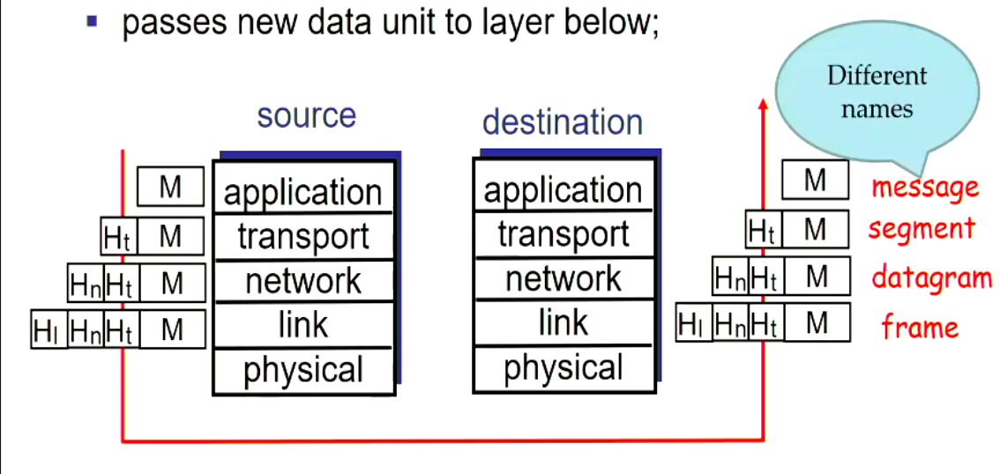

> [TOC]

<center>

# COSC264 Notes - Networking

</center>

### General Info About Course

Note that although a number of assessments are closed-book, we will be permitted to bring an A4 hand written sheet of paper, this can be double sided but must be *hand written*.

#### Grading
- Lab quizzes (16%)
    - Four in first term (2% each)
    - Four in second term (2% each)
- Super quiz on packet processing (7%)
    - Open during week 3
- Socket programming assignment (10%)
    - Due: Sunday, August 16, 2020, 11:59pm
- Mid-term test (25%)
  - 90 minutes
  - Closed-book, mostly electronic
  - Covers all first term content
  - Friday September 11, 2020 7:00 - 8:00pm
- Lab test(17%)
    - 60 minutes
    - closed-book
    - Friday, October 9, 7:00pm
    - Held in Jack Erskine Labs (TBC)
    - Covers material from labs in second term
- Final exam (25%)
    - 90 minutes
    - closed-book
    - time and place to be determined

> In order to pass this course, you must meet the following criteria, an average of 50%
> across all assessments, and an average mark of at least 45% on invigilate assessments 
> (mid-term, lab test and final exam).

#### Resources
- [Lecture Notes](https://learn.canterbury.ac.nz/course/view.php?id=9047&section=1)
- [Problem Sheets](https://learn.canterbury.ac.nz/course/view.php?id=9047&section=2)
- Principles of Digital Transmission – With Wireless Applications
    - Sergio Benedetto and Ezio Biglieri
- Principles of Digital Communication
    -  Robert G. Gallager
- Data and Computer Communications
    - William Stallings
- Computer Networks.
    - Andrew S. Tanenbaum and David J. Wetherall

### Introduction to Networking

#### Terminology
| Term         | Description                                                                                                       |
| ------       | -----------                                                                                                       |
| End Stations | These are the items connecting to a user ie a computer, servers etc. these are always connected to other stations |
| Network      | A loose term used in many ways, but essentially is a path for information flow                                    |
| Router       | Connects networks together so data can flow from one network to another                                           |

#### First look at the internet

##### Conversion Chart

| Term | Approximate Size |
| ---  | -----------------|
| Byte (B) | 8 bits |
| Kilobyte (KB) | 1024 bytes |
| megabyte (MB) | 1024 KB | 
| Gigabyte (GB) | 1024 MB |
| Terabyte (TB) | 1024 GB |
| Petabyte (PB) | 1024 TB | 
| Exabyte (EB) | 1024 PB |

**Where do routers send traffic?** 
> Routers do not normally generate any traffic of their own, they are there to connect
> networks from point to point, they make routing decisions in order to indicate where
> to send the traffic to.

**How can I connect overseas then?**
> Parts of the internet are owned by service providers. These companies own large cables 
> that go overseas to allow companies to connect their networks to the world, service
> providers sell connectivity for a price, your local internet providers will purchase
> access from the largest providers, the top level service providers tend to provide to
> each other, however this tends to not be paid for as it is a mutual benefit for both
> companies to be more connected.

#### Delay - Quality of Service >> Write Types of delay
| Application                          | Data loss     | bandwidth                               | Delay-sensitive   |
| ---                                  | ---           | ---                                     | ---               |
| File Transfer                        | No loss       | Elastic                                 | No                |
| Email                                | No loss       | Elastic                                 | no                |
| Web pages                            | No loss       | Mostly elastic, minimum rate desireable | no                |
| Internet telephony videoconferencing | Loss-tolerant | Audio/Voice: few kbps                   | <= 200 - 250 ms   |
| Streaming audio/video                | Loss-tolerant | same as above                           | a few seconds     |
| interactive games                    | Loss-tolerant | few kbps - 1 mbps                       | few hundred ms    |
| instant messaging                    | No loss       | Elastic                                 | not very, depends |

> The term `elastic` means: these applications have no strict minimum-bandwidth requirements, they are just find with what they get

##### Transmission Delay

This is the time it takes to transmit an entire packet over a link.

The formula for working out transmission delay is as follows $\frac{L}{R}$, where *L = length of packet* and *R = Data rate*, this is
how we can workout the transmission delay, This is generally denoted as $(T_{d})$

Here is an example of how we could solve for this in python:

```python
def transmission_delay(packetLength_bytes, rate_mbps):
    return packetLength_bytes / rate_mbps / 125000
```

##### Propagation Delay

This is the time it takes to transmit a single bit of a packet over a link.

This is the delay in which it takes to propagate the signal, and is denoted by $(T_{d})$. The way we can calculate propagation delay is
to use the formula $\frac{d}{s}$ where *d = the distance* and *s = c i.e. the speed of light in copper wire*

### Bitwise operations

**Bitwise `AND` Operation**

The `AND` operation works by multiplying each bit in the first string to the bits in the
second string, in the python interpreter, the symbol `~` denotes the bitwise `AND`. The 
following example will multiple two binary numbers.

```python
# Here is a python example of a bitwise AND operation
binary_first = 0b0110110110
binary_second = 0b1100011101

bitwise_first_AND_second = binary_first & binary_second
print(bitwise_first_AND_second)
```
> Result: 01 0001 0100

**Bitwise `OR` Operation**

The `OR` operation works by checking if the bit is equal to *1*, if it is equal to 1 then
put 1, else put 0.

```python
# This is how to preform the bitwise function manually
output = ""
if see == 1:
    output.append(1)
else:
    output.append(0)
print(reversed(output))
```

To actually preform this in python, you would use the `|` operand to denote the `OR` bitwise
function. The following is how to preform this in python.

```python
# Here is a python example of a bitwise OR operation
binary_first = 0b0110110110
binary_second = 0b1100011101

bitwise_first_OR_second = binary_first | binary_second
print(bitwise_first_OR_second)
```


### Communication Patterns

##### Unicast
- Only two nodes in the networks involved
- One is the transmitter, the other the receiver, but the nodes can have both roles
- Goal: reproduce exactly at the chosen reciever the bit stream sent by the transmitter
- Example
    - phone connections
    - viewing a web page

##### Broadcast
- One node as sender, all other as recievers
- Goal: reporiduce exactly at all stations in the network the bit stream is sent by the transmitter
- Example
    - Radio
    - TV

##### Multicast
- One node as sender, several but not all recievers
- Goal: reproduce exxactly at some stations in the network the bit stream is sent by the transmitter
- often, in multicast groups all nodes can act as senders
- Example
    - Internet chat
    - Phone confrence

#### Client Server Paradigm

The server allocates an address to each client connected. The client acts by sending requests and then turns off
when it receives its answer, the server will stay on and wait for requests to enter. Servers need to have powerful
programs for all users, this is why most servers are hosted on multiple machines that act as the same address to
connect on

One server has multiple clients, and the server has to provide a request `n` times for `n` users.

#### Peer-to-Peer Paradigm
- Has no centralised network
    - this means that it avoids a single point of failure

A peer to peer network is a two way street, you have to both provide data in order to benefit by getting your service.

> an example of this is torrents - you have to upload in order to gain the download

#### Circuit and Packet Switching

The design of a network is strongly influenced by the traffic it is supposed to carry, this will shape the netowrk.

##### Circuit Switching

**Voice Traffic**

- In today's POTS voice is transmitted digitally, the analog voice signal is A/D-converted with fixed sampling rates and resolution
    - Data rate: 64kbit/s
- The voice data is generated continously at a fixed rate
    - The provider has to be able to provide this rate continuously by the period or the voice quality will drop dramatically
- This is called a continuous bit rate (CBR) data stream
- No one else's connection is allowed to interfere with our own
- Goal: provide the illusion of having your own connection with the end user
    - this is achieved by the server allocating a certain amount of `bandwidth` to your call
    - at the end of the call, the resources are re-allocated to a new user 
- Other examples of CBR data: CBR Video, periodic sensor measurements

> When we are recording audio, we do not take the whole thing, we have a 256 bit storage, and we `sample` the data in order to store it.

**Properties of Circuit Switching**
- A routing descision is only made once
- A connection has its resources guaranteed
- Any bandwidth not used by a connection cannot be re-used by other connections
- Connection setup takes time, it does not pay off when only very little data needs to be transmitted
- Connection setup may fail when no route or insufficient resources are available in the network

##### Packet Switching
- Many data applications naturally have time-varying rates
- called `Variable-bit-rate (VBR)` or `bursty` traffic
- CS-networks are not well suited to VBR traffic

**Properties of Packet Switching**
- Data flows are segmented into packets
- Packets are basic unit of transmission
- Packets consist of:
    - A `packet header` containing meta-information about the packet
    - The `packet payload` 
    - Possibly a `packet trailer` for error detection
- Packets are transmitted individually
- There is no notion of a connection, packets can be sent immediately without having to setup any state or resource reservation
- Congestion *To many cars on the highway* can cause packet loss
    - we allocate *buffer memory* to back these packets, if we run out of memory, we must drop some of the incoming packets
- The internet is a Packet-Switching network
*Conequences*
- Lack of resourcse reservation means there are no guarantees for packet delivery
    - Internet/IP "best effort" service: packet is delivered/not delivered
    - IP's lack of guarantees is compensated in parts by TCP
    - **Routers in packet-switched networks perform more complex processing during information transfer than
switching fabrics in circuit-switched networks**
- Packet size
    - Packet overheads (header, trailer) have fixed size
    - Payload size is variable (within bounds)
    - Tradeoff
        - Small size payload leads to high overhead ratio
        - Small payload size leads to reduced susceptibility to errors
    - Packet size limits can be technology or application driven
        - to long packets might block important packets from being sent for an unacceptable time
- Router will not accept packet until it accepts the whole packet and sees trailer (due to corruption)

**Protocols and Services**
- Packets can get lost, re-ordered, delayed, modified or be tampered with
- Stations (end hosts or routers) can implement procedures to repair these problems
- These procedures run in a distributed fashion (as different stations need to cooperate) and are called **protocols**
- Protocols are rules and procedures underlying data transfer

We need to use sequence numbers in order to keep values in order online (such as if we had
a book, we need to make sure page one is ordered before page two, as if we purely rely on
page one arriving before page two, this will not work as we cannot guarantee that the packet
containing page one will not be lost). This is why we should send timers, and other things included
within the trailer of a packet.

The role of IP in the internet protocol Stack
- IP = Internet Protocol
- There are two protocol versions *4, 6* here we use *IPv4*
- Everything over IP, IP over everything

**IP Addresses**
- Each host is identified by one or more IP addresses
    - A host has many IP addresses as it has network adapters
    - End hosts usually have only one IP address (as we use the one with widest scope)
- The IP address not only identifies the host but also helps the network find the path to this host
- Humans normally do not work with IP directly but with host names such as www.canterbury.ac.nz
- There exists a special service/protocol called the domain name service (`DNS`) which translates to human-readable host names to IPv4 addresses, the internet itself only works
    with IPv4 addresses
- Suppost to be worldwide unique (not really true anymore)
- unacknowledged (post service does not send back feedback)
- no guaranteed order of packets recieved with IPv4 protocol

### Socket Programming

#### TCP Client - Example Workflow

**Functions**

> **Socket()** 
> - Create a socket, this allocates resources and assigns a random unused port number
>
> **Connect()**
> - Establish a connection with the server
>
> **Read()/Write()**
> - Reading and writing from and to the socket, alternatively you could also use **sendto()** or **recvfrom()** which allow you to specify other parameters
>
> **Close()**
> - closes the connection to the socket

#### TCP Server - Example Workflow

> **Socket()** 
> - Create a socket, this allocates resources and assigns a random unused port number
>
> **Bind()**
> - Bind a socket to a particular port number and IP addresss
> 
> **Listen()**
> - Declare whether or not the server will accept incoming connections, allocate resources (queue) for incoming connection requests (TCP)
>
> **Accepts()**
> - Accepts an incomming connection request (take it from the request queue) and create a new socket for this connection, bound to the same port as the socket we called `listen()` on.
>
> **Read()/Write()**
> - Reading and writing from and to the socket, alternatively you could also use **sendto()** or **recvfrom()** which allow you to specify other parameters
>
> **Close()**
> - closes the connection to the socket > that was connected to us

#### UDP Client Example Workflow

> **Socket()** 
> - Create a socket, this allocates resources and assigns a random unused port number
>
> **rcvfrom() / sendto()**
> - Compared to TCP client, no `connect()` system call is necessary
> - Receiver address then has to be supplied to `sendto()`

#### UDP Client with `connect()`

> **Socket()** 
> - Create a socket, this allocates resources and assigns a random unused port number
>
> **Connect**
> - The `connect()` system call supplies a default receiver address
> - `connect()` can be called multiple times to change the default receiver
>
> **Write()**
> - `write()` then sends to the last receiver specified with `connect()`
>
> **Close()**
> - closes the connection to the socket > that was connected to us

#### Using the Socket API in C

```c
#include <sys/types.h>
#include <sys/socket.h>

int socket(int domain, int type, int protocol);
```
**Using `socket()`**

This creates a new socket structure, including allocation of resources like the socket buffer, assigns  a random un-used port number to it 
and returns a file descriptor representing the socket

> `socket()` is non-blocking

Parameter `domain`:
- selects the protocol family to be used for the socket
- options include `AF_INET` for IPv4, `AF_INET6` for IPv6, `AF_APPLETALK` for the appletalk protocol
  - for this course we will only use `AF_NET`

Parameter `protocol`:
- selects the protocol used for the given socket type
- often only one option sensible; then `protocol=0` is a good choice as it sets the default value for protocol

Return value:
- If successful, a file descriptor (>= 0) is returned
- Otherwise -1 is returned, and error code `errno` is set

**Using `bind()`**

```c
#include <sys/types.h>
#include <sys/socket.h>

int bind(int sockfd, const struct sockaddr *addr, socklen_t addrlen);
```
- Links a socket to a particular IP address / port number / address family combination
- `bind()` is not blocking

Parameter `sockfd`:
- Denotes the socket
- is just the value returned by the previous `socket()` call

Return value:
- when operation successful: `return 0`
- when operation fails: `return -1`

**`bind()` The `sockaddr` Structure**

```c
#include <sys/types.h>
#include <sys/socket.h>
#include <netinet/in.h>

int bind(int sockfd, const struct sockaddr *addr, socklen_t addrlen);

// this is to hold any kind of address (allocating memory)
struct sockaddr {
  sa_family_t sa_family;
  char sa_data[14];
}

// Contains all the things that we need to specify an address
struct sockaddr_in {
  short sin_family;
  unsigned short sin_port;
  struct in_addr sin_addr;
  char sin_zero[8];
};

struct in_addr {
  unsigned long s_addr;
}
```

**Using `listen()`**

```c
#include <sys/types.h>
#include<sys/socket.h>

// This is called by the TCP server
int listen(int sockfd, int backlog);
```

**Using `accept()`**

```c
#include <sys/types.h>
#include <sys/socket.h>

int accept(int sockfd, struct sockaddr *addr, socklen_t *addrlen);
```

**Using connect()**

```c
#include <sys/types.h>
#include <sys/socket.h>

int connect(int sockfd, const struct sockaddr *addr, socklen_t addrlen);
```

**Helper functions for conversion**

```c
#include <arpa/inet.h>

uint32_t htonl(uint32_t hostlong);
uint16_t htons(uint16_t hostshort);
uint32_t ntonl(uint32_t netlong);
uint16_t ntons(uint16_t netshort);
```
These functions convert from `host(h)` to `network(n)` representation or vice versa
- They exist for 16 bit (short) and 32 bit(long) integers
- These helper functions are described in the man page (section 3)

#### Socket Programming Example

##### Client side TCP

```c
#include <stdio.h>
#include <stdlib.h>
#include <unistd.h>
#include <string.h>
#include <sys/types.h>
#include <sys/socket.h>
#include <netinet/in.h>
#include <netdb.h>

// This will print errors when they occur and then exit (note errors will be printed to terminal)
void error(const char *msg)
{
  perror(msg);
  exit(0);
}

int main(int argc, char *argv[])
{
  int sockfd, portno, n;
  struct sockaddr_in serv_addr; // address structure
  struct hostent *server; // result of DNS resolver

  char buffer[256]; // buffer for actual data (allocated memory)
  if (argc < 3) { // check number command line arguments
    fprintf(stderr, "usage %s hostname port\n", argv[0]);
    exit(0);
  }
  portno = atoi(argv[2]); // convert port number argument to integer

  // now create socket, protocol=0 
  // for given address family TCP will be used, this is how we define a TCP socket
  // AF_INET >> IPv4, 0 >> default socket
  sockfd = socket(AF_INET, SOCK_STREAM, 0);
  if (sockfd < 0) {
    errpr("ERROR opening socket");
  }
}

// gives IP address
server = gethostbyname(argv[1]);
if (server == NULL) {
  fprintf(stderr, "ERROR, no such host\n");
  exit(0);
}

bzero((char *) &serv_addr, sizeof(serv_addr));
serv_addr.sin_family = AF_INET;
bcopy((char *)server->h_addr, (char *) &serv_addr.sin_addr.s_addr, server -> h_length);
serv_addr.sin_port = htons(portno);
if (connect(sockfd, (struct sockaddr *) &serv_addr, sizeof(serv_addr)) < 0) {
  error("Error connecting");
}

printf("Please enter the message: ");
bzero(buffer,256);
fgets(buffer,255,stdin);

n = write(sockfd, buffer, strlen(buffer));
if (n < 0) {
  error("ERROR writing to socket");
}

bzero(buffer,256);
n = read(sockfd, buffer, 255);
if (n < 0) {
  error("ERROR reading from socket");
}

printf("%s\n", buffer);

// cleanup and exit
close(sockfd);
return 0;
```

##### Server side TCP

```c
#include <stdio.h>
#include <stdlib.h>
#include <string.h>
#include <unistd.h>
#include <sys/types.h>
#include <sys/socket.h>
#include <netinet/in.h>

void error(const char*msg) {
  perror(msg);
  exit(1);
}

int main(int argc, char*argv[])
{
  int sockfd, newsockfd, portno;
  socklen_t clilen;
  char buffer[256];
  struct sockaddr_in serv_addr, cli_addr;
  int n;

  // check number of command line arguments, port number needed
  if (argc < 2) {
    fprintf(stderr,"ERROR, no port provided\n");
    exit(1);
  }

  // create the socket
  sockfd = socket(AF_INET, SOCK_STREAM, 0);
    if (sockfd < 0) error("ERROR opening socket");


bzero((char*) &serv_addr, sizeof(serv_addr));
portno = atoi(argv[1]);
serv_addr.sin_family = AF_INET;
serv_addr.sin_addr.s_addr = INADDR_ANY;
serv_addr.sin_port = htons(portno);
if (bind(sockfd, (struct sockaddr*) &serv_addr, sizeof(serv_addr))<0) error("ERROR on binding");

listen(sockfd,5);

clilen = sizeof(cli_addr);
newsockfd = accept(sockfd, (struct sockaddr*) &cli_addr, &clilen);

if (newsockfd < 0) error("ERROR on accept");

bzero(buffer,256);
n = read(newsockfd,buffer,255);
if (n < 0) error("ERROR reading from socket");
printf("Here is the message: %s\n",buffer);
n = write(newsockfd,"I got your message",18);
if (n < 0) error("ERROR writing to socket");

close(newsockfd);
close(sockfd);
return 0;
}
```

In the assignment, we are asked to do this in python. We can Google socket programming and there will be many tutorials on how to do this

### Network Protocols: Architecture and Basics

We need to have a *Structure* to organize networking software to achieve the following

- Modularity and software re-use
- independence of network technologies (**Transparency**)
- Separation of concerns
- Correctness

This is important because without these things being achieved, we would need to re-write code often as the technology is getting better annually

**Layering**

The internet is structured in such a way that a layer cannot access services of layers that are not at tangents to it, therefore the layer can
only interface with the layer directly below and directly above, this is a method in order to keep us from having to re-write code, and re-design
the internet.

An example of how an interface can help us link through layers is the socket API, this allows us to go up a layer and use tools from this area. This is known as `Assessing an access point`

The concept of layers is to have many layers, that allow us to build a stack to complete a task.


#### The OSI Seven Layer Model

*Layer's*

| Layer's            |
| ---                |
| Application Layer  |
| Presentation Layer |
| Session Layer      |
| Transport Layer    |
| Network layer      |
| Link Layer         |
| Physical Layer     |

- Lowest two layers have strictly single-hop scope and exchange PDU's only with
  physically connected hosts
- Network layer uses hop-by-hop communication to achieve end to end communication
- Upper four layers exchange PDU's between hosts and have end-to-end scope
- routers only work on the lowest three layers


##### The Physical Layer

**Digital Data vs Analog Data**

| Digital Data                                                                        | Analog Data                                                                                                                                                                                                    |
| ---                                                                                 | ---                                                                                                                                                                                                            |
| Digital data refers to a sequence of *discrete symbols*                             | Analog data can take on an uncountable number of values                                                                                                                                                        |
| A symbol is a member of a **finite** set which is also known as the alphabet        | Human speech and old FM Radio are analog transmissions                                                                                                                                                         |
| Now days many further types of data are represented digitally, audio, video, images | in recent decades our world has become largely digitalized                                                                                                                                                     | 
| It has a finite number (0 , 1)                                                      | within computers and networks, all the data of interest by the processor, messages / packets in networks is represented as digital data, perhaps after some conversion from analog to digital (A/D conversion) |

**Transmission of Digital Data**

The transmitter has a stream of bits that it wants to stream to the receiver, the physical layer makes changes in order to transmit this through air (convert it to analog), the
signal will lose power as it is sent, the receiver will receive a distorted version of the original data. The goal of digital data is to have the same data at the start and end,
this will be contained with the bit error rate.

**Transmission of Analog Data**

The goal of this is not to get a perfect replica of the transmitted signal to the received data. This means that we are trying to just create as accurate of an image as possible,
we are not trying to create an exact replica unlike that of digital data.

##### The Link Layer
- Task: transfer messages over one physical link
- Link later messages are often called **frames**
- Often involves specification of:
    - Framing:
        - delineation of frame start and end
        - choice of frame size
        - frame format
    - Error Control:
        - Error correction coding is often regarded as a physical function
    - Medium access control
        - distributes right to send on shared channel to several participants
        - often considered a separate sub-layer
    - Flow Control:
        - avoid overwhelming a slow receiver with too much data

##### Network Layer
- Concerned with:
    - providing a link technology independent abstraction of the entire network to higher layers
    - addressing and routing
    - end-to-end delivery of messages

##### Transport Layer
- Concerned with:
    - Reliability of end-to-end transfer
    - programming abstractions (interface) to higher layers
- Often involves specification of:
    * Error control
    * Flow control
    * Congestion control procedures
        - Protect network against overloading
        - can also be considered a network layer issue

##### Session and Representation Layer
- Session Layer:
    * Concerend with establishing communication sessions between applications
    * A session can involve many transport layers connections in parallel or sequentially
    * A session might control the way in which two partners interact, for example enforce that partners speak in an alternating fashion
- Representation Layer
    * Translates between different representations of data types used on different end hosts

##### Application Layer
- Application support functions useful for many applications
    * File transfer services
    * Directory services
    * Transaction processing support

#### TCP / IP Reference Model (**The Internet**)

| Layers            | 
| ---               | 
| Application Layer | 
| Transport Layer   |
| Internet          |
| Network Interface |
| Physical Layer    |

* The model is used in the internet 
* This is broadly equivalent to OSI 
* The internet follows on an end-to-end system

##### Application Layer

- Consists of applications using services of transport layer
- accesses transport layer through socket interface
- there are well known application layer protocols

##### Transport Layer

- Provides end-to-end communications
- Offers its services through socket interfaces
- standard transport layer protocols
- - SAPs are called *ports* used for application multiplexing
    * several applications can use a transport services
    * a port is bound to an application
    * ports are identified by numbers
    * the PDU's are generated by TCP/UDP (standard protocols) are known as **segments**
    * segments include port number
    * receiver delivers the incoming segment to the application denoted by the port number
- TCP has mechanisms for:
    - Error control
    - Flow control
    - Congestion control
- UDP has none of these basic features
- For transmission TCP and UDP hand over segments to the internet layer
- For receptions TCP and UDP get incoming segments for the internet layer

##### Internet Layer

- This is the key part of TCP/IP reference model
- Uses IP its PDU's are called *datagrams*
- All higher segments are encapsulated in datagrams
- IP:
    - Specifies addressing scheme **IP address**
    - Provides end-to-end delivery of datagrams **Forwarding**
    - Does not specify how routing is done
    - has no mechanism for error, flow and congestion controls
    - can send IP datagrams over any network interface


#### MAC Addresses

Small medium access delay, the time between arrival of packet to
empty station and start of successful transmission.

Mac Addresses need to be:
- Fair
- efficient
- stable

##### Orthogonal Schemes

In Orthogonal schemes the behaviour of one station does not influence
the behaviour of other stations. The goal is to achieve collision free 
communication.

There are four types of orthogonal schemes:
- FDMA (Frequency Division Multiple Access)
- TDMA (Time Division Multiple Access)
- SDMA (Space Division Multiple Access)
- CDMA (Code Division Multiple Access)
    * Note: In this course we will not discuss `SDMA` and `CDMA`

##### Frequency Division Multiple Access (FDMA)

A channel's bandwidth is sumdivided into *N sub-channels*

Between the sub-channels and at the fringe of the channel there are *guard bands*:
- Reduction of adjecent-channel interference, robustness against imperfect frequency synchronization

A sub-channel is *exclusively*  assigned to a station *i* on a longer-term basis for
transmission of data, **no other station is allowed to transmit on this channel**.

To receive data a station must do the following:
- Either possess a separate receiver for each channel or
- have a single tunable receiver that must be switched to a specific channel before data
can be received on it
    - Problems: coordination/rendez-vous, tuning times

An example of this is FM Radio, as we have a center frequency that we are based around, we have
enough distance to allow the user to not interfere with frequencies above and below.

- if totally available bandwidth is B $\frac{b}{s}$, station *i* is assigned $\frac{1}{N}$ of *B*
on a long term basis *neglecting guard bands*
- Medium access delay for a new packet arriving to an empty station *i* is always zero, since *i*
can start transmission immediately without risk of collision
- If a packet has size $\frac{B}{N}$ bits, its transmission takes one second:

$$E[Transmission Delay] = 1$$

FDMA was very popular for both radio and old phone systems.

**Advantages of** `FDMA`:
- *N* stations can transmit in parallel
- No need for time synchronization between the *N* transmitters

**Disadvantages of** `FDMA`:
- Need for *N* recievers or tunable receivers increasing complexity
- Frequency synchronization required
- No re-use channel not used by owner can't be used by others
- Coordination and shared state required for allocating subchannels

**Conclusion on FDMA: Good for CBR but bad for VBR traffic**

#### Time Division Multiple Access (TDMA)

Each station uses the whole frequency band (except some guard bands at the fringe
the spectrum), but only at certain times:
- Time is subdivided into *superframes* of duration $T_{SF}$
- Each superframe is subdivided into *N* time-slots
- There are short *guard times* between time slots
- One or more time slots are assigned exclusively and on a longer-term basis to a station *i*
for transmission

Stations must be time-synchronized to avoid overlapping transmissions, guard times are required
to compensate (small) synchronization errors.

Neglecting guard times each station having a slot gets the full channel bandwidth *B*
$[\frac{b}{s}]$ for a fraction of $\frac{1}{N}$ of time

Assume the following facts:
- station *8* owns one time slot
- $T_{SF}$ = 1 second
- a time-slot suffices to transmit $\frac{B}{N}$ bits (we ignore guard times)
- a packet of $\frac{B}{N}$ bits arrived at random time to empty station *i*

Medium access delay is the waiting time until station *i*'s next slot starts

$$E[Access Delay] = \frac{T_{SF}}{2} = 0.5_s$$

The completion time of TDMA can be shown with the following expression

$$E[completion Time] = E[Access Delay] + E[Transmission Delay]$$

- The time to transmit the packet (Transmission Delay) is $\frac{1}{N}$ seconds

> We can note from this that with TDMA we can start later and finish sooner than FDMA

**Advantages:**
- It is easier to achieve asymmetric bandwidth assignments in `TDMA` than it is in `FDMA` using multiple time-slots is much simpler than transmitting on multiple frequencies in
    parallel
- `TDMA` tends to have better completion times than `FDMA`
- No tunable receivers needed

**Disadvantages**
- Tight time-synchronization between stations required
- High expected access delay even in otherwise idle systems
- Not pissible to re-use unused time slots
- Coordination and shared state required for allocating time slots

> Conclusion: TDMA is good for CBR but bad for VBR traffic

#### Random Access Protocols
- do not attempt to reserve channel resources for longer time
- do not require a central station 
- do not access the medium at predictable times
- often have low complexity
- typically involve some random elements

- Random access protocols are used standalone and also as building blocks for more
complex MAC protocols

##### ALOHA

- One of the earliest MAC protocols, developed in 1970's
- when a new packet arrives at an idle station
    - a checksum is computed and appended to the frame
    - the frame is then transmitted immediately
    - an *acknowledgement timer* is started
- if receiver gets packet, the receiver will transmit, else it will stay quite
- if the timer expires, we conclude that the packet has got lost

All of the above protocols have in common the sense that they all listen to if there
is someone else using the service, they will reject the service if it is busy.

#### Ethernet

New packet arrives at the MAC of a station, set coll to zero.
- coll is a local collision counter, each station has its own

Station performs a carrier-sense operation

When the medium is idle, transmission starts immediately

When medium is busy
- listen until channel becomes idle
- start transmitting

While transmitting check for collisions

If collision is detected
- abort frame transmission
- increase counter coll, counting # of subsequent collision
- if coll is > 16 drop frame, set coll to 0
- wait for random time **the backoff time**

If no collision, transmit the entire frame and reset `coll`

Draw a random integer number uniformly from the backoff window.

The backoff window can be denoted by the following:

$$[0, 1, ..., 2^{min(10,coll)}-1]$$

The backoff window size and therefore the average backoff time doubles each collision
until 10 collisions have been seen. This is called the *truncated* binary exponential
backoff algorithm.

Note: This is shown in full in the slides (Ethernet Section)

Ethernet under light load has minimal delay, however when under heavy load, it still
only experiences 50 - 60% as many collisions and is therefore faster.

#### Bridges and Switches

##### Repeaters

A repeater amplifies a signal on an analog level
- Any noise present in the signal is amplified as well
- Repeaters add their own noise
- Repeaters are agnostic to any protocol or modulation
- They can create slight delay (nanoseconds or less)

**Regenerating Repeater**

A **Regenerating Repeater** demodulates an incoming signal symbol-per-symbol and modulates
it again
- It does not look beyond one symbol at a time
- No interpretation whatsoever of protocols

##### Hubs

Acts as a centralized repeaters, take signals coming from one port and sends to all the
ports using broadcast transmission.

The advantage over a bus is that we cannot cut a cable to remove the signal.

### IP Addressing

- IP addresses have 32 bits (IPV4)
- They are suppost to be worldwide unique
    - This is not really true anymore with NAT
- IP addresses are written in dotted decimal notation
> 130.149.99.77
- They have internal structure
> <network-id> <host-id>

- where
    * `<network-id>` denotes a network (e.g. an Ethernet)
    * `<host-id>` denotes a host *within* the network
- `<host-id>` must only be unique with respect to its network

These are Half-Duplex - meaning that we cannot send and receive at the same time, this
means that we are guaranteed to get a collision if we send and receive at the same time, this
is very bad.

An example of a hub is below:


#### Bridges

These were designed as a method to solve some of the short comings with hubs, they segment
the network into many sections. It does this by using MAC Addresses of the Destination and
Source address.

Here is an example of a Bridge network:


Bridges are the following:
- Layer two device:
    * Can Understand MAC Protocols
- Segments LAN's
- 2 Collision Domains
- Fewer Ports
- Now Replaced by switches

#### Switches

Switches use MAC Addresses and PORT controls. A switch works by sending data to all connected
clients, and when the desired client responds, the switch will learn what Port the client is
connected on. This means that the switch now has the clients MAC and Port number, this means that
instead of having to contact all the clients, it knows exactly how to reach the desired client from
here on. This is very efficient.

Switches are the following: 
- Can understand MAC protocols
- Full-Duplex
- Multiple collision domains
- Saves bandwidth
- Increased Security

Here is an example of a basic Switch setup:


#### Routing and Fowarding

- IP routers have several network interfaces or ports, (different from TCP/UDP port numbers) where they recieve/transmit datagrams
- In IP networks a router getting a packet on some input port looks at the `DestinationAddress` field to determine the output port

**Important points about routing**o

A host address is tied to its location in the network, it is coupled to network topology
when a host switches to another network it obtains another address and ongoing connections (TCP)
break - IP therefore has no direct support for mobility.

IP Routing is mostly concerned with networks, i.e. forwarding tables in routers mostly store
`<network-id>`'s - it is the responsibility of the last router to deliver an IP datagram to the host connected.

### Term Four

We will go over the Network layer, transport layer and App layer over this term.

Network layer is responsible for how to find a route from A - B, Transport layer is concerned
with how to transport data from A to B with *reliability and ease of use*, the Application layer
is concerned with how we share this data and information.

#### Protocol layering and data

Each layer takes data from the layer above
- adds header information to create new data unit
- passes new data unit to layer below



`jitter` is defined as the difference between two packets receiving time.

A bus is a shared medium, where many people get to access it but if someone is using the
bus we cannot connect to it.

How a router works **23 minutes Lecture (Monday 7th september)**


These routers are built on Linux distro's, they are made up with ram and CPU's, 
this allows us to have quickly allocated memory.


#### Routing algorithms

**Routing overview**
- Hierarchical routing
- Forwarding vs routing
- Classification of routing algorithms

**Hierarchical Routing**

We need to have this because of the pure scale of the internet. According to Cisco
we will have 500 billion devices connected to the internet in 2030. We also need these
to make the system considerably more simple as we can offload some of the work to the upper
levels of the hierarchy.

Autonimus Systems (AS)
- An internet provider is an example of an AS or more specifically an (ISP)
- An AS is a set of routers that are used to localise a network

Routing determines the **path** to take, Forwarding transfers packets hop-by-hop.

Routers will create forwarding tables to plan a path, this is open to change when
topology changes.
