> [TOC]

<center>

# COSC265 Notes - Database Management

</center>

### General Info About Course

#### Gradings

- Assessment part 1 8% (8/8/2020, 5PM)
- Assessment part 2 16% (21/8/2020, 5PM)
- Quizzes 6% (multiple quizzes)
- Lab Test 20% (1st October, 7PM)
- Final Exam 50% (To be announced)

#### Resources

- [Lecture Notes](https://learn.canterbury.ac.nz/course/view.php?id=8959&section=1)
- [Labs and Tutorials](https://learn.canterbury.ac.nz/course/view.php?id=8959&section=2)
- [Homework Material](https://learn.canterbury.ac.nz/course/view.php?id=8959&section=4)
- [Previous Exams](https://learn.canterbury.ac.nz/course/view.php?id=8959&section=2)

### Introduction to Databases

#### Data Management

- Entity
  - Is something that we have to collect data about
- Attribute
  - Is something we assign to a value, ie if we have an entity called person,
    the person will have a name attribute
- Data
  - Must be well organized
  - we need to have a system in order to access it efficiently
- Record

**Why We Use Databases**

We use databases to store our information rather then files, this is because
working with files becomes a problem for a number of reasons, these include
having information located in different files and locations. This is a problem
for querying information and manipulating data.

**Database Management System (DBMS)**

Is a system to manage and create databases, the most common one is Oracle. This is also
responsible for managing traffic and making sure that multiple people on the same system
cannot make conflicting changes to the database.

**Database Software**

This is inclusive of applications used to manipulate the database as well as the DBMS.
A DBMS is a general software, it is possible to have many databases on each DBMS. In
the labs we will use the Oracle database.

##### Example Database

Entities

- Course
- section
- grade_report
- prerequisite

**Here is an example of an Entity**

| course_name               | course_number | credit | department |
| ------------------------- | ------------- | ------ | ---------- |
| Intro to computer science | CS1310        | 4      | CS         |
| Data Structures           | CS1120        | 3      | CS         |
| Discrete Mathematics      | MA2220        | 5      | MATH       |

##### DBMS Functionality

- Define database:
- Construct or load databases
- Manipulate database
  - querying
  - generating reports
  - insertions
  - deletions
  - modification to content
- Concurrent processing
- Protection or security

##### Schema's and Instances

| Terminology            | Description                                                          |
| ---------------------- | -------------------------------------------------------------------- |
| Database Schema        | The description of a database (database's purpose)                   |
| Schema Diagram         | A diagram display of some aspects of database schema                 |
| Database instance      | The actual data stored in a database _at one point in time_          |
| Database state         | Refers to content of database at a time (extension, occurrence)      |
| Data model             | A set of concepts used to describe the structure of a database       |
| Initial database state | Refers to the database when it is loaded                             |
| Valid state            | A state that satisfies the structure and constraints of the database |

An important distinction to make between database states and database schema is that **the
database schema changes very infrequently** and the **database state changes every time
the database is updated**.

**Internal Schema**

At this level, we are dealing with the files directly, this is about how things are stored
and how to achieve results, this is not for the user to interact with. This has lots of
detail about the database structure and storage. This is independent from the conceptual
view.

**Conceptual Schema**

This is where we can interact with the relationships between entities and make queries and
changes to the database. This has a bit of detail about storage but not that much. This is
independent from the internal level.

**External level**

This is where the end users only get what they desire from the database, the queries are
made for them in an automatic fashion. We can give different descriptions of the data for
different users (multiple viewing methods of data).

##### Database Features

- Data catalog (dictionary)
- Data abstraction
- Data integrity
- Data independence
  - Logical data independence
  - physical data independence
- Multiple views of data
- Sharing of data
- Controlled data redundancy (repeated stuff)
- Query languages
- Interfaces
- Backup and recovery
- Utilities

**People invlolved with Databases**

- Actors on the scene
  - Database administrators
  - Database designers
  - End-users
    - Casual users
    - Naive/Parametric users _("canned transactions")_
    - sophisticated users
    - standalone users
- Working behind the scene
  - DBMS designers and implementers
  - Tool developers
  - Operators and maintenance

##### Data Models

**Categories of Data Models**

- Conceptual
  - High level, semantic
  - Provide concepts that are close to the way many users percieve data
- Physical
  - Low level, internal
  - Provide concepts that are describe details of how data is stored
- Implementation
  - Provide concepts that fall between users views and computer storage details

#### Classification of DBMS's

- Based on data model used
  - Relational, Netowrk, Hierarchical
  - Emerging: Object-orientated Models

#### Don't Bother using DBMS for these Scenario's

- small data set
- strict time requirements
- access by a single user
- not expecting data to change

### Database Design

This section is estimated to take around four lectures to complete

#### Data Modeling

##### Phases of Database Design

- Requirements collection and analysis
- Conceptual design
- Logical design
- Physical design

**Structural Component of ER**

- `Entities` are specific objects or things in the mini-world that are represented in the database
- `Attributes` are properties used to describe an entity
  - Name
  - SSN
  - Address
    - Number
    - Street
    - suburb
  - Gender
  - etc.

Note that `Attributes` can have multiple sub-attributes bellow it. If this is the case it is said to be the value is _multi-valued_

- A specific entity will have a value for each of its attributes

Example of an entity with a few attributes
| Name | SSN | Address | Gender | BirthDate |
| --- | --- | --- | --- | --- |
| 'John Smith' | '12232333' | '731 Houston Drive' | 'Male' | '09-JAN-85' |

#### Types of attributes

**Simple (atomic) or Composite**

- _Gender_ is a simple attribute
- _Name_ (FirstName, MiddleName, LastName) - Composition may form a hierarchy where some components are themselves composite
  **Single/Multi-valued**
- _previousDegrees_ of a STUDENT
  - Denoted as `{PreviousDegrees}`

**Composite Multi-valued attribute**

- Denoted by: `{Degrees (University, Year, Degree, Field)}`
- In charts: _Double oval denotes multivalued attribute_

**Key Attributes**

- A key attribute may be composite
  - Denoted as `{CourseCode(CourseNo, UnitNo, AddressNo)}`
- A key cannot be multivalued
- It has to be a unique identifier
- A key attribute in a model will be underlined
- Strong entity types must contain at least one key attribute

##### The `NULL` Value

Has three possible interpretations

- Not known
- Not applicable
- Missing

#### Introduction to Relationships

Relationships are denoted using diamonds in the diagrams

**Relationship types**

- Is the schema description of a relationship
- Identifies the relationship name and the participating entity types
- Also identifies certain relationship constraints
- More than one relationship type can exist with the same entity types
- Relationship types can also have attributes associated with them
- Recursive Relationship Types
  - Both participants have the same entity type in different roles
  - (slides 2-26)

**Relationship Set**

- The current set of relationship instances represented in the database
- The current state of a relationship type

##### Dependent's

**Dependents**

- Denoted with double box
- connects to Depends relationship
- This is considered a _Weak Identity Type_

**Cardinality Ratio**

The types of relationships, and how they connect.

- One to one `(1:1)`
- One to many `(1:N)`
- Many to many `(N:N)`

**Participation Constraint**

- Total (existential)
- Partial

Minimum cardinality
(also called existence dependency constraint)

**Structural Constraints**

If we want to put a minimum amount of people and maximum on a relationships cardinality ratio, we use the syntax `(min, max)` in the diagram.

**Lattice**

This is a type of structure where entity types end up at a single node, if this is to occur, it must all stem from the same parent class. If
this is the case, it is possible to take on roles of multiple subclasses at the same level.

#### Relationship Diagrams

Assessment info on Learn, they have given us ER-Tutor to draw diagrams, they have given us model answers (also available on Learn).

##### Syntax of Diagrams

| Notation                 | Definition                                                  |
| ------------------------ | ----------------------------------------------------------- |
| Underline                | Key attribute                                               |
| Square box               | Entity                                                      |
| Oval                     | Attributes                                                  |
| Double square            | Weak Entity Type                                            |
| Double Oval              | Multi-valued attribute                                      |
| ) on line                | Represents specialization as a subclass of the parent class |
| circle                   | represents multiple subclasses below parent                 |
| Double lines (Relations) | represents that there need to be plow both ways             |

##### Shit I need to know

An attribute can be associated with the relationship diamond when it shows an association
between two particular entities.

A week entity type can only have **One Partial Key**, in some cases it can be a composite
attribute if a set of attributes is required for unique identification

The values of completeness constraint are **Total / Partial**.

An entity type has a multivalued attribute, then there are some entities of this type
that have more than one value for that attribute.

A week entity type participates in the identifying relationship type **always totally**.

##### ER to Relational Mapping Algorithm

This is the algorithm to turn an ER model into a relational model

**NOTE:** _Steps for what to do are found in Lecture: July 31st, and corresponding slide-set_

A table is defined as a set of tuples, this means that we can not contain duplicate
entries.

### Relational Algebra

#### The Pie Operand

This is the Reject operation.

$\pi (A, C)$ if the tuple does not contain a key, it is possible to have < `N` entries
as there is a possibility that there are duplicate entries in the table (SET OF TUPLES).

If A or C is a key, the tuples cannot be the same because they have a unique identifier.

### The Omega Operand

$\sigma$ is used to define a select method. therefore if given the following:

Table:

| A (key) | B   | C   |
| ------- | --- | --- |
| 1       | 1   | 2   |
| 2       | 2   | 1   |
| 3       | 3   | 2   |
| 4       | 1   | 2   |
| 5       | 2   | 1   |
| 6       | 3   | 3   |

Here are some expressions/questions.

Q1:

$\pi _(A, C) (R)$

This expression will give the following output table:

| A   | C   |
| --- | --- |
| 1   | 2   |
| 2   | 1   |
| 3   | 2   |
| 4   | 2   |
| 5   | 1   |
| 6   | 3   |

The table gives a result set that is of length `N` becuase A is a primary key.

$\pi _(B, C) (R)$

| B   | C   |
| --- | --- |
| 1   | 2   |
| 2   | 1   |
| 3   | 2   |
| 3   | 3   |

The reason that this result set `S < N` is because that if we look at the input table `Table`
we can see that there have been some results appearing multiple times, such as ($B _1, C _1$)

Q3:

$\sigma _(B > 1) (R)$

| $\underline{A}$ | B   | C   |
| --------------- | --- | --- |
| 2               | 2   | 1   |
| 3               | 3   | 2   |
| 5               | 2   | 1   |
| 6               | 3   | 3   |

We can use a series of relational Algebra in order to imply a table as these things are
interchangable.

**Union compatible relations**

- same degree
- each pair of corresponding attreubutes have the same domain

- Union: $S \cup R$
- Intersection: $S \cap R$
- Set difference (minus) $S - R$

Properties of Union Intersect and Difference

- Both Union and intersect are Communatative
  - $R\cup S=S \cup R \quad AND \quad R \cap S = S \cap R$

#### Cartesian Product

- set operation
- does not require union compatible relations
- $S \times X$
- Binary operation
- Communatative

Example:

Table R:

| $\underline{A}$ | B   | C   |
| --------------- | --- | --- |
| 1               | 1   | 2   |
| 2               | 2   | 1   |
| 3               | 3   | 2   |
| 4               | 1   | 2   |
| 5               | 2   | 1   |
| 6               | 3   | 3   |

Table S:

| $\underline{D}$ | E   | A    |
| --------------- | --- | ---- |
| 1               | a   | 1    |
| 2               | b   | 2    |
| 3               | e   | 4    |
| 4               | a   | l    |
| 5               | c   | null |
| 6               | d   | 4    |
| 7               | f   | 2    |

Question: Find the cartesian Product

$S \times R$

| A   | B   | C   | D   | E   | A   |
| --- | --- | --- | --- | --- | --- |
| 1   | 1   | 2   | 1   | a   | 1   |
| 1   | 1   | 2   | 2   | 6   | 2   |
|     |     |     |     |     |     |
| 1   | 1   | 2   | 7   | f   | 2   |
| 2   | 2   | 1   | 1   | a   | 1   |
| 2   | 2   | 1   | 2   | 6   | 2   |
|     |     |     |     |     |     |
| 2   | 2   | 1   | 7   | f   | 2   |
|     |     |     |     |     |     |
| 6   | 3   | 3   | 7   | f   | 2   |

**Joins**

- Binary relational operation
- $R \bowtie_{<join condition>} S$
- join condition: $R.A = S.B$
- Example 8:
  - _Join the MOVIE and DVD tables_

The resulting table will have the same number of tuples as the DVD table, as a MOVIE
can have many DVD's. This is more efficent than Cartesian in this case as it does not
create every possible combination of MOVIE and DVD.

If we specify the condition in which it is joining, this is the variable we are joining
onto _This tends to be when the foreign key and primary key from different tables tend
to have the same name_

Aquajoin will not remove the double up of the keys, normal outer join will remove this
double contents.

#### Complete set of relational algebra operations

The set is as follows, this should allow us to derive any operation on a database from
these five different operations:

`SET =`$\{\sigma, \pi, \cup, -, \times\}$

### SQL

- Terminology: tables, columns and rows
- Important distinction: between `SQL` and the formal relational model, `SQL` will allow
  a table to contain multiple duplicate tuples.
- Hence an `SQL` relastion table is a _multi-set_ of tuples; it is **Not** a set
  of tuples.
- `SQL` relations can be constrained to be sets by specifying `PRIMARY KEY` or `UNIQUE`
  attributes, or by using the `DISTINCT` option in a query.

#### Logical Design

_This is the process of going from a relational model to an DBMS specific outline
for this section we will be using Oracle_

**Oracle Syntax**

For the value of a primary key we cannot use the `NUMBER` as it is a reserved
word in Oracle, we must instead use `DNUMBER` for our unique identifiers

Comments: HTML/C Style /\* ... \*/ Multi-line comment or -- for single line.

```sql
-- single line comment

/*
    Multi-line
    comment
*/
```

Example of setting values with constraints

```sql
-- This is an example of a statement in SQL --
BORN integer
    constraint dir_born check
        (BORN between 1880 and 1990);
```

We can also specify key, ability to hold nulls, other constraints and conditions.

Here is a full `SQL` example of a table:

```sql
/* This table is a table of movies, with the following attributes:
MNUMBER >> Unique Identifier
TITLE >> String length 50 chars (not null)
TYPE >> String length 15 not null
AANOM >> integer
AAWON >> integer
YEAR >> integer
CRITICS >> string length 2
DIRECTOR >> integer that references a primary key from another table (DIRECTOR table)
    Note: This foreign key MUST be the same type as the primary key
*/
CREATE TABLE MOVIE(
    MNUMBER Unique number not null PRIMARY KEY,
    TITLE, varchar(50) not null,
    TYPE varchar(15) not null,
    AANOM integer,
    AAWON integer,
    YEAR integer,
    CRITICS varchar(2),
    DIRECTOR integer references DIRECTOR
);
```

#### Division

We can divide a table by another table. This means to remove the values from table B
in table A. This can be denoted using $A \div B$

Given two relations `R(X)` and `S(Z)`:

$R \div S = T(Y)$, this results in the corresponding association $Y = X - Z$, for
a tuple `t` to appear in `T`, the values in `t` must appear in `R` in combination
with every _tuple_ in `S`.

#### Insert

- used to add one or more tuples to a relation
- attribute values should be listed in the same order as the attributes were specified in the `CREATE TABLE` command
- `INSERT INTO` table_name `VALUES` (list_of_values)

This is a statement to add a person to a table, so to add to a table we can use the following syntax

```sql
insert into customer
values ('John', 'Marks', 18, 0, 0, '10/19/20');
```

The above will insert an new customer instance into the customer table, we can also do this without specifying all of the customer value fields, lets say we wanted to insert a customer but we only know the first and last name of this user.

```sql
insert into customer (cnumber, fname, lname)
values (19, "John", "Wick");
```

#### Entering multiple Tuples

- Another variation of INSERT allows insertions of _multiple tuples_ resulting from a query into a relationship
- INSERT INTO table_name(att_list) select_statement;

Example

```sql
create table movie_info
as select mnumber, title, year, fname, lname
from movie join director on director-dnumber
```

> This will create the table and also add data at the same time, rather then having to insert the data manually after the creation of the table.

#### Delete

- `DELETE FROM` table_of_values

If there is no where clause, it will delete all info from the table. If there is a where clause it will delete data that meets the condition of the clause.

This will delete all entries in the table movies:

```sql
DELETE FROM movies;
```

#### Update

This is an operation to update the value of an attribute for a tuple in a table, we can use this to update all values in the table by doing the following:

```sql
UPDATE customer
set bonus = bonus + 5;
```

Or we could use a `WHERE` clause to be more specific about the values we want to update.
For instance we could use the unique identifier for a customer in order to isolate a
single instance/tuple.

#### Views

- virtual tables: data does not exist on the disk but the query is stored
- Purpose
  - security
  - Custom access to data
  - Specifications of complex operations on base tables
- Updatable views
  - Defined over a single table
  - Containing primary or candidate key
  - Not involving aggregate functions for grouping

##### Creating Views

Define a view called _MOVDIR_ which consists of the movie number, title, director number and director name for all movies with type="comedy"

```sql
create view movdir
as select number, title, director, fname, lname
from movie join director on director=dnumber
where type='comedy';
```

> This is actually storing the select statement rather than creating a table, however it
> still used exactly like any other table would be used.

NOTE: A view with a single defining table is updatable if the view contains the primary key or a candidate key of the base relation.

#### Indexing

We should create indexes before we add data to the table, as changing indexes is a very
costly operation for a `DBMS`, as we will likely need to do $O(n^2)$ operations instead
of $O(1)$ due to having to move indexes when inserting each value into the Database.

- Access structures., used to speed up retrieval
- CREATE INDEX index_name ON table_name (att_list);

```sql
CREATE index CNO ON customer(cnumber);
```

This is no longer part of the `SQL` standard, but Oracle or some other `DBMS's` will still
use this and sometimes automatically create indexing for you (behind the scenes).

We can also `DROP` index by name, the syntax for this is as follows:

```sql
DROP INDEX index_name;
```

#### Integrity Enhancement Feature

- Required data (NOT null)
- Domain constraints
- Entity integrity (primary key, unique)
- Referential integrity (foreign key, references)
- Referential integrity constraint violation
- Enterprise constraints

#### Triggers

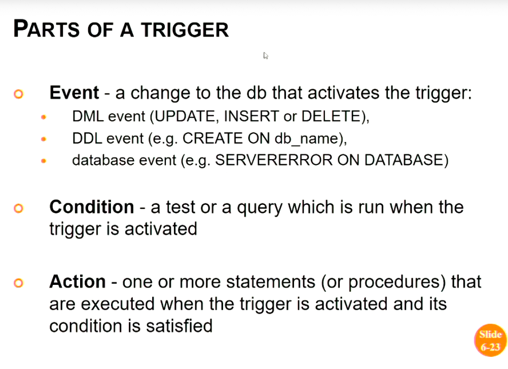

Triggers can be useful to calculate or update values of derived attributes.

A trigger has an **Event** which is a change to the DB that activates the trigger, a **condition** that is a test or query which is run when the trigger is activated, and an **action** which is used and executed when the trigger is activated and the condition is activated.

```sql
/* Syntax for a trigger */
CREATE [or REPLACE] trigger [schema]trigger
  {before | after | instead of}
  {delete | insert | update [of column [, column] ...]}
  [or {delete | insert | update [of column [, column]]}]
  on [schema]{table-name | view_name}
  [[referencing {old [as] old | new [as] new}]]
  for each [row | statement]
  [when (condition])]
  PL / SQL block
/
```

A derived attribute must have its value updated every time there is an `INSERT, UPDATE or DELETE` operation.

Lab test
creating tables, deleting tables, adding data to tables, insert, deleting and updating, complex queries and triggers / procedures, it will be completely open book.

**Security and Authorization**

We have two different methods of controlling security, we have _Discretionary_ security mechanisms this is when we create different levels or roles of people that have different rights to view different places in the dbms, another option is _Mandatory_ security mechanisms, this is when we use have different levels of security and we use it to allow different users to be at this level or not, the difference is one is altering the value of the people and one is altering the value of access to the database.

The `DBA` is responsible for database security, there are special things that only the `DBA` can do.

We can use the `GRAND` Key word to assign privileges to a user, this uses the following syntax:

```sql
GRAND {account_priv | odj_priv | ALL [PRIVILEGES]}
[ON {object}]
TO {user | role | PUBLIC}
{WITH GRANT OPTION};
```

> This will grant some user access to a specific role / privilege that the user wants them to have access to.

Here is an example of how we can take away privileges:

```sql
REVOKE {system_priv | obj_priv | ALL [PRIVILEGES]}
[ON {object}]
FROM {user | role | PUBLIC};
```

### Functional Dependencies

A functional dependency is a relationship between two attributes, typically between the PK and other non-key attributes within a table. For any relation R, attribute Y is functionally dependent on attribute X (usually the PK), if for every valid instance of X, that value of X uniquely determines the value of Y.

The left side of an FD diagram is called the determinant, and the right side is the dependent. Here are a few examples.

<center>

In the first example, below, SIN determines Name, Address and Birthdate. Given SIN, we can determine any of the other attributes within the table.

`SIN ———> Name, Address, Birthdate`

For the second example, SIN and Course determine the date completed (DateCompleted). This must also work for a composite PK.

`SIN, Course ———> DateCompleted`

The third example indicates that ISBN determines Title.

`ISBN ———–> Title`

</center>

**Inference Rules for FD's**

X -> Y denotes that `X` determines `Y`

- Reflexive
  - $If \quad Y \in X, \quad then \quad X -> Y$
- Augmentation
  - $If \quad X -> Y, \quad then \quad XZ -> YZ$
- Transitive
  - $If \quad X -> Y \quad AND \quad Y -> Z, \quad then \quad X -> Y$

If we know just these three rules, we can derive any other inference rules, these rules are not axioms, they are theorems, meaning that they each have valid proofs.

These proofs are outlined in the following timestamp [9:15](https://echo360.org.au/lesson/G_099ab24d-9b4c-4ffa-b320-7cbb02fe8170_f0fc3e94-0d9e-495a-8d23-7290ed389ccd_2020-09-18T16:00:00.000_2020-09-18T16:55:00.000/classroom#sortDirection=desc)

- Decomposition
  - $If \quad X -> YZ, \quad then \quad X -> Y \quad and \quad X -> Z$
- Union
  - $IF \quad X -> Y \quad and \quad X -> Z, \quad then \quad X -> YZ$
- Pseudotransitivity
  - $If \quad X -> Y \quad and \quad WY -> Z, \quad then \quad WX -> Z$

These rules can be derived from the first three rules.

**Example Exam Question**

Given relation R(A, B, C, D) and a set of functional dependencies F={A -> B, AC -> D, BC -> A, BC -> D, CD -> A} show that AC -> D is redundant.

- Using Armstrong's theorems

> A -> B Given \
> AC -> BC Augmentation \
> BC -> D Given (from the set) \
> AC -> D 2, 3 Transitive

This proves that `AC -> D` is redundant (however note this only answers the first part of the question, we will come to this later).

- **Closure** of a set of attributes X with respect to F is the set $X^+$ of all attributes that are functionally determined by X.

Algorithm to find _Closure_

$X^+ := X;$ \
$repeat$ \
$\qquad oldX^+ := X^+$ \
$\qquad for \ each \ FD \ Y -> Z \ in \ F \ do:$ \
$\qquad \qquad If \ Y \in X^+ \ then \ X^+ \ := | X^+ \cup Z;$ \
$until (oldX^+ = X^+);$

| Question                                            | Working                                          |
|-----------------------------------------------------|--------------------------------------------------|
| 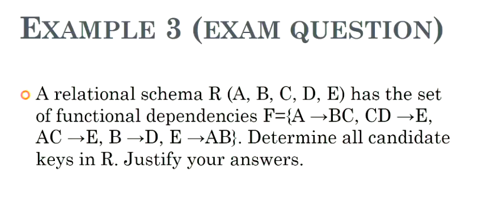 | 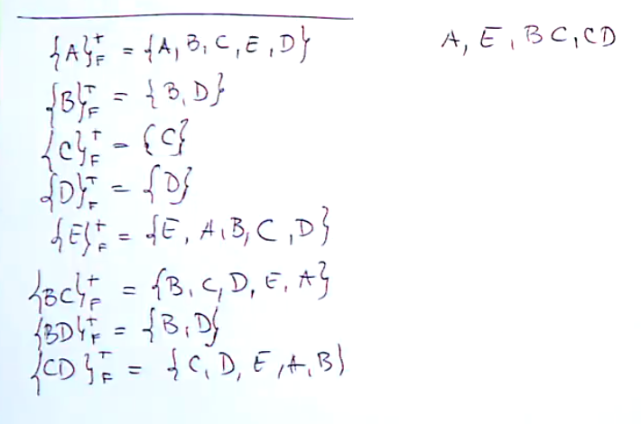 |


> The following is the answer and full working if you want the video, you can refer to the following: [31:46](https://echo360.org.au/lesson/G_099ab24d-9b4c-4ffa-b320-7cbb02fe8170_f0fc3e94-0d9e-495a-8d23-7290ed389ccd_2020-09-18T16:00:00.000_2020-09-18T16:55:00.000/classroom#sortDirection=desc)

> The goal is to find keys, if we start from `A` and we can get to all the values, this means that we have fount a key

The answer to this questions is in the format as follows

> {A} = {A, B, C, D, E} (therefore is a key)
> {B} = {B, D} (this is not a key)

Here is the full working of the above question:

> The answer to this question is the following four keys:
> Keys = {A, E, BC, CD}

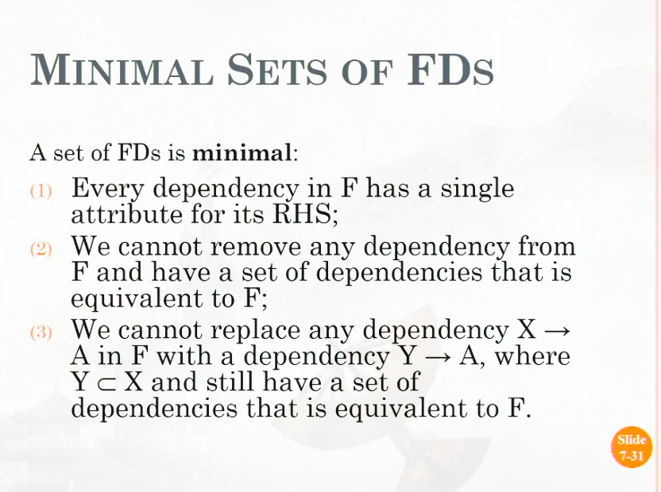

| Question                             | Working                                          |
|--------------------------------------|--------------------------------------------------|
| 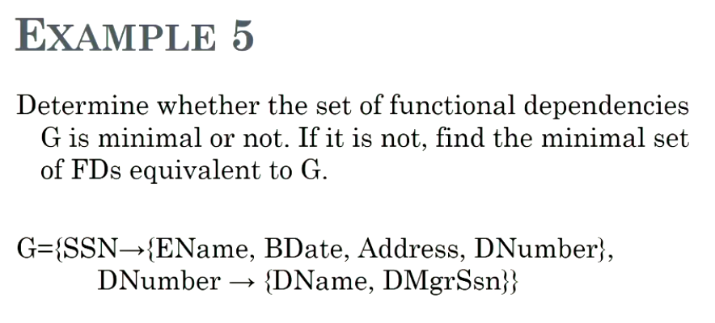 | 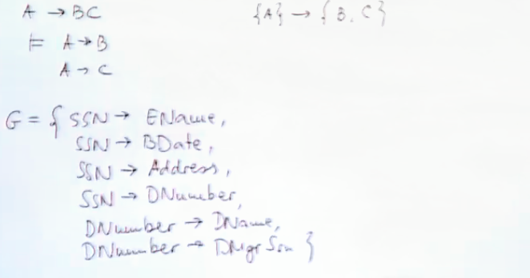 |


Note: that because there is only one item on the left for each line, this must be a minimal set as if we remove one, we cannot infer it from the other dependencies in the set.

**Definition of Keys**

| First Slide                            | Second Slide                             |
|----------------------------------------|------------------------------------------|
| 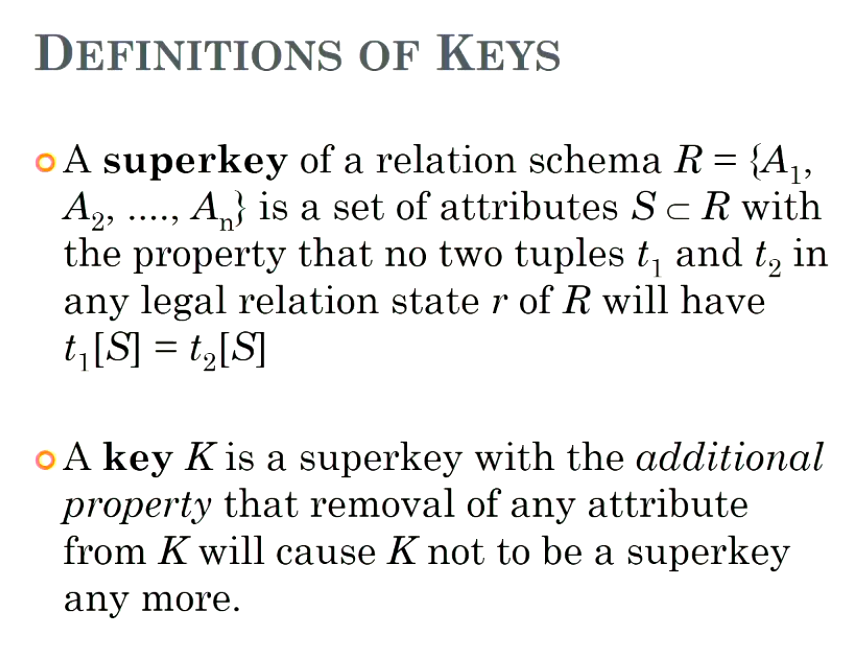 | 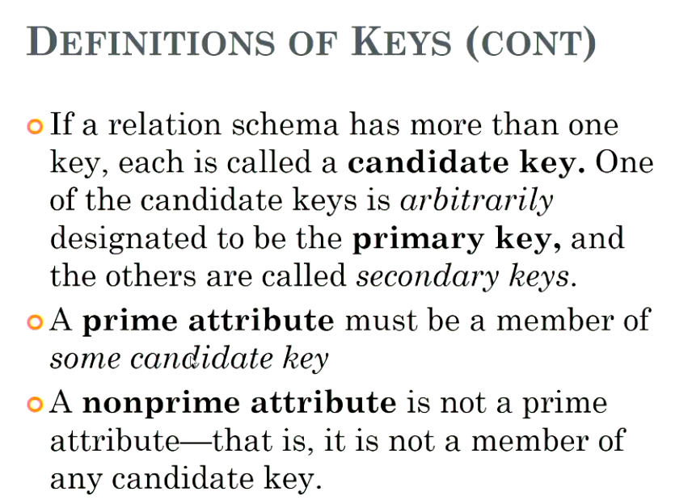 |

**Full functional Dependency**

- a FD where $Y -> Z$ where removal of any attribute in `Y` means the FD does not hold any more.

**Normal Forms**

An example of normal form relation:

| Question                     |
|------------------------------|
| 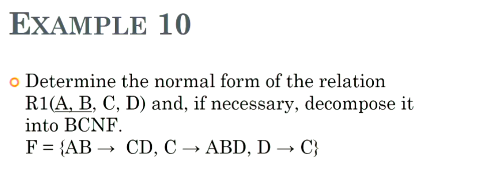 |

| Graphical Solution             | Explaination                                                                                                                                                                                                             |
|--------------------------------|--------------------------------------------------------------------------------------------------------------------------------------------------------------------------------------------------------------------------|
| 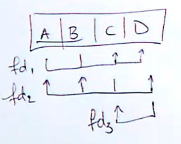 | We know _AB_ is a primary key (given), we know that *C* is a candidate key because it is not primary and can infer all other attributes, because *D* infers *C* and *C* is a key, we can conclude that *D* is also a key |

To find the closure from example 10, just take the logical order down $\{D\}^+ = \{D, C, AB\}$

But we have still not answered the question, we must find the highest normal form of the Relation `R1`.

- [Article on how to complete this process](https://www.geeksforgeeks.org/how-to-find-the-highest-normal-form-of-a-relation/)
- [Timestamp from Lectre](https://echo360.org.au/lesson/G_72da4005-3aa4-4310-a2b1-6721dd784429_f0fc3e94-0d9e-495a-8d23-7290ed389ccd_2020-09-24T09:00:00.000_2020-09-24T09:55:00.000/classroom#sortDirection=desc)

### Database file organization and indexing

**Internal Schema**

This is efficent storage and index structures, this is very important. Schema's depend
on the chosen `DBMS` as there are no specific standard. We must think about how to store
tables in persistent storage and how to speed up access to this data?


**Disk storage devices**

Data is stored as magnetized areas on the disk, a `disk pack` contains several magentic
disks connected to a rotating spindle. Disks are divided into concentric circular `tracks`
on each disk surface, track capacities vary, this is referred to as `HHD Space`. To access
information on the `HHD`, we must refer to the address that the block is stationed.

**Record Organization**

A file is a sequence of records, where each record is a collection of values, inside
we have many blocks (in each file), inside each block we have a record *a row in our
table*, this is how we represent the data.

We have an important concept known as the blocking factor, this is the factor of how
many blocks can be contained in said file, this is used to distinguish when we need to
go to a new file.

**Unspanned**
- no record can span two blocks

**Spanned**
- Records can be spread over multiple blocks

If we store database data in primary memory, we would lose all data if there was a
crash (this is a terrible idea). We have some database ideas to manage this problem,
these are called `In-Memory Database Systems`.

Pro's and Cons of `In-Memory Database Systems`
- relies mainly on main memory for data storage
- faster access
- loss of data if crash

Hashing files, hashed files for disk files are known as *External Hashing*, file blocks
are divided into `M` equal-sized *buckets*, typically a bucket responds to one or more disk
blocks.

A *Hash Key* is computed for each file record. The record with hash key value `K` is
stored in bucket `I`, where `i = h(K)` and `h` is the hash function.

Searching hash Keys is extremely efficent, and is much better then searching by name.

Collisions can occur when a new record hashes to a bucket that is already full (We use
an overflow file to store such records).

| Raid 0    | Raid 1    |
| --------- | --------- |
| single    | double    |
| unsafe    | safer     |
| full size | half size |

Raid 4 and Raid 5 are also used often (refer to Lecture below):
- [36.00](https://echo360.org.au/lesson/G_484b044b-4c52-4ad9-baf9-9899f418d8f5_f0fc3e94-0d9e-495a-8d23-7290ed389ccd_2020-09-28T13:00:00.000_2020-09-28T13:55:00.000/classroom#sortDirection=desc)

#### Index Structure

Physical order of records affects the efficiecny of individual queries required for
file traversal.

Physical records can only be in one order at a time, Need an efficient way to access
records in different orders without expensive operations like physical sorting.

Index's are stored in a separate table that hold the index number and the address of
each record. We can have many indexes per table, index entries are ordered by index field
value, they are generally implemented on primary or candidate keys.

We have three different single level indexes:
- Primary index
    - specified on the ordering key field of an ordered file
- Clustering index
    - specified on the ordering non-key field of an ordered file
- Secondary index
    - can be specified on any non-ordering field of a file

A file can have **EITHER** a primary or a clustering index, it **CANNOT** have both.

If the keys are repeated, this is a clustering index, if they are `distinct` then it is
likely to be a primary index.

We describe an index as `DENSE` if we have an index for every tuple in the database,
an index is `SPARSE` if there is an index for each table rather then for each tuple.

How to answer the question of how many searches we have to do to find the needle in
the stack of files (Binary Search Tree's).

Questions: [24:00](https://echo360.org.au/lesson/G_099ab24d-9b4c-4ffa-b320-7cbb02fe8170_f0fc3e94-0d9e-495a-8d23-7290ed389ccd_2020-10-02T16:00:00.000_2020-10-02T16:55:00.000/classroom#sortDirection=desc)

**Multi-Level Indexes**

Because a single level index is an ordered file, we create an empty primary index *to
index itself*, we do this because the original index file is called the *first-level index*.
We then have have a second-level index of pointers to the set of indexes.

**Making Query Processing more Efficient**

Over the next set of lectures we will be talking about how to overcome the hurdle of inefficent
queries, and hope to understand the steps of query processing and techniques to optimize.

We can do this by changing the order of operations, for instance, if we are joining three different
tables, we can make our joins more efficient by asking for the information from table one, and
join to the other two (_By calculating the information first, we can cut down our time a lot_).

This is because we have to do one less join operation in the process, (Table operands are more
expensive then select queries).

**Translating SQL into Relational Algebra**

```sql
select LNAME, FNAME
FROM EMPLOYEE
WHERE SALARY>(SELECT MAX(SALARY) FROM EMPLOYEE WHERE DNO=5);

/* This turns into two blocks */
/* */
SELECT LNAME, FNAME
FROM EMPLOYEE
WHERE SALARY > C

/* */
SELECT MAX(SALARY)
FROM EMPLOYEE
WHERE DNO=5;
```

To make the above blocks more efficient, we must sort the values of both blocks by `salary`, this
will allow us to just select the top row (as it will be the `MAX(salary)`), this means that at
runtime, this will be the best case, however we need some sort of sorting algorithm as we need a
method of finding values in a sorted table. (we will not go into this, however `Merge sort` is acceptable).

The Cross-Join is the worst method of joining, we can use **brute force** to heck each tuple from each
table, we can use **single-loop join** to be more efficient.

**Aggregate functions**

Aggregate functions have a large running time, because they are higher level operations and are
preforming complicated tasks behind the scenes, (we can think about these, for example the `MAX` function)
this is `Log(n)` as it needs to iterate through `n` times and sort the data, then return the top field, this
is an `Log(1)` operation, and `Log(n) + Log(1) + n = log(n)`.

**Query Trees**

These are tree data structures that correspond to a relational algebra expression
- relations = leaf nodes
- relational algebra operations = internal nodes

Canonical tree
- a standard tree that corresponds to an `SQL query` without optimisation

Which one of these is the canonical tree? (why) -- we must be able to draw these trees

- [Identifying Canonical trees (19:34)](https://echo360.org.au/lesson/G_72da4005-3aa4-4310-a2b1-6721dd784429_f0fc3e94-0d9e-495a-8d23-7290ed389ccd_2020-10-08T09:00:00.000_2020-10-08T09:55:00.000/classroom#sortDirection=desc)

> Answer: we expect two cross joins in a canonical tree

- How do we draw a canonical tree of an sql query?
- what is the complexity of this tree?

We can use these trees in order to isolate the most complex parts of a query in order to make them more efficent.


Here is an explaination of why (A) is more efficent then (B) (using $\sigma$ (selection) first, then doing inner join ($\boetie$)instead of cross join/cartesian product ($\times$))
- [Identifying Canonical trees (30:00)](https://echo360.org.au/lesson/G_72da4005-3aa4-4310-a2b1-6721dd784429_f0fc3e94-0d9e-495a-8d23-7290ed389ccd_2020-10-08T09:00:00.000_2020-10-08T09:55:00.000/classroom#sortDirection=desc)

Goal: An ideal scenario is to have the highest result at the top as this would make it more efficient on the aggregate

**Data Catalogs (Dictionaries of database)**

Catalogs are stored as a read-only view or relation. They are very useful in queries.

They are generally constructed using 3 views, one for the `User views` (our tables), one for `ALL views` (all we have access to)
and another for the `DBA views` these act as what we can see from the database, in our database, we can see the `User and All views`.

Example: find all rows of a select table?

```sql
SELECT *
FROM ALL_TABLES
WHERE OWNER IN ('NAME_OF_OWNER') /* this is so we can select our tables not ALL tables (for admins) */
```

`OCT 12 - 25:40`

`Exam`

Exam is structured like a quiz, this means that it is different to previous years; this means that we will have long answer `Explain` answer questions
and other styles of questions, we will have `NOT` main questions and sub-questions, 1 (a, b, c) format, this will mean that each of the questions relate to
each other in these forms of questions (these will probably be grouped due to use of the same database). For a more accurate idea of how the exam will be
structured, view the `2019 Exam`.

Low weighting for things we have already been assessed on (`SQL, ER Models`), Migaels content will be tested more frequently than other topics.

### Definitions

| Term                          | Description                                                                                                                                               |
|-------------------------------|-----------------------------------------------------------------------------------------------------------------------------------------------------------|
| Database Schema               | The *description* of a database                                                                                                                           |
| Schema diagram                | A diagrammatic display of (some aspects of) a database schema                                                                                             |
| Database instance             | The actual data stored in a database at a particular point in time                                                                                        |
| Database state                | extension, occurrence; refers to the content in database at a moment in time                                                                              |
| initial database state        | refers to database when it was loaded                                                                                                                     |
| Valid state                   | A state that satisfies the structure and constraints of the database                                                                                      |
| Categories of Data models     |                                                                                                                                                           |
| Conceptual (high level)       | Provide concepts that are close to the way many users percieve data                                                                                       |
| Physical (low level)          | Provide concepts that describe details of how data is stored on a computer                                                                                |
| Implementation                | Provide concepts that fall inbetween the two above                                                                                                        |
| Database languages            | Data definition language (DDL), View definition language (VDL), Storage definition language (SDL), Data manipulation language (DML)                       |
| Entities                      | are specific objects or things in the mini-world that are represented in the database                                                                     |
| Attributes                    | are properties used to describe an entity                                                                                                                 |
| TYPES OF ATTRIBUTES           |                                                                                                                                                           |
| Simple/Atomic/Composite       | *Gender* is a simple attribute; composition may form a heirarchy where some components are themselves composite                                           |
| Single/Muti-valued            | multiple values denoted as {PreviousDegrees}                                                                                                              |
| Stored or derived             | can be both stored in a table or derived (non-stored attributes or attributes that come from other attributes)                                            |
| Recursive relation            | Both pariticpations are same entity type in different roles                                                                                               |
| Weak entity type              | An entity type that does not have a key attribute can contain a partial key                                                                               |
| Cardinality ratio             | (1:1, 1:N, N,M) indicates cardinality of a relationship                                                                                                   |
| Specialization                | The process of defining a set of subclasses of a superclass                                                                                               |
| Generalization                | The reverse of the specialization process                                                                                                                 |
| Relation                      | A set of rows (tuples), a set of columns (attributes) -- maps to a table                                                                                  |
| Relation Degree               | The number of attributes                                                                                                                                  |
| Relation Cardinality          | The number of Tuples                                                                                                                                      |
| Domain                        | The set of valid values                                                                                                                                   |
| Tuple                         | An unordered set of values                                                                                                                                |
| Relational Database Schema    | A set `S` of relation schema's that belong to the same database. `S` is the *name* of the database                                                        |
| Entity Integrity              | No primary key value can be NULL                                                                                                                          |
| Referential Integrity         | A constraint involving *two* relations (referencing using a foreign key)                                                                                  |
| Union Compatible relation     | Must have same degree, each pair of corresponding attributes have the same domain                                                                         |
| Union                         | Denoted as `S U R`                                                                                                                                        |
| Intersection                  | Denoted as `S n R`                                                                                                                                        |
| Set difference                | Denoted as `S - R`                                                                                                                                        |
| Cartesian Product (CROSS)     | Denoted as `S x R`                                                                                                                                        |
| Join                          | Denoted as $\bowtie_{<condition>}$                                                                                                                        |
| Natural Join                  | Denoted as `S * R`                                                                                                                                        |
| Types of joins                | 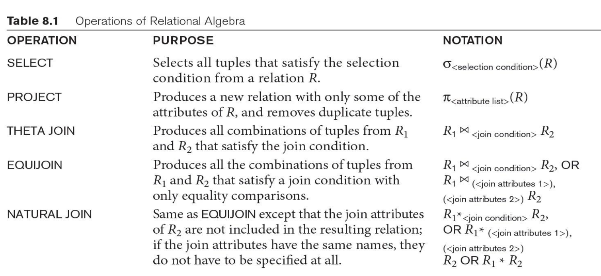                                                                                                                        |
| Operands                      | 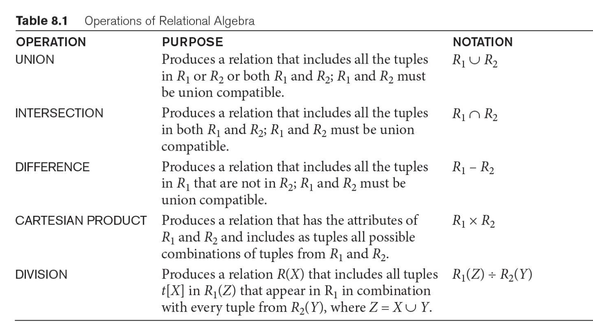                                                                                                                      |
| Views                         | Virtual tables, data is not stored on the disk, instead the query itself is stored (good for security, customised access to data)                         |
| Semantics of attributes       | each tuple in a relation should represent one entity or relationship instance                                                                             |
| Decomposition                 | Update abnormalities can be solved by decomposing relations, this is the process of breaking up large relations into sets of smaller ones                 |
| Normalization                 | A technique for producing a set of relations with desirable properties                                                                                    |
| Functional dependency         | A constraint between two sets of attributes in a database                                                                                                 |
| Closure                       | D+ defines all attributes we can get from D                                                                                                               |
| Equivalence of sets (FD's)    | Two sets are equivalent if every FD in R can be inferred from G and every FD in G can be inferred from F                                                  |
|                               | This means that if F+ = G+, we can say they are equivalent                                                                                                |
| Minimal set                   | A set is minimal if every dependency in F has a single attribute for its RHS, we cannot remove any dependencies and still have an equivalent set          |
| Normalization of relations    | the process of decomposing bad relations by breaking their attributes into smaller relations                                                              |
| Normal Form                   | Condition using keys and FD's of a relation to certify whether a relation schema is in a particular normal form                                           |
| Superkey                      | An attributes or set of attributes that uniquely identify a tuple or row such that no other attribute has the same value in the set                       |
| Candidate key                 | If a relation schema has more than one key, each is called a candidate key                                                                                |
| Primary Key                   | An arbitarily assigned candidate key chosen to be the unique identifier                                                                                   |
| Prime attribute               | An attribute that is a member of a candidate key                                                                                                          |
| Non-Prime attribute           | An attribute that is not a member of a candidate key                                                                                                      |
| 1NF                           | Must conform to all single atomic values                                                                                                                  |
| 2NF                           | If Y -> Z such that the removal of any attribute in Y implies that the FD does not hold anymore                                                           |
| 3NF                           | If in 2NF and no non-prime attribute A in R is transitively dependent on the primary key                                                                  |
| BCNF                          | If whenever FD X -> A holds in R then X is a superkey of R                                                                                                |
| Catalog                       | The catalog consists of Base tables, user-accessible views                                                                                                |
| Query Block                   | The basic unit that can be translated into algebraic operators and optimized                                                                              |
| Query tree                    | A tree data structure that corresponds to a relational algebra expression (relations = leaf nodes, relational algebra operations - internal nodes)        |
| Canonical tree                | A standard tree that corresponds to an SQL query without optimization                                                                                     |
| Materialized evalution        | The result of an operation is stored as a temporary relation                                                                                              |
| Pipelined evalution           | as the result of an operator is produced, it is forwarded to the next operator in sequence                                                                |
| Semantic query optimization   | Uses constraints specified on the database schema in order to modify one query into another query that is more efficent to execute                        |
| Rule-based query optimization | The optimizer chooses execution plans based on heuristically ranked operations                                                                            |
| Cost-based query optimization | The optimizer examines alternative access paths and operator algorithms and chooses the execution plan with lowest estimate cost                          |
| Single-user system            | At most one user at a time can access system                                                                                                              |
| Multi-user system             | Many users can access system concurrently                                                                                                                 |
| Concurrency                   |                                                                                                                                                           |
| Interleaved processing        | Concurrent execution of processes is interleaved in a single CPU                                                                                          |
| Parallel processing           | Processes are concurrently executed in multiple CPU's                                                                                                     |
| Transaction                   | A logical unit of work (can be one or more statements)                                                                                                    |
| Atomicity                     | A transaction is either performed to completion or is not performed at all                                                                                |
| Consistency                   | A correct execution of the transaction must take the database from one consistent state to another                                                        |
| Isolation                     | A transaction should not make its updates visible to other transactions until committed; this when strictly followed ensures the temporary update problem |
| Durability                    | Once a transaction changes the database and the changes are committed, these changes to the database must never be lost because of subsequent failure     |
| Phantoms                      | New rows being read using the same read with a condition                                                                                                  |
| Program Data Dependence       | When we require a change to the program after we have a change to the data set                                                                            |


**Distinctions between SQL and Relational model**
- SQL allows for a relation to have more tuples to have two or more tuples that are identical in attribute values (all) to exist

**Factors for database performance**
- Secondary storage
- Memory management
- Indexing
- Query optimisation
- Network factors
- Concurrency

**Rule-based optimization vs cost-based optimization**

- Might need a little more context but as an example in the Oracle world it was possible to have either cost based (CBO) or rule based (RBO) query execution. The rule based optimizer relies mainly on schema structure (table fields, keys, indexes) and set rules when creating an execution plan. The cost based optimizer relies on generated schema/table statistics (including table size, indexes, data cardinality, etc.) and availability/speed of resources (CPU, memory, disk) and is more dynamic. Typically cost based is better, but does have the drawback of requiring that statistics be kept fairly up to date, but this drawback has become less of an issue as the underlying hardware has gotten better. Most modern databases use cost based optimization. Specifically in the Oracle world the rule based optimizer is obsolete.
