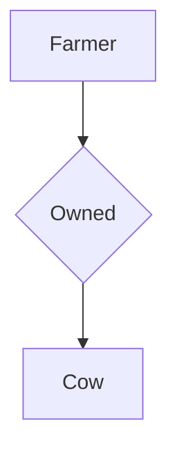

# COSC265 Notes 

> [TOC]

### General Info About Course

#### Gradings
- Assessment part 1 8% (8/8/2020, 5PM)
- Assessment part 2 16% (21/8/2020, 5PM)
- Quizzes 6% (multiple quizzes)
- Lab Test 20% (1st October, 7PM)
- Final Exam 50% (To be announced)

#### Resources
- [Lecture Notes](https://learn.canterbury.ac.nz/course/view.php?id=8959&section=1)
- [Labs and Tutorials](https://learn.canterbury.ac.nz/course/view.php?id=8959&section=2)
- [Homework Material](https://learn.canterbury.ac.nz/course/view.php?id=8959&section=4)
- [Previous Exams](https://learn.canterbury.ac.nz/course/view.php?id=8959&section=2)

### Introduction to Databases 

#### Data Management
- Entity
    - Is something that we have to collect data about
- Attribute
    - Is something we assign to a value, ie if we have an entity called person, 
      the person will have a name attribute
- Data
    - Must be well organized
    - we need to have a system in order to access it efficiently
- Record

**Why We Use Databases**

We use databases to store our information rather then files, this is because
working with files becomes a problem for a number of reasons, these include
having information located in different files and locations. This is a problem
for querying information and manipulating data.

**Database Management System (DBMS)**

Is a system to manage and create databases, the most common one is Oracle. This is also
responsible for managing traffic and making sure that multiple people on the same system
cannot make conflicting changes to the database.

**Database Software**

This is inclusive of applications used to manipulate the database as well as the DBMS.
A DBMS is a general software, it is possible to have many databases on each DBMS. In
the labs we will use the Oracle database.

##### Example Database
Entities
- Course
- section
- grade_report
- prerequisite

**Here is an example of an Entity**

| course_name               | course_number | credit | department |
| -----------               | ------------- | ------ | ---------- |
| Intro to computer science | CS1310        | 4      | CS         |
| Data Structures           | CS1120        | 3      | CS         |
| Discrete Mathematics      | MA2220        | 5      | MATH       |

##### DBMS Functionality

- Define database:
- Construct or load databases
- Manipulate database
    - querying
    - generating reports
    - insertions
    - deletions
    - modification to content
- Concurrent processing
- Protection or security

##### Schema's and Instances

| Terminology            | Description                                                          |
| ---                    | ---                                                                  |
| Database Schema        | The description of a database (database's purpose)                   |
| Schema Diagram         | A diagram display of some aspects of database schema                 |
| Database instance      | The actual data stored in a database *at one point in time*          |
| Database state         | Refers to content of database at a time (extension, occurrence)      |
| Data model             | A set of concepts used to describe the structure of a database       |
| Initial database state | Refers to the database when it is loaded                             |
| Valid state            | A state that satisfies the structure and constraints of the database |

An important distinction to make between database states and database schema is that **the
database schema changes very infrequently** and the **database state changes every time
the database is updated**.

**Internal Schema**

At this level, we are dealing with the files directly, this is about how things are stored
and how to achieve results, this is not for the user to interact with. This has lots of
detail about the database structure and storage. This is independent from the conceptual
view.

**Conceptual Schema**

This is where we can interact with the relationships between entities and make queries and
changes to the database. This has a bit of detail about storage but not that much. This is
independent from the internal level.

**External level**

This is where the end users only get what they desire from the database, the queries are
made for them in an automatic fashion. We can give different descriptions of the data for
different users (multiple viewing methods of data).

##### Database Features
- Data catalog (dictionary)
- Data abstraction
- Data integrity
- Data independence
    - Logical data independence
    - physical data independence
- Multiple views of data
- Sharing of data
- Controlled data redundancy (repeated stuff)
- Query languages
- Interfaces
- Backup and recovery
- Utilities

**People invlolved with Databases**
- Actors on the scene
    - Database administrators
    - Database designers
    - End-users
        - Casual users
        - Naive/Parametric users *("canned transactions")*
        - sophisticated users
        - standalone users
- Working behind the scene
    - DBMS designers and implementers
    - Tool developers
    - Operators and maintenance

##### Data Models
**Categories of Data Models**
- Conceptual
    - High level, semantic
    - Provide concepts that are close to the way many users percieve data
- Physical
    - Low level, internal
    - Provide concepts that are describe details of how data is stored
- Implementation
    - Provide concepts that fall between users views and computer storage details

#### Classification of DBMS's
- Based on data model used
    - Relational, Netowrk, Hierarchical
    - Emerging: Object-orientated Models

#### Don't Bother using DBMS for these Scenario's 
- small data set
- strict time requirements
- access by a single user
- not expecting data to change

### Database Design

This section is estimated to take around four lectures to complete

#### Data Modeling

##### Phases of Database Design
- Requirements collection and analysis
- Conceptual design
- Logical design
- Physical design

**Structural Component of ER**
- `Entities` are specific objects or things in the mini-world that are represented in the database
- `Attributes` are properties used to describe an entity
    - Name
    - SSN
    - Address
        - Number
        - Street
        - suburb
    - Gender
    - etc. 

Note that `Attributes` can have multiple sub-attributes bellow it. If this is the case it is said to be the value is *multi-valued*

- A specific entity will have a value for each of its attributes

Example of an entity with a few attributes
| Name         | SSN        | Address             | Gender | BirthDate   |
| ---          | ---        | ---                 | ---    | ---         |
| 'John Smith' | '12232333' | '731 Houston Drive' | 'Male' | '09-JAN-85' |

#### Types of attributes
**Simple (atomic) or Composite**
- *Gender* is a simple attribute
- *Name* (FirstName, MiddleName, LastName)
    - Composition may form a hierarchy where some components are themselves composite
**Single/Multi-valued**
- *previousDegrees* of a STUDENT
    - Denoted as `{PreviousDegrees}`

**Composite Multi-valued attribute**
- Denoted by: `{Degrees (University, Year, Degree, Field)}`
- In charts: *Double oval denotes multivalued attribute*

**Key Attributes**
- A key attribute may be composite
    - Denoted as `{CourseCode(CourseNo, UnitNo, AddressNo)}`
- A key cannot be multivalued
- It has to be a unique identifier
- A key attribute in a model will be underlined
- Strong entity types must contain at least one key attribute

##### The `NULL` Value
Has three possible interpretations
- Not known
- Not applicable
- Missing

#### Introduction to Relationships

Relationships are denoted using diamonds in the diagrams

**Relationship types**
- Is the schema description of a relationship
- Identifies the relationship name and the participating entity types
- Also identifies certain relationship constraints
- More than one relationship type can exist with the same entity types
- Relationship types can also have attributes associated with them
- Recursive Relationship Types
    - Both participants have the same entity type in different roles
    - (slides 2-26)

**Relationship Set**
- The current set of relationship instances represented in the database
- The current state of a relationship type

##### Dependent's

**Dependents**
- Denoted with double box
- connects to Depends relationship
- This is considered a *Weak Identity Type*

**Cardinality Ratio**

The types of relationships, and how they connect.

- One to one `(1:1)`
- One to many `(1:N)`
- Many to many `(N:N)`

**Participation Constraint**
- Total (existential)
- Partial

Minimum cardinality
    (also called existence dependency constraint)

**Structural Constraints**

If we want to put a minimum amount of people and maximum on a relationships cardinality ratio, we use the syntax `(min, max)` in the diagram.

#### Relationship Diagrams

Here is an example of a relationship diagram (simple)

