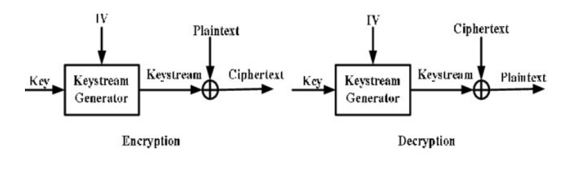
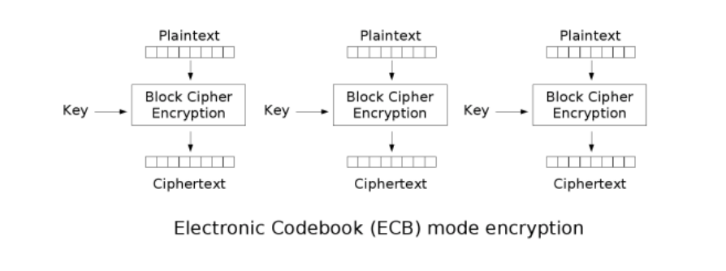
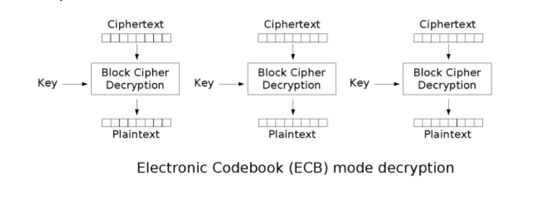
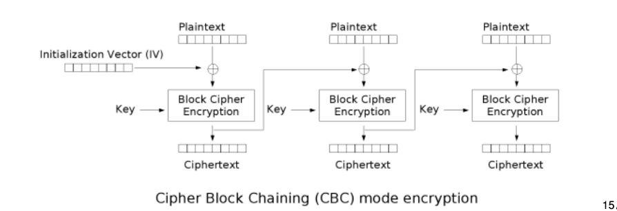
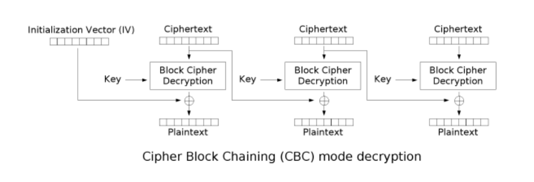

\newpage

# COSC362 Cheatsheet

## Notes to self

> Lecture Three: covers the basic maths component (brush up on this if relevant)

> Lecture Ten: covers more basic maths (number theory)

## Definitions

### Assets

- **Hardware**: Computer systems, storage and communication devices
- **Software**: OS, System utilities, Applications
- **Data**: files, databases and security data

### Vulnerabilities

- **Leaky**: Gives information through the network when it shouldn't
- **Corrupted**: Does wrong thing or gives wrong results
- **Unavailable**: Becomes impossible to use

A cryptosystem is considered to be *highly insecure* if it can be practically attacked using only intercepted ciphertexts.

A cryptosystem should be secure against chosen plaintext and chosen ciphertext attacks (modern standard).

### Randomness

- Defining randomness is difficult
- What we want: any specific string of bits is exactly as random as any other string
- Generators of random strings:
  * True random number generator (TRNG)
  * Pseudorandom number generator (PRNG)
- Using a `TRNG` to provide a seed for `PRNG`

**True random number generator (TRNG)**

- The entropy source (framework for design and validation of TRNG algorithms) includes:
  * A physical noise source
  * A digitalization process
  * Post-processing stages
- The output of the entropy source is any requested number of bits.
- Periodic health test to ensure continuous reliable operation

**Pseudorandom number generator (PRNG)**

- Each generator takes a seed as input
- it outputs a bit string before updating its state
- The seed should be updated after a $n$ calls
- The seed can be obtained from a `TRNG`

Functions used to produce `Randomness`:

- Instantiate: setting the initial state of the DRBG using a seed.
- Generate: providing an output bit string for each request.
- Reseed: inputting a new random seed and updating the state.
- Test: checking correct operation of the other functions.
- Uninstantiate: deleting (zeroising) the state of the DRBG.

**Security benefits**

The ability of an attacker to distinguish reliably between its output and a truly random string

#### CTR_DRBG

- Using a block cipher in counter mode
  * such as AES (recommended) or DES
- DRGB initialised with a seed whose length is equal to the `key length plus block length`
- Seed defines a key $K$ and a counter $ctr$:
- `CTR` mode encryption is iterated with no plaintext added
- The output blocks form `CTR_DRBG` output

> Further information found in Lecture 9, Page 11-12

### Attacks

- **Passive attacks**:
  * Interception or eavesdropping
  * Traffic analysis
- **Active attacks**
  * Masquerade
  * Altering information
  * DDOS
- **Inside attacks**
  * Falsification: False details into database/files
  * Exposure: exposing information in the system
- **Outside attacks**
  * Obstruction: Disabling communication links and information links
  * Intrusion: Gaining unauthorized access to the system

### C.I.A

- **Confidentiality**: Preventing of unauthorized disclosure of information
- **Integrity**: Preventing unauthorized modifications of the system
- **Availability**: Ensuring resources are available when required by authorized users

### Perfect Secrecy

Definition:

- Message set {M1, ··· , Mk }.
- Ciphertext set {C1, ··· , Cl}.
- $PR(M_i, C_j)$ is the probability that $M_i$ is encrypted given that $C_j$ is observed
- In most cases the messages $M_i$ are not equally likely
- For all messages $M_i$ and ciphertext $C_i$:

$$ PR(M_i, C_j) = Pr(M_i) $$

### Security services and mechanisms

**Security Service**: a processing or communication service to give a specific kind of protection to the system resources

**Types of security services**

- `Peer entitiy authentication`: provides confirmation of the claimed identity of an entity.
- `Data origin authenticaiton`: provides confirmation of the claimed source of a message.
- `Access control`: provides protection against unauthorized use of resources
- `Data confidentiality`: protects data against unauthorised disclosure.
-  `Traffic flow confidentiality`: protects disclosure of data which can be derived from knowledge of traffic flows.
- `Data integrity`: detects any modification, insertion, deletion or replay of data in a message(s).
- `Non-repudiation`: protects against any attempt by the creator of a message to falsely deny creating the data or its contents.
- `Availibility`: service protects a system against denial of service.

**Security Mechanism**: a method of implementing one or more security services.

**Types of security Mechanisms**

- `Encipherment`: is the transformation of data in order to hide its information content.
- `Digital signatures`: are cryptographic algorithms which transform data using a signing key
- `Access control lists, passwords or tokens`: used to indicate access rights.
- `Corruption detection techniques`: which can be used with "sequence information".
  * This will be covered in `MAC's`
- `Authentication exchange`: mechanisms are protocols which excnage information to ensure identity of protocol participants
  * Used in TLS
- `Traffic padding`: is spurious traffic generated to protect against traffic analysis.
- `Routing control mechanism`: is the use of specific secure routes.
- The `notarization mechanism`: uses a trusted third party to assure the source or receipt of data.
  * This third party is called a `notary`.

### Confidentiality and Authentication

- `Confidentiality`: A key is needed to *read* the message.
- `Authentication`: a key is needed to *write* the message.

### Symmetric and Asymmetric Cryptography

- `Symmetric key cipher`: Encryption keys are known only to sender and receiver, has secure channel to communicate these keys.
- `Asymmetric key cipher`: Each participant has two keys (public and private)
  * Can be used for both encryption and signing digital signatures

### Kerckhoffs' Principle

`Kerckhoffs' Principle`: The attacker has complete knowledge of the cipher
  * This assumption should be made, the only secret is the decryption key.

### Basic Ciphers

- **Transposition cipher**: characters in the plaintext are mixed with each other.
- **Substitution cipher**: Each character is replaced by a different character.
  * Caesar Cipher, Random simple substitution cipher

### One-way Functions

- A function $f$ is one-way if $f(x) = y$ is easily computed given $x$, but $f^{-1}(y) = x$ is computationally difficult to compute given $y$
- Considered an open problem: `Do one-way functions actually exist?`

**Trapdoor One-way Functions**

A trapdoor one way function $f$ is a one way function s.t. $f^{-1}(y)$ is easily computed given additional information called a trapdoor.

> See an example on Lecture 12, Page 6

This is the basis of public key cryptosystems, using a trapdoor as the decryption key and designing the cryptosystem to be a trapdoor one-way function.

## Cryptographic Ciphers

### Polyalphabetic Substitution Cipher's

**Description and properties**

- Uses multiple mappings from plaintext to ciphertext.
- The effect with multiple alphabets is to smooth frequency distribution.
- **Frequency analysis** should no longer be effective.

**Encryption Process**

A Plaintext message: $M = M_0...M_{d-1}...M_d...M_{2d-1}...M_2d...$

is encrypted using $E(K,M)$

$E(K, M) = f_0 (M_0)...f_{d-1}(M_{d-1}) f_0(M_{d})...f_{d-1} (M_{2d-1}) f_{0} (M_{2d})...$

**Special case** when using $d = 1$: the cipher is monoalphabetic, (simple substitution cipher).

#### Vigenere Cipher (Most famous Polyalphabetic cipher)

**Description and properties**

- Popular form of periodic substitution ciphers based on shifted  alphabets.

**Encryption Process**

> See lecture 6 page 10

**Vulnerabilities**

- Identifying the period length (via Kasiski method)
  * Information found in `Lecture 6 page 12`
- Attack separately $d$ substitution tables
  * Each substitution is just a shift
    + If we have enough ciphertext this is trivial

#### Hill Cipher

**Description and properties**

Performing a linear transformation on $d$ plaintext characters to get $d$ ciphertext characters.

- *Polygram/polygraphic cipher*
  * Simple substitution cipher for extended alphabets
- **weakness**: it's linearity, hence known plaintext attacks are easy
- Known plaintext attachs are possible given $d$ plaintext-ciphertext matching blocks

**Encryption and decryption functions**

- $K$: $d \times d$ matrix
- $M$: Plaintext/message
- $C$: Ciphertext/encrypted message

Encryption function: $C = KM$
Decryption function: $C = K^{-1}M$

> Example Encryption and Decryption: Lecture 6, Page 21 - 22

### Block Ciphers

Block ciphers are the workhorse of secure communications, AES is the currentchoice of block cipher and tripple DES is still used.

- Symmetric key ciphers where each block of plaintext is encrypted with the SAME key
- A *block* is a set of plaintext symbols of a fixed size
- Used in certain configurations called `modes of operation`

#### Terminology and Problems

**Terminology**

- Differential Cryptanalysis:
  * Chosen plaintext attack
  * Based on the idea that the difference between 2 input plaintexts can be correlated to the difference between 2 output ciphertexts.
- Linear Cryptanalysis:
  * Known plaintext attack
  * Theoretically used to break DES

> Modern block ciphers are designed to be immune to both of these attacks.

**Avalanche Effects**

- Key Avalanche:
  * A SMALL change in the key (with the same plaintext) should result in a LARGE change in the ciphertext.
- Plaintext Avalanche:
  * A SMALL change in the plaintext should result in a LARGE change in the ciphertext
  * Changing $1$ bit should change each of the bits with a probability of $\frac{1}{2}$

#### Product Cipher

- Cryptosystem where encryption is formed by applying (also composing) several sub-encryption functions
- Block ciphers are a composition of functions where each $f_i$ has its own key $K_i$

$$ C = E(P,K) = f_r(...(f_2(f_1(P, K_1), K_2)...), K_r) $$

#### Iterated Cipher

Most modern block ciphers are special product ciphers, called *Iterated Cipher's*

- Encryption is divided into rounds
- Sub-encryption functions are all the same function $g$ called the *round function*
- Key $K_i$ is derived from overall master key $K$ and is called the *round key*.

> Encryption and decryption Lecture 7, Page 10 - 12

> Other subsets of an iterated cipher are found in the lectures namely: \
> - Substitution-Permutation Network \
> - Feistel Cipher

#### Data Encryption Standard (DES)

- Designed by IBM
- Encryption and decryption definitions are public property
- Security resides in difficulty of decryption without knowledge of key
- Known attacks
  - Brute force effective against single encryption
  - MITM can be applied to double encrypted DES
- Standard to use triple DES with 3 distinct keys (but is still weak)
- Uses Feistel structure

> Encryption and Decryption found in Lecture 7, Page 23
> Double encryption found in Lecture  7, Page 30

#### Advanced Encryption Standard (AES)

**Properties**

- 128-bit data blocks
- 128-,192- or 256-bit master key
- 10, 12, 14 rounds respective to master key
- Byte-based design
- Substitution-permutation network (SPN)
  * See lecture 7, Page 10

**Security**

- Some cracks have appeared but no breaks in security
- Attacks exist on reduced-round versions
- `Related key attack`: requiring the attacker to obtain ciphertext encrypted with a key related to the actual key in a specified way
- Most serious real attacks so far reduce the effective key size by around 2-bits

**AES vs DES**

- Block size:
  * DES: 64-bits
  * AES: 128-bits
- Key size:
  * DES: 56-bits
  * AES: 128-,192- or 256-bits
- Both are iterated ciphers
- DES uses Feistel cipher
- AES uses Substitution-Permutation Network
- AES is byte-based, where DES is bit-based
- AES is much faster in both software and hardware

### Stream Ciphers

- Characterised by the generation of a `keystream` using a short key and an init value `IV`
- Each element of the `keystream` is used successively to encrypt one or more chars of ciphertext

**Synchronous Stream Ciphers**

- The `keystream` is generated independently of the plaintext.
- Both sender and receiver need to generate the same `keystream` and synchronise on its usage.
- Vigenère cipher seen as a (periodic) synchronous stream cipher where each shift is defined by a key letter.
- CTR mode of operation for a block cipher is one method to generate a `keystream`

- Binary synchronous stream ciphers
  - Encryption: $C(t) = p(t) \bigoplus s(t)$
  - Decryption: $P(t) = C(t) \bigoplus s(t)$

#### One Time Pad

- Key is random sequence of characters, all of them are independently generated
- Each char in the key is used once
- Relies on perfect secrecy
- Is the only unbreakable cipher
- Practical usage is possible for pre-assigned communications between fixed parties
- How to deal with key management of completely random keys

**Properties**

- One time pad is the ONLY unbreakable cipher
- Practical usage is possible for assigned communications between fixed parties
- `Problem`: How to deal with key management of completely random keys?

**Perfect Secrecy using One Time Pad**

- Any message could have been sent, depending on the `keystream`
- The probability that $M_i$ is sent given that $C_j$ is observed - probability that $M_i$ is chosen, weighted by the probability that the right `keystream` is chosen.
- Each ley is chosen with equal probability
- Conditional probability is thus: $Pr(M_i | C_j) = Pr(M_i)$

> Encryption/decryption example: Lecture 9, Page 27-28

#### A5 Cipher

Is a binary synchronous stream cipher applied in most GSM mobile phones

Three variants:

- A5/1: is the original algorithm
- A5/2: is a weakened version
- A5/3: is an algorithm for deployment in 3G mobile systems

**A5/1 Design**

- Algorithm uses 3 linear feedback shift registers whose output is combined
- The 3 `LFSR`'s are *irregilarly clocked*:
  * The overall output is non-linear
  * 64-bit keystream
  * The effective key length is 54-bits
- Has had many successful attacks

#### RC4 Cipher

- Simple, efficient for software implementation
- Widely believed to be too weak to use in new systems

#### ChaCha Algorithm

- Available in TLS ciphersuites as possible replacement for RC4
- Faster than AES
- Uses 256-bit key

## Modes of Operation

Modes were designed to provide confidentiality for data OR autentication for data OR both. Different modes have different efficiency properties and different communication properties. All modes can be applied to any `block cipher`.

### Confidentiality Modes

**Confidentiality Modes: Electronic Code Block (ECB Mode)**

This is the basic mode of a block cipher

| Property            | Description                    |
| ---                 | ---                            |
| Randomised          | is not randomised              |
| Padding             | Required                       |
| Error Propagation   | Errors propagate within blocks |
| IV                  | None                           |
| Parallel encryption | true                           |
| Parallel decryption | true                           |

Encryption: $C_t = E(P_t, K)$

Decryption: $P_t = D(C_t, K)$

> Encryption and decryption found in Lecture 8, Page 12-13

**Cipher Block Chaining (CBC Mode)**

| Property            | Description                           |
| ---                 | ---                                   |
| Randomised          | is randomised                         |
| Padding             | Not Required                          |
| Error Propagation   | in specific bits of the current block |
| IV                  | Must be random                        |
| Parallel encryption | false                                 |
| Parallel decryption | true                                  |

Chaining blocks together

Encryption: $C_t = E(P_t \oplus C_{t-1}, K) s.t. C_0 = IV$

> IV is chosen at random and sent together with ciphertext blocks

Decryption: $P_t = D(C_t, K) \oplus C_{t-1} s.t. C_0 = IV$

**Counter (CTR Mode)**

| Property            | Description                                        |
| ---                 | ---                                                |
| Randomised          | is randomised                                      |
| Padding             | Not Required                                       |
| Error Propagation   | Errors occur in specific bits of the current block |
| IV                  | Nonce must be unique                               |
| Parallel encryption | true                                               |
| Parallel decryption | true                                               |

- Synchronous stream cipher mode (see later)
- A counter and a nonce are used, initialised using a randomly chosen value called $N$
- Propagation of channel errors: one bit change in ciphertext produces a bit error in plaintext in the same location.

> Encryption and decryption found in Lecture 8, Page 20-21

### Authentication Mode (MAC)

Goal: Ensure that messages are not altered in transmission, treating message *integrity* and message *authentication* as the same thing.

**Message Authentication Code (MAC)**

- Cryptographic mechanism to ensure message integrity
- $T = MAC(M, K)$, where $M$ is a message and $K$ is the secret key and $T$ is a fixed length tag.

MAC Properties:

- Providing sender authentication to the message
- Basic security property: Unforgability
  * Infeasible to produce $M$ and $T$ without knowledge of $K$

#### CBC-MAC

- Using a block cipher to create a MAC provided message integrity (but not confidentiality)
- $IV$ must be fixed and public and can be set to all `0`'s
- CBC-MAC with random $IV$ is not secure

- Tag generation: $T = CBC-MAC(P, K)$
  - $C_t = E(P_t \oplus C_{t-1}, K) \forall 0 \leq t \leq n \ s.t. \ C_0 = IV$
  - $T = C_n$

#### Cipher-based MAC (CMAC)

- Is a standardised secure version of `CBC-MAC` by `NIST`
- 2 keys are derived from origin key $K$
- Then XOR's with $M_n$ and added padding if nessasary
- CBC encryption on message $M$
- $T$ is some number of MSB bits of final block
- Standard recommends MAC tag to be of length $log_2(lim/R)$
  * Tag can be of any length (minimum 64 to be safe)

### Authenticated Encryption Mode

- Inputs: 
  * payload: both encrypted and authenticated 
  * associated data: only authenticated.
- Standard modes:
  * `NIST SP-800-38C` in 2004 for Counter with CBC-MAC (CCM) Mode
  * `NIST SP-800-38D` in 2007 for Galois/Counter (GCM) Mode
- Both modes use CTR mode for confidentiality but add integrity with different methods
- Both used in `TLS 1.2/1.3`

#### Counter with CBC-MAC (CCM) Mode

Combining CBC-MAC for authentication of ALL data (payload and associated data) and CTR mode encryption for the payload:

**Properties**

- Complex format with restrictions
- Lengths of $N$ and $P$ are included in first block
- If $A$ is non-zero then formatted from the 2nd block onwards including its length

**High-level Algorithm/Description**

- Inputs: 
  * Nonce: for `CTR` mode
  * Payload: of $P_{length}$ bits
  * Associated data: of $A$
- Format $N, A, P$ to produce a set of blocks
- Computer CBC-MAC tag for these blocks with length of tag
- Use `CTR` mode to compute blocks of key stream
- Output function: $C = (P \oplus MSB_{Plen}(S)) || (T \oplus MSB_{Tlen}(S_0)) \forall S \in \{s_1, ..., S_m\}$

### Hash Functions and MAC

A hash function $H$ is a public function s.t.
- $H$ is simple and fast to compute
- $H$ takes as input a message $m$ of arbitrary length $ and outputs a message digets $H(m)$ of FIXED length

> See Security Properties of this in Lecture 11, Page 6

> Birthday Paradox is also covered in Lecture 11, Page 7

**Iterated Hash Functions**

- From block ciphers, arbitrary-sized data can be processed by having a function processing fixed-sized data and using it repeatedly
- An iterated hash function splits the input blicks of fixed size and operates on each block sequentially using the same function with fixed-sized inputs
- uses a `compression function` $h$ taking fixed size inputs and applies to multiple blocks of the message.

> Compression function is elaborated on in Lecture 11, Page 10-12

#### Secure Hash Algorithm (SHA)

- Based on `MDx` family design
  + About `MDx`:
    * `MDx` has 128-bit output
    * All are proven broken (real collisions found)
  + SHA is more complex, larger output of 160-bits
- Both `SHA-0, SHA-1` have been broken
  + collisions found in both

**SHA-2 Family**

- Developed in response to real attacks on `MD5` and `SHA-1`

**Padding in SHA-2**

- Message length field:
  * 64 bits when block length is 512 bits
  * 128 bits when block length is 1024 bis
- At least one bit padding
- There is an exact number of complete blocks:
  * After the first bit "1" enough bits "0: are added
  * Length field is then added
- Adding the padding and length field will sometimes add an extra block

**SHA-3**

- Is now the current standard for hash functions, `Keccak` is the name of `SHA-3`
- `Keccak` does not use compression function
  * Instead uses a sponge function

**Using hash functions**

- Applying a hash function is NOT an encryption
- Helping to provide data authentication:
  * Not providing it alone
  * Authenticating the hash of a message to authenticate the message
  * Building block for `MAC`'s
  * Building block for `digital signatures`
- Used to store passwords on servers
- Used in conjunction with a `salt` for the hash function

#### Message Authentication Code (MAC) using Hash Functions

- Message Authentication Code (MAC) is a cryptographic mechanism to ensure message integrity
- Alice the sender appends the tag $T$ to the message $M$
- Bob the recipient, computes $T^\prime = MAC(M^\prime, K)$ with the received message $M^\prime$, and checks whether $T = T^\prime$

**Properties**

- Unforgability
- Unforgability under chosen message attack:
  * The attacker has access to a forging oricle s.t. on any input of the attackers choice, the oracle outputs the tag $T = MAC(M,K)$
  * The attacker should not be able to produce a valid forgery that was not asked to the oracle

**MAC from hash functions (HMAC)**

- Built from ANY iterated hash function $H$
- Used in many applications including TLS and IPSec

> Construction found in Lecture 11, Page 24

> Security information found in Lecture 11, Page 25

#### Authenticated Encryption

- let Alice and Bob share a key $K$
- Alice wants to send a message to Bob $M$ with *confidentiality* and *integrity*
- Two options:
  * Split $K$ into two parts $K_1$ and $K_2$, encrypt with $K_1$: *confidentiality*
  * Use the *authenticated encryption* algorithm providing both confidentiality and integrity

> Combining encryption and MAC and Modes; see Lecture 11, Page 28-35

## Public Key Cryptosystems

