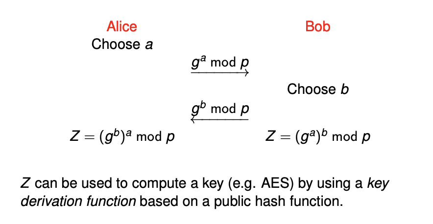
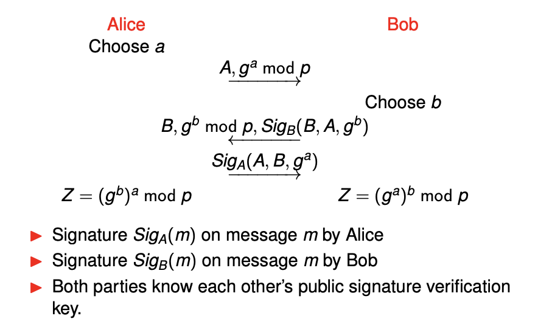
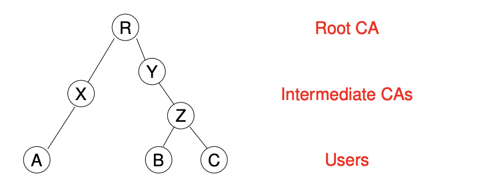
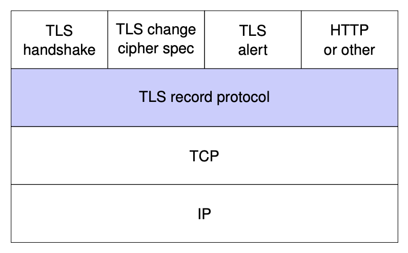

\newpage

# COSC362 Cheatsheet

## Notes to self

> Lecture Three: covers the basic maths component (brush up on this if relevant)

> Lecture Ten: covers more basic maths (number theory)

## Definitions

### Assets

- **Hardware**: Computer systems, storage and communication devices
- **Software**: OS, System utilities, Applications
- **Data**: files, databases and security data

### Vulnerabilities

- **Leaky**: Gives information through the network when it shouldn't
- **Corrupted**: Does wrong thing or gives wrong results
- **Unavailable**: Becomes impossible to use

A cryptosystem is considered to be *highly insecure* if it can be practically attacked using only intercepted ciphertexts.

A cryptosystem should be secure against chosen plaintext and chosen ciphertext attacks (modern standard).

### Randomness

- Defining randomness is difficult
- What we want: any specific string of bits is exactly as random as any other string
- Generators of random strings:
  * True random number generator (TRNG)
  * Pseudorandom number generator (PRNG)
- Using a `TRNG` to provide a seed for `PRNG`

**True random number generator (TRNG)**

- The entropy source (framework for design and validation of TRNG algorithms) includes:
  * A physical noise source
  * A digitalization process
  * Post-processing stages
- The output of the entropy source is any requested number of bits.
- Periodic health test to ensure continuous reliable operation

**Pseudorandom number generator (PRNG)**

- Each generator takes a seed as input
- it outputs a bit string before updating its state
- The seed should be updated after a $n$ calls
- The seed can be obtained from a `TRNG`

Functions used to produce `Randomness`:

- Instantiate: setting the initial state of the DRBG using a seed.
- Generate: providing an output bit string for each request.
- Reseed: inputting a new random seed and updating the state.
- Test: checking correct operation of the other functions.
- Uninstantiate: deleting (zeroising) the state of the DRBG.

**Security benefits**

The ability of an attacker to distinguish reliably between its output and a truly random string

#### CTR_DRBG

- Using a block cipher in counter mode
  * such as AES (recommended) or DES
- DRGB initialised with a seed whose length is equal to the `key length plus block length`
- Seed defines a key $K$ and a counter $ctr$:
- `CTR` mode encryption is iterated with no plaintext added
- The output blocks form `CTR_DRBG` output

> Further information found in Lecture 9, Page 11-12

### Freshness

- To defend against replay attacks, established key must be fresh for each session
- Mechanisms:
  * Random challenges (nonces)
  * Timestamps (string on current time)
  * Counters (increased for each new message)
* Repaired protocol uses random challenges:
  * It can be adapted to use Timestamps and counters

> See example on Lecture 16, Page 26

### Attacks

- **Passive attacks**:
  * Interception or eavesdropping
  * Traffic analysis
- **Active attacks**
  * Masquerade
  * Altering information
  * DDOS
- **Inside attacks**
  * Falsification: False details into database/files
  * Exposure: exposing information in the system
- **Outside attacks**
  * Obstruction: Disabling communication links and information links
  * Intrusion: Gaining unauthorized access to the system

#### Replay Attack

- Let an attacker $C$ get a session key $K'_{AB}$ previously established between $A$ and $B$
- $C$ masquerades as $A$ and persuades $B$ to use the old key $K'_{AB}$

> To defend against replay attacks, we must use a fresh key for each session, see freshness in the notes

### C.I.A

- **Confidentiality**: Preventing of unauthorized disclosure of information
- **Integrity**: Preventing unauthorized modifications of the system
- **Availability**: Ensuring resources are available when required by authorized users

### Mutual and Unilateral Authentication

- If both parties achieve the authentication goal, then the protocol provides *mutual authentication*
- If only one party achieves it, then the protocol provides *unilateral authentication*
- Many real world key establishment protocols achieve only unilateral authentication
  - Typically, clients can authenticate servers.
  - Client authentication often happens later, protected with the establishment key

### Perfect Secrecy

Definition:

- Message set {M1, ··· , Mk }.
- Ciphertext set {C1, ··· , Cl}.
- $PR(M_i, C_j)$ is the probability that $M_i$ is encrypted given that $C_j$ is observed
- In most cases the messages $M_i$ are not equally likely
- For all messages $M_i$ and ciphertext $C_i$:

$$ PR(M_i, C_j) = Pr(M_i) $$

### Security services and mechanisms

**Security Service**: a processing or communication service to give a specific kind of protection to the system resources

**Types of security services**

- `Peer entitiy authentication`: provides confirmation of the claimed identity of an entity.
- `Data origin authenticaiton`: provides confirmation of the claimed source of a message.
- `Access control`: provides protection against unauthorized use of resources
- `Data confidentiality`: protects data against unauthorised disclosure.
-  `Traffic flow confidentiality`: protects disclosure of data which can be derived from knowledge of traffic flows.
- `Data integrity`: detects any modification, insertion, deletion or replay of data in a message(s).
- `Non-repudiation`: protects against any attempt by the creator of a message to falsely deny creating the data or its contents.
- `Availibility`: service protects a system against denial of service.

**Security Mechanism**: a method of implementing one or more security services.

**Types of security Mechanisms**

- `Encipherment`: is the transformation of data in order to hide its information content.
- `Digital signatures`: are cryptographic algorithms which transform data using a signing key
- `Access control lists, passwords or tokens`: used to indicate access rights.
- `Corruption detection techniques`: which can be used with "sequence information".
  * This will be covered in `MAC's`
- `Authentication exchange`: mechanisms are protocols which excnage information to ensure identity of protocol participants
  * Used in TLS
- `Traffic padding`: is spurious traffic generated to protect against traffic analysis.
- `Routing control mechanism`: is the use of specific secure routes.
- The `notarization mechanism`: uses a trusted third party to assure the source or receipt of data.
  * This third party is called a `notary`.

### Confidentiality and Authentication

- `Confidentiality`: A key is needed to *read* the message.
- `Authentication`: a key is needed to *write* the message.

### Symmetric and Asymmetric Cryptography

- `Symmetric key cipher`: Encryption keys are known only to sender and receiver, has secure channel to communicate these keys.
- `Asymmetric key cipher`: Each participant has two keys (public and private)
  * Can be used for both encryption and signing digital signatures

### Kerckhoffs' Principle

`Kerckhoffs' Principle`: The attacker has complete knowledge of the cipher
  * This assumption should be made, the only secret is the decryption key.

### Basic Ciphers

- **Transposition cipher**: characters in the plaintext are mixed with each other.
- **Substitution cipher**: Each character is replaced by a different character.
  * Caesar Cipher, Random simple substitution cipher

### One-way Functions

- A function $f$ is one-way if $f(x) = y$ is easily computed given $x$, but $f^{-1}(y) = x$ is computationally difficult to compute given $y$
- Considered an open problem: `Do one-way functions actually exist?`

**Trapdoor One-way Functions**

A trapdoor one way function $f$ is a one way function s.t. $f^{-1}(y)$ is easily computed given additional information called a trapdoor.

> See an example on Lecture 12, Page 6

This is the basis of public key cryptosystems, using a trapdoor as the decryption key and designing the cryptosystem to be a trapdoor one-way function.

### Elliptic Curves

- Algebraic stuctures formed from cubic equations
- Curves defined over any field
- Add an identity element, and then define a binary operation on the points
  * Form a group over the elliptic curve points, called *elliptic curve group*.

**Choosing Elliptic Curves**

- Generate a new elliptic curve at any time:
- Standardised curves generated in a verifiable random way
  - Difficult to generate curves with any hidden special properties 

> Example Lecture 13, Page 22

**Discrete Logarithm**

- Discrete log defined on elliptic curve groups:
  * if an elliptic curve operation is denoted as a multiplication, then definition same as in $\mathbb{Z}^*_p$
- Best known algorithms for solving discrete log problems are *exponential* in length of parameters.
- Elliptic curve implementations use smaller keys
- Comparison with other cryptosystems (RSA/AES)
  * Relative advantage of elliptic curve cryptography increases at higher security levels
  * Brute force of 128-bit AES key takes same time as factorisation of 3072-bit RSA modulus or taking discrete logarithms in an elliptic curve with elements of size 256 bits.

**Elliptic curve Cryptography**

- Most cryptosystems based on discrete log constructed with elliptic curves as well as in $\mathbb{Z}^*_p$
- Cryptosystems that run on elliptic curves:
  * Diffie-Hellman key exchange
  * Elgamal encryption

## Cryptographic Ciphers

### Polyalphabetic Substitution Cipher's

**Description and properties**

- Uses multiple mappings from plaintext to ciphertext.
- The effect with multiple alphabets is to smooth frequency distribution.
- **Frequency analysis** should no longer be effective.

**Encryption Process**

A Plaintext message: $M = M_0...M_{d-1}...M_d...M_{2d-1}...M_2d...$

is encrypted using $E(K,M)$

$E(K, M) = f_0 (M_0)...f_{d-1}(M_{d-1}) f_0(M_{d})...f_{d-1} (M_{2d-1}) f_{0} (M_{2d})...$

**Special case** when using $d = 1$: the cipher is monoalphabetic, (simple substitution cipher).

#### Vigenere Cipher (Most famous Polyalphabetic cipher)

**Description and properties**

- Popular form of periodic substitution ciphers based on shifted  alphabets.

**Encryption Process**

> See lecture 6 page 10

**Vulnerabilities**

- Identifying the period length (via Kasiski method)
  * Information found in `Lecture 6 page 12`
- Attack separately $d$ substitution tables
  * Each substitution is just a shift
    + If we have enough ciphertext this is trivial

#### Hill Cipher

**Description and properties**

Performing a linear transformation on $d$ plaintext characters to get $d$ ciphertext characters.

- *Polygram/polygraphic cipher*
  * Simple substitution cipher for extended alphabets
- **weakness**: it's linearity, hence known plaintext attacks are easy
- Known plaintext attachs are possible given $d$ plaintext-ciphertext matching blocks

**Encryption and decryption functions**

- $K$: $d \times d$ matrix
- $M$: Plaintext/message
- $C$: Ciphertext/encrypted message

Encryption function: $C = KM$
Decryption function: $C = K^{-1}M$

> Example Encryption and Decryption: Lecture 6, Page 21 - 22

### Block Ciphers

Block ciphers are the workhorse of secure communications, AES is the currentchoice of block cipher and tripple DES is still used.

- Symmetric key ciphers where each block of plaintext is encrypted with the SAME key
- A *block* is a set of plaintext symbols of a fixed size
- Used in certain configurations called `modes of operation`

#### Terminology and Problems

**Terminology**

- Differential Cryptanalysis:
  * Chosen plaintext attack
  * Based on the idea that the difference between 2 input plaintexts can be correlated to the difference between 2 output ciphertexts.
- Linear Cryptanalysis:
  * Known plaintext attack
  * Theoretically used to break DES

> Modern block ciphers are designed to be immune to both of these attacks.

**Avalanche Effects**

- Key Avalanche:
  * A SMALL change in the key (with the same plaintext) should result in a LARGE change in the ciphertext.
- Plaintext Avalanche:
  * A SMALL change in the plaintext should result in a LARGE change in the ciphertext
  * Changing $1$ bit should change each of the bits with a probability of $\frac{1}{2}$

#### Product Cipher

- Cryptosystem where encryption is formed by applying (also composing) several sub-encryption functions
- Block ciphers are a composition of functions where each $f_i$ has its own key $K_i$

$$ C = E(P,K) = f_r(...(f_2(f_1(P, K_1), K_2)...), K_r) $$

#### Iterated Cipher

Most modern block ciphers are special product ciphers, called *Iterated Cipher's*

- Encryption is divided into rounds
- Sub-encryption functions are all the same function $g$ called the *round function*
- Key $K_i$ is derived from overall master key $K$ and is called the *round key*.

> Encryption and decryption Lecture 7, Page 10 - 12

> Other subsets of an iterated cipher are found in the lectures namely: \
> - Substitution-Permutation Network \
> - Feistel Cipher

#### Data Encryption Standard (DES)

- Designed by IBM
- Encryption and decryption definitions are public property
- Security resides in difficulty of decryption without knowledge of key
- Known attacks
  - Brute force effective against single encryption
  - MITM can be applied to double encrypted DES
- Standard to use triple DES with 3 distinct keys (but is still weak)
- Uses Feistel structure

> Encryption and Decryption found in Lecture 7, Page 23
> Double encryption found in Lecture  7, Page 30

#### Advanced Encryption Standard (AES)

**Properties**

- 128-bit data blocks
- 128-,192- or 256-bit master key
- 10, 12, 14 rounds respective to master key
- Byte-based design
- Substitution-permutation network (SPN)
  * See lecture 7, Page 10

**Security**

- Some cracks have appeared but no breaks in security
- Attacks exist on reduced-round versions
- `Related key attack`: requiring the attacker to obtain ciphertext encrypted with a key related to the actual key in a specified way
- Most serious real attacks so far reduce the effective key size by around 2-bits

**AES vs DES**

- Block size:
  * DES: 64-bits
  * AES: 128-bits
- Key size:
  * DES: 56-bits
  * AES: 128-,192- or 256-bits
- Both are iterated ciphers
- DES uses Feistel cipher
- AES uses Substitution-Permutation Network
- AES is byte-based, where DES is bit-based
- AES is much faster in both software and hardware

### Stream Ciphers

- Characterised by the generation of a `keystream` using a short key and an init value `IV`
- Each element of the `keystream` is used successively to encrypt one or more chars of ciphertext

**Synchronous Stream Ciphers**

- The `keystream` is generated independently of the plaintext.
- Both sender and receiver need to generate the same `keystream` and synchronise on its usage.
- Vigenère cipher seen as a (periodic) synchronous stream cipher where each shift is defined by a key letter.
- CTR mode of operation for a block cipher is one method to generate a `keystream`


- Binary synchronous stream ciphers
  - Encryption: $C(t) = p(t) \bigoplus s(t)$
  - Decryption: $P(t) = C(t) \bigoplus s(t)$

#### One Time Pad

- Key is random sequence of characters, all of them are independently generated
- Each char in the key is used once
- Relies on perfect secrecy
- Is the only unbreakable cipher
- Practical usage is possible for pre-assigned communications between fixed parties
- How to deal with key management of completely random keys

**Properties**

- One time pad is the ONLY unbreakable cipher
- Practical usage is possible for assigned communications between fixed parties
- `Problem`: How to deal with key management of completely random keys?

**Perfect Secrecy using One Time Pad**

- Any message could have been sent, depending on the `keystream`
- The probability that $M_i$ is sent given that $C_j$ is observed - probability that $M_i$ is chosen, weighted by the probability that the right `keystream` is chosen.
- Each ley is chosen with equal probability
- Conditional probability is thus: $Pr(M_i | C_j) = Pr(M_i)$

> Encryption/decryption example: Lecture 9, Page 27-28

#### A5 Cipher

Is a binary synchronous stream cipher applied in most GSM mobile phones

Three variants:

- A5/1: is the original algorithm
- A5/2: is a weakened version
- A5/3: is an algorithm for deployment in 3G mobile systems

**A5/1 Design**

- Algorithm uses 3 linear feedback shift registers whose output is combined
- The 3 `LFSR`'s are *irregilarly clocked*:
  * The overall output is non-linear
  * 64-bit keystream
  * The effective key length is 54-bits
- Has had many successful attacks

#### RC4 Cipher

- Simple, efficient for software implementation
- Widely believed to be too weak to use in new systems

#### ChaCha Algorithm

- Available in TLS ciphersuites as possible replacement for RC4
- Faster than AES
- Uses 256-bit key

## Modes of Operation

Modes were designed to provide confidentiality for data OR autentication for data OR both. Different modes have different efficiency properties and different communication properties. All modes can be applied to any `block cipher`.

### Confidentiality Modes

**Confidentiality Modes: Electronic Code Block (ECB Mode)**

This is the basic mode of a block cipher

| Property            | Description                    |
| ---                 | ---                            |
| Randomised          | is not randomised              |
| Padding             | Required                       |
| Error Propagation   | Errors propagate within blocks |
| IV                  | None                           |
| Parallel encryption | true                           |
| Parallel decryption | true                           |

Encryption: $C_t = E(P_t, K)$


Decryption: $P_t = D(C_t, K)$


> Encryption and decryption found in Lecture 8, Page 12-13

**Cipher Block Chaining (CBC Mode)**

| Property            | Description                           |
| ---                 | ---                                   |
| Randomised          | is randomised                         |
| Padding             | Not Required                          |
| Error Propagation   | in specific bits of the current block |
| IV                  | Must be random                        |
| Parallel encryption | false                                 |
| Parallel decryption | true                                  |

Chaining blocks together

Encryption: $C_t = E(P_t \oplus C_{t-1}, K) s.t. C_0 = IV$

> IV is chosen at random and sent together with ciphertext blocks


Decryption: $P_t = D(C_t, K) \oplus C_{t-1} s.t. C_0 = IV$


**Counter (CTR Mode)**

| Property            | Description                                        |
| ---                 | ---                                                |
| Randomised          | is randomised                                      |
| Padding             | Not Required                                       |
| Error Propagation   | Errors occur in specific bits of the current block |
| IV                  | Nonce must be unique                               |
| Parallel encryption | true                                               |
| Parallel decryption | true                                               |

- Synchronous stream cipher mode (see later)
- A counter and a nonce are used, initialised using a randomly chosen value called $N$
- Propagation of channel errors: one bit change in ciphertext produces a bit error in plaintext in the same location.

> Encryption and decryption found in Lecture 8, Page 20-21

### Authentication Mode (MAC)

Goal: Ensure that messages are not altered in transmission, treating message *integrity* and message *authentication* as the same thing.

**Message Authentication Code (MAC)**

- Cryptographic mechanism to ensure message integrity
- $T = MAC(M, K)$, where $M$ is a message and $K$ is the secret key and $T$ is a fixed length tag.

MAC Properties:

- Providing sender authentication to the message
- Basic security property: Unforgability
  * Infeasible to produce $M$ and $T$ without knowledge of $K$

#### CBC-MAC

- Using a block cipher to create a MAC provided message integrity (but not confidentiality)
- $IV$ must be fixed and public and can be set to all `0`'s
- CBC-MAC with random $IV$ is not secure

- Tag generation: $T = CBC-MAC(P, K)$
  - $C_t = E(P_t \oplus C_{t-1}, K) \forall 0 \leq t \leq n \ s.t. \ C_0 = IV$
  - $T = C_n$

#### Cipher-based MAC (CMAC)

- Is a standardised secure version of `CBC-MAC` by `NIST`
- 2 keys are derived from origin key $K$
- Then XOR's with $M_n$ and added padding if nessasary
- CBC encryption on message $M$
- $T$ is some number of MSB bits of final block
- Standard recommends MAC tag to be of length $log_2(lim/R)$
  * Tag can be of any length (minimum 64 to be safe)

### Authenticated Encryption Mode

- Inputs: 
  * payload: both encrypted and authenticated 
  * associated data: only authenticated.
- Standard modes:
  * `NIST SP-800-38C` in 2004 for Counter with CBC-MAC (CCM) Mode
  * `NIST SP-800-38D` in 2007 for Galois/Counter (GCM) Mode
- Both modes use CTR mode for confidentiality but add integrity with different methods
- Both used in `TLS 1.2/1.3`

#### Counter with CBC-MAC (CCM) Mode

Combining CBC-MAC for authentication of ALL data (payload and associated data) and CTR mode encryption for the payload:

**Properties**

- Complex format with restrictions
- Lengths of $N$ and $P$ are included in first block
- If $A$ is non-zero then formatted from the 2nd block onwards including its length

**High-level Algorithm/Description**

- Inputs: 
  * Nonce: for `CTR` mode
  * Payload: of $P_{length}$ bits
  * Associated data: of $A$
- Format $N, A, P$ to produce a set of blocks
- Computer CBC-MAC tag for these blocks with length of tag
- Use `CTR` mode to compute blocks of key stream
- Output function: $C = (P \oplus MSB_{Plen}(S)) || (T \oplus MSB_{Tlen}(S_0)) \forall S \in \{s_1, ..., S_m\}$

### Hash Functions and MAC

A hash function $H$ is a public function s.t.
- $H$ is simple and fast to compute
- $H$ takes as input a message $m$ of arbitrary length $ and outputs a message digets $H(m)$ of FIXED length

> See Security Properties of this in Lecture 11, Page 6

> Birthday Paradox is also covered in Lecture 11, Page 7

**Iterated Hash Functions**

- From block ciphers, arbitrary-sized data can be processed by having a function processing fixed-sized data and using it repeatedly
- An iterated hash function splits the input blicks of fixed size and operates on each block sequentially using the same function with fixed-sized inputs
- uses a `compression function` $h$ taking fixed size inputs and applies to multiple blocks of the message.

> Compression function is elaborated on in Lecture 11, Page 10-12

#### Secure Hash Algorithm (SHA)

- Based on `MDx` family design
  + About `MDx`:
    * `MDx` has 128-bit output
    * All are proven broken (real collisions found)
  + SHA is more complex, larger output of 160-bits
- Both `SHA-0, SHA-1` have been broken
  + collisions found in both

**SHA-2 Family**

- Developed in response to real attacks on `MD5` and `SHA-1`

**Padding in SHA-2**

- Message length field:
  * 64 bits when block length is 512 bits
  * 128 bits when block length is 1024 bis
- At least one bit padding
- There is an exact number of complete blocks:
  * After the first bit "1" enough bits "0: are added
  * Length field is then added
- Adding the padding and length field will sometimes add an extra block

**SHA-3**

- Is now the current standard for hash functions, `Keccak` is the name of `SHA-3`
- `Keccak` does not use compression function
  * Instead uses a sponge function

**Using hash functions**

- Applying a hash function is NOT an encryption
- Helping to provide data authentication:
  * Not providing it alone
  * Authenticating the hash of a message to authenticate the message
  * Building block for `MAC`'s
  * Building block for `digital signatures`
- Used to store passwords on servers
- Used in conjunction with a `salt` for the hash function

#### Message Authentication Code (MAC) using Hash Functions

- Message Authentication Code (MAC) is a cryptographic mechanism to ensure message integrity
- Alice the sender appends the tag $T$ to the message $M$
- Bob the recipient, computes $T^\prime = MAC(M^\prime, K)$ with the received message $M^\prime$, and checks whether $T = T^\prime$

**Properties**

- Unforgability
- Unforgability under chosen message attack:
  * The attacker has access to a forging oricle s.t. on any input of the attackers choice, the oracle outputs the tag $T = MAC(M,K)$
  * The attacker should not be able to produce a valid forgery that was not asked to the oracle

**MAC from hash functions (HMAC)**

- Built from ANY iterated hash function $H$
- Used in many applications including TLS and IPSec

> Construction found in Lecture 11, Page 24

> Security information found in Lecture 11, Page 25

#### Authenticated Encryption

- let Alice and Bob share a key $K$
- Alice wants to send a message to Bob $M$ with *confidentiality* and *integrity*
- Two options:
  * Split $K$ into two parts $K_1$ and $K_2$, encrypt with $K_1$: *confidentiality*
  * Use the *authenticated encryption* algorithm providing both confidentiality and integrity

> Combining encryption and MAC and Modes; see Lecture 11, Page 28-35

## Public Key Cryptosystems

### Asymmetric Cryptography

-   **Asymmetry**: encryption and decryption keys are different
-   Encryption key is public
-   Decryption key is private
-   Advantage: Key management is simple, can share public key to anyone, secret key still needs to be handled with care

### RSA

- Public key cryptosystem and digital signature scheme
    - Anyone can check if the signature is valid using public encryption key
- Based on the `integer factorisation problem`
- RSA patent expired in 2000

**Applications of RSA**

- Message encryption
- Digital signature
- Distribution of a shared key for symmetric key encryption
- User authentication by proving knowledge of the private key corresponding to an authenticated public key

**Key Generation:**

- Randomly choose two distinct primes $p, q$ from the set of all primes of a certain size
- Compute $n = pq$
- Randomly choose $e$ s.t. $gcd(e, \phi(n)) = 1$
    - Here, $\phi(n) = \phi(pq) = (p - 1)(q - 1)$
- Compute $d = e^{-1} \mod \phi(n)$
- Set the public key $K_E$ ad $(n,e)$
- Set the private key $K_D$ as $(p,q,d)$

Encryption:

- Public encryption key $K_E = (n,e)$
- Input is a value $M$ s.t. $0 \leq M \leq n$
- Compute $C = Enc(M, K_E)$

Decryption:

- Private decryption key is $K_D = (p,q,d)$
- Compute $Dec(C, K_D) = C^d \mod n$

> Example of key generation and encryption/decryption in Lecture 12, Page 15

#### Implementing RSA

> Can be found in Lecture 12, slides 21-34

#### Security of RSA

**Attacks**

Most of existing attacks avoided by using standardised padding mechanisms
  * Factorisation of the modulus $n$:
    + Factorisation is believed to be a hard problem (although not proven)
    + Factorisation can be prevented by choosing $n$ large enough
  * Finding $d$ from $n$ and $e$:
    + Finding $d$ is as hard for the adversary as factorising the modulus $n$

> More information on this in Lecture 12, slide 36

**Problems with Key Generation**

Implementation of OpenSSL in Debian based Linux massively reduced randomness for RSA key generation.

### Diffie-Hellman Key Exchange

-   Two users, Alice and bob, share a secret using only public communication.
-   Public elements:
    -   Large prime $p$
    -   Generator $g \in \mathbb{Z}^{*}_p$
-   Alice and bob each selects random values $a$ and $b$ respectively
-   Alice and Bob both compute the secret key $Z = g^{ab}$



**Security of Diffie-Hellman**

- An attacker who finds discrete logarithms breaks the protocol:
  * Intercepting $g^a \mod p$ and taking the discrete log to get $a$
  * Computing $(g^b)^a$ in the same way as Bob
- No better way known for a passive adversary than by taking discrete logs

> Example explored and worked in Lecture 13, Page 7

**Authenticated Diffie-Hellman**

- In the basic protocol:
  * Messages between Alice and Bob are not authenticated
- In a network, Alice/Bob do not know how $Z$ is shared, unless messages are authenticated
- MITM attack: the adversary sets up two keys, one with Alice and one with Bob, and relays the messages between the two
- Authentication feature: authentication can be added by using `digital signatures`



**Static and Ephemeral Diffie-Hellman**

- The above protocol uses *ephemeral keys*
  * Key used one and then discarded
- In the *static* protocol:
  * Alice chooses a long-term private key $X_A$ and public key $y_A = g^{X_B} \mod p$
  * Bob chooses a long-term private key $X_B$ and a public key $Y_B = g^{X_B} \mod p$

- Alice and Bob find a shared secret $S = g^{X_A X_B} \mod p$, that is static:
  * $S$ stays the same until Alice and Bob change their public keys.

### Elgamal Cryptosystem

- Diffie-Hellman protocol turned into a cryptosystem
- For encryption and for signature
- Alice combines her ephemeral private key with Bob's long-term public key

**Key generation:**

- Select a prime $p$ and a generator $g \in \mathbb{Z}^{*}_p$
- Select a long term private key $K_D = x$ where $1 < x < p$
- Compute $y = g^x \mod p$
- Set the long term public key as $K_E = (p,g,y)$

> Encryption and Decryption found in Lecture 13, Page 15

**Security:**

- An attacker who solves the discrete log problem breaks Elgamal cryptosystem by determining the private key $x$ from $g^x \mod p$
- Possible for many users to share the same $p$ and $g$
- No need for any padding as in RSA
  * Each ciphertext is already randomised, thanks to the ephemeral key $k$

**Correctness:**

- Alice knows the ephemeral private key $K$.
- Bob knows the static/long term k=private key $K_0 = x$
- Both Alice and Bob compute the `Diffie-Hellman` value for the two public keys:
  * $C_1 = g^k \mod p$
  * $y = g^x \mod p$
- `Diffie-Hellman`: value $y^k \mod p = C^x_1 \mod p$  used as a mask for the message $M$

? Example found in Lecture 13, Page 17

## Digital Signatures  

This is the main benefit of using public key encryption (see above chapter)

### Properties of digital signatures

- Message authentication codes (MACs) only allow an entity with shared secret to generate a valid tag:
  * Providing data integrity and data authentication
- Digital signatures use public key cryptography to provide properties of a MAC and more:
  * Only the owner of the private signing key can generate a valid digital signature.

**Algorithms used with digital signatures**

- Key generation
  * Outputs two keys A private key and a public key
  * private key is used for signing, public for verification
- Signature generation
- Signature verification

> This algorithm is outlined in Lecture 14, Pages 8-12

### RSA Signatures

RSA signature keys are generated the same way as encryption keys:

- Public key: $n,e \forall n = pq$ for large primes $p, q$
- Private key: $p,q,d \ s.t. \ ed \mod \phi(n) = 1$

A hash function $h$ is also required, as a fixed public parameter, it can be a standard hash function.

> Example Signature Generation and verification Lecture 14, Page 14

### Discrete logarithm Signatures

- Security relying on difficulty of discrete logarithm problem:
- Three versions
  1. Original Elgamal signatures in $\mathbb{Z}^*_p$
  2. Digital signature algorithm (DSA)
  3. DSA based on elliptic curves

#### Elgamal

**Signature generation:**

1. Alice selects a random $k$ s.t. $gcd(k, p-1) = 1$ and computes

$$ r = g^k \mod p $$

2.  Alice solves $M = xr + ks \mod (p - 1)$ for $s$ by computing

$$ s = k^{-1}(M - xr) \mod (p - 1) $$

3. Alice outputs the tuple (M,r,s).

**Signature verification:**

- Bob checks if $g^M \equiv y^r r^s \mod p = ((g^x)^r(g^k)^s)$

**Digital Signature Algorithm (DSA)**

- Prime $p$ is chosen s.t. $p - 1$ has a prime divisor $q$ of much smaller size (\~256 bits)
- A generator $g$ used in Elgamal signatures replaced by $g = h\frac{p-1}{q} \mod p$
  -   $g$ has order $q$ since $g^q \mod p = 1$
- Differences with Elgamal signatures:
    - Message is hashed using SHA hash algorithm
    - $g$ is chosen to be the order of $q$
    - Verification equation becomes as seen below: 

$$ (g^{H(M)})^{S^{-1}}(y^{-r})^{S^{-1}} \equiv r \mod p $$

Both sides of the equation are then reduced modulo $q$

> Parameters can be found in Lecture 14, Page 22
> Key and signature generation found in Lecture 14, Page 23-24

#### Comparison

**Differences with Elgamal signatures**

- Verification equation is the same, except that all components and final result are reduced modulo $q$
- Signature generation mainly requires one exponentiation with a short exponent (224 or 256 bits)
- Signature validation requires two short exponentiations
- Signature size is only $2N$ bits:
  * 448 bits when $N = 224$
  * 512 bits when $N = 256$


#### Elliptic Curve DSA (ECDSA)

- Parameters chosen from NIST approved curves
- Signature generation and verification are the same, except that:
  - q becomes the order of the elliptic curve group
  - multiplication mod $p$ is replaced by the elliptic curve group operation
  - After operations on group elements, only the x coordinate is kept from the pair
- Signatures are generally not shorter than DSA at the same security level
  - Size varies with underlying curve

## PKI and Certification

### PKI

**Motivation**

- Public key infrastructure implies the use of public digital certificates
- Digital signatures provide these certificates
- X.509 certificates are standardized and used in most network security applications

**What is a public key infrastructure (PKI)**

- A public key infrastructure is the key management environment for public key information of a public key cryptosystem - `NIST`
- Key management concerned with *life-cycle* of cryptographic keys
    - Generation, distribution, storage and destruction of keys

#### Hierarchical PKI



- A CA certifies the public key of the entity below
- In a non-hierarchical PKI, certification is done between two CA's

#### Browser PKI

- Multiple hierarchies with preloaded public keys as root CA's
- Intermediate CA's can be added
- Users can also add their own certificates
- Most servers send their public key and certificate to the browser at the start of a secure communication using TLS protocol

#### OpenPGP PKI

- Used in PGP email security
- Certificate includes ID, Public key, validity period and *self-signature*
- There is NO certification authorities
- Various key servers store keys
- Often known as *web of trust*

### Digital Certificates

- How to be confident of the correct binding between a public key and its owner?
  - When using a public key to encrypt a message or to verify a digital signature
- Achieved through the use of *digital certificates*
  - They contain the public key and the owner identity
  - There is other information such as signature algorithm and validity period
- Certificate digitally signed by a certification authority (CA):
  - CA should be trusted by the certificate verifier
- Certificates play a central role in key management for PKI's

**Using a certificate**

-   Verifying a certificate
    -   By checking that the CA's signature is valid
    -   Check that any conditions set in the certificate are correct
-   In order to verify the certificate:
    -   The user of the certificate must have the correct public key of the CA
-   It does not matter who obtains the certificate
-   Public directories may store certificates

> Walk through of certification path in Lecture 15, Page 13

## Key Management 

**Goals**

- Distribution of cryptographic keys to protect subsequent communication sessions
- Key establishment in TLS uses public keys to allow clients and servers to share a new communication key

**How should key's be managed?**

- Critical aspect of any cryptographic system
- Phases:
  - Key generation: keys should be generated such that they are equally likely to occur
  - Key distribution: Keys should be distributed in a secure fashion
  - Key protection: Keys should be accessible for use in relevant algorithms, but not accessible to unauthorised parties
  - Key destruction: once a ley has performed its function, it should be destroyed s.t. It is of no value to an attacker

**Key types**

Keys are often organized in a hierarchy:

-   **Long term keys**
  - Also called static keys
  - Intended to be used for a long time
  - depending upon the application, from a few hours to a few years
  - Used to protect distribution of session keys
-   **Short term keys**
  - Also called session keys
  - Intended to be used for a short time
  - depending upon the application, from a few seconds to a few hours
  - Used to protect communications in a session

**Key Distribution Security**

- In practice, session keys are symmetric keys used with ciphers
- Long term keys can be either symmetric or asymmetric keys depending on how they are used
- How to establish secret session keys among communicating parties using the long term keys
  - Common approaches:
    - Key pre-distribution
    - Using an online server with symmetric long term keys
    - Using asymmetric long term keys
- **Goals of key distribution**
  - Authentication
  - Confidentiality

**A note on forward secrecy**

What happens when a long term key is compromised?

-   The attacker can now act as the owner of the long term key
-   Previous session keys may also be compromised
    -   This can be the case with key transport
    -   This can be prevented with key agreement

A protocol provides *(perfect) forward secrecy* if compromise of long term secret keys does not reveal session keys previously agreed using those long-term keys

### Key Distribution using Symmetric Keys

- Key distribution with an online server
- The TA shares a long-term shared key with each user
- An online TA generates and distributes session keys to users when requested
- The TA is highly trusted and is a single point of attack
- Scalability can be a problem

> Lecture 16, Page 21-23 walks through an example of key distribution using symmetric keys \
> Including Needham-Schroeder Protocol and Kerberos


### Key Distribution using Asymmetric Keys

- No online TA is required
- Public keys used for authentication
- Public keys managed by PKI (certificates and CAs)
- Users are trusted to generate good sessiom key:
  * A good pseudo-random number generator is required.
- Types:
  * *Key transport*
    + TLS sometimes uses this
    + User chooses key material and sends it encrypted to another party
    + Not providing *forward secrecy*
  * *Key agreement*
    + Two parties each provide input to the key material
    + Providing authentication with public keys (by signing the exchanged messages)
    + TLS includes options for key agreement
    + Provides *forward secrecy*

> Lecture 16, Page 17-19 walks through an example of key distribution using asymmetric keys \> Using Diffie-Hellman

### 3-Level Protocol

- Level One: Client interacts with authentication server in order to obtain ticket granting
- Level Two: Client interacts with ticket-granting server TGS in order to obtain a service-granting ticket
- Level Three :Client interacts with application server V in order to obtain a service

> More information on this found in Lecture 16, Pages 31-39

## Transport Layer Security Protocol (TLS)

**Motivation**

- TLS is the most widely used security protocol
- TLS is used to secure communications with banks, online shops, email providers
- TLS uses most of the mainstream cryptographic algorithms
- TLS is a very complex protocol
- TLS has been subject to many attacks and has had many repairs

**Applications of TLS**

- Cryptographic services protocol based upon PKI and commonly used on the Internet.
- Often used to allow browsers to establish secure sessions with Web servers.
- Many other application areas.
- TLS runs primarily over TCP:
- Variant DTLS runs over datagram protocols

**TLS Architecture**

- Designed to secure reliable end-to-end services over TCP
- Three higher level protocols
  * *TLS handshake protocol* to set up sessions
  * *TLS alert protocol* to signal events, such as failures
  * *TLS change cipher spec protocol* to change the cryptographic algorithms



### TLS Record Protocol

- TLS connection services:
  * Message confidentiality 
  * Message integrity
- Services possibly provided by a symmetric encryption algorithm and a MAC
- From TLS > 1.2, services provided with authenticated encryption modes `CCM, GCM`
- Handshake protocol establishes symmetric session keys to use with these mechanisms

Format:

```
Header   | Content type | Major Version | Minor Version | Length |

Packet   |            plaintext optionally compressed            |
         |     MAC (unless authentication encryption is used     |
```

**Header Breakdown**

- Content type
  * Change cipher spec
  * Alert
  * Handshake
  * Application data
- Protocol version:
  * Major version: 3 for TLS
  * Minor version
    + 1 for TLS 1.0
    + 2 for TLS 1.1
    + 3 for TLS 1.2
    + 4 for TLS 1.3
- Length: of the data, (in octets)

**Operation**

- `Fragmentation`: each application layer message is fragmented into blocks of $2^{14}$ bytes or less
- `Compression`:
  * Default compression algorithm is null in TLS 1.2 (thus is optionally applied)
  * Removed in TLS 1.3
- `Authenticated Data`: consisting of the compressed data, header and an implicit record sequence number
- `Plaintext`: compressed data and MAC (if present)
- `Session keys`: computed during handshake protocol, for either MAC and encryption algorithms or authenticated encryption algorithm
- `Specification`: encryption and MAC algorithms are specified in the negotiated cipher suite

**Other information**

Hash function:

- All TLS versions use negotiated hash function `HMAC`
- `SHA-2` allowed only from TLS 1.2
- `MD5` and `SHA-1` discarded from TLS 1.3

Encryption Algorithm:

- Either a negotiated block cipher in CBC mode or a stream cipher
- Most common block cipher is AES
- 3DES and RC4 discarded in TLS 1.3
- For block ciphers, padding is applied after MAC to make a multiple of the cipher block size

Authenticated Encryption Algorithm:

- Allowed instead of encryption and MAC from TLS 1.2
- Only AES with either `CCM` or `GCM` modes in TLS 1.3
- Authenticated additional data in the header and implicit record sequence number

### TLS Handshake Protocol

**Purposes**

- Negotiating the TLS version and cryptographic algorithms to be used
- Establishing a shared session key for use in the record protocol
- Authenticating the server, and optionally authenticating the client
- Completing the session establishment
- `Variations With:`
  * RSA
  * Diffie-Hellman
  * Pre-shared keys
  * Mutual authentication
  * Server-only (unilateral) authentication
- Simplified in TLS 1.3 (see later)

**Phases**

- Phase 1: initiating the logical connection and establishing its security capabilities
- Phases 2,3: performing key exchange
- Phase 4: completing the setting up of a secure connection

> More information in the Lecture 17, Pages 19-35

**Summary of handshake protocol**

Process to start a communication session between a server and a client:

- Specify which version of TLS they will use
- Decide on which cipher suites they will use
- Authenticate the identity of the server via the server's public key and the certificate authority's digital signature
- Generate session keys in order to use symmetric encryption after the handshake is complete

#### Variation for handshake protocol: Steps for RSA Key Exchange

1. `Client hello message`: TLS version and cipher suites supported by the client + $N_C$
2. `Server hello message`: certificate + chosen cipher suite + $N_S$
3. `Authentication`: client checks certificate
4. `Premaster secret using key transport`:
  * Chosen by client and encrypted using server's public key
  * Decrypted using server's private key
5. `Session Keys`: Computed using PRF on each side
6. `Client finished message`: encrypted with a session key
7. `Server finished message`: encrypted with a session key

> The handshake is now complete and communication continues using the session keys

#### Variation for handshake protocol: Steps for Diffie-Hellman Key Exchange

1. `Client hello message`: TLS version and cipher suites supported by the client + $N_C$
2. `Server hello message`: certificate + chosen cipher suite + $N_S$
3. `Server's signature`: on $N_C, N_S$ and server's Diffie-Hellman parameters using server's private key
4. `Signature verification`: client checks signature and sends client's Diffie-Hellman parameters
5. `Premaster secret usign key agreement`: using exchanged Diffie-Hellman parameters
6. `Session Keys`: computed using PRF on each side
7. `client finished message`: encrypted with a session key
8. `Server finished message`: encrypted with a session key

> The handshake is now complete and communication continues using the session keys
