\newpage

## Course Information

**Lecturers Details**

- Lecturer: Dr. Clementine Gritti
  - Office: Erskine 304
  - Email: clementine.gritti@canterbury.ac.nz
- Tutor: Ryan Beaumont
  - Email: rbe72@uclive.ac.nz

**Weekly Lab Times**

- Tuesday, 16:00–18:00, Jack Erskine 136 Lab 4.
- Wednesday, 14:00–16:00, Jack Erskine 136 Lab 1.
- Friday, 16:00–18:00, Jack Erskine 136 Lab 4.

**Other Information**

- Labs and Quiz's will be available on learn
- Textbooks
  - Cryptography and network security : principles and practice, William Stallings, 5th edition
    - This course is inspired from this book as the bulk of the course
      is founded in cryptography.
    - The exam will only be on content in the slides not from the book
  - Computer security : principles and practice, William Stallings and Lawrie Brown, 3rd edition

### Assessment

1. Labs (10%) - attendance and participation:

- Labs are done individually but you are encouraged to discuss and share with your peers (you are allowed to see each other during labs).
- Attending one lab each week over the semester automatically gives you full mark: – The tutor will assess your attendance.
- If you cannot attend one lab session, then a report (along with a justification of student absence) will be required and assessed:
  - The report needs to be submitted by one week after the missed session.
  - Example: if you miss Tuesday lab on Week X then you are asked to submit a report by Tuesday of Week X+1.
  - The report needs to be sent to _both_ the lecturer and the tutor.

2. Weekly quizzes (20%):

- They can be found and done on LEARN.
- 9 quizzes in total.
- Each quiz contains 10 questions. Each question contains 4 choices such that only one choice is correct.
- 2 attempts per quiz, such that the highest grade is taken into account.
- A quiz is given on Friday of Week X, and should be done before Friday of Week X+1 (except for the one released just before the break):

3. Assignment (20%):

- _Deadline_: 17 September 2021.
- Small exercises on what has been covered so far.
- The assignment will be released on LEARN on 20 August 2021.
- Your report should be uploaded to LEARN.

4. Final exam (50%)

- 3-hours duration
- 25 multiple-choice questions
- 5 open questions, such that if additional information is needed to solve the problem then it will be provided.
- Covers all content from all lectures study _definitions, mechanisms, processes_
  - Not expected to remember the code of each standard (e.g. RFC1234)

## Lectures

### Lecture One - Course Introduction

- All materials will be found on learn, including lectures, labs, quizzes
  and assignments.
- Course outline available
- Labs must be done in person or a report _will not get full marks if do not attend_
- Labs start next week
- Weekly quizzes go over two lectures each _multi-choice_
- Midterm and final will all be entirely open questions

**Why do we need cyber security**

- Privacy
- Security
- Risk management

**Famous recent attacks**

- Dark hotel attack
  - Targeted phishing attacks using spy-ware
  - Infiltrating guests computers through WIFI networks at hotels
  - Loss of confidentiality
- POODLE attack
  - man in the middle exploit
  - Communications can be decryped and exploited
- EncroChat
  - A communications network and service provider
  - Infiltrated by police in 2020
- WannaCry
  - Loss of availability
  - stolen government hacking tools
  - Worm encrypting files on computers hard drive
    - Was a form of ransom-ware
- Botnet
  - Botnet attacking IoT devices with default admin credentials
  - DDos
  - Loss of availability

Because of these attacks, some users have lost confidence in the service
provided not storing/selling data.

**Course Focus**

- Cryptography as a foundation for information security
- Applications of cryptography
- History of cryptography
- Modern cryptography
  - Block ciphers, stream ciphers
  - public key crypto
  - Hashing and MAC
- Some mathematics
  - Modular arithmetic
  - Number theory
  - Elliptic curves
- Using all of the cryptography
  - Public key infrastructure
  - Secure email
  - TLS (HTTPS)

### Lecture Two - Course Overview

**What is cyber security?**

Definition from the NIST computer security handbook:

- The protection afforded to an automated information system in order to attain the applicable objectives of preserving the
  integrity, availability and confidentiality of information system resources.
  - Some literature might differentiate between _computer security and cyber security_

**Definitions**

- A threat
  - Represents a potential security harm to an asset
- An attack
  - is a threat that is carried out
- The threat agent
  - carrying out the attack is referred to as an attacker
- A countermeasure
  - Any means taken to deal with an attack
- A residual level of risk to the assets
  - represented by vulnerabilities possibly exploited by threat agents
- **Assets**
  - Computer systems and other data processing, storage and data communication devices
  - OS, system utilities and applications
  - Files and databases and further data
  - Local and wide area network links
- **Vulnerabilities**
  - A computer system can be:
    - Leaky
      - meaning gives access to information through the network, violates confidentiality
    - Corrupted
      - meaning that it does the wrong thing, violates integrity principle
    - Unavailable
      - meaning that it becomes impossible or impractical to use, violates availability
- Passive attacks
  - Interception
  - Traffic analysis
    - Spoofing, finding information and observing traffic
- Active attacks
  - Altering information and system resources
  - May be hard to prevent but easy to detect
  - Masquerade
    - the attacker claims to be someone else _authorized_
  - Falsification (Man in middle)
    - the attacker changes messages during transmission
  - Misappropriation (DDOS)
    - the attacker prevents legitimate users from accessing resources
- Inside attacks
  - initiated by an entity INSIDE the security perimeter
  - authorization to access system resources but use of them in a malicious way
  - Exposure
    - the attacker intentionally releases sensitive information to an outsider.
  - Falsification
    - the attacker alters or replaces valid data or introduces false data into a file or database.
- Outside attacks
  - initiated from OUTSIDE the perimeter, by an unauthorised or illegitimate user of the system
  - Obstruction
    - the attacker disables communication links or alters communication control information.
  - Intrusion
    - the attacker gains unauthorised access to sensitive data by overcoming the access control protections.

**Security functional requirements**

- Information security management requires to:
  1. Identify threats
  2. Classify all threats according to liklihood and severity
  3. Apply security controls based on cost benefit analysis
- Countermeasures to vulnerabilities and threats comprise:
  1. Computer security technical measures
  - access control, authentication and system protection
  2. Management measures
  - awareness and training
  3. Both
  - configuration management

**Defining Information Security**

Definition from the NIST computer security handbook:

- The term security is used in the sense of minimizing the vulnerabilities of assets and
  resources. An asset is anything of value. A vulnerability is any weakness that could be
  exploited to violate a system or the information it contains. A threat is a potential
  violation of security.

**The CIA Triad**

- Confidentiality
  - Preventing unauthorised disclosure of information
- Integrity
  - Preventing modification or destruction of information
- Availability
  - ensuring resources are accessible when required

**Information Security Definitions**

- Security Service
  - a processing or communication service to give a specific kind of protection to system resources.
  - Types of security services [Lecture Two - Slide 20/27]:
    - Peer entity authentication
    - Data origin authentication
    - Access control
    - Data confidentiality
    - Traffic flow confidentiality
    - Data integrity
    - Non-repudiation
    - Availability
- Security Mechanism
  - a method of implementing one or more security services.
  - Types of security mechanisms
    - Encipherment
    - Digital signature
    - Access control
      - access control lists, password or tokens which may be used to indicate access rights
    - Data integrity
    - Authentication exchange
    - Traffic padding
    - Routing control
    - Notarization

**Risk Management**

A key tool in information security management:

1. Identify threats
2. Classify all treats according to likelihood and severity
3. Apply security controls based on cost benefit analysis

### Lecture Three - Number Theory and Finite Fields

**Factorisation**

The set of all integers is denoted by $\mathbb{Z} = {..., -3, -2, -1, 0, 1, 2, 3, ...}$,
given $a, b \in \mathbb{Z}$, $a$ divides $b$ if there exists $k \in \mathbb{Z} \quad s.t \quad ak = b$.

- This means that $a$ is a factor of $b$
- $a | b$

We use $p$ to denote a prime, an integer $p \geq 1$ is a _prime_ if its divisors are
$(1, p)$.

- Testing a prime number $p$ by trial numbers up to the square root of $p$
  = There are more efficient ways to check for primality _later in the course_

**Properties of factorisation and useful formulae:**

- If $a | b$ and $a | c$, then $a | bc$
- If $p$ is prime and $p | ab$ then either $p | a$ or $p | b$
- **Division algorithm**
  - given $a, b \in \mathbb{Z}, \quad s.t \quad a > b$, then there exists $q, r \in mathbb{Z} \quad s.t \quad a = bq + r$
  - $a = bq + r$ and $0 \leq r \ leq b$, we can use this to show $r < \frac{a}{2}$.
- **Greatest common divisor (GCD)**
  - $gcd(a, b) = d$ if $d | a$ and $d | b$
  - if $c | a$ and $c | b$ then $c | d$
  - $a$ and $b$ are _relatively prime / co-prime_ when $gcd(a, b) = 1$
- **Euclidean Algorithm**
  - Find $d = gcd(a, b)$

$$ a = bq*1 + r_1 \quad for \quad 0 < r_1 < b $$
$$ b = r_1q_1 + r_2 \quad for \quad 0 < r_2 < r_1 $$
$$ r_1 = r_2q_1 + r_3 \quad for \quad 0 < r_3 < r_2 $$
$$ ... $$
$$ f*{k - 3} = r*{k-2}q*{k-1} + r*{k-1} \quad for \quad 0 < f*{k-1} < f*{k-2} $$
$$ f*{k - 2} = r*{k-1}q*{k} + r*{k} \quad for \quad 0 < f*{k} < f*{k-1} $$
$$ f*{k - 1} = r*{k}q*{k+1} + r*{k+1} \quad with \quad r*{k+1} = 0$$

- Hence $d = r_k = gcd(a, b)$

* **Back Substitution - Extending Euclidean Algorithm**

  - Finding x, y in $ax + ay = d = r_k$
  - This is essentially reversing the Euclidean algorithm

* **Modular Arithmetic:**

* Given $a \equiv b$ (mod n) and $c \equiv d$ (mod n), then the following conditions hold:

  - $a + b \equiv c + d$ (mod n)
  - $ac \equiv bd$ (mod n)
  - $ka \equiv kb$ (mod n)

* **Groups**
  - A group $\mathbb{G}$ is a set with _binary operation_ and:
    - Closure: $a \cdot b \in \mathbb{G}$ for $a, b \in \mathbb{G}$
    * Identity: there is an element 1, s.t. $a \cdot 1 = 1 \cdot a = a$ for $a \in \mathbb{G}$
    * Inverse: there is an element $b$ s.t. $a \cdot b = 1$ for $a \in \mathbb{G}$
    * Associativity: $(a \cdot b) \cdot c = a \cdot (b \cdot c)$ for $a,b,c \in \mathbb{G}$
    * Commutativity: $a \cdot b = b \cdot a$ for $a, b \in \mathbb{G}$
      - If this condition holds, the group is said to be _abelian_.
* **Cyclic Groups**
  - the order $|\mathbb{G}|$ of a group $\mathbb{G}$ is the number of elements in $\mathbb{G}$
  - $g^k$ denote the repeated application of $g \in \mathbb{G}$, using the group operation
  - The order $|g|$ of $g \in \mathbb{G}$ is the smallest integer $k$ s.t. $g^k = 1$
  - $g$ is a generator of $\mathbb{G}$
  - A group is said to be _cyclic_ if it has a generator
* **Finding inverse**

  - Use extended Euclidean algorithm if GCD is 1.

* **Fields**
  - A field $\mathbb{F}$ is a set with binary operations:
  - $\mathbb{F}$ is an _abelian group_ under the operation $+$ with identity
    element of 0.

- **Finite Fields**
  - Setting up secure communications requires fields with a finite number of elements.
  - Notation is $GF(p) = \mathbb{Z}\_p$
  - Addition modulo 2: XOR LOGIC

### Lecture Four - CrypTool

What is cryptool?

- Open source program that focuses on the free e-learning software, illustrating
  cryptographic concepts.
- We will be using CrypTool 2
- [Video to go back and watch](https://www.youtube.com/watch?v=dELT2-Vgsr8)

### Lecture Five - Classic Encryption

**Goals:**

- Study historical ciphers
- Establish basic notation and terminology
- Introduce basic cryptographic operations
- Explore typical attacks and adversary capabilities

**Terminology:**

- Cryptography: The study of designing crypto-systems, key components are:
  - Confidentiality: A key is needed to _read_ the message
  - Authentication: A key is needed to _write_ the message
- Cryptanalysis: The study of breaking crypto-systems
- Stenography: The study of concealing information
- Crypto-system
  - A set of plain-texts
  - A set of cipher-texts
  - A set of keys
  - A function called _encryption_ which transforms plain text to cipher text
  - An inverse function called _decryption_, which reverses the encrypted message to plain-text
- Symmetric and Asymmetric Cryptography
  - Symmetric key cipher:
    - Encryption and decryption keys are known to the sender and receiver
    - Secure channel for transmission of the keys
  - Asymmetric key cipher
    - Each participant has a public key and a private key
    - Possibly working for both encryption of messages and the creation of digital signatures

#### Symmetric Encryption

**Notation for Symmetric Encryption Algorithms:**

- Encryption function: $E$
- Decryption function: $D$
- Message or plain-text: $M$
- Cipher-text: $C$
- Shared secret key: $K$

Encryption is denoted as $C = E(M, K)$ \
Decryption is denoted as $M = D(C, K)$

**Methods to break Symmetric encryption:**

An adversary has access to many methods to break a cryptosystem, however such methods depend on some conditions and
known knowledge, such as:

- What are the resources available to the adversary?
  - Examples: _computational capability, inputs/outputs, knowledge of the crypto-system_
- What does the adversary want?
  - Do we want to know the secret key, distinguish two messages, **what are we trying to achieve?**.

**Exhaustive Key Search:**

This is a brute force attack, that checks all combinations of possible keys, note there is no way to prevent such
an attack, our best option is just to raise complexity to where it is to combinationally difficult to compute, however
this does not stop people from getting lucky when breaking your system.

- We may be able to break the system without exhaustive search.
- We may be able to break the system without finding the key.

**Attack classifications:**

These are ordered from the least powerful to the most dangerous information an attacker could have.

1. Cipher-text Only Attack - the attacker only has access to intercepted encrypted messages
2. Known Plain-text Attack - The attacker knows some of the plain text
3. Chosen Plain-text Attack - The attacker can obtain the cypher-text from some plain-text that has been selected
4. Chosen Cipher-text Attack - The attacker can obtain the plain-text from some cipher-text that it has selected

Which of these should be prevented?

- A crypto-system is seen as very insecure if it can be practically attacked using only intercepted cypher texts
- A crypto-system should be secure against chosen plain-text and chosen cipher-text attacks (_this is the modern standard_)
- History shows that chosen cipher-text attacks are practical to set up for an attacker

**Kerchhoffs' Principle**: We assume an attacker has complete knowledge of the cipher, the only item that is
unknown about the crypto-system is the private key.

- Using a secret, non-standard algorithm can cause severe problems
  - This would be an example of _security through obscurity_ (note this is a bad habit)

**Statistical Attacks:**

- Depends on using the redundancy of the alphabet
- Information from distribution of letters
- Recognising patterns to guess information about the crypto-system

**Basic cipher operations:**

Historical ciphers combine two basic operations:

- Transposition: Characters on the plain-text are mixed up with each other
  - Permutating characters in a fixed period $d$ and a permutation $f$
  - Plain-text is seen as a matrix of rows of length $d$
  - Key is $(d, f)$
  - Each block of $d$ characters is re-ordered using permutation $f$
  - Complexity is $d!$
  - We will go through how to do this by hand and a formulation of how to automate this process using Crypt Tool
- Substitution: Characters are replaced by a different character (or set of characters)
  - Each character in the plain-text alphabet replaced by a character in the cipher-text alphabet, following a
    cypher-text table.
  - _Caesar cipher_ is a simple example of a substitution cipher
    - Functions for encryption $C_i = (M_i + j) mod n$
    - Functions for decryption $M_i = (C_i + j) mod n$
    - To break this we can do a frequency analysis in order to find common characters (_example, use ' ' as most common letter_)

### Lecture Six - Classic Encryption: Block ciphers

**Defining Polyalphabetic Substitution**

- Using multiple mappings from plaintext to ciphertext
- The effect with multiple alphabets is to smooth frequency distrabution
  - Direct frequency analysis should no longer be effective
- Typical polyalphabetic ciphers are periodic substitution ciphers based on period $d$
- Given $d$ ciphertext alphabets $C_0, C_1, ..., C_{d-1}$ let $f_i: A \rightarrow C_i$ be a mapping
  from the plaintext alphabet $A$ to the $i_{th}$ ciphertext alphabet $C_i \forall 0 \leq i \leq d - 1$

- Encryption Process:

  - Plaintext: $M = M_0 ... M_{d-1}M_d...M_{2d-1}M_{2d}...$
  - is encrypted to:
    - $E(K, M) = f_0((M_0))...f_{d-1}(M_{d-1})f_0(M_d)...f_{d-1}(M_{2d-1})f_0(M_{2d})...$
  - Special case with $d = 1$: the cipher is monoalphabetic (simple substitution cipher)

- Key generation:
  - Select a block $d$
  - Generate $d$ random simple substitution table
- Encryption:
  - Encrypting the character by using the substitution table number $j$ such that $i \equiv j (mod d)$
- Decryption
  - Using the same substitution table as in encryption in order to reverse the simple substitution

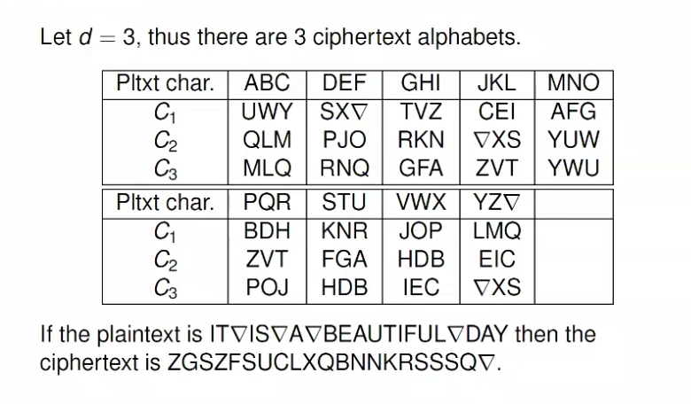

**Vigenere Cipher**

- Popular form of periodic substitution ciphers based on _shifted_ alphabets
- The key $K$ is a sequence of characters
  - $K = K_0K_1...K_{d-1}$

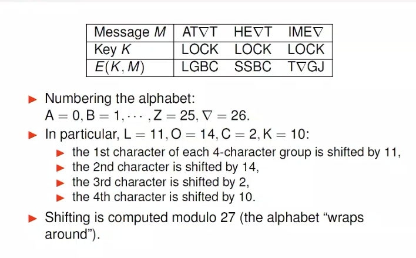

Crypto-analysis:

- Identify the period length
  - Kasiski method
  - Cryptool uses autocorrelation to estimate the period
- Attack separately $d$ substitution tables
  - Each substitution is just a shift
    - If there is sufficient ciphertext then it is trivial

**Autocorrelation method**

- Method used to find the period length $d$ of any periodic polyalphabetic cipher
- Given ciphertext $C$, computing the correlation between $C$ and its shift $C_i$ for all values of $i$, of the period
- Seeing peaks in the value will help to find $i$

**Hill Cipher**

- THe americal mathematition Lester S. Hill published his cipher in 1929
- _Polygram cipher_
  - Simple substitution cipher on an extended alphabet consisting of multiple characters
  - Example: Diagram substatution in which the alphabet consists of all pairs of characters
- Major weakness: its linearity, hence known plaintext attacks are easy
- Let $d = 2$ so encryption takes diagrams as input and output blocks
- Each plaintext pair is written as a column vector, letters are encoded as numbers

Performing a linear transformation on $d$ plaintext characters to get $d$ ciphertext characters:

- Encryption involves multiplying a $d \times d$ matrix $K$ by the block of plaintext $M$.
  - $C = KM$
  - [tutorial: 27:00](https://echo360.net.au/lesson/G_fa546c08-021e-4228-a773-3d8e47bbac7d_f2ab542e-5a86-4120-9080-57e4475971b4_2021-08-05T11:00:00.000_2021-08-05T11:55:00.000/classroom#sortDirection=desc)
- Decryption involves multiplying the matrix $K^{-1}$ by the block of ciphertext $C$
  - $M = K^{-1}C$

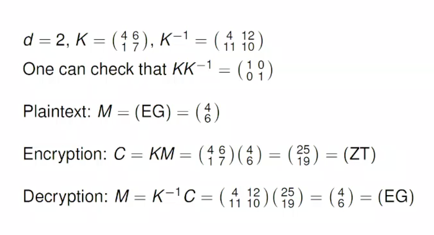

Crypto analysis:

- Known plaintext attacks possible given $d$
- Given blocks $m_i$ and $C_i$ for $0 \leq i \leq d-1$
- [example: 29:00](https://echo360.net.au/lesson/G_fa546c08-021e-4228-a773-3d8e47bbac7d_f2ab542e-5a86-4120-9080-57e4475971b4_2021-08-05T11:00:00.000_2021-08-05T11:55:00.000/classroom#sortDirection=desc)

**Block Cipher**

- Block ciphers are the main bulk encryption algorithm in commercial applications
- AES and legacy cipher DES are widely used
- Symmetric key ciphers where each block is encrypted with the same key
- A block is a set of plaintext symbols of a fixed size
- length of plaintext and ciphertext is the same

Product cipher:

- Cryptosystem where encryption is formed by applying several sub-encryption functions
- Most block ciphers are a composition of simple functions

Iterated cipher:

Most modern block ciphers are special product ciphers

- encryption is divided into $r$ smaller rounds
- sub-encryption functions are all same function, called a _round function_
- key $K_i$ is derived from overall master key $K$
- [tutorial: 38:40](https://echo360.net.au/lesson/G_fa546c08-021e-4228-a773-3d8e47bbac7d_f2ab542e-5a86-4120-9080-57e4475971b4_2021-08-05T11:00:00.000_2021-08-05T11:55:00.000/classroom#sortDirection=desc)
- Decrypt by taking the inverse

Types of iterated ciphers:

- Substitution-Permutation network
  - Block length $n$ mst allow each block to be split into $m$ sub-blocks
  - we have two operations:
    - Substitution: $\Pi_S : {0, 1}^{'} \rightarrow {0,1}^{'}$
    - Permutation: $\Pi_P : {1, ..., n} \rightarrow {1, ..., n}$
    - [tutorial: 45:00](https://echo360.net.au/lesson/G_fa546c08-021e-4228-a773-3d8e47bbac7d_f2ab542e-5a86-4120-9080-57e4475971b4_2021-08-05T11:00:00.000_2021-08-05T11:55:00.000/classroom#sortDirection=desc)

Feistel Cipher:

- Round function swaps two blocks and forms a new right hand half
- Can be mapped to a network where two halves plaintext travels through
- [tutorial: 50:00](https://echo360.net.au/lesson/G_fa546c08-021e-4228-a773-3d8e47bbac7d_f2ab542e-5a86-4120-9080-57e4475971b4_2021-08-05T11:00:00.000_2021-08-05T11:55:00.000/classroom#sortDirection=desc)

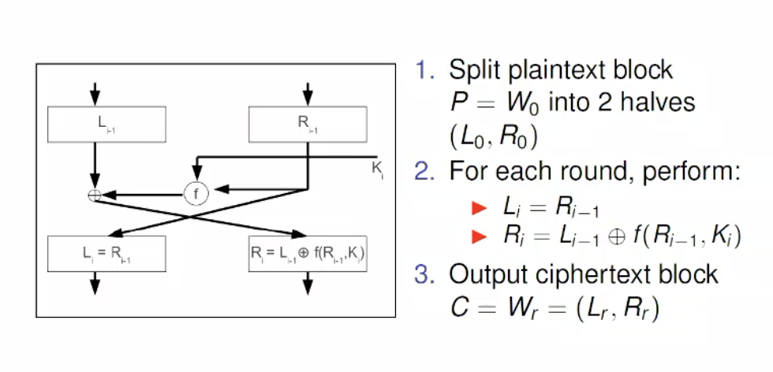

**Differential Crypto-analysis**

- Chosen plaintext attack
- Based on the idea that the difference between two input plaintext can be correlated to the difference between the output text

**Linear Crypto-analysis**

- Known plaintext attack
- Theoretically used to break DES

### Lecture Seven: Block ciphers continued

- Encryption and decryption definitions are public property
- Security resides in the difficulty of decryption without the key
- [Encryption steps: 08:00](https://echo360.net.au/lesson/G_07bf8bc4-e541-404a-9816-826195e79456_f2ab542e-5a86-4120-9080-57e4475971b4_2021-08-09T10:00:00.000_2021-08-09T10:55:00.000/classroom#sortDirection=desc)

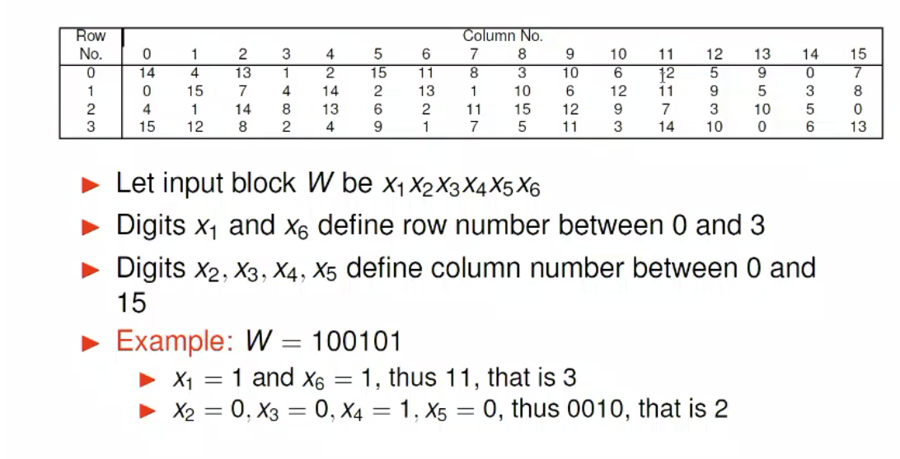

**Key schedule**

- Each of the 16 rounds involves 48 bits of the 56-bit key
- Each 48-bit subkey is defined by a series of permutations

**Breaking DES**

- Testing all possible $2^k$ keys in order to find the key $K$
- Key identified by using small number of cipher-text blocks or by looking for low entropy in decrypted plain-text
- $2^{56}$ DES keys to test
- Short DES key size was criticised from the start
  - Realistically brute force is a good method to break a 56-bit key
  - In 2017 we could find the keys in < 25 seconds
- To deal with the lack of security they created a double encryption
  - Having two keys $K_1, K_2$ be two block cipher keys

**MITM attack**

Let (P, C) be a single plaintext-ciphertext pair:

1. For each key $K$ store $C' = E(P,K)$ in memory
2. Check if $D(C,K') = C'$ for any key $k'$
3. Check if any key values in 2. work for other $(P, C)$ pairs

> we need to store plain-text, single encryption keys and decryption key

> We can just add more layers of encryption to get even better security (triple encryption), this will protect against MITM attacks, it is just too expensive and
> time restricted to be feasible

> this is only used in legacy code now, other block ciphers are better

**AES, Advanced Encryption Standard**

- Designed in an open competition due to DES being bad
- Process over several years with much public debate

- 128-bit data block (fixed)
- Can have any sized master key (128, 192, 256)
- Byte-based design
- uses a state matrix
- [Information on AES: 33:00](https://echo360.net.au/lesson/G_07bf8bc4-e541-404a-9816-826195e79456_f2ab542e-5a86-4120-9080-57e4475971b4_2021-08-09T10:00:00.000_2021-08-09T10:55:00.000/classroom#sortDirection=desc)

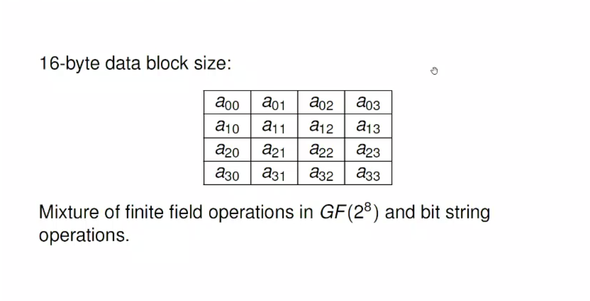

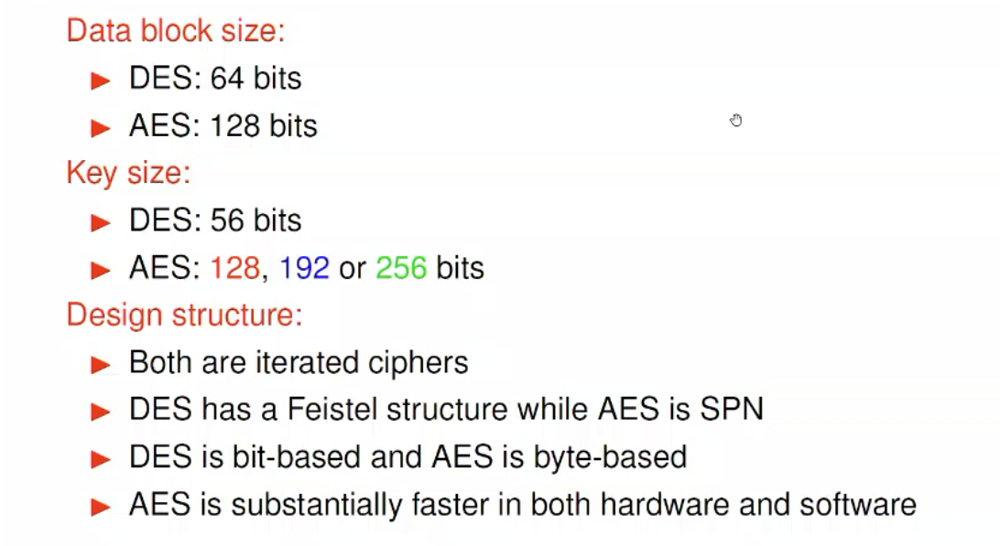

- Block ciphers are the workhorses of secure communication
- AES is the current choice, Triple DES is still used
- Block ciphers are used as building blocks fore confidentiality and authentication

### Lecture Eight: Block cipher's Modes of Operation

**Why different modes?**

Designed to provide confidentiality for data OR authentication for data OR both

Different modes have:

- Different efficiency properties
- Different communication properties

**Problem with randomised encryption:**

- The same plaintext block is encrypted to the same ciphertext block
- Prevention:
  - By using an initialisation vector which propagates through the entire ciphertext ($IV$)
  * $IV$ may require to be either unique or random
- Features impacting on efficiency:
  - Parallel processing
    - Multiple plaintext blocks are encrypted in parallel
    - Multiple ciphertext blocks are decrypted in parallel
  - Error propagation
    - Bit errors can be an issue
- Padding:
  - Requiring the plaintext to complete of complete blocks
  - NIST suggests a padding method
  - Padding bits removed unabiguously if usage of this padding method is known
    - Remove all trailing `0` bits after the last `1` bit
    - Remove the single `1` bit
- Notations:

  - Plaintext message $P$
  - $t-th$ plaintext block $P_t$
  - Ciphertext $C$ $t-th$ ciphertext block $C_t$
  - Key $K$
  - initialisation vector $IV$

  **Confidentiality Modes**

- ECB Mode encryption
  - Basic mode of a block cipher
  - Encryption: $C_t = E(P_t, K)$
  - Decryption: $P_t = E(C_t, K)$
  - Padding required
  - Not randomised
  - No IV
  - Allows for parallel encryption and decryption
- CBC Mode Encryption
  - Encryption: $C_t = E(P_t \bigoplus C_{t-1})$ s.t $P_0 = IV$
  - Decryption: $P_t = E(C_t \bigoplus C_{t-1})$ s.t $C_0 = IV$
  - Randomised
  - Padding required
  - IV must be random
  - Parallel decryption allowed
  - Common choice for channel protection in TLS
- CTR Mode:
  - Synchronous stream cipher mode
  - A counter and a nonce are used initialised using a randomly selected value $N$
  - Encryption: $C_t = O_t \bigoplus P_t$
  - Plaintext block $P_t$ is XOR'd with $O_t$
  - Decryption: $P_t = O_t \bigoplus C_t$
  - Don't require padding
  - randomised
  - error propagation: occurs in specific bits of current block

**Authentication Modes**

> NOTE: I got bored of typing here, should probably go back over this content

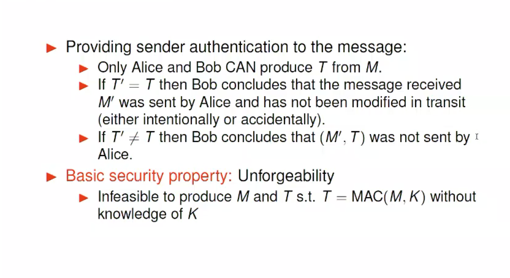

- Using a block cipher to create a MAC providing message integrity, not confidentiality
- $IV$ must be fixed and public, can be set to all 0's
- $P$ is the message
- $T = CBC-MAC(P,K)$
- Unforgeable as long as the message length is fixed

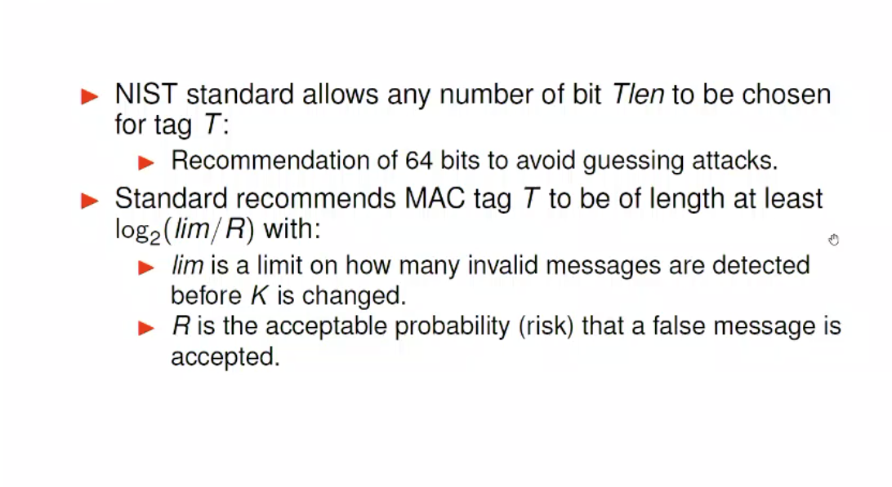
  
### Lecture Nine: Stream ciphers and Randomization

**Randomness**

- Defining randomness is difficult
- We want any specific string of bits to be as random as any other string
- Generators of random strings are used
- Using a `TRNG` to provide a seed for a `PRNG`

**True Random number generator (TRNG)**

- The entropy source includes:
  * A physical noise source
  * A digitalization process
  * Post-processing stages
- The output of the entropy source is any requested number of bits
- Periodic health test to ensure continuing reliable operation
- Intel introduces TRNG to Ivy Bridge processors in 2012

**Pseudo random Number generator (PRNG)**

- Each generator takes a seed as input
- It outputs a bit string before its state

These random number generators are made using a set of functions *outlined in lecture slides*

**CTR_DRBG**

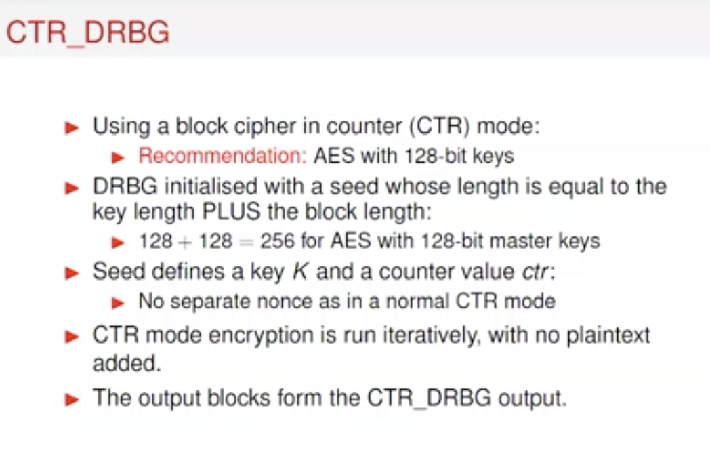

Update function:

- Each request DRBG generates up to $2^{19}$ bits
- From the function generate
- Updating provides backtracking resistance
- Restriction: up to $2^{48}$ seed bits
- Each re-seed provides forward prediction and backtracking resistance

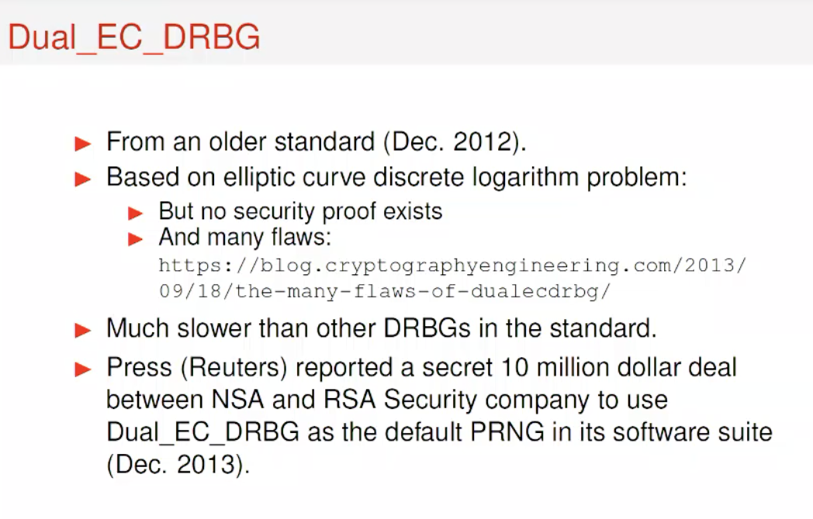

**Stream Ciphers**

- Characterised by the generation of a keystream using a short key and an initialisation value $IV$
- Synchronous stream ciphers
  - The keystream is generated independently of the plaintext
  - Both sender and receiver need to generate the same keystream and sync its usage
  - Vigenere cipher seen as a periodic synchronous stream sipher where each shift is defined by a key letter
  - CTR mode of operation for a block cipher is one method of generating a keystream
- Binary synchronous stream ciphers
  * Encryption: $C(t) = p(t) \bigoplus s(t)$
  * Decryption: $P(t) = C(t) \bigoplus s(t)$

**One time pad**

- Key is random sequence of characters, all of them are independently generated
- Each char in the key is used once
- Relies on perfect secrecy
- Is the only unbreakable cipher
- Practical usage is possible for pre-assigned communications between fixed parties
- How to deal with key management of completely random keys

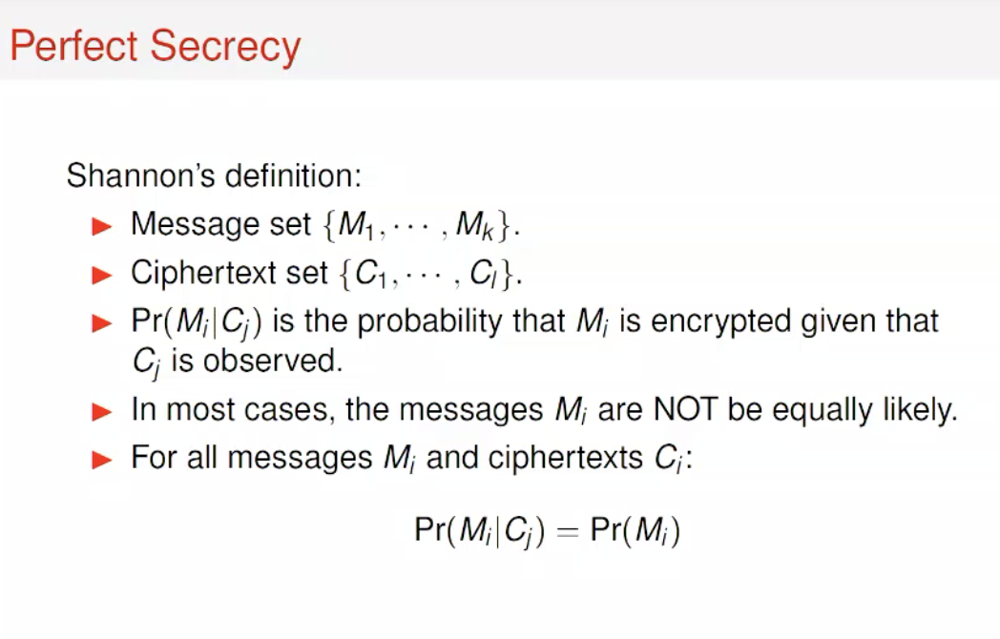

**Visual Cryptography**

- Application of one time pad: visual splits an image into two shares
- Decryption works by overlaying the two shared images
- Many generalisations are possible
- Each pixel is shared in a random way, similar to splitting a bit in the one time pad

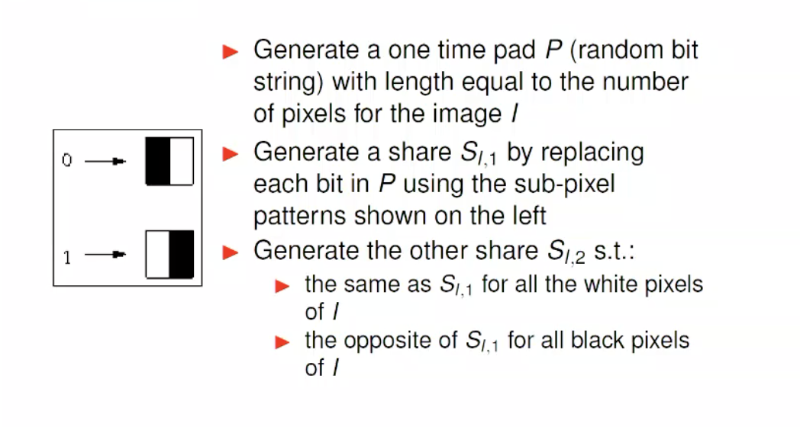
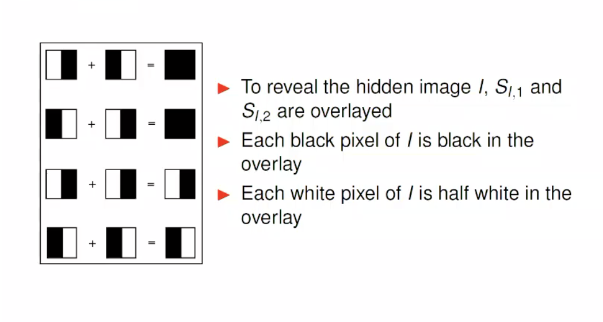
