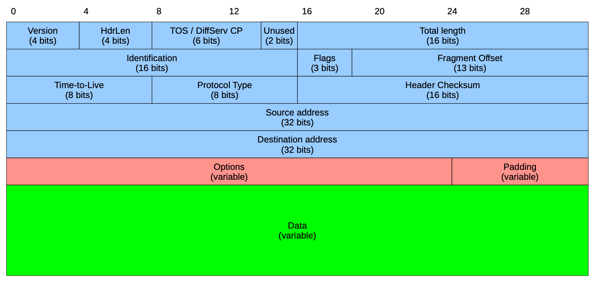

> [TOC]

# Internet Technology and Engineering

### Course Information

**Main Topics**

- BGP, OSPF, architecture, optimisation with linear programming, Routers, routing protocols `RIP` ect, solving network flow problems

It is expected to go through the booklet in your own time as lectures will be mainly focused on problems within the booklet rather
than its main content and learning

> Install CPLEX by IBM student version for solving linear systems

[Course Material](https://learn.canterbury.ac.nz/course/view.php?id=10169&section=1)

#### Lab Progress

**Lab 1**: Got half way through problem 5.3.1

Next step is to populate the config files for both `zebra.conf` and `ripd.conf`

#### Grades

- Assignment 1 30%
    - Implementing `RIP` routing protocol (we can start this now)
    - Due: Tuesday, April 27th 12:00pm
    - Requirements:
        - Create a report
        - Inspection and showcase of source code and will be marked on showcase
- Assignment 2 15%
    - Due: Wednesday, June 2nd 12:00
- Mid-term test 35%
    - Due: Monday May 3rd 7:00 - 9:00pm
- Take home test (Must pass this to pass course)
    - Due: Monday May 28th 6:00pm
    - On linear programming and simplex computations
- Final exam 20% (One hour)

Both the mid-term and the final exam are closed book tests, however you are permitted to bring
a one page hand written cheat sheet on an A4 sheet of paper, double sided.

> NOTE: These assessments will be altered if lock down takes place, see details of adjustment on learn.

### Lectures

#### Lecture One: IPV4 Refresh

Packets are called `dataframes`, each interface in the network is assigned an `IP` address (each wifi card/ethernet)

`IP` service is a *best effort* protocol, it is unreliable, doesn't use acknowledgements, retransmissions etc, 
here is the packet structure of a `IPV4` packet (dataframe)

#### Lecture Two: IP Addressing

**IP Address Representation**

- IP addresses have a width of 32 bits
- They are supposed to be worldwide unique
    * This is no longer true
- IP addresses are written in dotted-decimal notation
- They have an internal structure:
    * `<network-id>` `<host-id>`
 
**Classless Inter-Domain Routing**

- Question: how many bits to allocate to `<network-id>`?
- In the early days this was fixed to three different values
- This proved inflexible
- `CIDR`: Classless Inter-Domain Routing
- Introduced in 1993
- Modern routing protocols `OSPF, RIPv2, BGP` use `CIDR`
- In `CIDR` a network is specified by two values
    * A 32 bit network address
    * A 32 bit network mask (`netmask`)

**CIDR - Netmask**

- For a given 32-bit IP address, the net-mask specifies which bits belong to network-id and which
    bit belong to host-id
- The net-mask consists of 32 bits the left *k* bits are ones the remaining 32 - *k* bits are zeros; *where k is the net-mask*

> To use a net-mask in practice we can use a boolean `AND` operation in order to pull the ones with a mask

In order to completely specify an IP network, we must provide both the IP address and the net-mask:

$$192.168.40.0/24$$
$$192.168.40.0/21$$

> Note: The above network prefixes are NOT the same network. *due to different net-masks*

**Aggregation**

The number of available host addresses in a `/k` network is: $2^{32-k} - 2$

The big problem is the size of routing/forwarding tables.

[Example of why this is a problem: 35:40](https://echo360.org.au/lesson/G_8f1a649f-406a-4efb-ab3c-60f1c74f77c7_2edec770-99c1-4501-9fd4-3441f9fdc940_2021-02-25T10:00:00.000_2021-02-25T10:55:00.000/classroom#sortDirection=desc)

Address aggregation is an important approach of reducing the size of forwarding tables, it makes use 
of `CIDR`. (This keeps the routing tables small)

#### Lecture Three: IP Forwarding

**Routing Daemon**

- Refers to the forwarding table
- gathers the IP output
    * deliver directory or calculate next hop
    * decrement `TTL`
    * recompute header checksum
- passed to network interfaces
- IP input queue
- process IP options
- check if our packet:
    * destined to one of my IP addresses
    * destined to broadcast address
        + send via `UDP, TCP, ICMP`
    * Forward datagram *if forwarding is enabled*

**Forwarding Table Contents**

- Each entry in the forwarding table contains:
    * Destination IP prefix
    * Information about next hop
        + IP address of next-hop router or interface towards it
        + IP address of directly connected network (with net-mask)
    * Flags
        + whether next hop is router or directly attached network
    * Specification of outgoing interface

