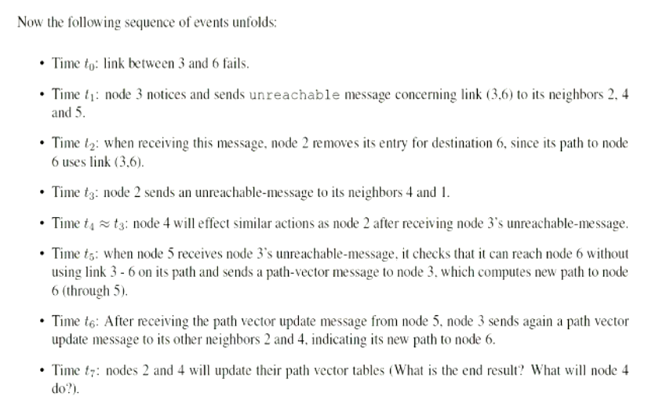
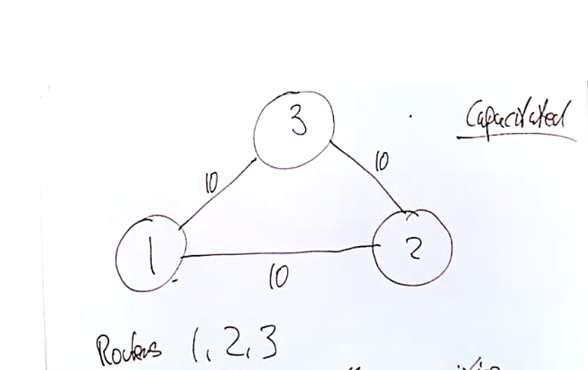
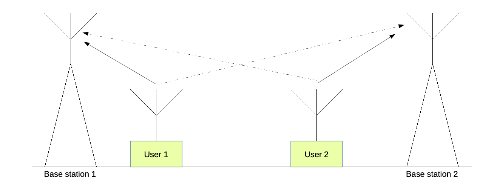
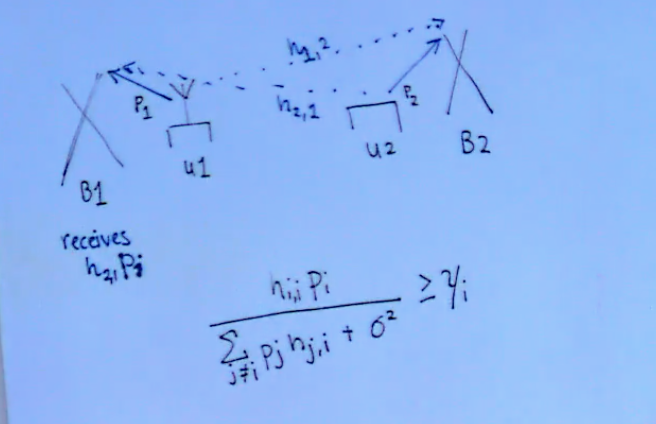
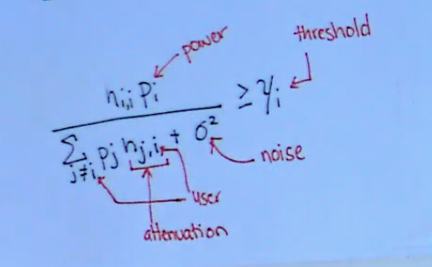

---
title: "Internet Technology and Engineering"
author: [Jordan Pyott]
date: "2021-05-06"
subject: "COSC364"
lang: "en"
titlepage: true
titlepage-color: "3C9F53"
titlepage-text-color: "FFFFFF"
titlepage-rule-color: "FFFFFF"
titlepage-rule-height: 2
...

\newpage

# Course Information

**Main Topics**

- BGP, OSPF, architecture, optimisation with linear programming, Routers, routing protocols `RIP` ect, solving network flow problems

It is expected to go through the booklet in your own time as lectures will be mainly focused on problems within the booklet rather
than its main content and learning

> Install CPLEX by IBM student version for solving linear systems

[Course Material](https://learn.canterbury.ac.nz/course/view.php?id=10169&section=1)

## Lab Progress

**Lab 1**: Got half way through problem 5.3.1

Next step is to populate the config files for both `zebra.conf` and `ripd.conf`

## Grades

- Assignment 1 30%
    - Implementing `RIP` routing protocol (we can start this now)
    - Due: Tuesday, April 27th 12:00pm
    - Requirements:
        - Create a report
        - Inspection and showcase of source code and will be marked on showcase
- Assignment 2 15%
    - Due: Wednesday, June 2nd 12:00
- Mid-term test 35%
    - Due: Monday May 3rd 7:00 - 9:00pm
- Take home test (Must pass this to pass course)
    - Due: Monday May 28th 6:00pm
    - On linear programming and simplex computations
- Final exam 20% (One hour)

Both the mid-term and the final exam are closed book tests, however you are permitted to bring
a one page hand written cheat sheet on an A4 sheet of paper, double sided.

> NOTE: These assessments will be altered if lock down takes place, see details of adjustment on learn.

# Lectures Term One - Routing Protocols

## Lecture One: IPV4 Refresh

Packets are called `dataframes`, each interface in the network is assigned an `IP` address (each wifi card/ethernet)

`IP` service is a *best effort* protocol, it is unreliable, doesn't use acknowledgements, retransmissions etc,
here is the packet structure of a `IPV4` packet (dataframe)

## Lecture Two: IP Addressing

**IP Address Representation**

- IP addresses have a width of 32 bits
- They are supposed to be worldwide unique
    * This is no longer true
- IP addresses are written in dotted-decimal notation
- They have an internal structure:
    * `<network-id>` `<host-id>`

**Classless Inter-Domain Routing**

- Question: how many bits to allocate to `<network-id>`?
- In the early days this was fixed to three different values
- This proved inflexible
- `CIDR`: Classless Inter-Domain Routing
- Introduced in 1993
- Modern routing protocols `OSPF, RIPv2, BGP` use `CIDR`
- In `CIDR` a network is specified by two values
    * A 32 bit network address
    * A 32 bit network mask (`netmask`)

**CIDR - Netmask**

- For a given 32-bit IP address, the net-mask specifies which bits belong to network-id and which
    bit belong to host-id
- The net-mask consists of 32 bits the left *k* bits are ones the remaining 32 - *k* bits are zeros; *where k is the net-mask*

> To use a net-mask in practice we can use a boolean `AND` operation in order to pull the ones with a mask

In order to completely specify an IP network, we must provide both the IP address and the net-mask:

$$192.168.40.0/24$$
$$192.168.40.0/21$$

> Note: The above network prefixes are NOT the same network. *due to different net-masks*

**Aggregation**

The number of available host addresses in a `/k` network is: $2^{32-k} - 2$

The big problem is the size of routing/forwarding tables.

[Example of why this is a problem: 35:40](https://echo360.org.au/lesson/G_8f1a649f-406a-4efb-ab3c-60f1c74f77c7_2edec770-99c1-4501-9fd4-3441f9fdc940_2021-02-25T10:00:00.000_2021-02-25T10:55:00.000/classroom#sortDirection=desc)

Address aggregation is an important approach of reducing the size of forwarding tables, it makes use
of `CIDR`. (This keeps the routing tables small)

## Lecture Three: IP Forwarding

**Routing Daemon**

- Refers to the forwarding table
- gathers the IP output
    * deliver directory or calculate next hop
    * decrement `TTL`
    * recompute header checksum
- passed to network interfaces
- IP input queue
- process IP options
- check if our packet:
    * destined to one of my IP addresses
    * destined to broadcast address
        + send via `UDP, TCP, ICMP`
    * Forward datagram *if forwarding is enabled*

**Forwarding Table Contents**

- Each entry in the forwarding table contains:
    * Destination IP prefix
    * Information about next hop
        + IP address of next-hop router or interface towards it
        + IP address of directly connected network (with net-mask)
    * Flags
        + whether next hop is router or directly attached network
    * Specification of outgoing interface
    * Most end hosts leverage the default route mechanism
        + An end host can differentiate between packets to local destinations
        + Packets to local destinations are delivered directly
        + Packets to all other destinations are sent to default router
- Forwarding tables in Routers
    * Most routers at the fringe of the internet only have routing table entries for a subset of all networks, for all other networks they use default routers
    * Some routers in the core
        + do not have a default router
        + are (transitively) the ultimate default routers of other routers
        + must know (almost) all the internet networks

`ARP Protocol`
- Main focus is to find the mac address of a station
- Broadcast to the station until a router responds (when the mac address matches the responders)

`ICMP`
- Not a protocol, it is just a set of error messages that are useful.
- This is optional, you cannot expect a router to implement this as `ICMP` can be stopped with a firewall or by a select router

## Lecture Four: Routing Algorithm Structure

The main purpose of this lecture is to discuss the pros and cons of Link State Routing and
Distance Vector Routing.

**Distance Vector** - *Bellman Ford*
- Talks only to immediate neighbours.
- Once received update, the routers neighbours will re-draw their routing tables.
- In `RIP` a triggered update only sends triggered updates when something bad happens (fast).
    * (`RIP` works on the concept that bad news travels fast and good news travels slow).
    * Because of this, it may take a long time for nodes in the network to update routing tables
        + Inconsistencies in routing tables of the network can introduce routing loops.
        + This can also introduce the counting to infinity problem.
        + This also introduces security issues as by acting as a node, we can disrupt the neighbouring routing topology

**Link State** - *Dijkstra's*
- Each and every router has a local copy of the full topology on the network (a link state database).
- floods changes in the topology to the entire network.
- the flood can be fast.
- each router hosts its own database.
- once the database is up to date, each router runs its algorithm in order to re-allocate the topology of the network.
- will need to store a sequence number in order to see whether a router is up to date.

## Lecture Five: OSPF

- In OSPF packets get encapsulated
- Distance Vector algorithm (only talks to immediate neighbours)
- is a broadcast network (can reach all stations)
- scalability issue as in large networks many iterations
    * this can be solved with OSPF areas (see lecture 6 and routing-booklet on learn)

OSPF can support five different types of IP sub-networks

- Point-to-point network: OSPF routers are connected through p2p links, only two routers share a transmission medium, and whenever one of them sends there is only one reciever, examples of this include dial-up lines or optical links, in this type of network it is trivial to discover neighboured OSPF routers.
- Broadcast networks: several OSPF routers are attached to an underlying IP subnetwork with MAC-layer broadcast or multicast address and can be heard by all other routers in the same subnetwork, the discovery of all OSPF routers is easy on broadcast networks
- non-broadcast multi-access networks: several OSPF routers are attached to the same IP subnetwork and can reach each other, but this subnetwork does not have broadcast, examples of this type of network is a frame relay network, because of lack of ability to broadcast, finding other routers is difficult.
- virtual links: in virtual links it is possible to connect two non-neighboured OSPF area-border routers through other routers in an intermediate area, intuitively, these two routers establish a tunnel over the intermediate area, and again the discovery of the neighboured router in a virtual link requires configuration.

## Lecture Six: OSPF Area's

An aria consists of a number of OSPF routers and IP subnetworks - each IP subnetwork in an `OSPF` domain belongs to exactly one area. Routers that belong to two different areas are called area-border routers, other routers are called internal routers.

When we have large networks, we have a scalability issue with Distance Vector protocols, because of this we must we would be better to use link state advertisements, this is when a link state advertisement router only generates information about its local environment, (only the attached IP sub-networks and its neighboured OSPF routers.) Describing an IP subnetwork in an OSPF LSA takes a few tens of bytes, similarly for a neighbour, and considering that usually routers do not have more than a few dozen to a few hundreds of interfaces the total volume of data a router generates for all its links is moderate.

In this type of network, each area can be assigned any ID (no stack template), with one exception, the protocol must contain an area with ID=0. This is called the **backbone area or core area**

- AreaID is identified by a 32-bit value
- OSPF performs hierarchical routing with these areas
- Routers belonging to the core area are called core routers
- Routers pertaining to other areas are called low-level routers as they are apart of low-level area's
- Only the core area can have BGP border routers / AS boundary routers.

Here is the packet structure of the OSPF packet.

## Lecture Seven: OSPF continued; LSA Records

As explained previously, an LSU packet is simply a container for one or more LSA records, therefore the strucutre of an LSA packet is simple
(see Routing 3.5)

> NOTE: all fields are set in 32 bits, this is because the data bus size is 32 bits for LSA

## Lecture Eight: Path Vector Routing and BGP

Path vector routing method in `BGP`:

This has a problem, that the protocol assumes that the neighbour will always
receive the packet that has been sent. This is an issue due to the fact that
in real world situations, packets get lost often.

The issue with this is that path vector routing does not scale well due to the
fact that with large networks there is simply too much traffic.

`BGP` is currently the inter-autonomous system routing protocol that is currently
in use in the internet today. This is because they view each AS as an individual
node. This means that although it is played on a large scale, OSPF handles most of
the traffic within autonomous systems (sometimes RIP also), and `BGP` handles the
routing between autonomous systems.

In `BGP` a router is known as a `BGP Speaker`, these advertise the available prefixes
of a particular network.

`BGP` takes place within a `BGP` session that is embedded into a `TCP` connection that
allows us to communicate with neighbouring routers.

> Note: *For routing packet structure of BGP messages, see the full notes on Learn*

Definitions for BGP messages:

- `AS-PATH`: this specifies the AS path or route through which all of the prefixes listed in the NLRI are reachable. Every BGP speaker sending an UPDATE to a peer prepends its known AS number
- `ORIGIN`: identifies how an IP prefix has been injected into BGP. For example, a BGP router could have learned a prefix from an interior routing protocol running in its AS, or a prefix could have been manually configured
- `NEXT-HOP`: this specifies the router in the speakers AS that routers in the neighboured AS should actually use to forward packets in order to reach an advertised prefix. This can be the same as the speaker, but can also be on a different machine
- `MULTI-EXIT-DESCRIMINATOR`: two AS's can actually be connected by more than one pair of routers. For example, assume that two AS's are connected by two such routers, In some situations a destination prefix might be more preferably reached by one of the two router pairs. This attribute can be used to express such a preference.

A specific Autonomous system can filter out specific prefixes that we do not
want to send/receive on.

- If import filtering indicates an unwanted prefix, discard it
- If the IP prefix belongs our own AS, the speaker will prefer routes determined by its own interior routing protocol over learned routes
- If there are several AS routes availible to the destination prefix, keep the ones with the fewest number of AS hops listed in the `AS-PATH`, if only a single router survives, then take this route
- If there are still serveral candidate routes, choose the one having the highest preference, using the `MULTI-EXIT-DESCRIMINATOR` attribute

In reality there are many more steps involved in producing a BGP routing protocol, however many of them
are not nessasary to the core structure of the routing protocol.

\newpage

**Summarise my personal cheatsheet here (personal note)**

\newpage

# Lectures Term Two - Optimisation and Linear Programming

## Lecture One: Intro to Linear Programming and ISP's

An ISP is made up of routers, and the links that connect these routers. On long
time frames, the ISP will have to make investment decisions, do we need new routers?
where should I put these routers? Do I need new links? Where should these links be connected?

This is important as routers and links are very expensive to replace.

Many optimisation problems can be written in the form of linear programming problems.

Calculating routes and the necessary traffic in a network:

`Links` are parallel with capacities

`Routes` are representative of traffic

`Demand Volumes`:

- Is a data we needed between two routes.
- Traffic is continuous bit rate.
- Can be split over different paths

We are given a number of routers and a costs and number of routes to and from
networks. We need to determine how much traffic of DV h to route to routes between
`i` and `j`. These are known as path flows.

Example: Assume single demand volume between nodes [1, 2]

Demand volume is *h*

Paths:

$$ 1 \leftrightarrow 2 $$
$$ 1 \leftrightarrow 3 \leftrightarrow 2 $$

Links have capacities, Capacity of a path is the minimum of link capacities of involved links.
Because in reality these capacities are the data rates of the link in question.

Deduce path capacities:

$$ C_{12} \quad for \quad path \quad 1 \leftrightarrow 2 $$
$$ C_{132} \quad for \quad path \quad 1 \leftrightarrow 3 \leftrightarrow 2 $$

We need to check path flows:

$$ X_{12} \quad : \quad flow \quad on \quad path \quad 1 \leftrightarrow 2 $$
$$ X_{132} \quad : \quad flow \quad on \quad path \quad 1 \leftrightarrow 3 \leftrightarrow 2 $$

We can state some constraints for those decision variables:

- Demand constraint: $X_{12} + X_{132} = h$
    * If we split paths, we must have seporate paths from 1 - 2 adding up to *h*
- Non-Negative constraint: $X_{12} \geq 0 \quad and \quad X_{132} \geq 0$
- Capacity constraint: $X_{12} \leq C_{12} \quad and X_{132} \leq C_{132}$

Suppose $C_{12} = C_{132} = G = 10$ and $h = 7$:

Question: How many feasible solutions are there?

Answer: Any value within the range of $0 \leftrightarrow h$ where *h* is 7 in this
example, is a viable solution, therefore there are infinitely many solutions for this
problem, to be precise there is an uncountably infinite solutions to this problem.

Solution formally: let x be a viable solution such that $x \in (0, 7) \in \mathbb{R}$

## Lecture Two: Linear Optimisation (Tutorial)

The objective of our linear optimisation is either to find the optimal `load
balancing` of a network or minimum cost of a network.

Linear Optimisation problems are composed of two parts

- **Objective Function** $\rightarrow$ The problem we are trying to solve *min cost or load balancing etc.*
- **Constraints** $\rightarrow$ Network for the problem

We denote the objective function with the following notation $minimise_{[x]}$ where
we are minimising a set of `x` variables and our general notation consists of a transposed
constant called C and a variable called x, the general format is considered the following:

$$ minimise_{[x]} \quad C^{T}X $$
$$ subject \ to \quad Ax = b $$
$$ \quad \quad X \geq 0 $$

> This is the general format of every linear programming problem

### Problem 4.1.2 Wireless Communications

Each user (ie u1) wants to transmit to its own base station (B1) and similar for
u2, each user has transmit power denoted by the letter `p`, and we have an attenuation
factor from u1 to base station 2 and vice versa for u2, this is denoted by $h_{1,2}$ for
u1 and $h_{2,1}$ for u1.

Therefore base station one recieves $h_{2,1}p_i$, this gives us the following equation
seen in the figure below

The right side of the equation is the `threshhold` ($y_i$) *i* refers to a user on the
network, *p* indicates the power, $h_{j,i} denotes attenuation factor and *o* represents our noise factor, see this notated
below.

This then becomes the base equation for our problem. Our goal as outlined in the question
is to find an allocation of transmit powers to the different users such that the total transmit
power becomes minimal -> this means that the condition outlined above holds for **all** users on
the network.

This gives us our linear program:

$$ minimise_{[x]} \quad p_1 + p_2 + ... + p_n$$
$$ subject \ to \quad \frac{p_i h_{i,i}}{\sum_{j \neq i} (p_j h_{j,i}) + \sigma^2} \geq y_i \quad for \ all \ i \in [1 ... n]$$
$$  \qquad \qquad p_i \geq 0 \quad for \ all \ i \in [1 ... n]$$

The problem asks us to re-write this into matrix form

**Matrix Form**: (in general)

$$ minimise_{[p]} \quad C^{T}P $$
$$ subject \ to \quad A_p \geq b $$
$$ \quad \quad p \geq 0 $$

To address this matrix with more accuracy we need to define what lies in each matrix

**Where** (specific):

We can re-arrange the following equation:

$$ \frac{p_i h_{i,i}}{\sum_{j \neq i} (p_j h_{j,i}) + \sigma^2} \geq y_i $$

To:

$$ p_i h_{i,i} - y_i(\sum_{j \neq i} p_j h_{j,i}) \geq y_i \sigma^2 $$

We now have all the information to find $C^T$ and $b$ in our equation:

$$ C^T = (1, 1, ..., 1) \qquad b = \sigma^2 (y_1, y_2, ..., y_n)^T $$

\newpage

**Question**: Convert the above equation to matrix form. (Find A, p, and b in terms of matrices)

We can translate this by putting in values for *i, j* into the equation outlined above.

$$
A = \begin{pmatrix}
h_{1,1} & -y_1 h_{2,1} & -y_1 h_{3,1} & ... -y_1 h_{j,1} \\
-y_2 h_{1,2} & h_{2,2} & -y_2 h_{3,2} & ... -y_1 h_{i,2} \\
... & ... & ... & ...
\end{pmatrix}
$$

### Problem 4.1.3 The Transportation Problem

**Problem:** formulate the Transport problem from the given information below using the methods
provided in class.

**Given information:**

- At $i$, produce $a_i$ units $m$ production locations $> i \in [1, m]$
- At $j$, require $b_j$ units $n$ customer locations $> j \in [1,n]$
- Expression: $\sum^{m}_{i=1} a_i = \sum^{n}_{j=1} b_j$

> The expression above gives us the total number of units produced = total number of units required

- We know that $C_{i,j}$ is the cost to ship form $i$ to $j$ (production (i) to customer (j))
- variable $x_{i,j}$ units to ship from $i$ to $j$ (production (i) to customer (j))
    * We denote this as $x$ to indicate that we have control over this variable

Now we have all the information in order to define our objective function, we need to define
this as a linear programming equation in the standard form.

The minimum cost is defined by $\sum c_{i,j} x_{i,j}$

So we can formulate this into our standard form for linear programming problems:

$$ minimize_{[x]} \quad \sum^{m}_{i=1} \sum^{n}_{j=1} c_{i,j} x_{i,j} $$
$$ subject \ to \quad \sum^{n}{j=1} x_{i,j} = a_i for \ all \ i \in [1,m], j \in [1,n] $$
$$ \quad \quad \quad \sum^{m}_{i=1} x_{i,j} = b_{j} \ for \ all \ i \in [1,m], j \in [1,n] $$
$$ \quad \quad \quad x_{i,j} \geq 0 \ for \ all \ i \in [1,m], j \in [1,n] $$

Notice in our first constraint, we have a fixed value *i* and a variable *j*, in the
second constraint we have a fixed value *j* and a variable value *i*.

We can now convert these conditions to our linear programming expression:

**Base expression**:

$$ minimise_{[p]} \quad C^{T}P $$
$$ subject \ to \quad A_p \geq b $$
$$ \quad \quad p \geq 0 $$

**Define variables:**

$$ c^T = (c_{1,1}, c_{1,2}, ... c_{1,n}, c_{2,1}, c_{2,2}, ...c_{2,n}, ...c_{m,n}) $$
$$ x = (x_{1,1}, x_{1,2}, ... x_{1,n}, x_{2,1}, x_{2,2}, ...x_{2,n}, ...x_{m,n}) $$

> Note: that our variable x will always match our $c^T$ notation

$$ 
b = 
\begin{pmatrix}
a_1 \\
a_2 \\
... \\
a_m \\
b_1 \\
b_2 \\
... \\
b_n
\end{pmatrix}
$$

$$ A = \begin{pmatrix}
a \ 1 \ where \ there \ is \ x_{1,j} \ exists \ else \ 0 \\
have \ a \ 1 \ where \ there \ is \ x_{m,j} \\
have \ a \ 1 \ where \ x_{m,1} \ exists \\
have \ a \ 1 \ where \ x_{i,n} \ exists \\
\end{pmatrix}
$$

### Problem 4.1.4 Minimise Transport Problem

> Note: in this problem, $a_i$ is now a variable and can be changed, not a fixed value as stated before.

$$ minimize_{[x]} \quad \sum^{m}_{i=1} \sum^{n}_{j=1} c_{i,j} x_{i,j} $$
$$ subject \ to \quad \sum^{n}{j=1} x_{i,j} = a_i for \ all \ i \in [1,m], j \in [1,n] $$
$$ \quad \quad \quad \sum^{m}_{i=1} x_{i,j} = b_{j} \ for \ all \ i \in [1,m], j \in [1,n] $$
$$ \quad \quad \quad x_{i,j} \geq 0 \ for \ all \ i \in [1,m], j \in [1,n] $$

We know that $\sum^{m}_{i=1} a_i = \sum^{n}_{j=1} b_j$ we now need to make sure that the
amount produced is equal to the amount required, we must add this as a constraint.

$$ let B = \sum^{n}_{j=1} b_j $$

Our new linear expression is this, note that we have to add upper and lower bounds to our
new variable $a_i$, this is because we cannot have non-negative values and $a_i \leq B$

$$ minimize_{[x]} \quad \quad \quad \sum^{m}_{i=1} \sum^{n}_{j=1} c_{i,j} x_{i,j} $$
$$ subject \ to \quad \sum^{n}{j=1} x_{i,j} = a_i for \ all \ i \in [1,m], j \in [1,n] $$
$$ \quad \quad \quad \sum^{m}_{i=1} x_{i,j} = b_{j} \ for \ all \ i \in [1,m], j \in [1,n] $$
$$ \quad \quad \quad x_{i,j} \geq 0 \ for \ all \ i \in [1,m], j \in [1,n] $$
$$ \quad \quad \quad \sum^{m}_{j=1} a_i = B $$
$$ \quad \quad \quad a_i \geq 0 $$
$$ \quad \quad \quad a_i \leq B $$

### Problem 4.2.1 Reduction to Standard Form

$$ min \quad c^Tx $$
$$ s.t. \quad Ax = b $$
$$ \quad \quad x \geq 0 $$

**Question:** Reduce the following problem to standard form

$$ min \quad x_1 + 2x_2 + 3x_3 $$
$$ s.t. \quad x_1 + 6x_2 - 4x_3 = 5 $$
$$ \quad \quad 3x_1 + x_2 - 2x_3 = -8 $$
$$ \quad \quad x_1 \geq 0, x_2 \geq 0, x_3 \geq 0 $$

**Convert this to vector/matrix form**

Constants on the objective function defines $C^T$ (constant vector)

$$ C^T = (1,2,3) $$

Decision vector is defined by the variables of the objective function $x^T$

$$ x^T = (x_1, x_2, x_3) $$

$A$ is defined by the system of equations within the constraints (problem in vector matrix form)

$$ A = \begin{pmatrix}
1 & 6 & -4 \\
-3 & -1 & 2
\end{pmatrix}
$$

$B^T$ is defined by the resultant vector, (results of the linear systems)

$$ b^T = (5, 8) $$

If we have in-equalities in the constraints of the problem, we can use surplus variables
in order to turn them into an equality.

$14 \geq 8$ turns into $14 - 6 = 8$ or for something we don't know, we use a variable named `y`.

