```{=tex}
\newpage
```
# Artificial Intelligence

## Course Information

The course covers core topics in AI including:

-   uninformed and informed graph search algorithms,
-   propositional logic and forward and backward chaining algorithms,
-   declarative programming with Prolog,
-   the min-max and alpha-beta pruning algorithms,
-   Bayesian networks and probabilistic inference algorithms,
-   classification learning algorithms,
-   consistency algorithms,
-   local search and heuristic algorithms such as simulated annealing, and population-based algorithms such as genetic search and swarm optimisation.

**Grades**

Standard Computer science policy applies

-   Average 50% over all assessment items
-   Average at least 45% on all invigilated assessment items

Grading structure for course

-   Assignments (5%)
    -   Two Super Quiz's
-   Quizzes (16.5%)
    -   Weekly Quiz Assessments (1.5% ea)
-   Lab Test (20%)
-   Final Exam (58.5%)

### Textbooks / Resources

-   Poole, David L.1958, Mackworth, Alan K; Artificial intelligence : foundations of computational agents; Cambridge University Press, 2010.
-   Russell, Stuart J, Norvig, Peter; Artificial intelligence : a modern approach; 3rd ed; Prentice Hall, 2010.

## Readings

## Lectures

### Lecture One: Searching the State Space

**What is state?**

-   A state is a data structure that represents a possible configuration of the world *agent and environment*
-   The **state space** is the set of all possible states for that problem
-   actions change the state of the world

![State space example one]

State can also be represented as a graph *both directed and undirected*

![State space graph simplified]

-   Many problems in AI can be abstracted to the problem of finding a path in a directed graph
-   Notation we use is **Nodes** and **arcs** for **vertices** and **edges** in a graph

**Explicit vs Implicit graphs**

-   In **explicit graphs** nodes and arcs are readily available, they are read from the input and stored in a data structure such as an adjacency list/matrix.
    -   the entire graph is in memory.
    -   the complexity of algorithms are measured in the number of nodes and/or arcs.
-   In **implicit graphs** a procedure `outgoing_arcs` is defined that given a node, returns a set of directed arcs that connect node to other nodes.
    -   The graph is generated as needed *due to the complexity of the graphs.*
    -   The complexity is measured in terms of the depth of the goal state node or *how far do we have to get into the graph to find a solution*.

**Explicit graphs in quizzes**

-   In some exercises we use small explicit graphs to stydy the behaviour of various frontiers
-   Nodes are specified in a set
-   Edges are specified in a list
    -   pairs of nodes, or triples of nodes (in a tuple)

**Searching graphs**

-   We will use generic search algorithms: given a graph, start nodes, and goal nodes, incrementally explore paths from the start nodes.
-   Maintain a **frontier** of paths that have been explored
    -   frontier: paths that we have already explored
-   As search proceeds, the frontier is updated and the graph is explored until a goal node is found.
-   The order in which paths are removed and added to the frontier defines the search strategy
-   A **search tree** is a tree drawn out of all the possible actions in terms of a tree.
    -   How do we handle loops? *Covered in next lecture*
    -   In the search tree outlined below, you can see that the *end of paths on frontier* represents a BFS relationship note this is not always the case.

![search tree]

**Generic graph search algorithm**

![Generic Search]

> NOTE: you will have to use what ever data structure for the seach you are using (BFS use a queue), (DFS use a stack).

In the generic algorithm, neighbours are going to use the method `outgoing_arcs`, we are given this algorithm in the form of a python module.

**Depth-first search**

-   In order to perform DFS, the generic graph search must be used with a stack frontier *LIFO*
-   If the stack is a python list, where each element is a path, and has the form \[..., p, q\]
    -   *q* is selected and popped
    -   of the algorithm continues then paths that extend *q* are pushed (appended) to the stack
    -   *p* is only selected when all paths from *q* have been explored.
-   As a result, at each stage the algorithm expands the deepest path
-   The orange nodes in the graph below are considered the frontier nodes

![DFS]

-   DFS does not guarantee a solution without pruning, due to the fact that we can have infinite loops
-   It is not guaranteed to complete if it does not use pruning

**A note on complexity**

Assume a finite search tree of depth *d* and branching factor of *b*:

-   What is the time complexity?
    -   It will be exponential: $O(b^d)$
-   What is the space complexity?
    -   It will be linear: $O(bd)$

**How do we trace the frontier**

-   starting with an empty frontier we record all the calls to the frontier: to add or get a path we dedicate one line per call
-   When we ask the frontier to add a path, we start the line with a `+` followed by the path that has been added
-   When we ask for a path from the frontier we start the line with a `-` followed by the path being removed
-   When using a priority queue, the path is followed by a comma and then the key *e.g, cost, heuristic, f-value, ...*
-   The lines of the trace should match the following regular expression `^[+-][a-z]+(,\d+)?!?$`
-   We stop when we **remove** a path from the trace

![DFS trace using generic algorithm]

**Breath-first search**

-   In order to perform BFS, the generic graph search must be used with a queue frontier *FIFO*.
-   If the queue is a python deque of the form \[p,q,...,r\], then
    -   p is selected (dequeued)
    -   if the algorithm continues then paths that extend *p* are enqueued *appended* to the queue after *r*
-   As a result, at each state the algorithm expands the shallowest path.

![BFS Illustration of search tree]

-   BFS **does** guarantee to find a solution with the fewest arcs if there is a solution
-   It will complete
-   It will not halt due to some graphs having *cycles, with no pruning*

**A note on complexity**

> BFS has higher complexity than DFS

-   What is the time complexity?
    -   It will be exponential: $O(b^d)$
-   What is the space complexity?
    -   It will be linear: $O(b^d)$

![BFS trace using generic algorithm]

**Lowest-cost-first search**

-   The cost of a path is the sum of the costs of its arcs
-   This algorithm is very similar to Dijkstra's except modified for larger graphs
-   LCFS selects a path on the frontier with the lowest cost
-   The frontier is a priority queue ordered by path cost
    -   A priority queue is a container in which each element has a priority *cost*
    -   An element with a higher priority is always selected/removed before an element with a lower priority
    -   In python we can use the `heapq` you will need to store objects in a way that these properties hold
-   LCFS finds an optimal solution: a least-cost path to a goal node.
-   Another name for this algorithm is *uniform-cost search*.

> NOTE: For an example of this queue, see Lecture One: 1:45 time stamp

![LCFS trace generic]

### Lecture Two: Searching the State Space (part two)

**Pruning**

-   This is our method to deal with cycles and multiple paths.
-   this means we can have wasted computation and cycles in our graph

> Principle: Do not expand paths to nodes that have already been expanded

**Pruning Implementation**

-   The frontier keeps track of expanded or *closed* nodes
-   When adding a new path to the frontier, it is only added if another path to the same end-node has not already been expanded, otherwise the new path is discarded (*pruned*)
-   When asking for the **next path** to be returned by the frontier, a path is selected and removed but it is returned only if the end-node has not been expanded before, otherwise the path is discarded (pruned) and not returned. The selection and removal is repeated until a path is returned (or the frontier becomes empty). If a path is returned, its end-node will be remembered as an expanded node.

In frontier traces every time a path is pruned, we add an explanation mark `!` at the end of the line

![Example: LCFS with pruning]

**How does LCFS behave?**

-   LCFS explores increasing cost contours
    -   Finds an optimal solution always
    -   Explores options in every direction
    -   No information about goal location

We are going to use a search heuristic, function `h()` is an estimate of the cost for the shortest path from node *n* to a goal node.

-   *h* needs to be efficient to compute
-   *h* can be extended to paths: $h(<n_0, ..., n_k) = h(n_k)$
-   *h* is said to be admissible if and only if:
    -   $\forall n \ h(n) \geq 0$, *h* is non-negative and $h(n) \leq C$ where C is the optimal cost of getting from *n* to a goal node

> NOTE: We will have to come up with our own heuristic for the assignment as it depends on context.

**Best-first Search**

-   Idea: select the path whose end is closest to a goal node according to the heuristic function.
-   Best-first search is a greedy strategy that selects a path on the frontier with minimal *h*-value
-   Main drawback: this does not guarentee finding an optimal solution.

![Tracing best-first search]

$A^{\*}$ **search strategy**

Properties:

-   Always finds an optimal solution as long as:
    -   there is a solution
    -   there is no pruning
    -   the heuristic function is admissible
-   Does it halt on every graph?

Idea:

-   Don't be as wasteful as LCFS
-   Don't be as greedy as best-first search
-   Estimate the cost of paths as if they could be extended to reach a goal in the best possible way.

Evaluation function: $f(p) = cost(p) + h(n)$

-   $p$ is a path, $n$ is the last node on $p$
-   $cost(p)$ = cost of path $p$ *this is the actual cost from the starting node to node n*
-   $h(n)$ = an estimate of the cost from $n$ to goal node
-   $f(p)$ = estimated total cost of path through $p$ to goal node

The frontier is a priority queue ordered by $f(p)$

![][1] ![Tracing A\* search] ![Proof of optimality] ![Pruning on A\* Search]

**What went wrong when pruning** $A^{\*}$ **Search**

-   An expensive path, *sa* was expanded before a cheaper path *sba* could be discovered, because $f(sa) < f(sb)$
-   Is the heuristic function *h* admissible?
    -   Yes
-   So what can we do?
    -   We need a stronger condition than admissibility to stop this from happening

> Principle: When we are removing nodes, we are essentially saying we have found a cheaper solution, in this case, this was not true and hence why the algorithm fails, we need to use a stronger condition as outlined below

**Monotonicity**

A heuristic function is monotone or consistent if for every two nodes $n$ and $n'$ which is reachable from $n$:

$$h(n) \leq cost(n,n') + h(n')$$

With the monotone restriction, we have:

$$
\begin{aligned}
f(n') &= cost(s, n') + h(n') \\
&= cost(s, n) + cost(n, n') + h(n') \\
&\geq cost(s, n) + h(n) \\
&\geq f(n) \\
\end{aligned}
$$

How about using the actual cost as a heuristic?

-   Would it be a valid heuristic?
-   Would we save on nodes expanded?
-   What's wrong with it?
    -   It becomes as computationally expensive as it is to just do the problem

Choosing a heuristic: a trade-off between quality of estimate and work per node!

![Dominance Relation]

> Further algorithms are discussed in this segment of the and lecture *boarders onto lecture three* however this content will not be assessed in the duration of this course.

### Lecture Three: Knowledge Base and Information

**How to represent information in a knowledge base**

  --------------------------------------------------------------------------------------------
  Information                                      Knowledge Base
  ------------------------------------------------ -------------------------------------------
  ![Electrical Environment: Information (Input)]   ![Electrical Environment: Knowledge Base]

  --------------------------------------------------------------------------------------------

-   The computer doesn't know the meaning of the symbols (logical and etc...)
-   The user can interpret the symbol using their meaning
-   There is no specific syntax for this, it is just what ever is readable for the user/writer

**Simple language and definitions**

-   An **atom** is a symbol starting with a lower case letter
-   A **body** is an atom or is of the form $b_1 \land b_2$ where $b_1$ and $b_2$ are bodies
-   A **definite clause** is an atom or a rule of the form $h \leftarrow b$ where $h$ is an atom and $b$ is a body
-   A **knowledge base** is a set of definite clauses
-   An **interpretation** $i$ assigns a truth value to each atom
-   A **body** $b_1 \land b_2$ is true in $i$ if $b_1$ is true in $i$ and $b_2$ is true in $i$
-   A **rule** $h \leftarrow b$ is false in $i$ if $b$ is true in $i$ and $h$ is false in $i$, the rule is true otherwise
-   A **knowledge base** $KB$ is true in $i$ if and only if every clause in $KB$ is true in $i$
-   A **model** of a set of clauses is an interpretation in which all the clauses are *true*
-   If $KB$ is a set of clauses and $g$ is a conjunction of atoms, $g$ is a **logical consequence** of $KB$, this is denoted as $KB \models g$, if $g$ is *true* in every model of $KB$
    -   That is, $KB \models g$ if there is no interpretation in which $KB$ is *true* and $g$ is *false*.
-   A **Proof procedure** is a -possibly non-deterministic - algorithm for deriving consequences of a knowledge
-   Given a proof procedure, $KB \vdash g$ means $g$ can be derived from knowledge base $KB$
-   Recall $KB \models g$ means $g$ is *true* in all models of $KB$
-   A proof procedure is **sound** if $KB \vdash g \implies KB \models g$
-   A proof procedure is **complete** if $KB \models g \implies KB \vdash g$

![simple example question]

Answers to the questions:

> We have four atoms {p,q,r,s}, because we have 4 atoms, there are 16 permutations in our truth table ($2^4$), therefore we have 16 interpretations

**Bottom-up proof procedure**

Rule of derivation:

if $h \leftarrow b_1 \land ... \land ... b_m$ is a clause in the knowledge base, and each $b_i$ has been derived, then $h$ can be derived

-   This is **Forward chaining** on this clause (this rule also covers the case when $m = 0$)
-   $KB \vdash g$ if $g \in C$ at the end of the below algorithmic procedure
-   [Tracing tutorial: 1:13:30]

![Bottom-up proof procedure algorithm pseudo code]

**Top-down proof procedure**

Idea: search backward from a query to determine if it is a logical concequence of $KB$

An **answer clause** is of the form:

-   $yes \leftarrow a_i \land ... \land a_m$

The SLD Resolution of this answer clause on atom $a_i$ with the clause:

-   $a_i \leftarrow b_1 \land ... \land b_p$
-   [Tracing tutorial: 1:31:00][Tracing tutorial: 1:13:30]

An **answer** is an answer clause with $m = 0$. That is the answer clause $yes \leftarrow$.

A **Derivation** of query $? q_1 \land ... \land q_k$ from $KB$ is a sequence of answer clauses $\lambda_0, \lambda_1, ... \lambda_n$

-   $\lambda_0$ is the answer clause $yes \leftarrow q_1 \land ... \land q_k$
-   $\lambda_1$ is obtained by resolving $\lambda_{i-1}$ with a clause in $KB$
-   $\lambda_n$ is the answer

![Top-down proof procedure algorithm pseudo code]

> There is more information on SLD Resolution at the end of this lecture, this will be needed in the assignment

### Lecture Four: Declarative Programming (Part One)

**What is declarative programming?**

Declarative programming is the use of mathematical logic to describe the logic of computation without describing its control flow

-   Knowledge bases and queries in propositional logic are made up of propositions and connectives
-   Predicate logic adds the notion of *predicates* and *variables*
-   We take a non-theoretical approach to predicate logic by introducing *declarative programming*
-   useful for: expert systems, diagnostics, machine learning, parsing text, theorem proving, ...

**Datalog**

-   Prolog is a declarative programming language and stand for PROgramming in LOGic
-   we only look at a sybset of the language which is equal to Datalog
-   Think declaratively, not procedurally
-   High level, interpreted language
-   We will have a file that contains a knowledge base, and we will have an interpreter where we can ask queries

Here is an example of a knowledge base in Datalog:

    woman(mia)
    woman(jody)
    woman(yolanda)
    playesAirGuitar(yolanda)

Here is how we may query data using the interpreter:

    $ woman(mia)
    yes

> Further examples of this are in the slides of lecture four

Operators

-   Implication :-
-   Conjunction: , (AND)
-   Disjunction ; (OR)
-   We will later talk about how to simulate the (NOT) operator

Interpreter Operands and rules:

-   Variables: X, Y, Z, Cam, AnythingThatStartswithUppercase
    -   Acts as a `wildcard` to match with when querying
-   Order of arguments matters
-   `Arity` is important
-   Unification/matching:
    -   Two terms unify or match if they are the same term or if the contain variables that can be uniformly instanciated with terms in such a way that the resulting terms are equal (this is how we query)
    -   Example: $l(s(g), Z) = k(X, t(Y))$

With only Unification we can do some programming

    vertical(line(point(X,Y), point(X,Z))
    horizontal(line(point(X,Y), point(Z,Y))

**Proof Search**

-   Prolog has a specific way of answering queries
    -   Search knowledge base from top to bottom
    -   Processes clauses from left to right
    -   Backtracking to recover from bad choices
-   [Further examples using prolog: 1:10:00]

**Recursive Programming**

    child(anna, bridget)
    child(bridget, caroline)
    child(caroline, donna)
    child(donna, emily)
    decendent(X,Y):-child(X,Y)
    decendent(X,Y):-child(X,Z), decendent(Z,Y)

If we make the following query with the above knowledge base, we get a positive response

    $- decendent(anna, donna)
    yes

### Lecture Five: Declarative Programming (Part Two)

**Lists in Prolog**

-   A list is a finite sequence of elements
-   List elements are enclosed in square brackets
-   we can think of non-empty lits as a head and tail
    -   Head is first item
    -   Tail is the rest of the list
-   Empty list has no head or tail
-   Here are some examples of lists in prolog

```{=html}
<!-- -->
```
    [mia, vincent, jules, yolanda]
    [mia, robber(honeybunny), X, 2, mia]
    []

**Pipe Operand**

-   Can be used for creating a list
-   Example:

```{=html}
<!-- -->
```
    [head|tail] = [mia, vincent, jules, yolanda].
    Head = mia
    tail = [vincent, jules, yolanda].

-   We can have anonymous variables denoted with the `_`
-   These do not get recorded and assigned to variables

```{=html}
<!-- -->
```
    [_,X2,_,X4|_] = [mia, vincent, jules, yolanda].
    X2 = vincent
    X4 = Jody

**Defining Members of a list**

-   One of the most basic things we would like to know is whether something is an element of a list or not
-   So let's write a predicate that when given a term X and a list L, tells us whether $X \in L$
-   We can define member as the following:

```{=html}
<!-- -->
```
    member(X,[X,_]).
    member(X,_),T]):-member(X,T).

**Defining Append**

-   We can define an important predixate, append whose arguements are all lists
-   Declaratively, append(L1,L2,L3) is true if list L3 is the result of concat L1, L2
-   Recursive definition,
    -   Base case: appending the empty list to any list produces the same list
    -   The recursive step says that when concatenating non-empty list $[H|T]$ with list $L$, the result is a list with head $H$ and the result of concatenating $T$ and $L$

Definition:

    append([],L,L).
    append([H|L1],L2,[H|L3]):-append(L1,L2,L3).

Expected Output:

    $- append([a,b,c],[d,e,f], Z).
    $- Z = [a,b,c,d,e,f].
    yes

**Sublist**

-   Now it is very easy to write a predicate that finds sub-lists of lists
-   The sub-lists of a list L are simply the prefixes of suffixes of `L`
-   Checks if a list is a subset of another list

```{=html}
<!-- -->
```
    sublist(Sub,List):-suffix(Suffix,List),prefix(Sub,Suffix).

**Reversing a list**

-   Recursive definition
    1.  If we reverse the empty list, we obtain the empty list
    2.  If we reverse the list $[H|T]$, we end up with the list obtained by reversing $T$
    3.  This solution works, but is extremely inefficient, *Quadratic time*

```{=html}
<!-- -->
```
    reverse([], []).
    reverse([H|T],R) :- reverse(T,RT), append(RT,[H],R).

-   Here is a much more efficient solution:
-   We can use an accumulator (list to append the reverse to) in order to make this faster

``` python
accReverse([],L,L).
accReverse([H,T],Acc,Rev):-accReverse(T,[H|Acc],Rev).

reverse(L1,L2):-accReverse(L1,[],L2). # Wrapper for accReverse function
```

> The above is a more efficient solution

**Negation as Failure**

-   We need to use the cut operator (!) to suppress backtracking
-   The fail predicate always fails
-   They can be combined to get a negation as failure

```{=html}
<!-- -->
```
    neg(Goal):-Goal,!,fail.
    neg(Goal).

### Lecture Six: Local and Global Search (Optimisation)

**Optimisation Problems**

Given:

-   A set of variables and their domains; and
-   An objective function (aka a cost function),

Find an assignment (of each value to each variable) that optimises (max or min) the value of the objective function.

-   Optimisation usually involves searching
-   CSP's and optimisation problems can be converted (reduced) to each other
-   There are special algorithms for certain kind of optimisation problems (linear programming, convex optimisation)
-   In this lecture we will look at two families of algorithms (local and global)

**Local Search for Optimisation**

-   A **Local search** algorithm is an iterative algorithm that keeps a single current state and in each iteration tries to improve it by moving to one of its neighbouring states.
-   Two key aspects to decide:
    -   Neighbourhood: which states are the neighbours of a given state
    -   Movement: which neighbouring state should the algorithm go to
-   Asearch algorithm is considered to be greedy if it always moves to the best neighbour. Two variants happen to have special names:
    -   *Hill climbing*: for maximisation
    -   *Greedy descent*: for minimisation

![Example of local search]

Local search for CSP's:

-   A constrained satisfaction problem can be reduced to an optimisation problem
-   Given an assignment, a conflict is an unsatisfied constraint
-   Heuristic function: the number of conflicts produced by an assignment
-   Optimisation problem: find an assignment that minimises this heuristic function

Local search for CSP's in neighbourhood:

-   Neighbours of a given state can be defined in many ways
    -   All possible assignments except the current one
    -   Select a variable that appears in any conflict, neighbours are assignment in which that variable takes a different value from its domain
    -   Select a variables in the current assignment that participates in the most number of conflicts. Neighbours are assignments in which that variable takes a different value from its domain
    -   [n-queens example (35:00)]

**Global Search**

Parallel search:

-   A total assignment is called an **individual**
-   Idea: maintain a population of $k$ individuals instead of one
-   At every stage, update each individual in the population
-   Like $k$ restarts, but uses $k$ times the minimum number of steps
-   A basic form of global search

Simulating Annealing:

-   Pick a variable at random and a new value at random
-   If it is an improvement, adopt it
-   If it isn't an improvement adopt it probabilistically depending on a temperature parameter, $T$
-   Temperature can be reduced

  Temperature   1-worse   2-worse   3-worse
  ------------- --------- --------- ---------
  10            0.91      0.81      0.74
  1             0.37      0.14      0.05
  0.25          0.02      0.003     0.00005
  0.1           0.00005   0         0

**Gradient Descent**

-   A widely used local search algorithm in numeric optimisation (machine learning)
-   Used when the variagles are numeric and continous
-   The objective function must be differentiable (mostly)

![Gradient descent algorithm]

**Genetic Algorithms**

-   Genetic algorithms and the whole family of evolutionary algorithms are inspired by natural selection
-   They are in the global search family
-   The algorithm maintains a population of individuals which evolves over time
-   We can make an individual to represent anything we want
-   A fitness function is needed. The function takes an individual as input and returns a numeric number indicating how good/bad the individual is
-   A mechanism is needed to create the initial population
-   A mechanism is needed to `evolve` the current population to the next one. This involves the following mechanisms:
    -   Selection: decide which individuals survive or can reproduce
    -   Crossover: given a number of parent individuals, create a number of children
    -   Mutation: make some random changes to individuals
    -   [How this works (1:20:00)][n-queens example (35:00)]

**Roulette Wheel selection: Example**

-   Sum the fitness of all individuals, call it $T$
-   Generate a random number $N$ between $1$ and $T$
-   Return individual whose fitness added to the running total is equal to or larger than $N$
-   Chance to be selected is exactly proportional to fitness
-   Individual: \[1,2,3,4,5,6\]
-   Fitness: \[8,2,17,7,4,11\]
-   Running total: \[8,10,27,34,38,49\]
-   $N: \ 23$
-   selected: 3

**Tournament Selection**

-   Choose $n$ individuals randomly; the fittest one is selected as a parent
-   $n$ is the `size` of the tournament
-   By changing the size, selection pressure can be adjusted

**Crossover**

Often individuals are represented as a sequence (tuple) of values. With this representation, cross over can be performed very easily.

-   Generate 1,2, or a number of random *crossover points*
-   Split the parents at these points
-   Create offspring's by exchanging alternative segments

![Crossover Example]

**Mutation**

With sequential representation (tuples), mutation is performed by selecting one or more random locations (indices) and changing the values at those locations to some random values (from the domain).

**Mutation vs Crossover**

-   Purpose of crossover: combining somewhat good candidates in the hope of producing better children
-   Purpose of mutation: bringing diversity
-   Its good to have both
-   Mutation-only-EA is possible, crossover-only-EA would not work

**Fitness landscapes**

-   EA's are known to be able to handle relatively challenging fitness landscapes
-   *see lecture: sep 14 for more information, note to self: go over this again before final*

**Tree representation**

-   Individuals can have more sophisticated structure
-   The following shows two example trees representing statements and expressions

![Tree representation example]

### Lecture Seven: Belief Networks

What are belief networks about?

-   Long answer short **Probabilities**
-   Reasons for uncertainty and randomness

**Random Variables**

-   A random variable is some aspect of the world which we have uncertainty
    -   R = Is it raining?
    -   D = How long will it take to drive to work?
    -   L = Where am I?
-   We denote random variables with capital letters
-   Each random variable has a domain
    -   $R \in \{True, False\}$ as an example

**Probability distributions**

-   Unobserved random variables have distributions
-   A distribution is a TABLE of probabilities of values
-   A probability is a single number

**Joint distributions**

A *joint distribution* over a set of random variables is a map of assignments to real values

**Events**

-   A set of assignments
-   From a joint distribution we can calculate the probability of any event

**Marginalization**

-   Marginalization (or summing out) is *projecting* a joint distribution to a sub-distribution over subset of variables.

$$ P(X_1 = x_1) = \sum_{x2} P(X_1 = x_1, X_2 = x_2) $$

![][2]

**Conditional Probabilities**

-   A conditional probability is the probability of an event given another event, *center of a venn diagram*

$$ P(a|b) = \frac{P(a,b)}{P(b)} $$

**Conditional Distributions**

-   Conditional distributions are probability distributions over some variables given fixed values of others.

**Normalization Trick**

-   A trick to get the whole conditional distribution at once
    -   Select the joint probabilities matching the evidence
    -   Normalize the selection *divide by total sum so they sum to one*

![Normalization trick example]

**The product rule**

-   Sometimes joint `P(X,Y)` is easy to get
-   Sometimes easier to get conditional `P(X|Y)`

Defined by the following:

$$ P(x|y) = \frac{P(x,y)}{P(y)} \equiv P(x,y) = P(x|y) \times P(y) $$

More generally we can write any joint distribution as incremental product of conditional distributions.

$$ P(x_1,x_2,x_3) = P(x_1) \times P(x_2|X_1) \times P(x_3|x_1,x_2) $$

$$ P(x_1,x_2,...,x_n) = \prod_i P(x_i|X_1...x_{i-1}) $$

**Probabilistic Inference**

-   Probabilistic inference: compute a desired probability from other known probabilities *conditional from joint*
-   We generally compute conditional probabilities
    -   P(on time \| no report accidents) = 0.9
    -   These represent the agent's *beliefs* given the evidence
-   Probabilities change with new evidence:
    -   P(on time \| no accidents, 5 am) = 0.95
    -   P(on time \| no accidents, 5 am, raining) = 0.80
    -   Observing new evidence causes beliefs to be updated
-   We want $P(Y_1...Y_m|e_1...e_k)$
    -   Evidence variables $(E_1...E_k) = (e_1...e_k)$
    -   Query variables: $Y_1...Y_m$
    -   Hidden variables: $H_1...H_r$
-   First, select the entries consistent with the evidence
-   Second, sum out $H$:

$$ P(Y_1...Y_m,e_1...e_k) = \sum_{h_1...h_r} P(Y_1...Y_m, h_1...h_r,e_1...e_k) = \{X_1, X_2, ..., X_n\} $$

-   Finally normalize the remaining entries
-   Obvious problems
    -   Worst-case time complexity $O(d^n)$
    -   Space complexity $O(d^n)$ to store the joint distribution

![Example]

**Complexity of Models**

-   Engineers and designers are interested in simple and compact models
    -   Simple models are easier to build
    -   Simple models are easier to explain
    -   Compact models take less space
    -   Usually implies more efficient computational time

If a probabilistic model has multiple distributions, the number of its free parameters is the sum of the number of free parameters of the tables/distributions.

**Independence**

-   Two variables are independent if $P(x,y) = P(x)P(y)$
    -   This says that their joint distribution factors into a product of two simpler distributions
-   We can use independence as a modelling assumption
    -   Independence can be simplify assumptions

**Conditional Independence**

-   Absolute/Unconditional independence is very rare
-   Conditional independence:
    -   $\forall x,y,z : P(x,y|z) = P(x|z) P(y|z)$
    -   $\forall x,y,z : P(x|y,z) = P(x|z)$

![Conditional Independence: Example] ![][3]

**Graphical model notation:**

-   Nodes: variables with domains
    -   Can be assigned (observed) or unassigned (unobserved)
-   Arcs: Influences
    -   Allow dependence between variables
    -   For now: imagine that arrows mean causation *NOTE in general they don't have to*

[Example: Lecture (1:27:30)]

**Can we have reverse causality in a network?**

- Can we express the same joint distribution by a network where arrows no longer mean causality?
  * Yes, but the network is now harder for humans to read and understand

**Non-causal arrows?**

- when belief nets reflect the true casual patterns:
  * Often simpler
  * Often easier to think about
  * Often easier to elicit from experts
- BN's need not actually be causal
  * Sometimes no casual net exists over the domain
- What do the arrows really mean?
  * They define/allow dependence
  * This means that we can construct a table between the two nodes


### Lecture Eight: Introduction to machine learning

**what is learning?**

Learning is the ability to improve one's behaviour based on experience

- The range of behaviours is expanded: the agent can do more
- The accuracy on tasks is improved: the agent can do things better
- The speed is improved: the agent can do things faster

**Components of a learning problem**

The following components are part of any learning problem:

- Task: the behaviour or task that's being improved, for example classification, acting in an environment
- Data: the experiences that are being used to improve performance in the task
- Measure of improvement: how can the improvement be measured?

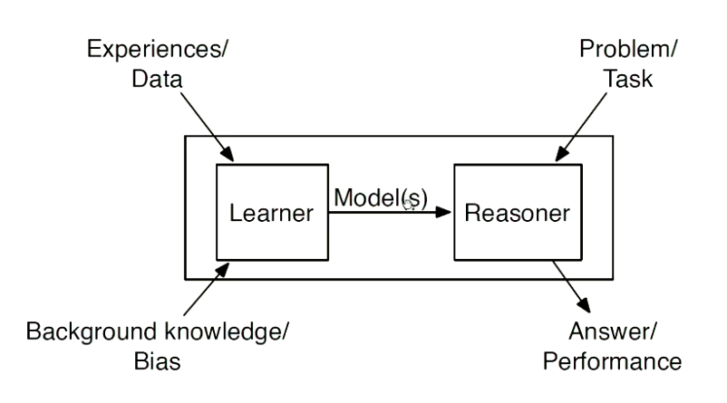

**Supervised Learning**

Given:

- a set of input attributes (features)
- A target attribute (feature)
- A set of training examples (instances) where the value of input and the target variables are given;

Automatically build a predictive model that takes a new instance and returns a prediction of the value for the target feature for the given instance

> Note: The terms feature, attribute and random variable are used with the same meaning in this context

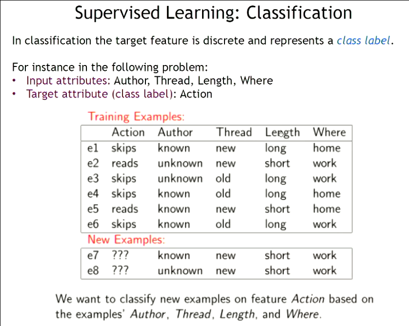

Another example of supervised learning is a Regression, (see lecture for more information)

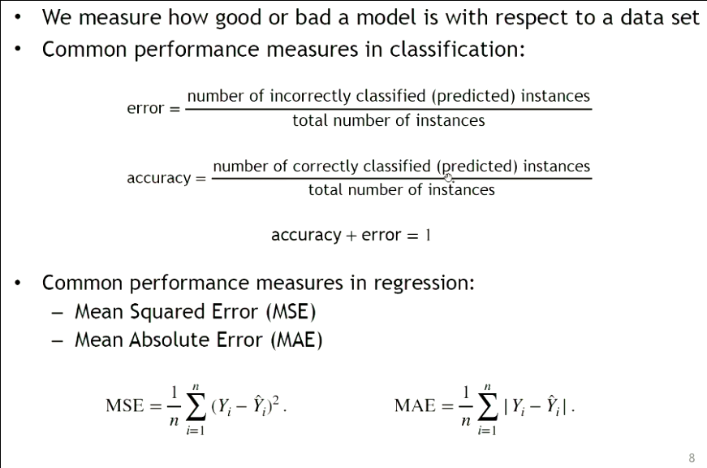

**Training and testing sets**

A given set of examples is divided into:
 
- Training examples: that are used to train a model
- Test examples that are used to evaluate the model
  * THESE MUST BE KEPT SEPARATE

**How overfitting affects prediction**

It allows the model to take more turns, if the model is too complex, the dispersion on the test data
from the training data will be much larger, this can be seen by the below model

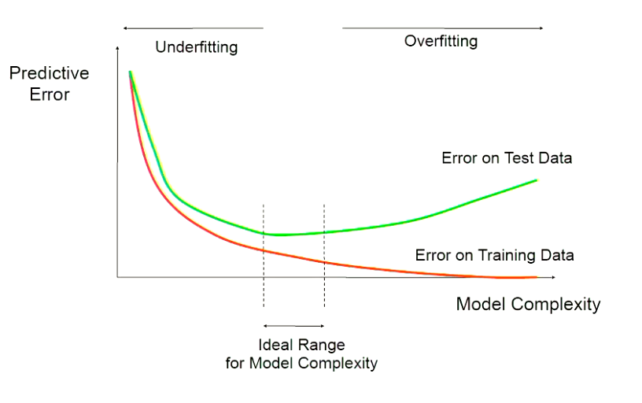

**Naive Bayes Models**

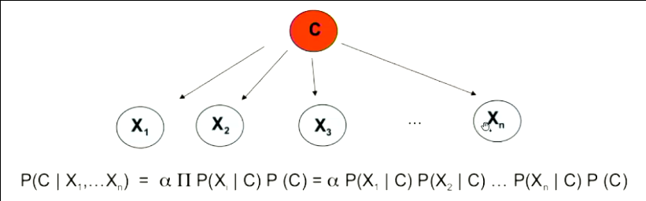

**Features** X are conditionally independent given the **class** variable C

- $P(C)$: Prior distributions of C, the random variable
- $P(X_i|C)$: Likelihood conditional distributions
- $P(C|X_1,...X_n)$: Posterior distribution

Widely used in machine learning as conditional probabilities $P(X_i | C)$ can easily be estimated from labeled data

**Building a classifier**

Determine whether a patient is susceptible to heart disease, given the following information:

- Whether they have a family history (T/F)
- Fasting blood sugar level (low/high)
- BMI (low, normal, high)

Classification (Heart disease): Yes or no

Given a set of data about past patients classification by experts, construct a classifier that will output the likely
prediction (class) when given a new (unseen) patient (instance).

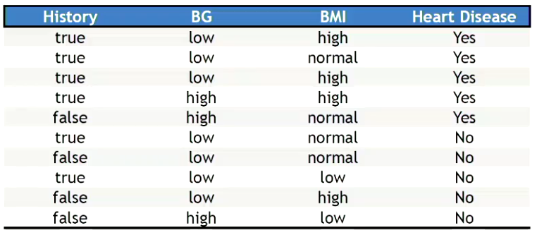

**Naive Bayes Classification**

How to classify?

1. Find P(Class | an input vector) for different classes
2. Pick the class with the highest probability as the result of the prediction

Problem: Hard to learn P(Class | Evidence)

- A lot of data is required; enough for each possible assignment of evidence
- For example P(Class=No | Hist = true, BG = high, BMI = low) needs lots of examples of (Hist = true, 
  BG = high, BMI = low). Then count a fraction that are "no". This is often infeasible, specifically when
  are many attributes.

A solution (compromise): assume input features are conditionally independent (Naive Bayes)

- Often the assumption is not entirely true, but nethertheless yields reasonable performance.

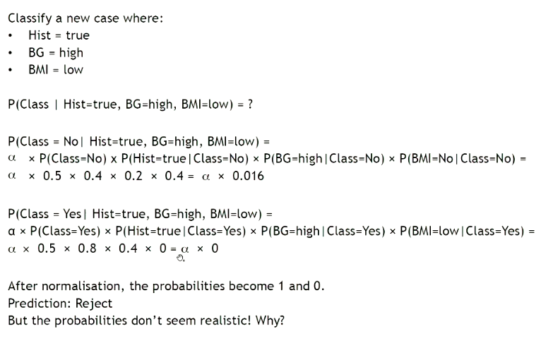

**Laplace Smoothing**

Problem: zero count (in small data sets) lead to zero probabilities (i.e. impossible) which is too strong a claim
based on only a small sample.

Solution: add a non-negative *pseudo-count* to the counts

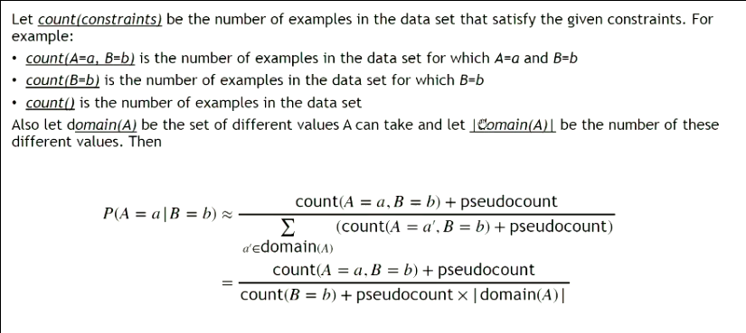

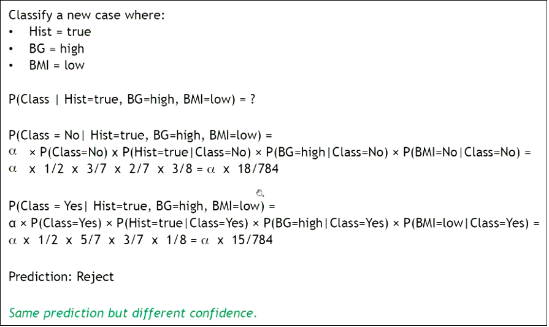

### Lecture Eight: Artificial Neural Networks

**Source of inspiration (Biological Neural Networks)**

- Brain as a network of "neurons"
- The interaction between them produces something interesting (mimicking intelligence)
- The building blocks of neurons
- Neuron:
  * Receives a signal from multiple inputs
  * Strength of the signal is affected by synaptic weights
  * If the overall signal is above a threshold, the neuron fires (sends a signal to its outputs)
  (Could be a neuron or an output)

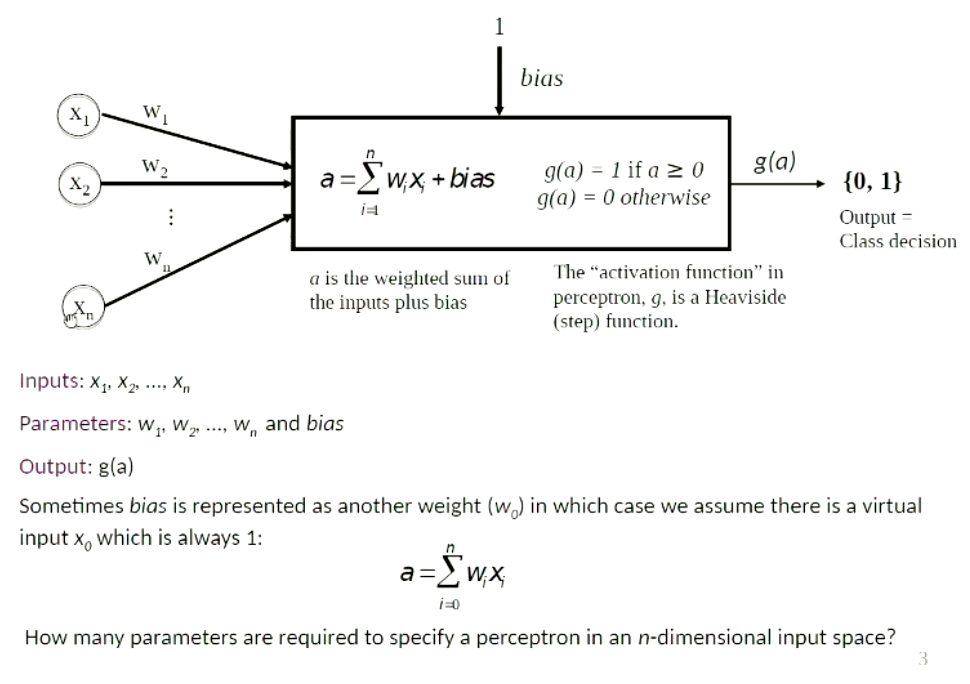

In the above model, $X_n$ represents previous nodes, $w_n$ represents the
weights given from the previous nodes, the current node computes $a$ and then
outputs $g(a)$ being the weight given from our particular node/neuron.

**Application: Decision Making and Classification**

- Perceptron can be seen as a predicate
  * given a vector $x$
  * $f(x) = 1$ if that predicate over $x$ is `true`
  * $f(x) = 0$ if that predicate is `false`
- Therefore it can be used for decision making and binary classification problems
  * spam vs non-spam
  * diseased vs healthy
- In binary classification
  * given input vector $x$
  * $f(x) = 1$ if $x$ is in `positive class`
  * $f(x) = 0$ if $x$ is in `negative class`

**Geometric interpretation of weights and bias**

Since the transition in output happens at $a = 0$, the equation of the descision
boundary is:

$$ a = w_0 + w_1x_1 + w_2x_2 + ... + w_nx_n = 0 $$

This will give a linear decision boundary shown with **two dimensions** in the figure below:

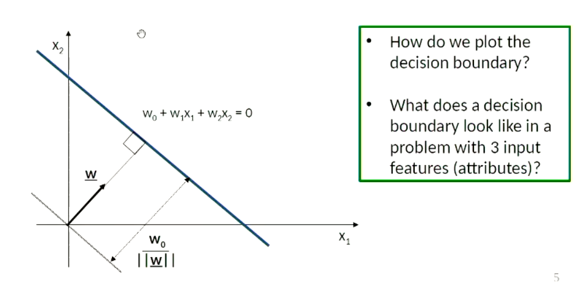

> NOTE: a decision boundary with three values will give a plane (three dimensions)

**Notes on visualising the decision boundary**

- An easy way of finding a linear decision boundary in 2D is to find two points that lie on it
  - *worked example in the lecture: (24:00)*
- The direction of a vector $w$ (without a bias) shows on which side of the hyper-plane patterns
will be classified as positive (output will be 1).
- If $w_a$ (bias) is positive then the origin is on the positive side of the discriminator (line), otherwise
on the negative side.

**Perceptron learning (for one neuron)**

This is the process of finding the best weights to match our data

- Given: a data set of training data
- We want: a `perceptron` (line that fits curve) that models the data
- Iterate through training examples, classify each example with current values
of weights and bias. If the example is classified correctly then don't do anything.
if the example is misclassified then change the weights and bias

Where $x_j$ is the value feature of the input pattern $x$, $w_j$ is the weight
$\eta$ is the learning rate (note this must be positive, and is usually small), $t$ is the target/desired value and $y$ is the perceptron
output the following equations are used:

$$ w_j \leftarrow w_j + \eta x_j(t-y) $$

The output of this will return `-1` or `1` to determine which direction
the error happened.

$$ bias \leftarrow bias + \eta (t - y) $$

This will tell us whether to increase the bias or to decrease the bias, we have
to repeat these a number of iterations in order to get valid results.

Below is a trace of this algorithm:

```python
weights = [1.0, 1.0]
bias = -2.0
eta = 0.5 # learning rate (usually far smaller)
max_epochs = 500

# this is in two space (size of input tuple)
examples = [ 
  ((0,4), 0),
  ((-2,1), 1),
  ((3,5), 1),
  ((1,1), 1),
]
```

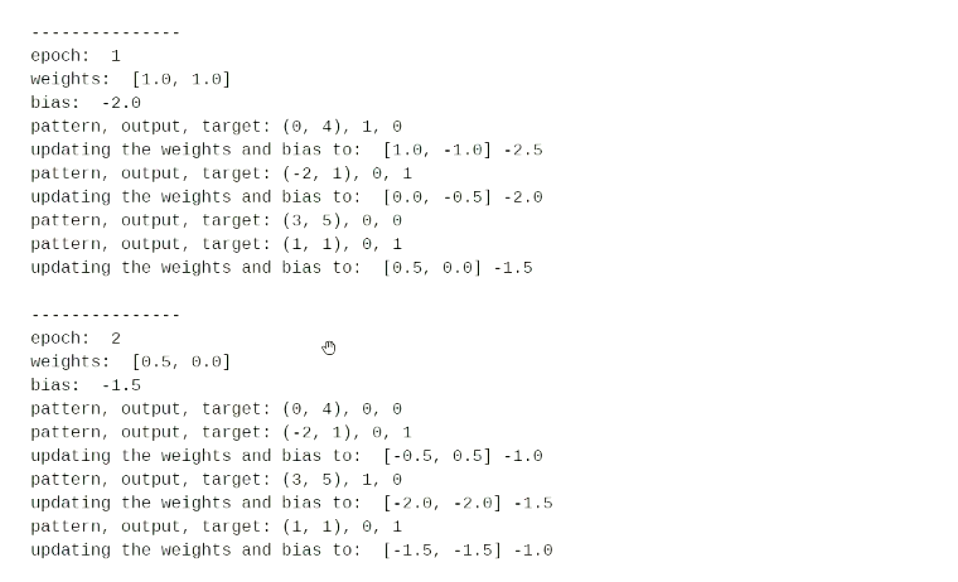

We stop the algorithm when we get a correct output (or a close approximation
to what we are looking for depending on dataset)

**Weight Updates**

If we have a misclassified value, (wrong side of the normal of the perceptron),
we calculate a new vector by taking the sum of the current vector + $\eta \underline{x} (t - y)$

**Limitations of single perceptron**

The XOR problem:

- Having both a single perceptron cannot solve cases where there are four
  nodes and two of these nodes are miss-classified, (you cannot draw a single
  perceptron that satisfies all the nodes).
- The solution is to use Multilayer Perceptrons (MLP's)

**Multi Layer Perceptrons (MLP's)**

- Instead of using a single perceptron, use a whole network of them
- The output of a node becomes the input for another node
- The network is usually arranged in layers, the data flows through layers, one
layer at a time.
- As a whole the network acts like a function taking a vector of input data and outputting
a scalar (or vector).
- Can be used for regression or classification
- The network function is computed layer by layer
- The first layer of the network is called the input layer
- The number of units in the input layer is equal to the number of features in
the problem domain. For each input vectorm the *i*-th input unit returns the value
of the *i*-th feature (no weight or function is applied).
- The last layer is called the output layer
- The number of output nodes depends on how we have encoded the output
called **hidden layers**
- All nodes (units) in all layers except the input layer are Perceptrons
- A network with only one layer (acting as input and output is an **identity function**)
- Adjacent layers are fully connected
- There is no backward connection
- THere is not shortcut to the right layers (layers cannot skip)
- Each perceptron has many weight parameters as the number of its inputs
- In designing neural networks. The number of hidden layers and the number of nodes in
the hidden layers depends on the complexity of the problem>

**How MLP's solve the XOR problem**

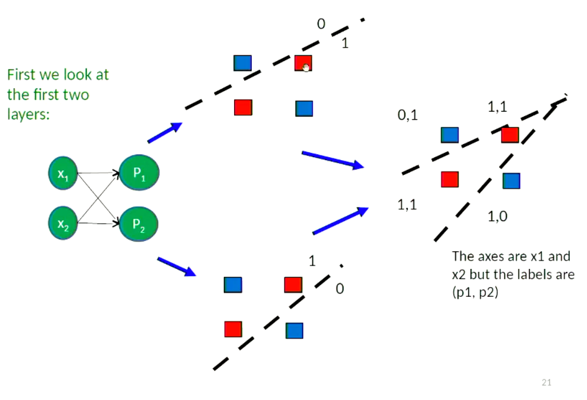

Written explanation of the solution (reference the xor problem above):

Note in the first perceptron (P1), the blue node to the left of the perceptron is
labelled as 0, the other three nodes are labelled as 1, in the second perceptron (P2),
vice versa is applied. This results in the given perceptron where we have two distinctions
between $(1,1)$ which is inside the two perceptron's and $(0,1)$ on the outside of the perceptrons.

> NOTE: We want to have an algorithm to define this for us, this is not in the scope of this course ( unfortunately :( ), however this would be a sick thing to go over in my own time, below is a little explanation of this idea

**Using a Sigmoid Function (don't think this is assessed, but its cool as fuck)**

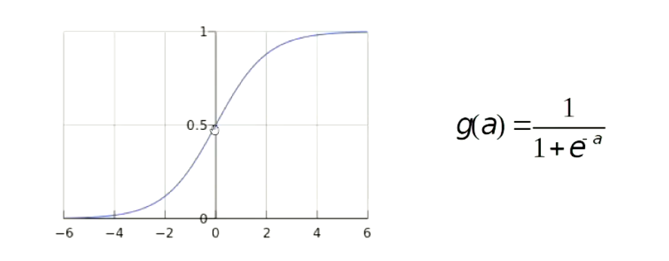

- It is differentiable at all points
- It handles uncertainty (e.g. an input example could be positive with different degrees of certainty
from 0.5 to 1).
- Have to define an error function (generally called a loss function)
  * $E = \sum_{i=1}^{n}(t_i - y_i)^2$
- Then we have to compute the gradient and evaluate the following:
  * $W \leftarrow W - \eta \delta E(W)$
  * The gradient is a vector of partial derivatives
  * The learning rate (step size) determines how much is made in each iteration

Here is a visual representation of this process:

The bottom left represents the error function dispersion, (the further away from the
epicenter, the more errors it has, the closer to the epicenter, the more optimised the
result will be):

The bottom right, shows some training data assessment, as you can see it gets stuck on some
cases, as the gradient approaches 0 (top left of the graph).

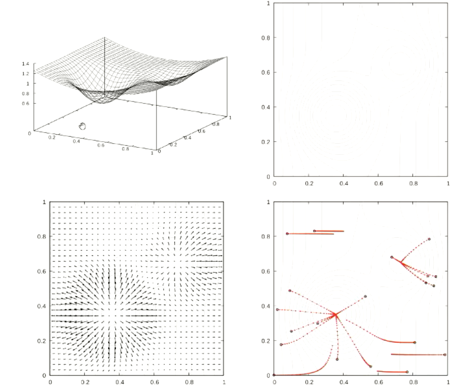

**Network architecture for a typical classification task**

- The number of inputs and outputs is determined by the problem
- One hidden layer is enough for many classification tasks. Therefore,
there will be a layer of input nodes, a hidden later of neurons and an
output layer, given the below state:

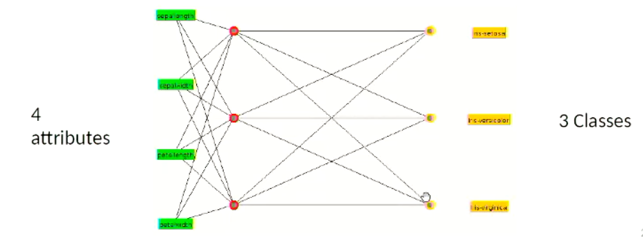

**A rough guideline for network size**

- Best is to have as few hidden layers as possible
  * Fouces better generalization
  * Fewer weights to be found
  * Less flexibility and less likely to overfit
- Number of nodes in the hidden layer:
  * Make the best guess you can
  * If training is unsuccessful try more hidden nodes
  * If training is successful try fewer hidden nodes


**Problems in this algorithm**

- Game tree size, as size of the game tree gets larger, the search across the decision tree becomes too large
an example of this is chess, the decision tree is too large for straight minimax to be run on it.

**How to reduce the search space?**

- Pruning the game tree
  * Generic algorithm, will work with all games
- Heuristic evaluations of states
- Tables lookup instead of search (*for opening and closing situations*), chess openings, checkmate patterns

**Pruning: The Idea**

If an option is bad compare to other options, there is no point in expending search time to find out how bad that option is.
If the minimising agent finds a node that can only be more than the previous iteration, the min agent will discard this node
(saving us computation time in the search space).

To do this, we need a mechanism to know events higher up in the tree.

It is important to note that this decision tree does not map to the decisions made in the game,
these are some iterations that are being `considered`, the goal node is to find the best
option to take at the depth we are considering (at the top of the tree that has not been
evaluated).

**Alpha-Beta Pruning: The Concept**

If $m > n$ Max would chose the $m$-node to get a guaranteed utility of at least $m$

The min node with utility $n$ (or less) would never be reached; stop further evaluation

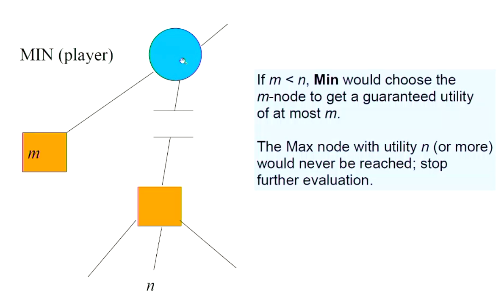

**Alpha-Beta Pruning: The Algorithm**

Similar to MinMax algorithm, but Max-Value and Min-Value keep two local variables
$\alpha$ and $\beta$.

- $\alpha$ = highest-value choice found for `MAX` higher up in the tree (initially $\alpha$ = -INF)
- $\beta$ = lowest-value choice found for `NIN` higher up in the tree (initially $\beta$ = INF)

Pass current values of $\alpha$ and $\beta$ down to child calls (nodes) during the search.

Update values of $\alpha$ and $\beta$ during search:

- Max-Value updates $\alpha$ (at Max nodes)
- Min-Value updates $\beta$ (at Max nodes)

Prune remaining branches at a node when $\alpha \geq \beta$

```
function Alpha-Beta-Search(state) return an action
  v <- Max-Value(state, -x, +x)
return the action in ACTIONS(state) with value v

function Max-Value(state, a, b) return a utility value
  if Terminal-Test(state) then return Utility(state)
  v <- Max(v, Min-Value(Result(s, a), a, b)
  a <- Max(a, v)
  if a >= b then return v
return v

function Min-Value(state, a, b) return a utility value
  if Terminal-Test(state) then return Utility(state)
  v <- Min(v, Max-Value(Result(s, a), a, b)
  a <- Min(a, v)
  if a <= b then return v
return v
```

[State space example one]: ./Diagrams/state-space.png
[State space graph simplified]: ./Diagrams/state-space-graph.png
[search tree]: ./Diagrams/search-tree.png
[Generic Search]: ./Diagrams/generic-graph-search.png
[DFS]: ./Diagrams/DFS.png
[DFS trace using generic algorithm]: ./Diagrams/DFS-trace-generic.png
[BFS Illustration of search tree]: ./Diagrams/BFS.png
[BFS trace using generic algorithm]: ./Diagrams/BFS-trace-generic.png
[LCFS trace generic]: ./Diagrams/LCFS-trace-generic.png
[Example: LCFS with pruning]: ./Diagrams/LCFS-with-pruning-example.png
[Tracing best-first search]: ./Diagrams/tracing-best-first-search-example.png
[1]: ./Diagrams/tracing-a-search-one-example.png
[Tracing A\* search]: ./Diagrams/asearch-two-example.png
[Proof of optimality]: ./Diagrams/proof-for-a-search.png
[Pruning on A\* Search]: ./Diagrams/pruning-on-a-search.png
[Dominance Relation]: ./Diagrams/dominance-relation.png
[Electrical Environment: Information (Input)]: ./Diagrams/electrical-environment.png
[Electrical Environment: Knowledge Base]: ./Diagrams/electrical-environment-base.png
[simple example question]: ./Diagrams/simple-example-interpretations.png
[Tracing tutorial: 1:13:30]: https://echo360.net.au/lesson/G_abdd116d-06db-42eb-a7c5-7574b3189d84_0603f480-010c-4863-abcd-d37c48fdb72f_2021-08-03T09:00:00.000_2021-08-03T10:55:00.000/classroom#sortDirection=desc
[Bottom-up proof procedure algorithm pseudo code]: ./Diagrams/bottom-up-proof-algorithm.png
[Top-down proof procedure algorithm pseudo code]: ./Diagrams/top-down-algorithm-proof.png
[Further examples using prolog: 1:10:00]: https://echo360.net.au/lesson/G_abdd116d-06db-42eb-a7c5-7574b3189d84_0603f480-010c-4863-abcd-d37c48fdb72f_2021-08-10T09:00:00.000_2021-08-10T10:55:00.000/classroom#sortDirection=desc
[Example of local search]: ./Diagrams/local-search-for-tsp.png
[n-queens example (35:00)]: https://echo360.net.au/lesson/G_abdd116d-06db-42eb-a7c5-7574b3189d84_0603f480-010c-4863-abcd-d37c48fdb72f_2021-09-14T09:00:00.000_2021-09-14T10:55:00.000/classroom#sortDirection=desc
[Gradient descent algorithm]: ./Diagrams/gradient-descent.png
[Crossover Example]: ./Diagrams/crossover.png
[Tree representation example]: ./Diagrams/tree-rep.png
[2]: ./Diagrams/marginalization.png
[Normalization trick example]: ./Diagrams/normalization-example.png
[Example]: ./Diagrams/inference-enumeration-example.png
[Conditional Independence: Example]: ./Diagrams/conditional-independence-example.png
[3]: ./Diagrams/conditional-independence-example2.png
[Example: Lecture (1:27:30)]: https://echo360.net.au/lesson/G_abdd116d-06db-42eb-a7c5-7574b3189d84_0603f480-010c-4863-abcd-d37c48fdb72f_2021-09-21T09:00:00.000_2021-09-21T10:55:00.000/classroom#sortDirection=desc
