\newpage

# Artificial Intelligence

## Course Information

The course covers core topics in AI including:

- uninformed and informed graph search algorithms,
- propositional logic and forward and backward chaining algorithms,
- declarative programming with Prolog,
- the min-max and alpha-beta pruning algorithms,
- Bayesian networks and probabilistic inference algorithms,
- classification learning algorithms,
- consistency algorithms,
- local search and heuristic algorithms such as simulated annealing, and population-based algorithms such as genetic search and swarm optimisation.

**Grades**

Standard Computer science policy applies

- Average 50% over all assessment items
- Average at least 45% on all invigilated assessment items

Grading structure for course

- Assignments (5%)
  * Two Super Quiz's
- Quizzes (16.5%)
  * Weekly Quiz Assessments (1.5% ea)
- Lab Test (20%)
- Final Exam (58.5%)

### Textbooks / Resources

- Poole, David L.1958, Mackworth, Alan K; Artificial intelligence : foundations of computational agents; Cambridge University Press, 2010.
- Russell, Stuart J, Norvig, Peter; Artificial intelligence : a modern approach; 3rd ed; Prentice Hall, 2010.

## Readings

## Lectures

### Lecture One: Searching the State Space

**What is state?**

- A state is a data structure that represents a possible configuration of the world *agent and environment*
- The **state space** is the set of all possible states for that problem
- actions change the state of the world

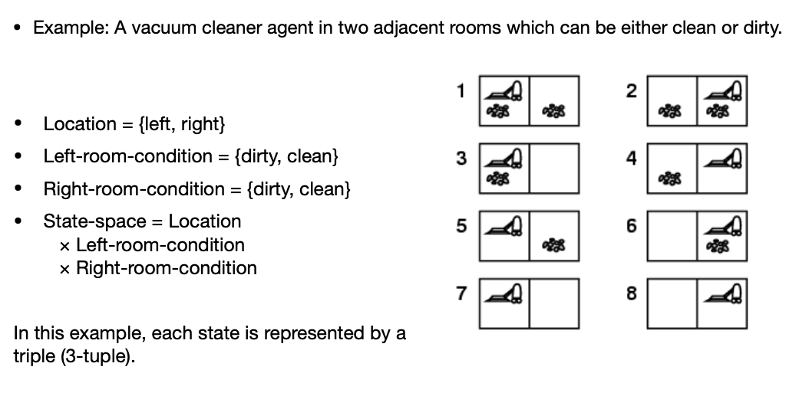

State can also be represented as a graph *both directed and undirected*

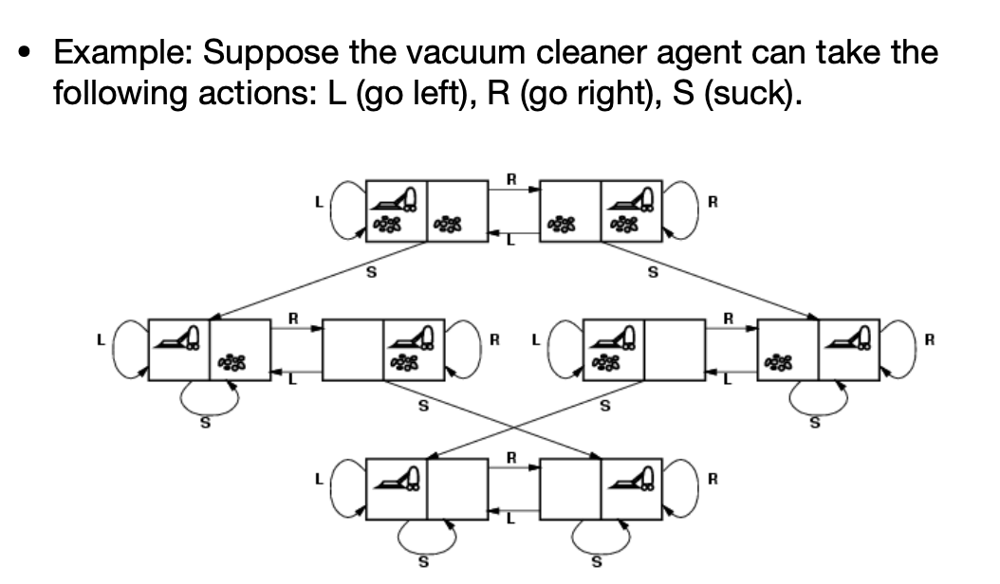

- Many problems in AI can be abstracted to the problem of finding a path in a directed graph
- Notation we use is **Nodes** and **arcs** for **vertices** and **edges** in a graph

**Explicit vs Implicit graphs**

- In **explicit graphs** nodes and arcs are readily available, they are read from the input and stored
  in a data structure such as an adjacency list/matrix.
  * the entire graph is in memory.
  * the complexity of algorithms are measured in the number of nodes and/or arcs.
- In **implicit graphs** a procedure `outgoing_arcs` is defined that given a node, returns a set
  of directed arcs that connect node to other nodes.
  * The graph is generated as needed *due to the complexity of the graphs.*
  * The complexity is measured in terms of the depth of the goal state node or *how far do we
    have to get into the graph to find a solution*.

**Explicit graphs in quizzes**

- In some exercises we use small explicit graphs to stydy the behaviour of various frontiers
- Nodes are specified in a set
- Edges are specified in a list
  * pairs of nodes, or triples of nodes (in a tuple)

**Searching graphs**

- We will use generic search algorithms: given a graph, start nodes, and goal nodes, incrementally
  explore paths from the start nodes.
- Maintain a **frontier** of paths that have been explored
  * frontier: paths that we have already explored
- As search proceeds, the frontier is updated and the graph is explored until a goal node is found.
- The order in which paths are removed and added to the frontier defines the search strategy
- A **search tree** is a tree drawn out of all the possible actions in terms of a tree.
  * How do we handle loops? *Covered in next lecture*
  * In the search tree outlined below, you can see that the *end of paths on frontier* represents a BFS relationship
    note this is not always the case.

**Generic graph search algorithm**

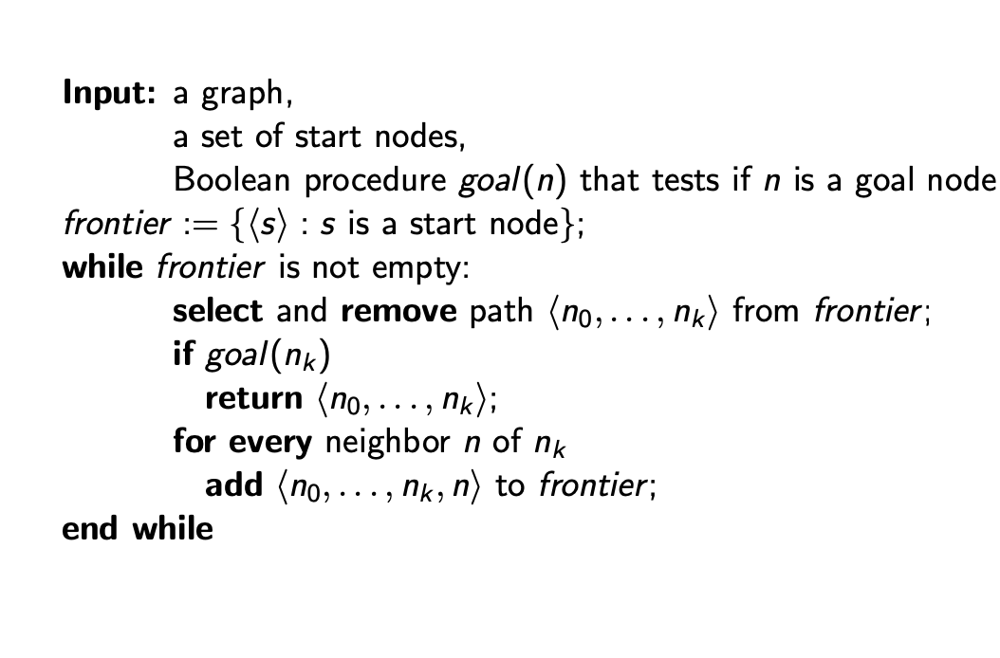

> NOTE: you will have to use what ever data structure for the seach you are using (BFS use
> a queue), (DFS use a stack).

In the generic algorithm, neighbours are going to use the method `outgoing_arcs`, we are 
given this algorithm in the form of a python module.

**Depth-first search**

- In order to perform DFS, the generic graph search must be used with a stack frontier *LIFO*
- If the stack is a python list, where each element is a path, and has the form [..., p, q]
  * *q* is selected and popped
  * of the algorithm continues then paths that extend *q* are pushed (appended) to the stack
  * *p* is only selected when all paths from *q* have been explored.
- As a result, at each stage the algorithm expands the deepest path
- The orange nodes in the graph below are considered the frontier nodes

- DFS does not guarantee a solution without pruning, due to the fact that we can have infinite loops
- It is not guaranteed to complete if it does not use pruning

**A note on complexity**

Assume a finite search tree of depth *d* and branching factor of *b*:

- What is the time complexity?
  * It will be exponential: $O(b^d)$
- What is the space complexity?
  * It will be linear: $O(bd)$

**How do we trace the frontier**

- starting with an empty frontier we record all the calls to the frontier:
  to add or get a path we dedicate one line per call
- When we ask the frontier to add a path, we start the line with a `+` followed by the path that has been added
- When we ask for a path from the frontier we start the line with a `-` followed by the path being removed
- When using a priority queue, the path is followed by a comma and then the key *e.g, cost, heuristic, f-value, ...*
- The lines of the trace should match the following regular expression `^[+-][a-z]+(,\d+)?!?$`
- We stop when we **remove** a path from the trace

**Breath-first search**

- In order to perform BFS, the generic graph search must be used with a queue frontier *FIFO*.
- If the queue is a python deque of the form [p,q,...,r], then
  * p is selected (dequeued)
  * if the algorithm continues then paths that extend *p* are enqueued *appended* to the queue after *r*
- As a result, at each state the algorithm expands the shallowest path.

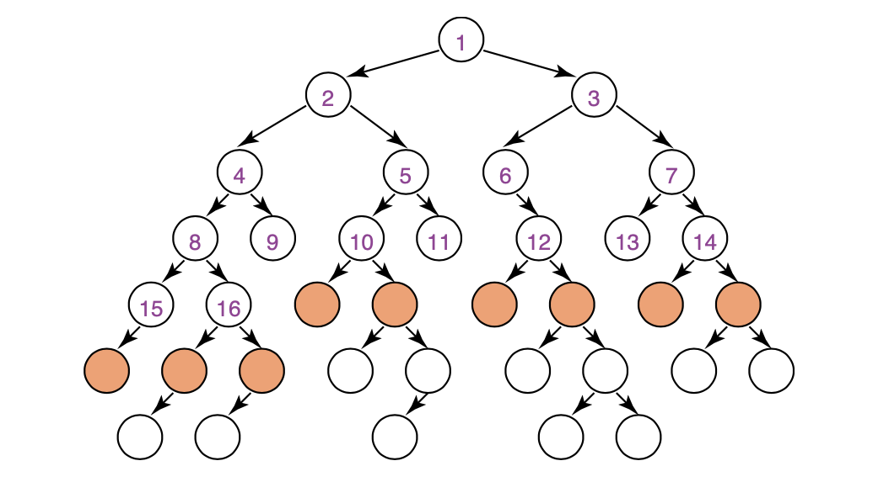

- BFS **does** guarantee to find a solution with the fewest arcs if there is a solution
- It will complete
- It will not halt due to some graphs having *cycles, with no pruning*

**A note on complexity**

> BFS has higher complexity than DFS

- What is the time complexity?
  * It will be exponential: $O(b^d)$
- What is the space complexity?
  * It will be linear: $O(b^d)$

**Lowest-cost-first search**

- The cost of a path is the sum of the costs of its arcs
- This algorithm is very similar to Dijkstra's except modified for larger graphs
- LCFS selects a path on the frontier with the lowest cost
- The frontier is a priority queue ordered by path cost
  * A priority queue is a container in which each element has a priority *cost*
  * An element with a higher priority is always selected/removed before an element with a lower priority
  * In python we can use the `heapq` you will need to store objects in a way that these properties hold
- LCFS finds an optimal solution: a least-cost path to a goal node.
- Another name for this algorithm is *uniform-cost search*.

> NOTE: For an example of this queue, see Lecture One: 1:45 time stamp

### Lecture Two: Searching the State Space (part two)

**Pruning**

- This is our method to deal with cycles and multiple paths.
- this means we can have wasted computation and cycles in our graph

> Principle: Do not expand paths to nodes that have already been expanded

**Pruning Implementation**

- The frontier keeps track of expanded or *closed* nodes
- When adding a new path to the frontier, it is only added if another path to the same end-node
  has not already been expanded, otherwise the new path is discarded (*pruned*)
- When asking for the **next path** to be returned by the frontier, a path is selected and 
  removed but it is returned only if the end-node has not been expanded before, otherwise 
  the path is discarded (pruned) and not returned. The selection and removal is repeated 
  until a path is returned (or the frontier becomes empty). If a path is returned, its 
  end-node will be remembered as an expanded node. 

In frontier traces every time a path is pruned, we add an explanation mark `!` at the end of the line

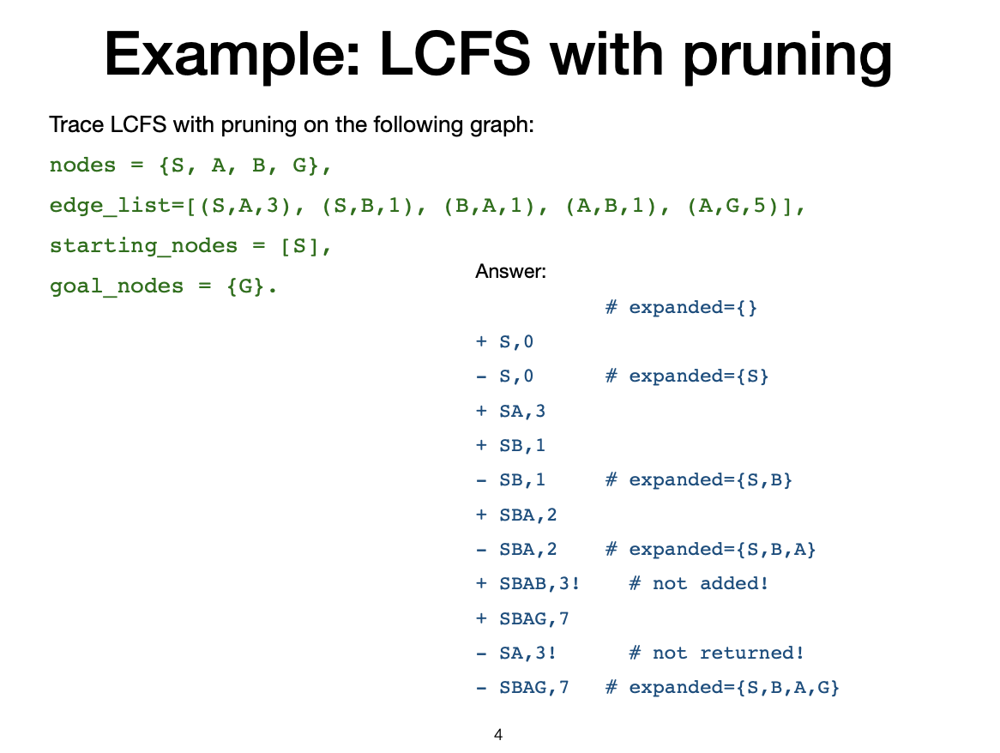

**How does LCFS behave?**

- LCFS explores increasing cost contours
  * Finds an optimal solution always
  * Explores options in every direction
  * No information about goal location

We are going to use a search heuristic, function `h()` is an estimate of the cost for the shortest path
from node *n* to a goal node. 

- *h* needs to be efficient to compute
- *h* can be extended to paths: $h(<n_0, ..., n_k) = h(n_k)$
- *h* is said to be admissible if and only if:
  * $\forall n \ h(n) \geq 0$, *h* is non-negative and $h(n) \leq C$ where C is the optimal cost of getting
    from *n* to a goal node

> NOTE: We will have to come up with our own heuristic for the assignment as it depends on context.

**Best-first Search**

- Idea: select the path whose end is closest to a goal node according to the heuristic function.
- Best-first search is a greedy strategy that selects a path on the frontier with minimal *h*-value 
- Main drawback: this does not guarentee finding an optimal solution.

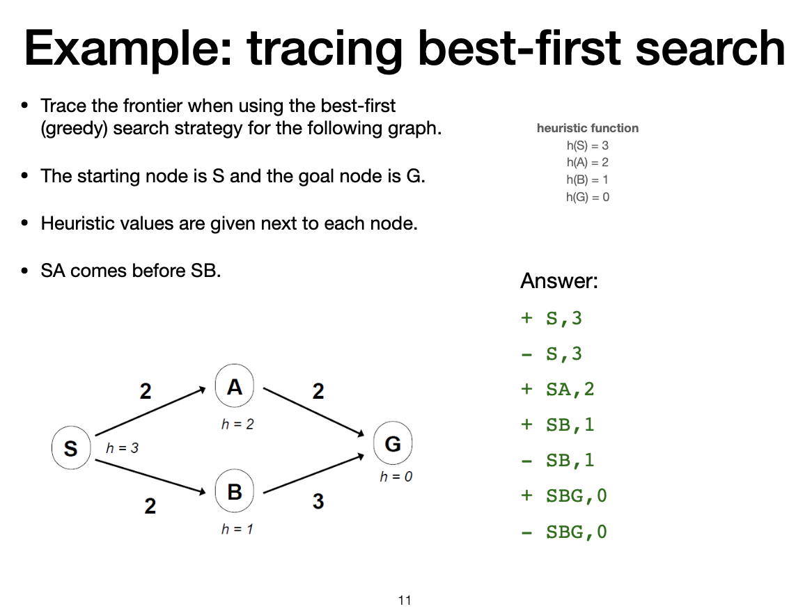

**A\* search strategy**

Properties:

- Always finds an optimal solution as long as:
  * there is a solution
  * there is no pruning
  * the heuristic function is admissible
- Does it halt on every graph?

Idea:

- Don't be as wasteful as LCFS
- Don't be as greedy as best-first search
- Estimate the cost of paths as if they could be extended to reach a goal in the best possible way.

Evaluation function: $f(p) = cost(p) + h(n)$

- $p$ is a path, $n$ is the last node on $p$
- $cost(p)$ = cost of path $p$ *this is the actual cost from the starting node to node n*
- $h(n)$ = an estimate of the cost from $n$ to goal node
- $f(p)$ = estimated total cost of path through $p$ to goal node

The frontier is a priority queue ordered by $f(p)$

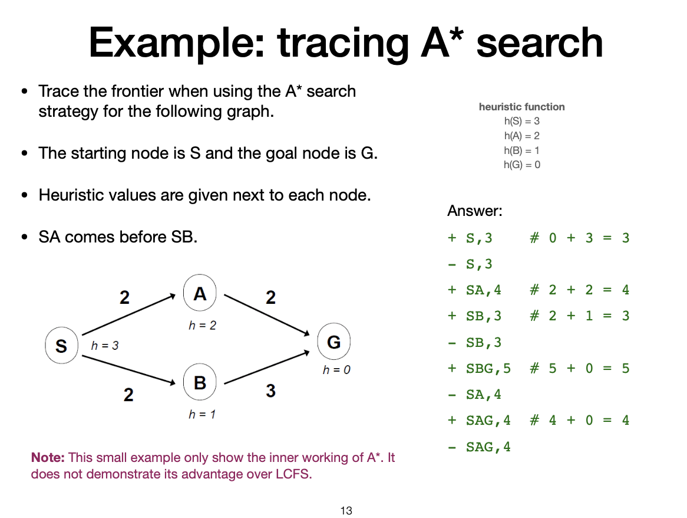
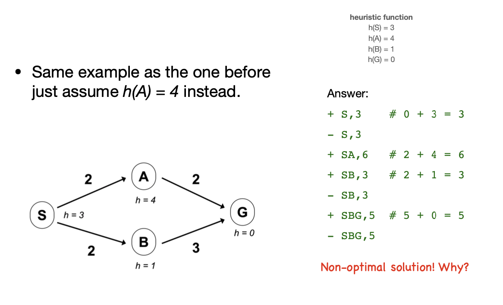
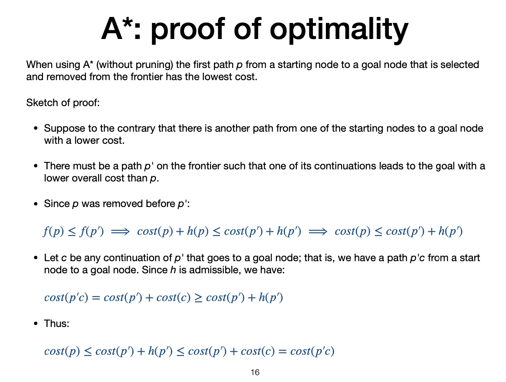
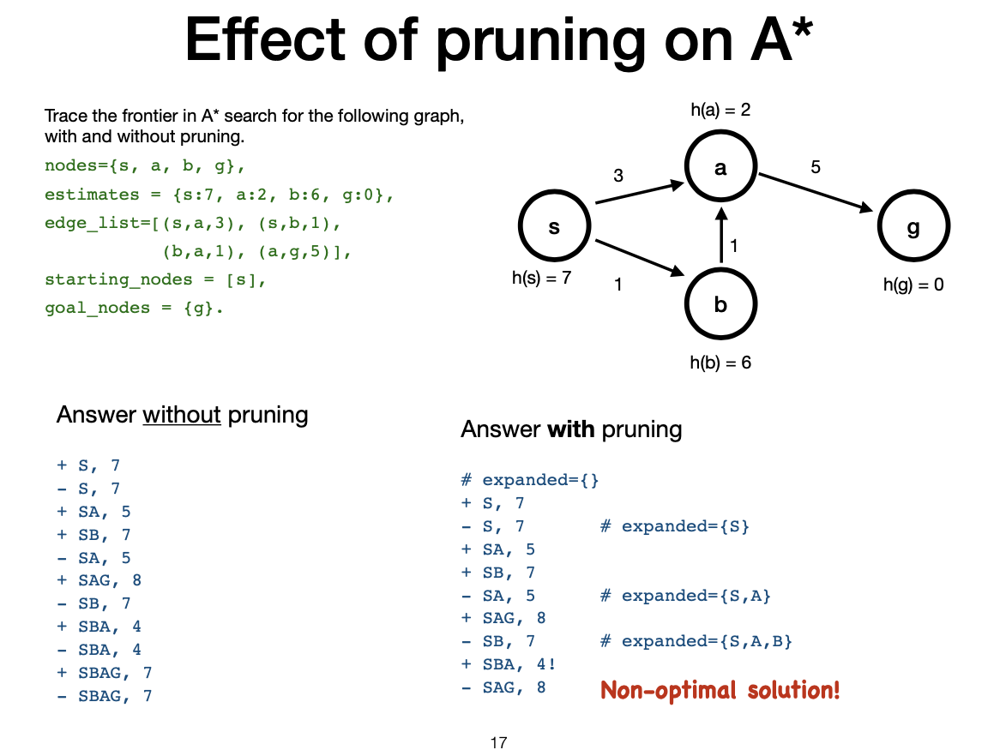

**What went wrong when pruning A\* Search**

- An expensive path, *sa* was expanded before a cheaper path *sba* could be discovered, because
  $f(sa) < f(sb)$
- Is the heuristic function *h* admissible?
  * Yes
- So what can we do?
  * We need a stronger condition than admissibility to stop this from happening

> Principle: When we are removing nodes, we are essentially saying we have found a cheaper solution, in this
> case, this was not true and hence why the algorithm fails, we need to use a stronger condition as
> outlined below

**Monotonicity**

A heuristic function is monotone or consistent if for every two nodes $n$ and $n'$ which is reachable from $n$:

$$h(n) \leq cost(n,n') + h(n')$$

With the monotone restriction, we have:

$$
\begin{aligned}
f(n') &= cost(s, n') + h(n') \\
&= cost(s, n) + cost(n, n') + h(n') \\
&\geq cost(s, n) + h(n) \\
&\geq f(n) \\
\end{aligned}
$$

How about using the actual cost as a heuristic?

- Would it be a valid heuristic?
- Would we save on nodes expanded?
- What's wrong with it?
  * It becomes as computationally expensive as it is to just do the problem

Choosing a heuristic: a trade-off between quality of estimate and work per node!

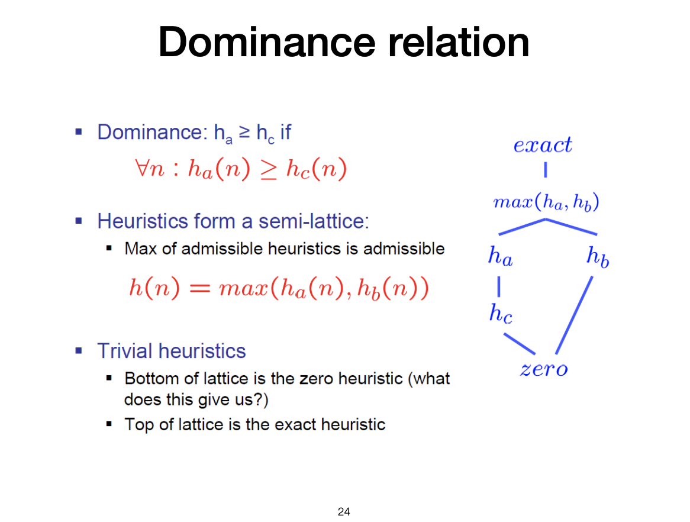

