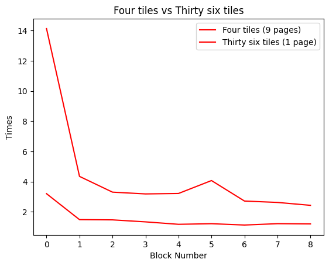

# COSC368 Lab 9 Results




After spending a couple of hours trying to run the R scripts on my home machine I have not
been able to isolate the problem, in the first script:


```

#!/usr/bin/env Rscript

data <- read.table("ttest-data.txt", header=TRUE)
t.test(data$four, data$thirtysix, paired=TRUE)

```


I am not sure what I have done wrong here, but I get the output as follows:


```

Error in t.test.default(data$four, data$thirtysix, paired = TRUE) :
  'y' is missing for paired test
Calls: t.test -> t.test.default
Execution halted

```

\newpage

In the second example I have another issue that seems unrelated, again I am not sure what is going on here?

```

#!/usr/bin/env Rscript

library(ez)

data <- read.table("ttest-data.txt", header=TRUE)
novice_data <- data[which(data$block == 0),]
expert_data <- data[which(data$block == 9),]

print("NOVICE ANALYSIS")
ezANOVA(data=novice_data, dv=as.numeric(time), within=condition, wid=subject)
ezStats(data=novice_data, dv=as.numeric(time), within=condition, wid=subject)

print("EXPERT ANALYSIS")
ezANOVA(data=expert_data, dv=as.numeric(time), within=condition, wid=subject)
ezStats(data=expert_data, dv=as.numeric(time), within=condition, wid=subject)

```

The output of this script has a different error, I tried to cast the time to an integer to avoid the issue
    however this seems to be of no avail, and recieves the following error:

```

[1] "NOVICE ANALYSIS"
Error in ezANOVA_main(data = data, dv = dv, wid = wid, within = within,  :
  "dv" must be numeric.
Calls: ezANOVA -> ezANOVA_main
Execution halted

```


I am not sure what to do here, any feedback would be appreciated.


