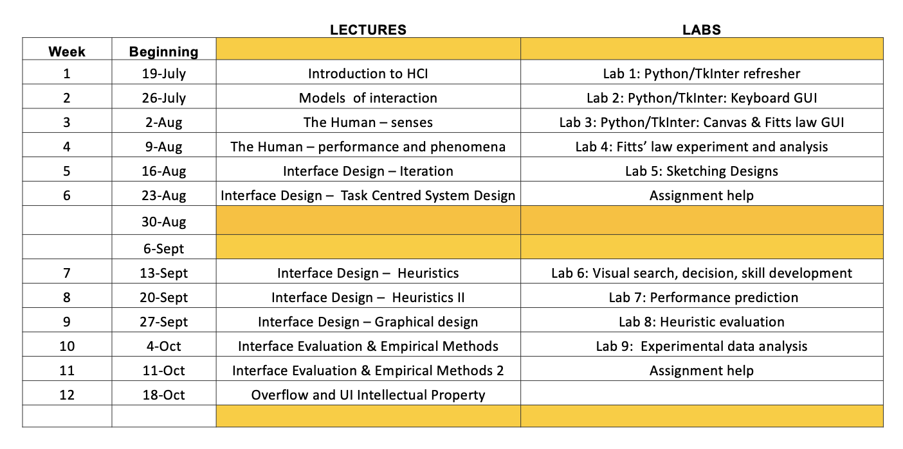

\newpage

# Humans and Computers

## Course Information

### Lecturers Details

- Lecturer: Andy Cockburn 
  * Email: andy.cockburn@canterbury.ac.nz
- Tutors: 
  * Katia De Lu: 
    + Email: katia.delu@canterbury.ac.nz
  * Stewart Dowding: 
    + Email: stewart.dowding@canterbury.ac.nz
- Team alias: team368@cosc.canterbury.ac.nz

### Schedule

**Topics**

- Introduction
- Models of interaction and interface technology
- The human
- Interface design
- Evaluation
- UI intellectual property

### Assessment Structure

- Labs (9%)
  * 1% per lab
  * Binary marking scheme - go to the lab, get full marks
- Usability analysis and storyboard (25%)
  * Wed 22nd September 5:00 pm
  * Teams of ~six, forming own groups
- Design Specification and Rationale (15%)
  * Wed 20th October 5:00 pm
- Exam (51%)
  * TBA

### Textbooks/Resources

- Designing with the Mind in Mind 
  * Based on COSC368, Old lecturers thoughts
  * Author: Jeff Johnson, Morgan-Kaufmann
- Papers on ACM Digital Library
- Other materials on Learn

## Lectures

### Lecture One - Introduction

**Technologies in this course**

- TKinter
  * Lab one - Refresher
  * Lab two - Keyboard GUI
  * Canvas & fitts law GUI
- Python

> NOTE: Labs will be used as the basis for analysis in assessments, so we need to build them

**What is HCI?**

Human computer interaction (HCI) is a discipline concerned with the design evaluation and implementation of interactive computing systems for human
use, and with the study of major phenomena surrounding them.

**What is HCI Responsible for?**

1. Learnability
2. Efficiency
3. Subjective satisfaction
4. *Memorability*
  * Mostly encapsulated in Learnability
5. *Errors*
  * Opposite of Efficiency
