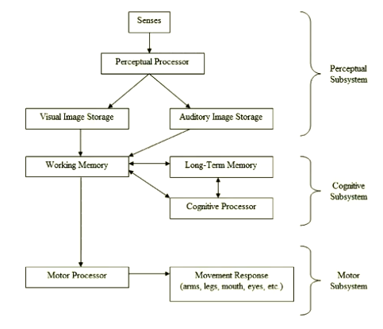
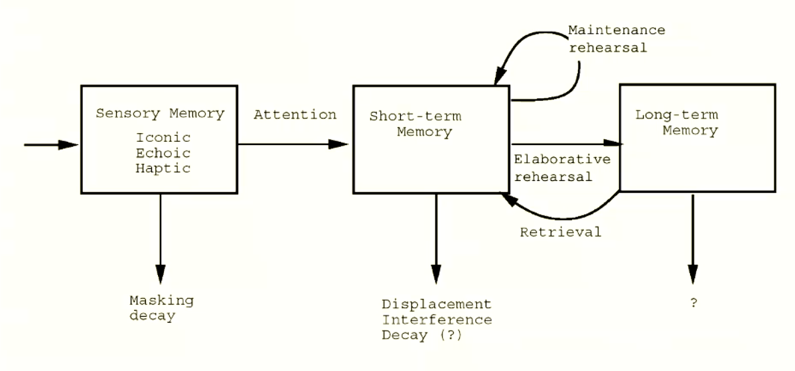

\newpage

# Humans and Computers

## Course Information

### Lecturers Details

- Lecturer: Andy Cockburn
  - Email: andy.cockburn@canterbury.ac.nz
- Tutors:
  - Katia De Lu:
    - Email: katia.delu@canterbury.ac.nz
  - Stewart Dowding:
    - Email: stewart.dowding@canterbury.ac.nz
- Team alias: team368@cosc.canterbury.ac.nz

### Schedule

**Topics**

- Introduction
- Models of interaction and interface technology
- The human
- Interface design
- Evaluation
- UI intellectual property

### Assessment Structure

- Labs (9%)
  - 1% per lab
  - Binary marking scheme - go to the lab, get full marks
- Usability analysis and storyboard (25%)
  - Wed 22nd September 5:00 pm
  - Teams of ~six, forming own groups
- Design Specification and Rationale (15%)
  - Wed 20th October 5:00 pm
- Exam (51%)
  - TBA

### Textbooks/Resources

- Designing with the Mind in Mind
  - Based on COSC368, Old lecturers thoughts
  - Author: Jeff Johnson, Morgan-Kaufmann
- Papers on ACM Digital Library
- Other materials on Learn

## Lectures

### Lecture One - Introduction

**Technologies in this course**

- TKinter
  - Lab one - Refresher
  - Lab two - Keyboard GUI
  - Canvas & fitts law GUI
- Python

> NOTE: Labs will be used as the basis for analysis in assessments, so we need to build them

**What is HCI?**

Human computer interaction (HCI) is a discipline concerned with the design evaluation and implementation of interactive computing systems for human
use, and with the study of major phenomena surrounding them.

**What is HCI Responsible for?**

1. Learnability
2. Efficiency
3. Subjective satisfaction
4. _Memorability_

- Mostly encapsulated in Learnability

5. _Errors_

- Opposite of Efficiency

### Lecture Two - Goals of HCI

**Knowing the user: Preliminary Factors**

- safety considerations
- need for throughput
- Frequency of use
- Physical space, lighting, noise, pollution
- Social context
- Cognitive factors: age, fatigue, stress, focus

**Managing complexity**

- Poorly designed interfaces amplify complexity
- Well designed UI's make interfaces as simple as possible, but no simpler
- Sometimes it may be appropriate to over-simplify _cater to an audience_

**Models of Interaction**

- A model is a simplification of reality
- They are useful when they help us understand a complex artifact

**Don Norman's Model of Interaction**

- Helps understand the designer's role in creating a system that is used by a thinking person
- Generally designers have a design model that is incomplete
- Then we get a system image, that is working, but in high incite, we would have
  built it differently
- The user has a model, that is weak, we need to try to map the designers model
  with the user model to create a mapping of the system image.

### Lecture Three - The Human

**Don Norman's Execute-Evaluate Cycle**

- Execute:
  - Goal > Intention > Actions > Exeution
  - Gulf of Execution: Problem arrives when executing intention/action
- Evaluate:

  - Perceive > Interpret > Evaluate
  - Gulf of Evaluation: Problem assessing state, determining effect, etc.
    **UISO Interaction Framework**

- Emphasises translations during interaction - This is a cycle
  1. Articulation: user's task language to input language
  2. Performance: callbacks, etc.
  3. Presentation: show new state
  4. Observation: interpretation
  5. Back to step one

**Mappings**

- Good mappings (relationships) between User and I/O, increasing Usability.
- We can try to allocate real world relationships by using mappings to real world items
  - We can also use spacing and different design to make things more intuative

**Affordance**

- Objects afford particular actions to users
  - Buttons afford pushing, chairs for sittings, sliders for sliding, dials for turning, handles for pulling.
  - Poor affordance encourages incorrect actions
  - Strong affordance may stifle efficiency

**Over and Under-Determined Dialogues**

- Ideally dialogue is well-determined, natural translation from task to input language
- **Under-determined** - User knows what they want to do, but not how to do it
- **Over-determined** - User forced through unnecessary or unnatural steps

**Direct Manipulation**

- Visibility of object
- Direct, rapid, incremental, reversible actions
  - This allows users to learn the interface and experiment without loss of data or risk
  - Unix's `sudo rm -rf / --no-preserve-root` is **NOT** an example of this as it is not reversible
- Rapid feedback
- Syntactic correctness
  - Disable illegal actions
- Replace language with action

- Advantages:
  - Easy to learn
  - Low memory
  - Easy to undo
  - Immediate feedback to user actions
  - Enables user to use spatial cues
- Disadvantages:
  - Consumes screen real estate
  - High graphical system requirements
  - May trap user in _beginner mode_

### Lecture Four - User Interaction and Psychology Behind Design

Psychological and physiological abilities have implications for design

- Perceptual: how we perceive things (input)
- Cognitive: how we process information
- Motor: how we perform actions (output)
- Social: how we interact with others

We are using these as a way to treat the human as an information processor, we are essentially mapping
humans to a model in order to create a general solution.

**The Human Information Processor**

_Based on a book by: card, Moran, Newell 1983_

- Underlying psychology of interaction
- Predictive engineering models (GOMS/KLM)
  - GOMS, A library of models in order to map user interfaces and engineer effectively
- Extensive empirical validation
- Core computer science
- We will further break up the human brain into:
  - Long-term memory
  - Working memory
    - Visual image storage
    - Auditory image store

- Human Input
  - Vision, hearing, haptics, olfaction
  - Vision:
    - Photoreceptors cells, rods: low light, monochrome, Cones: normal light, colour in fovea
    - Fovea: detailed vision of ~2 deg/sec
    - Retina: non-detailed vision of ~120 deg/sec; sensitive to movement
- Human Output
  - Pointing, steering, speech, typing, ...
- Human Processing
  - Visual search, decision times, learning
- Human Memory
- Human phenomena & Collaboration
- Human Error
- And UI implications of each

**Visual Acuity**

- Point acuity:
  - One minute of arc
- Grating acuity:
  - 1-2 minutes of arc
- Letter acuity:
  - Five minutes of arc
- Vernier acuity:
  - 10 seconds of arc

We can do the maths to figure out the acuity in order to figure out if the text/shapes
is readable in order to create user interfaces for a wider audience. For example we can
calculate letter acuity in order to see if text will be visible to a whole stadium.

**Eye movement**

- Fixations: Visual processing occurs when the eye is stationary (nearly)
- Saccades: Rapid eye movements (900 deg/sec), blind
- Eye movement used as input via eye-tracker
  - Midas touch problem
- Smooth-pursuit: for tracking moving objects up to 100 deg/sec; cannot be induced voluntarily
  - Relevant in scrolling e.g. (SDAZ)
  - The problem with scrolling is not computers cannot scroll fast and accurate, but that we cannot
    keep up with the scrolling (our eyes fall into motion blur).

### Lecture Five - Human Input: Depth-based UI's

**Size and Depth Cues**

- Familiarity
- Linear perspective
- Horizon distance
- Size constancy
- Texture gradient
- Occlusion
- Depth of focus
- Aerial perspective
- Shadows/Shading
- Stereoscopy

**Depth-based UI's: 3D**

- The real world is 3D
- So all interaction should be 3D, right?
  - No this is just a bad idea (lecturers opinion)
- 3D can be invaluable for interaction with 3D objects or in 3D Environments
- Terrible for navigation, to many mechanics
  - Occlusion is a huge issue (lots of stuff overlapping, cannot see)
  - Complexity

**Depth-based UI's Zooming**

- Overview first, zoom and filter, details on demand
- Allowing users to see everything, then allowing the user to get more specific when they want to
- Example: _zillow_ website

**Input: Haptics**

- Proprioception: sence of limb location +
- Kinaesthesia: particularly limb movement +
- Tactition: sensations
- Potentially powerful: e.g. Braille

**Human Output**

- Motor response times depend on stimuli
  - faster for combined signals
- Muscle actions
  - Isotonic: contraction yields movement
  - Isometric: contraction with no movement

**Fitts' Law**

- A model of rapid, aimed human movement
- Predictive of tasks; descriptive of devices
- Derived from Shannon's theory of capacity of information channels
- Extremely accurate and extensively validated for many types of aimed pointing
  - Consider velocity profile

### Lecture Six - Input Devices: Pointing, Scrolling and Textual

**Fitt's Law**

- Movement of time (MT) is linear with _ID_
  - $MT = a + b ID$ or $MT = a + b log_2 (A/W+1)$
  - Reciprocal of slope _(1/b)_ also called throughput or bandwidth of device, measured in bits/second

> NOTE: we are expected to be able to reproduce these formulae

**Pointing and Scrolling**

- Human output received as system input
- Direct vs Indirect
- Control: Position (zero-order), rate (first order), acceleration (second-order)
- Isotonic (force with movement)
- Isometric (force without movement)
- Control-Display gain and Transfer Functions

**Steering Law**

- A model of continuously controlled 'steering'
  - $MT = a + b ID$ or $MT = a + b (A/W)$
  - $A$ is the tunnel length; $W$ is tunnel width
  - $(A/W)$ is still called the `index of difficulty`

**Text Input**

- Alternative keyboard (Devorak)
- Chord keys
- Constrained keyboards
- Reactive/predictive systems (e.g. Dasher)
- Gestural input (unistrokes, shapeWriter/swipe)
- Hand-written recognition

**Visual search time**

- Extensively researched in psychology
- Linear complexity $O(n)$, unless we can create a pop out effect, then complexity is $O(1)$
- We should try to avoid this if possible, because it is slow with large values of $n$

### Lecture Seven - Human Processing: Visual Search Time

- Extensively researched in psychology
- Visual search time is a linear function
- Pop-out effects can reduce linearity to O(1)

**Hick/Hyman Law of Decision Time**

- $T = a + b \times H$
- $H$ is information entropy
- With $H_i = log(\frac{1}{p_i})$
- For all $n$ with equal probabilities $H = log_2(n)$
- We make frequent decisions quickly
- Decision times are fast $O(log \ n)$
- Applies to name retrieval and location retrieval
- In GUI's replace visual search with decision from spacial stability

We want to design for novice users to be able to transition to expert users.

### Lecture Eight - Human Memory

**Zipf's Law, Pareto Principle**

- Frequency of words (Zipf 1932)
  - $P_n = n^{-a}$
  - $P_n$ is a scaling factor of frequency of $n^{th}$ rank word
  - $a = 1$
  * Models fequency of commands, URL's, apps, windows, etc.

**Short-term memory**

- Input from sensory or long-term memory
- Capacity up to 7 (+/-) 2 chunks
- Chunks used to aid storage and reconstruction
- Fast access, rapid decay
- Constant update and interference
- Maintenance rehearsal

**Human Error: Mistakes**

- Errors of conscious decision making
- Due to incorrect or incomplete model of system
- Only detected with feedback

**Human Error: Slips**

- Errors of automatic and skilled behaviour
  - Capture error
    - Two action sequences with common starting point
  - Description error
    - More than one object allowing the same/similar action
  - Data-driven error
    - External data interferes with STM
  - Loss-of-activation error
    - Goal displaced/decayed
  - Mode Error
    - Right action, wrong system state
  - Mode slip
    - Pointing or steering error
  - Premature closure error
    - Dangling UI actions required after perceived goal completion
  - What is a mode?
    - system partition
    - Modal dialog
    - Ensure modes are visible and noticeable

### Lecture Nine: Deadlocks and the Ostrich Algorithm

**What is a deadlock?**

A set of processes is deadlocked if each process in the set is waiting for an event that only another process in the set can cause.

- Usually the event is release of an exclusively held resource
- None of the processes can:
  * run
  * release resources
  * be awakened
- **Resources:**
  - Various sorts
    * Physical devices: printers, tape drives
    * Database/data structures: tables
    * Locks (e.g. semaphores)
  - Sequence of events: request, use, release
  - Must wait if request is denied
  - Two types:
    * Preemptable, can be taken awar from a process with no ill effects
    * Nonpreemptable: will cause the process to fail if taken away
- **Four conditions for a deadlock:**
  * Mutual exclusion condition: each resources assigned to one process.
  * Hold and wait condition: process holding resources can request additional ones.
  * No preemption condition: previously granted resources cannot be forcibly taken away.
  * **Circular wait condition:** must be a circular chain of two or more processes, each is waiting for resources held by next member of the chain. *(this is the main condition)*
- **Deadlock modeling**
  * Modeled with directed graphs
    * Resources `R` assigned to process `A`
    * Process `B` is requested/waiting for resource `S`
    * Process `C` and `D` are in deadlock over resources `T` and `U`

Because there is a circular dependency (at the end of the above trace), this means we now have a deadlock in the system.

**Deadlock Strategies**

- Ostrich algorithm
  * Ignores the problem
- Detection and recovery
  * Take action when detected
- Dynamic avoidance
  * Avoidance by scheduling
  * careful resource allocation
- Prevention
  - Negate one of the four necessary conditions

**The Ostrich Algorithm**

- Pretend there is no problem
- Reasonable if:
  * Deadlocks occur very rarely
  * Cost of prevention is high
- UNIX and Windows take this approach
- Trade off between
  * Frequency and seriousness of deadlock
  * Cost/difficulty avoiding

**Deadlock detection**

- Periodically chechs resources held and requested to look for impasses
  * when resources requested
  * every *n* minutes
  * When CPU usage stalls
- Takes steps to recover from deadlocks if detected
- Practical limitations
  * Requires visibility of process resource requirements
    * Usually known to the resource scheduler
  - Space-time expensive: order $O(Processes \times Resoures)$
    * This is why most OS's avoid it

Deadlock detection, only works on the currently evaluated processes, it does **not** look into future deadlocks in order to prevent them if they are going to occur.

**Recovery from deadlock**

- Preemption: take a resource from another process
- Rollback
  * checkpoint a process periodically
  * use this saved state
  * Restart the process if it is found deadlocked
- Recovery through killing processes
  * kill one of the processes in the deadlock cycle or *another resource holder*
  * the other processes get its resources
  * choose process that can be rerun from the beginning

**Deadlock Avoidance** 

- Tries to predict when deadlocks may occur
- Checks required resources requested to determine how to avoid deadlocks
  * Process scheduling: suspend one or more processes to avoid resource clash
  * Resource scheduling: grant resources in a manner that avoids *unsafe state*
- Strong assumptions make implementation difficult and impractical
  * Requires visibility of process future resource requirements (*static scheduling*)
  * Assumes resources requested will be *held to completion* (*most pessimistic outlook*)

In order to map the availible resources in a way that we ensure that there are no deadlocks, comes down to a topology question, *can we allocate the resources in such a way that we avoid unsafe states?* We also make some assumptions, outlined in the figure below.

A state is considered **safe** if it can allocate all the resources to processes without locking.

**Bankers Algorithm**

This solves the problem, however it requires two major assumptions

- Static number of processes
- Known usage requirements

In a practical sense on an OS level, these are unrealistic assumptions to have, as it is impractical to have a static number of processes and we will not always know the usage of an individual process.

**Prevention: break one of the four conditions**

We could do one of the following:

- Remove competition over resource
- Don't allow additional resources to be requested
- Allow processes to surrender resources
- Avoid order issues

In practice it is difficult to break the four conditions for a deadlock.

**Deadlock Prevention: Attacking the hold and wait condition**

- Require processes to request resources before starting
  * A process not allowed to wait for further resources
- Problems:
  * May not know required resources at start of run
  * also ties up resources other processes could be using
- Dynamic variation: drop and reacquire
  * Release all currently held resources
  * Request all required (old and new)

