\newpage

# ENCE260 Notes - Computer Systems

### General Info About Course

The goal of this course is to introduce and get familiar with Linux and to teach you how to program in C. 
In this course the notes will be split into 3 major chunks throughout the year.

1. C Programming
2. Computer Architecture
3. Embedded System's

Textbook: None

Recommended text to read (C programming)

#### Grading

- 10% C Programming Assignment
  - (this is a three part super quiz)
- 10% Embedded Systems Assignment (Term 4)
  - Date: Monday 12th October
- 10% Weekly Quiz's
  - Dates: Each one will be on quiz server
  - There will be around 13 of these (0.8% each)
- 20% Test
  - Date: Monday 7th September 7pm
- 50% Final Exam (does not include C programming)

#### Resources

- K. N. King, C programming: a modern approach (2nd Edition) (Recommended not required)
- [Lecture notes, Recordings and slides](https://learn.canterbury.ac.nz/course/view.php?id=9078&section=1)
- [C Style Guide](https://learn.canterbury.ac.nz/mod/resource/view.php?id=1346587)
- [C Reference](https://en.cppreference.com/w/c)

#### Tutorials

This is some tutorial questions for computer architecture, It contains both questions and
model answers.

- 
- 
- 

## C Programming

#### Memory Organisation

- C programs should be structured as follows:
  - Program code (text)
  - Global and static data (data)
  - Uninitialized global data (bss)
  - Dynamic memory (heap)
  - scratch pad memory (stack)

#### Basic Hello World!

```c
// This line is including the header which contains a vast amount of C
#include <stdio.h>
// specifies the return type, main body function, and takes in void parameters
int main(void) {
  // Despite printing a string, this function will return 0, if return != 0 --> error
  printf("Hello World\n");
  return 0;
}
```

#### Declaring Variables

```c
#include <stdio.h>

# define A_CONSTANT 30 //this is how to define constants

int main(void) {
//Declarations are as follows
  int number1; // int means dedicate 4 bits to a number
  int number2;
  int total;

//Manipulation of variables
  number1 = 10;
  number2 = 20;
  total = number1 + number2;
  printf("The sum of %d and %d is %d\n", number1, number2, total);
  return 0
}
```

#### Using Macro's

The `#define` tag is used to assign macro's in C, this will be completed in-line with other
arithmetic. This is used to re-assign stock symbols and will execute the arithmetic where it
is placed in the file.

```c
// These are known as Macro's
#define SECOND_NUMBER 20
#define FIRST_NUMBER 20 this is still legal 2020
```

This line is defining second number as 20, this means that every time we call the parameter
second number it means 20, As we can see by the FIRST_NUMBER definition, this is not the
same as assigning an integer within the body of the function, this is defining a term as a
replacement for the symbol.

##### Macro's for arithmetic

As previously noted, we can re-define symbols using Macro's. This means that arithmetic works
in the same way as you would expect, so if we define a calculation as the macro, every time we
use it it will be evaluated in line with the expression. Here is an example.

```C
#define TEST 4 + 2

int main(void) {
  int val = TEST * TEST;
  printf("%i\n" val);
}
```

> This will use in-line math to result in the following output: 14

#### Statements

**General Expressions**

These are mostly like python except:

- No exponential operator
- `/` operator behaves like Python's `//` (integer devision by default)
- Logical operators are different
  - `and = &&`
    - single `&` acts as bitwise
  - `or = ||`
    - single `|` acts as bitwise
  - `not = !`
  - `++, --` are used as increment operators
    - pre-increment $++j$
    - post-increment $j--$
  - Assignment operator `=` is used anywhere in expressions
    - e.g. $foobar = (foo = 2) + (bar = 10)$
    - only use in simple assignment statements

**If Statements**

- Syntax in BNF notation
  - `::=` means _is defined as_
  - `|` denotes _or_
  - Tokens in double quotes are _terminals_
  - Other tokens are expanded by their own syntax definitions
- Note the parentheses around the condition expression

**To use Boolean Values**

To use boolean values, we must include _stdbool.h_ into the program, this will give us a
boolean value to use, the following will be the code to use boolean values.

```c
#include <stdbool.h>

int main(void)
{
    bool bigger = 6 > 5;
}
```

**Loops**

The loops act very similarly to that of the python loops, there are both `While loops` and `For loops`, that act
in much the same way that they would in python. The following is a basic implementation of a `while loop`.

```c
int main(void)
{
  int i = 10;
  while (i < 100) {
    printf("%i\n", i);
    i++;
  }
}
```

It is also important to note that there is also another version of the while loop that is called a `Do while loop`, this
is mostly useless, however it can come in useful occasionally. Here is an example of a `Do while loop`.

```c
int main(void)
{
  int i = 10;
  do {
    printf("%i\n", i);
    i--;
  } while (i > 0);
}
```

Here is an example of a `For loop`, this is used to specify a loop within a range of values. To use this we need to give it
an initialisation expression, a condition to continue and a loop body indication, this is in this order and is found in the
brackets in the body below.

```c
int main(void)
{
for (int i = 10; i > 0; i--) {
  printf("%i\n", i);
  }
}
```

We have been asked to with-hold from using for loops for anything other then simple counting, this is because when we use a
for loop, the check condition is preformed after the increment is completed. This is very counter intuitive as we would assume
by the presentation of the statement that the counter would be implemented before the check.

#### The Switch Statement

The switch statement uses a series of cases, and acts similar to that of the switch statement
found in `Java`.

```c
// Example of switch statement
switch ( expression ) {
    case constant-expression1 :
        // statement if case complies
        break;
    case constant-expression2 :
        // statement if case complies
        break;
    default :
        // the final case that is carried out if all above cases do not comply
}
```

##### Example of switch: Simple Calculator

```c
// Takes in an operand, then two numbers; this will determine the calculations result
#include <stdio.h>

int main() {
    char operator;
    double n1, n2;
    printf("Enter an operator (+, -, *, /): ");
    scanf("%c", &operator);
    printf("Enter two operands: ");
    scanf("%lf %lf",&n1, &n2);
    switch(operator)
    {
        case '+':
            printf("%.1lf + %.1lf = %.1lf",n1, n2, n1+n2);
            break;
        case '-':
            printf("%.1lf - %.1lf = %.1lf",n1, n2, n1-n2);
            break;
        case '*':
            printf("%.1lf * %.1lf = %.1lf",n1, n2, n1*n2);
            break;
        case '/':
            printf("%.1lf / %.1lf = %.1lf",n1, n2, n1/n2);
            break;
        // operator doesn't match any case constant +, -, *, /
        default:
            printf("Error! operator is not correct");
    }
    return 0;
}
```

The above code is a simple calculator, it will enable the user to add, subtract,
multiply and divide. This is done by scanning for the type of operand (`+, -, *, /`),
this will allow the user to define what type of operation to address (defined by cases)
then we will enter the two numbers to use the desired operand on.

#### C Error Messages

The C error messaging system is considerably more cryptic than that seen in the Python
interpreter. It is harder to follow, and the key point to take away is that **Not all
error messages will point to exactly where the error is unlike python sometimes you
will have to find the error yourself**.

#### The Celsius function

```C
#include <stdio.h>
#include <stdlib.h>

#define FREEZING_PT 32.0
#define SCALE_FACTOR (5.0 / 9.0)

int main(void) {
  float fahrenheit = 0.0;
  float celsius = 0.0;
  printf("Enter Fahrenheit temperature: ");
  scanf("%f", &fahrenheit);
  celsius = (fahrenheit - FREEZING_PT) * SCALE_FACTOR;
  printf("Celsius equivilent: %.1f\n", celsius);
  return EXIT_SUCCESS;
}
```

### How Memory Works

Memory at the lower levels is just a series of bits. C treats memory the same way as it has
no object store or _heap_. Each piece of memory used is allocated a byte sized number to
tell us where it is stored, this is known as an _address_, (if we have a 4GB machine, then
there is 4 Billion bytes to store this information).

#### a = b

Because of the above, the assignment operator _a = b_, is actually saying, go to memory location
_b_ and copy all the bytes of _b_ to memory location _a_. This is raw byte copying, this is
different to python in the fact that python stores the name in a dictionary as an object.

#### Data Types and Interesting Functions

- Integers
  - unsigned
  - signed
  - long
  - short
  - int
- Floating Point Integers
  - float
  - double
- Characters
  - char
  - always 8-bit ASCII encoding (1-byte)
- Complex Floating Point
  - not covered in ENCE260
- Boolean
  - \_Bool (or just _bool_ if #include <stdbool.h>)

##### Integers

```C
int a = 0;
short int b = 1;
signed long long int x = 256;
short c = 20; // Don't have to expand
long d = 50;
```

The different variables tell it how much memory to allocate to each variable, for instance
**char** allocates 1-byte, **short** allocates 2-bytes, **int** allocates 4-bytes and **long
long int** allocates 8-bytes.

##### Chars

```c
char someChar = 0;

someChar = '*';
printf("'%c'", someChar);
```

> Return: '\*'

This will return the actual character, however if we do an arithmetic operation on the char
it will treat it as an integer.

```c
char someChar = 0;

someChar = 42;
printf("'%c'", someChar);
```

> Return: 42

Because we have now assigned the char to a numeric variable, it will then treat this as an
ASCII value for a character in the alphabet.

**Using getchar()**

```c
int c = 0;

printf("Enter a line: ");
c = getchar();

while (c != '\n' && != EOF) {
    printf("c = '%c' dec %d hex %x\n", c, c, c);
    c = getchar();
}
```

Here is a sexier way of writing this

```c
int c = 0;
printf("Enter a line: ");
while (c = getchar()) != '\n' && c != EOF) {
    printf("c = char '%c' dec %d hex %x\n", c, c, c);
}
```

This will take a string of characters, and then print every character as a char, int
and hex.

> Note: That this will buffer each char and print at the end of the loop rather then
> printing them after each character is entered.

##### Arrays in C

```c
char line[100] = {0}; // this will set 100 bytes to a value of 0
char line2[5] = {0, 1, 2, 3, 4};

// Note we can also find the size of an array using the following syntax
printf("The size of line2 is %zu", sizeof line2);

int c, i, n = 0;

puts("Enter a line: ");
while ((c = getchar() != '\n' && c != EOF)) {
    line[i++] = c;
}

n = i;
for (i = n - 1; i >= 0; i--) {
    putchar(line[i]);
}
```

In the code above, we can see that we have allocated 100 bytes to a line of chars.
This means that if we go over 100 bytes of code in that line, we will find that there
is going to be an overflow, because of this we will only see the first 100 bytes and
the rest will be lost.

##### Functions

```c
#include <stdio.h>

double average(double a, double b)
{
    return (a + b) / 2;
}

int main(void)
{
    printf("Average is: %lf", average(10, 200));
}
```

Take away things about functions:

- you cannot nest functions in C
- you must define the function before use, therefore we need to define above the main function

##### Strings In C

```c
#include <stdio.h>
#define MAX_NAME_LENGTH 80

void readName(int maxLen, char name[])
{
    int c = 0;
    int i = 0;
    printf("Enter your name: ");
    while ((c = getchar() != '\n' && c != EOF && i < MAX_NAME_LENGTH)) {
        name[i++] = c;
    } name [i] = 0;
}

int main(void)
{
    char name[MAX_NAME_LENGTH] = {0};

    readName(MAX_NAME_LENGTH, name);
    printf("%s\n", name);
}
```

We can indicate strings by having an array of chars and then ending with a `0`, this would
look something like this `s[] = {'t', 'h', 'i', 's', 0}`, we can also define a string like
the following:

```c
char s[] = "This";
char str = "This";

puts(s);
puts(str);

s[1] = '*';   // will work
str[1] = '*'; // will not work
```

If we use the second example `str[1]`, we will run into a segmentation fault, this is
because we will be pointing into a defined spot in memory, and therefore causing memory
errors. We can use the **valgrind** program on Unix systems in order to spot these memory
errors.

We can use the `<string.h>` header to get string operands when needed, these include the
`strlen()` function, along with many others.

###### Finding string Lengths

```c
#include <string.h>
char s = "String";
size_t n = strlen(s);
printf("%zu", n);
```

> Returns: 6

Above is an example of how to get the length of a string in C or any array of chars. It is
important to note that this is not returned as an `int`, but is returned as a `size_t`
attribute.

From figure one, we cannot do something like `if (s == str)`, this is because the equals
operand compares two places in memory rather then the values.

###### String Functions

**Note:** _We can use the Man page to find the input parameters for the below functions_

We can use `strLen()` to get length of string.

We can use `strcmp()` to compare two strings.

We can use `strncpy()` to copy a string to another object.

We can use `strncat()` to concatenate strings.

##### Pointers

In C all memory is treated as a large array, there are no _run-time checks_, programming
errors with pointers and arrays usually results in a crash of the program: this can be
_segmentation fault, core dumped_. Sometimes a corrupted memory location causes a problem
much later in the execution of the program **This is hard to debug**.

```c
#include <stdio.h>

int main(void)
{
    int i = 10;
    int j = 20;
    int* p = NULL; // This now points to memory location 0, as int(NULL) == 0
    p = &i; // P is now set to the Address of int (I)
    *p = j; // this sets 'i' to the value of 'j'
}
```

The $*$ operator in C can be interpreted in a couple of ways depending on context.
When being used in **Declarations** it is read as `int* point` means define this as a
pointer to an int. When used in **Expressions**, it is read as _Indirectly via_, so
`*p = j` means get a value indirectly via `p` and store it in variable `j`.

Something that we must understand about C, is that everything

**Addressing memory**

```c
uint8_t varA;
char varB;
int16_t temp[2];
```

This translates to the following byte array
| Memory | Location | Allocation |
| --- | --- | --- |
| 0x100 | byte 0 | varA |
| 0x101 | byte 1 | varB |
| 0x102 | byte 2 | temp[0] |
| 0x104 | byte 3 | temp[0] |
| 0x105 | byte 4 | temp[1] |
| 0x106 | byte 5 | temp[1] |
| 0x107 | byte 6 | EMPTY |

**Pointers in C syntax**

```c
char varA = 'a'
char* point_to_varA;

point_to_varA = &varA;

printf("%c", *point_to_varA);
```

##### Malloc & Free

Because we do not want to have to declare `DEFINE` statements every time we want to use
a list, we only need to do this as it allows us to make a maximum size. Instead we can
use the `malloc()` function to allocate space.

Here is an example of using the `malloc()` function to allocate space for a student structure

```c
typedef student_s student;
student = malloc(sizeof(Student)); // Malloc will return a size in memory or Null if no space in memory.
```

Something to note is that when we are using strings we need to append the null terminator,
this will mean that `malloc()` will take `StringSize = n`; `n + 1` bits of memory to store
the value.

```c
// We must allocate the string size and another bit for '\0' (Terminator)
char[] string = "This is a string";
char* name = malloc(strlen(name) + 1);
```

> Remember to use the Man page if you don't understand dipshit!

Usually we want to check the return type of `malloc()` as it is good practice to make sure
it is not a `NULL` value, the most important part of this is once we free up memory, we
MUST NOT LOOK BACK INSIDE IT!

```c
// This is freeing a piece of memory
free(name);
```

###### An actual implementation of Dynamic Memory Allocation

```c
#include <stdio.h>
#include <stdlib.h>
#include <string.h>

typedef struct {
    char* description;
    float duration; // hours
    int priority;
} Task;

Task* newTask(char* description, float duration, int priority);
void freeTask(Task* task);

int main(void)
{
    Task* task = newTask("Studying for ENCE260", 2.5f, 1);
    printf("Task \'%s\' (priority %d) takes %.1f hours.\n", task->description, task->priority, task->duration);
    freeTask(task);
}


Task* newTask(char* description, float duration, int priority)
{
    Task* task = NULL;
    size_t allo = strlen(description) + 1;
    task = malloc(sizeof(Task));
    if (task != NULL) {
        task->description = malloc(allo);
        if (description != NULL) {
            strncpy(task->description, description, allo);
            task->duration = duration;
            task->priority = priority;
        } else {
            free(task);
            task = NULL;
        }
    }
    return task;
}

void freeTask(Task* task)
{
    // Freeing the allocated memory to description
    free(task->description);
    // Freeing the actual Task instance
    free(task);
}
```

**But how does it work?**

- _malloc_ and _free_ are the two main functions in the _memory allocator_ module.
- They manage the **Heap**
  - the free memory area above the initialized data segment
  - the maintain a booking sheet of available and unavailable memory.
    - a global variable in the module
- The size of the heap grows or shrinks by OS calls `brk` or `sbrk`
  - Use the man page to read on these functions

Here is a simple view of `malloc() & free()`:

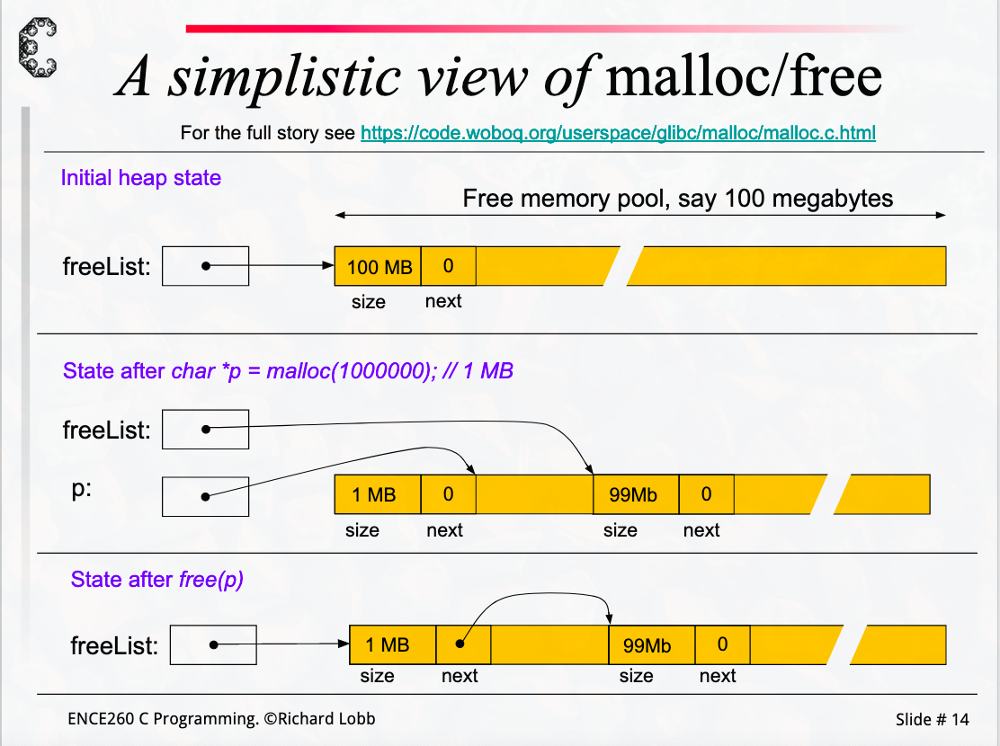

If you either underflow or overflow, you will end up having a messy heap, this will result
in either errors or miss-allocated bytes _this will cause hell in debugging_.

If we need to re-allocate a value to a new place in memory, we can use the `realloc()`
function.

```c
void* realloc(void* memPtr, int newSize);

// Here is a real example ( from slides )
char* readLine(void)
{
char* buff = NULL;
int numBytes = 0;
int c = 0;
while ((c = getchar()) != EOF && c != '\n') {
buff = realloc(buff, numBytes + 1);  // Get a new bigger block
buff[numBytes++] = c;
      }
      if (buff != NULL) {
            buff[numBytes] = '\0';
      }
      return buff;  // NULL if no data read
}
```

> if Result = NULL; we have run out of memory

This is a big fucking issue if this happens, its hard to diagnose and is really really annoying.

> else: Result != Null, we have not run out of memory

When we are using `malloc()` and `free()`, for every time we use `malloc()`, we MUST use
`free()` at some point for every `malloc()`. If this is not satisfied, we will have
_memory leaks_, this means that we will have a memory footprint that will grow with no
upper bound.

> To detect this, we can use the Unix valgrind tool.

Here is an example of simplification using `malloc AND free`. The example is from _Lab 6_:

```c
for (i = 0; i < NUM_REPEATS; i++)
{
studs = readStudents(inFile);
printStudents(&studs );
freeStudents(&studs );
rewind(inputFile);
}

Student* readStudent(FILE* fp)
{
    // Read from file then call …
    // newStudent which does ...
    sp = malloc(sizeof(Student));
    buffSize = strlen(name) + 1;
    sp->name = malloc(buffSize);
    ...
    strncpy(sp->name, name, buffSize);
    sp->age = age;
    sp->next = NULL;
    return sp;
}

void freeOneStudent(Student* sp) {
    free(sp->name);
    free(sp);
}

StudentList readStudents(FILE* fp)
{
    StudentList studs = {NULL, NULL};
    Student* sp = NULL;
    while ((sp=readStudent(fp))!=NULL)
    {
        addStudent(&studs, sp);
    };
    return studs;
}

void freeStudents(StudentList* studs) {
    /* **** TBS **** */
}
```

###### Dealing with Heap Corruption

- Over-running a `malloc’d` buffer is fatal
  - Probably
  - Eventually
- Difficult to debug
  - Solution: don't bug! Not-bugging is easier than de-bugging!

* Again there are many tools to help you find heap corruptions - _valgrind_ checks every heap memory reference (great tool for small projects but too slow and expensive for large projects)
  Link program with `–lmcheck`
  _ Uses versions of `malloc`, free that do some runtime checks
  _ Aborts on error - But checks only when `malloc`, free called - Should always use this when developing code that uses `malloc`/`free`

## Computer Architecture

#### Digital Logic

Analog Information

- defined by quantity

Digital Information

- true/false
- yes/no
- pairs well with logic values
- switches on/off

Logical variable, represents true or false, and is denoted by `varName = true`

**Logical functions**

- the limited set of values that logical variables can take (0, 1, true or false)
- makes it feasible to write out every possible combination

**Fundamental Functions**

`NOT`

- $f(a) = a'$

`AND`

- $f(a,b) = a * b$

`OR`

- $f(a,b) = a + b$

#### Boolean Algebra

- closure
  - for $a,b \in B$ then $a*b \in B$
- Identity $a*i = a$ therefore
  - $a*1 = a$
  - $a + 0 = a$
- Associative $a * (b*c) = (a*b)*c$
- Communicative $a*b = b*a$

#### Logic Gates

We use logic gates to create electronic circuits that describe logical variables and
their related statements.

| S   | B   | !B  | W=S!B |
| --- | --- | --- | ----- |
| 0   | 0   | 1   | 0     |
| 0   | 1   | 0   | 0     |
| 1   | 0   | 1   | 1     |
| 1   | 1   | 0   | 0     |

Each entry in the sequence can have one of two values (`M = 2`), since logical variables
have two logical values (0, 1). A sequence of `N` bits can be arranged into $2^{N}$ patterns.

##### Patterns

_Example_

- we have six differently coloured LED's that we can use to represent information
- we arrange these LED's into two groups, each with three colours (R, G, B).

Question: How many patterns can we make with the LED's.

> Answer: 9 patterns or $3^{2}$

What happens if we re-arrange the colors into three groups and two possible options (R, B).

> Answer: 8 patterns or $2^{3}$

How can we work this out without brute force?

In general, a sequence that is `N` entries long, where each entry has `M` values, this
will give a $M^N$ patterns.

**Address Bus**

This tells us the location of what we care about

**Data Bus**

This tells us what the data is that we care about

**Control Bus**

This specifies _which way_ transfers happen over the data bus

### The Computer

#### The CPU

##### Arithmetic Logic Unit (ALU)

- calculations (+, -, $\cdot, \div$)
  - $+$ = `OR` gate
  - $\cdot$ = `AND` gate
- comparisons (=, !=, <= >=)
- logical operations ()
- binary operands ()

If we want to map this to hardware, we will need to use combinational circuits that
use logic gates. (An example of this can be found in the slides).

Here are some real world examples of logic circuits that are often found within an
`ALU`.

**Decoder**

Used to get the memory location from an observed address.

- Typically used for _selecting_ a memory location given an address
- _N_ address bits $\rightarrow 2^N$ locations
- We want to separate output to be high for each possible combination of inputs
- Below is an example of what a decoder might look like in a logic circuit.

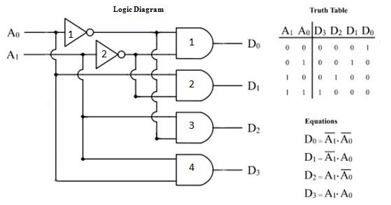

**Encoder**

**Multiplexer**

They act as a traffic cop, deciding which of two values go to the output. It essentially
routs a single input to the output.

- Multiplexers select one of several inputs and send it to output
- For example: ALU can operate on operands from the general purpose register file
  but they can also user the output of the previous operation for one of the operands.
- A mux at one of the ALU inputs allows the execution unit to select the source of
  the operand.

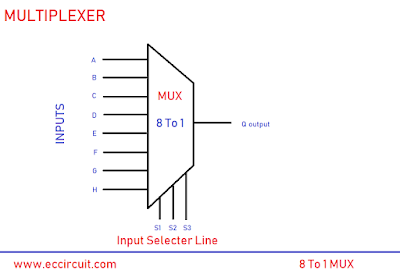

| Input | Output |
| S | O |
| --- | --- |
| 0 | $I_0$ |
| 1 | $I_1$ |

**Demultiplexer**

This acts like a multiplexer except it can output to multiple outputs. There will be a
diagram below that will show this:

- The way that this works is that it is conceptually similar to a Mux, however the inputs
  and outputs are switched.

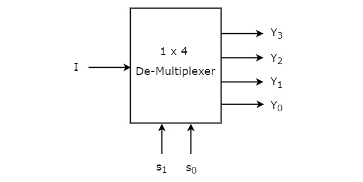

**Adder**

The following is an example of a full adder:

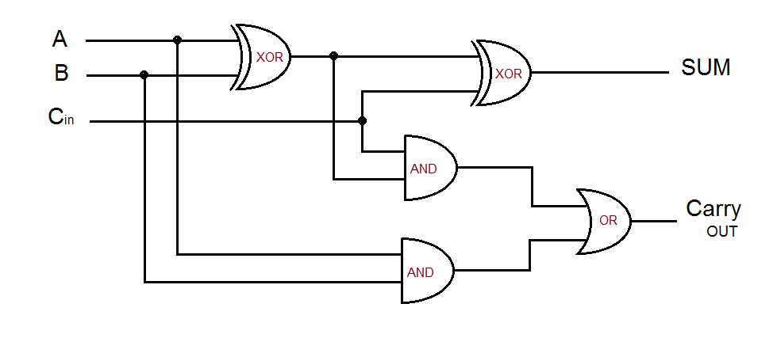

Here is an example of a 3-Bit Adder

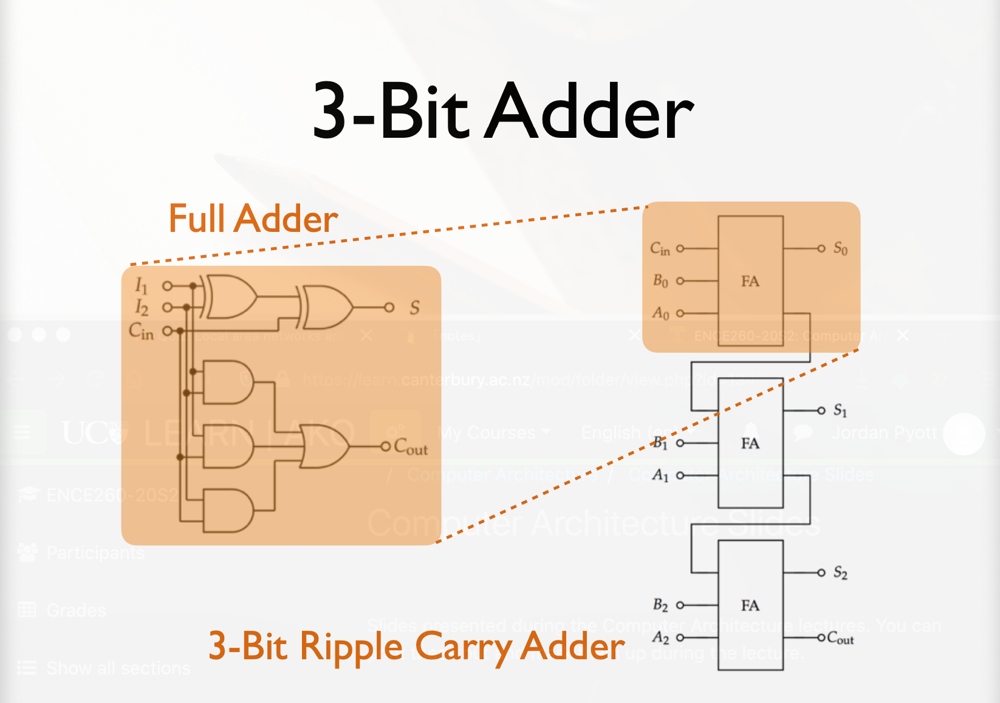

##### General Purpose Registers

- a set of memory locations located physically close to the ALU
- stores data that we are intending to manipulate
- Is a file

##### Control Registers

- holds the meta data associated with the data we wish to manipulate
- Contains
  - Address of next instruction (PC)
  - Address of _Top of stack_ (SP)
  - Status of last operation (STATUS)

##### Control/Execution Unit

- A _finite state machine_ that controls what happens and when
- sends data to the ALU
- sets ALU mode
- Control _address_ and _control_ buses
- inputs to the FSM are program instructions and the control registers.

#### Memory

##### Sequential Memory

###### SR Latch

- Simplest form of a sequential circuit (This table is from Slide 23)

`S AND R` are inputs into the table, `Y AND Z` are outputs (this particular SR latch
takes in two inputs and spits out four outputs)

| S   | R   | $y_k$ | $z_k$ | $y_{(k-1)}$ | $z_{(k-1)}$ |
| --- | --- | ----- | ----- | ----------- | ----------- |
| 0   | 0   | 1     | 0     | 1           | 0           |
| 0   | 0   | 0     | 1     | 0           | 1           |
| 0   | 1   | 1     | 0     | 1           | 0           |
| 0   | 1   | 0     | 1     | 1           | 0           |
| 1   | 0   | 1     | 0     | 0           | 1           |
| 1   | 0   | 0     | 1     | 0           | 1           |

###### D Flip Flop

- Outputs ignore input until _triggered_ by the **Rising edge** of a clock signal

| Input | Current | Next |             |             |
| ----- | ------- | ---- | ----------- | ----------- |
| D     | Q       | Q    | $Q_{(k+1)}$ | $Q_{(k+1)}$ |

#### Complete later

To store a byte of information we will need 8 D Flip Flops, a register typically stores
a single byte.

**Addressing memory**

```c
uint8_t varA;
char varB;
int16_t temp[2];
```

This translates to the following byte array
| Memory | Location | Allocation |
| --- | --- | --- |
| 0x100 | byte 0 | varA |
| 0x101 | byte 1 | varB |
| 0x102 | byte 2 | temp[0] |
| 0x104 | byte 3 | temp[0] |
| 0x105 | byte 4 | temp[1] |
| 0x106 | byte 5 | temp[1] |
| 0x107 | byte 6 | EMPTY |

**Pointers in C**

```c
char varA = 'a'
char* point_to_varA;

point_to_varA = & varA;

printf("%c", *point_to_varA);
```

###### Memory Architecture

- Von Neumann
  - This is the simpler approach, it is less expensive.
  - It was desired up until the 1990's
- Harvard
  - This is faster and more costly.
  - Has more buses
  - Came as a way to increase processing speed

###### IO Architecture

- Memory Mapped Architecture
- Separately Mapped Architecture

#### Combinational and Sequential Logic

We measure _frequency_ in `hz` and _period_ in `s`

Notation:

`T` = period
`f` = frequency
`clk` = clock time

Formulae for Logic circuits:

$T_Q = \frac{1}{f_Q}$ _where_ $f_Q = \frac{1}{2}(f_{clk})$

#### Program Execution

To execute a program, we use a control execution unit. It is built using a number
of cycles, namely `fetch, Decode and execute` this is known as a `Finite State Machine`.

- `Fetch` an instruction from memory
- `Decode` the instruction
- `Execute` the instruction

Here is what this looks like visually:

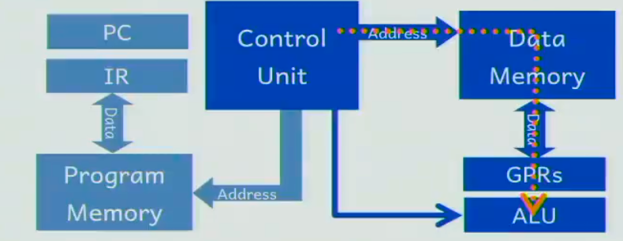

Here is how these are built with reference to memory:

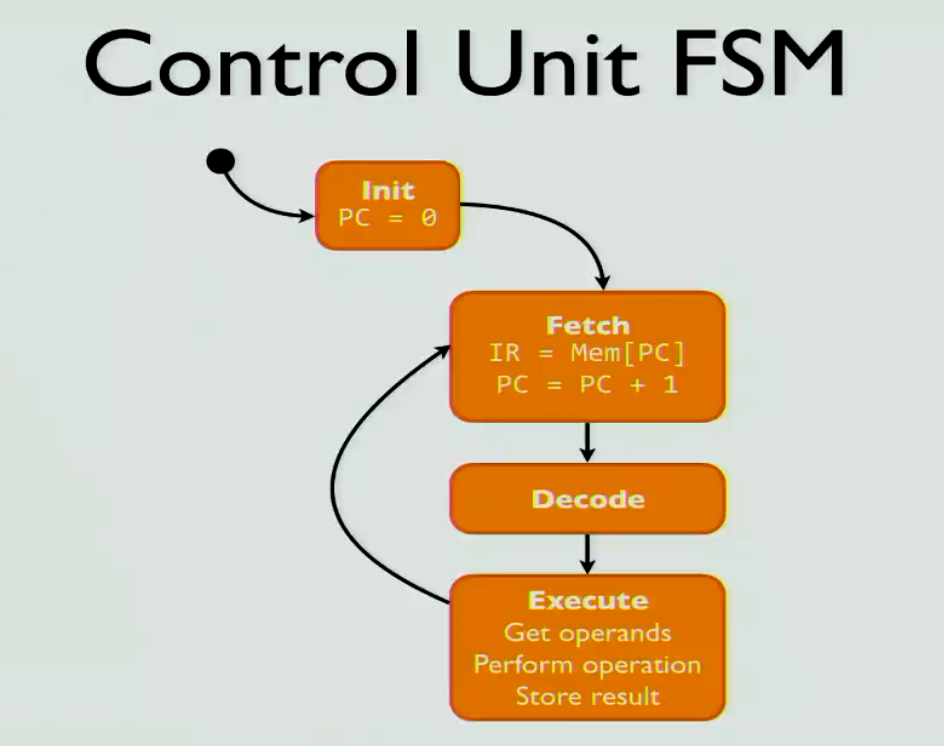

**Exam Question**

Question: If you were designing a control unit, state whether you would implement it as a Moore FSM or a Mealy FSM. Choose and justify why?

> Mealy FSM's depends on both the input and its current state, as appose to a Moores finite state machine because
> it the output only depends on the current state (and not on any input), this means that it is syncrhonus (as because
> the input is not changing the result, it will always be in sync with the clock signal transitions).

We can ask the CPU to do a number of different tricks and conditions. These are as follows:

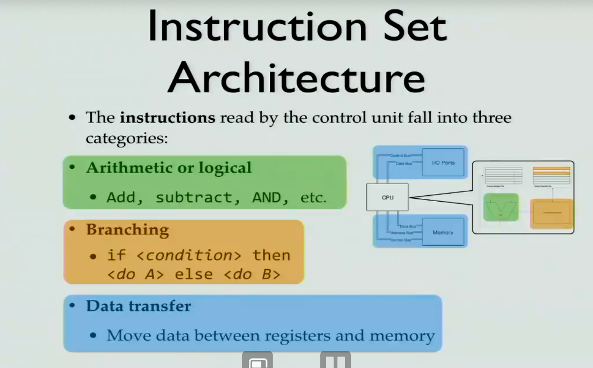

We can group these instructions into a set that is known as the _Instruction Set Architecture_

- These instructions read by the control unit into 3 categories:
- Complex instruction set computer (CISC)
  - Arithmetic / Logic instructions assess registers or memory
  - Instructions do not all complete in the same number of clock cycles
  - instructions do not have the same length
- Reduced Instruction set computer (RISC)
  - Arithmetic / logic only accesses registers
  - separate data transfer instructions
  - Design philosophy: instructions are simple, can be completed in the same time frame

##### The Stack and Function Calls

The stack is a region in memory that is used to record a program context.

It contains:

- function arguments
- local variables
- return variables
- copies of the contents of some of the general and special purpose registers, including PC.

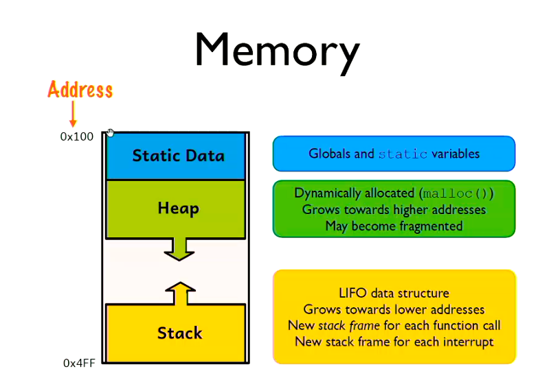

Here is an example of a conceptual idea of a stack frame:

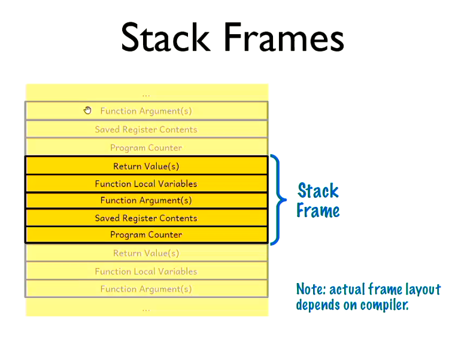

To leave a function, we need to record where we are in the stack. This is how we can call a function and then return to our original function.

##### Finite State Machines

| Intro                                                                                                                                                                                                                        | Stopwatch Example                             |
| ---------------------------------------------------------------------------------------------------------------------------------------------------------------------------------------------------------------------------- | --------------------------------------------- |
| Example Finite state are used for many things in computing, they are a system where particular inputs cause particular changes in states. An example of this is a stop watch with three distinct states, here is an example: | 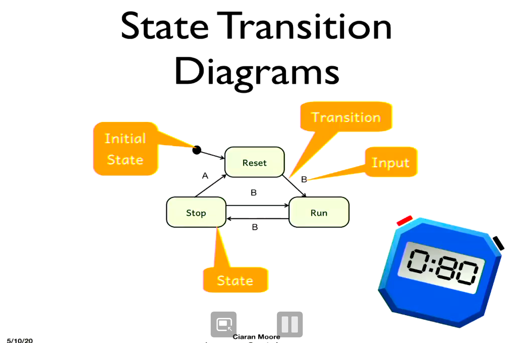 |

An example of a stopwatch in software is the following:

```c
switch(state) {
  case STATE_OFF:
    if (input == POWER_BUTTON) {
      ...
      state = STATE_ON;
    }
  case STATE_ON:
    if (input == START_BUTTON) {
      state = STATE_RECORDING;
    } else if (input == POWER_BUTTON) {
      state = STATE_OFF;
    }
}
```

This can be achieved via software, and is commonly seen in communication software such as phones.

We can also achieve a similar idea from hardware, here is some examples:

| Mealy Machine                        | Moore Machine                  |
| ------------------------------------ | ------------------------------ |
|        | 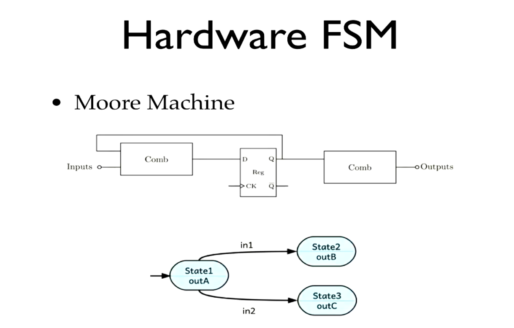 |
| Good because we have less flip flops | Good for asynchronous design    |

We will now go over how to design a finite state machine (`FSM`), in order to do this we must
do the following:

1. Determine inputs and outputs
2. Draw `FSM` state transition diagram
3. Choose a state encoding
4. Choose the implementation structure
5. Design the next-state and output logic

We must develop a solution to reach all states using boolean algebra (`NOT, AND, OR, XOR`) gates
in a physical machine.

We can simplify expressions from boolean logic tables to produce a simplified alternative expression.

Example; [rules used] to solve the following:

**Question:**

$$y = \not{a} \not{b} c + a \not{b} \not{c} + a \not{b} c + a b \not{c}$$

**Working:**

$$y = \not{a} \not{b} c + a \not{b} \not{c} + a \not{b} c + a b \not{c}$$
*[Commutative]*
$$y = \not{a} \not{b} c + a \not{b} c + a \not{b} \not{c} + a b \not{c}$$
*[Distributive]*
$$y = (\not{a} + a) \not{b} c + a \not{c} (\not{b} + b)$$
*[OrComplement]*
$$1 \dot \not{b} c + a \not{c} \dot 1$$ 
*[Commutative]*
$$\not{b} c + a \not{c}$$


## Embedded Systems

An Embedded System is a system that is made for a single purpose, it is unlike a
general purpose computer in the fact that it is not suppose to many things, they are
more simple and efficient at a single thing.

The labs will not be assessed, however will be important in preparing you for the lab test and the final exam, we will write our programs in modules to simplify code and keep certain ideas separate.

The stack frame is being held in Data Memory, and the registers hold the stack frame

When we want to call a function , we push the register holding our previous function in order to allow us to get back to it. We then push the new item to the stack to indicate that we are using it.

### Bit shifting and binary

$$ (1 << 4) | (1 << 2) = 0001 0100 = 0x14 = 20 $$

The above equation involes a bitshift by four and two respectively, and uses a bitwise `OR` to distinguish when to take the byte or when not to.

Bitwise operations in C

1. `~` is bitwise complement `NOT`
2. `|` is bitwise `OR`
3. `&` is bitwise `AND`
4. `^` is bitwise `XOR`
5. `<<` is bitwise left shift
6. '>>' is bitwise right shift

Examples of bitwise operations:

`NOT` > $~(0101) = 1010$

`OR` > $0101 \quad | \quad 1010 = 1111$

`AND` > $0101 \quad \& \quad  1010 = 0000$

`SHIFT` > $0001 \quad << \quad 2 = 0100$

`XOR` > `0101 ^ 1011 = 1110`

### Timing and flashing LED's

Frequency $f = \frac{cycles}{second}$

Period $T = \frac{1}{f}$

**Delaying with a loop**

In C code, this will add a delay to a LED that is turning on and off. With the following method, the delay_ms function will hog the CPU by remaining idle while the delay is on (nothing can be calculated in this time), Another problem with this method is that it will result in a delay that is > 500 ms.

```c
int main(void)
{
  system_init();

  DDRC != (1 << 2);

  while (1) {
  PORTC ^= (1 << 2);

  delay_ms(500);
  }
  return 0;
}
```

Here is a better method of using timers, we can use the TCNT1 timer unit on our micro-controller. The following is an example in C:

```c
void timer_delay (uint16_t ticks)
{
  TCNT1 = 0;

  // This timer will automatically tick until we want it to break out.
  while (TCNT1 < ticks) {
    continue;
  }
}
```

Another delay function (the one we want to implement) is to be used as the following in C:

```c
void delay_ms (uint16_t delay)
{
  timer_delay(delay * (F_CPU / TIMER1_PRESCALE) / 1000);
}
```

### Multiplexing With Funkit

Because we have a light matrix of `5 x 7` lights, we can either use a single pin to be paired with a light. If we want to use multiple inputs and outputs per pins, we must use multiplexing (_with regards to funkit we have 35 output lights and 23 PIO pins_)

A multiplexer is a switching circuit that provides a path from many inputs to select a single output. These can be constructed with `AND/OR` gates. With `N` bits, we can choose between $2^N$ inputs.

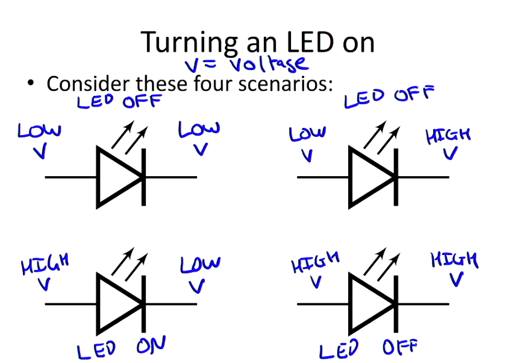

The above sheet shows us how the voltages define whether the LED is on or off.

On the funkit to turn on an `LED`, we must turn the `ROW` and `COLUMN` to be on low voltage in order to turn the `LED` on. This is for the reasons below.

We can use `MOSFET's` to turn on multiple lights at a single time. This is displayed below.

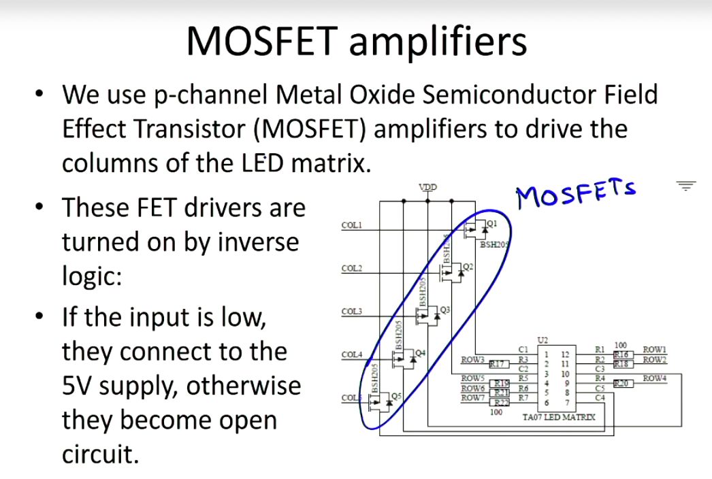

**Setting LED's to be initially off in C**

```c
#include "pio.h"
#include "system.h"

int main(void)
{
  // We must do the following for the entire matrix of LED's
  pio_config_set(LETMAT_ROW1_PIO, PIO_OUTPUT_HIGH);
}
```

We can use two states that are changing at a high frequency to give the appearance of an LED being on the entire time, here is an example below to make it appear like we have the 3 corners displaying at the same time.

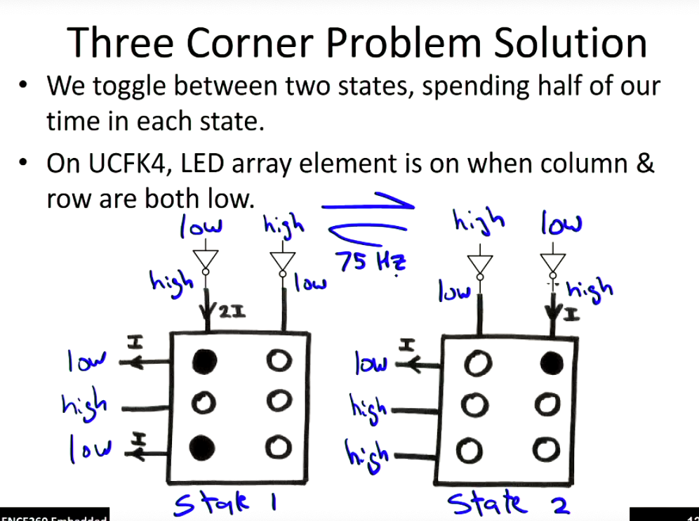

This is an example of using a `MUSFET` to display two states at one time

##### Methods of implementing

**Round Robin Scheduler**

We do things in sequence, this tends to be implemented with a loop and is done in order.

- easy to implement
- Response times are the same for every task
- Good for background tasks

- In most applications not all tasks will have the same priority
- If a task takes too long it will be hogging the CPU

**Paced Loops**

A paced loop allows us to synchronise tasks, however, it blocks the CPU while it is waiting.

This ensures that the tasks are being done at a specific frequency.

```c
void pacer_wait(void)
{
  while (TCNT1 < pacer_period) {
    continue;
  }
  // Reset the counter
  TCNT1 = 0;
}
```

**Periodic Scheduler**

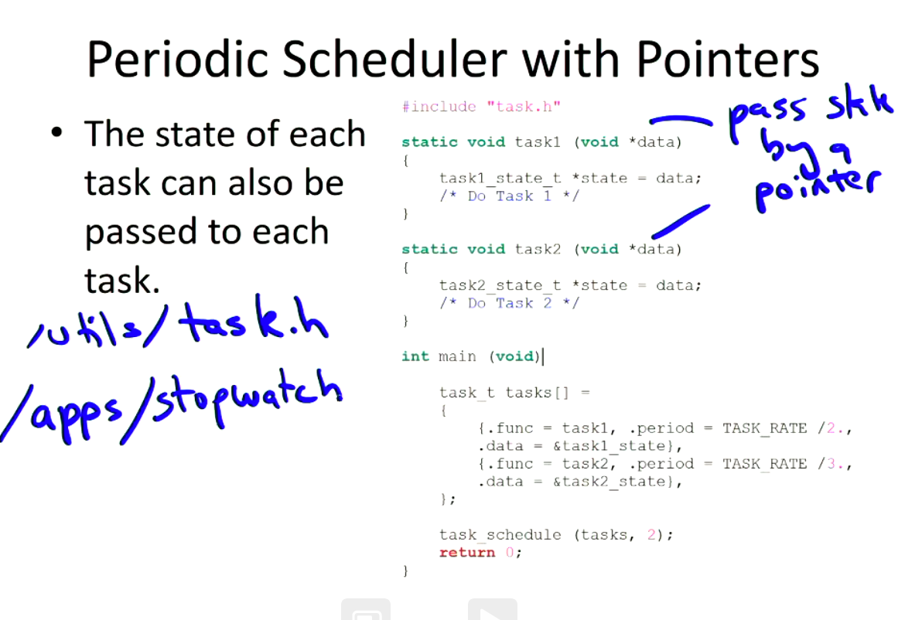

### Tutorial 2

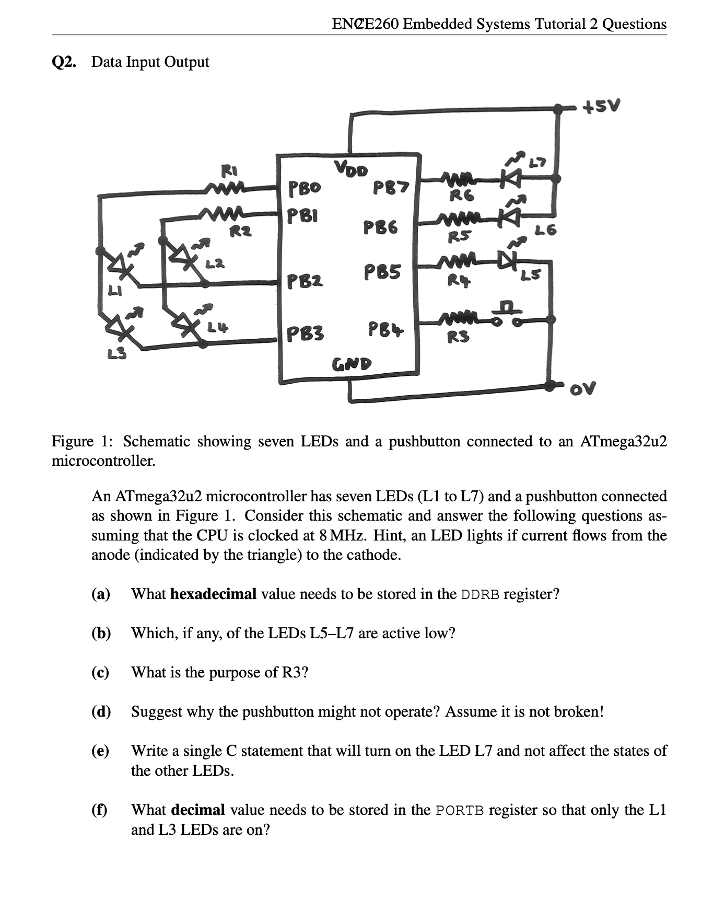

>

>

>

>

>

>

**Question 3**

Consider the LED flashing program:

```c
#include "pio.h"

void tempo(uint16_t bravo)
{
  while(TCNT1 < bravo) {
    continue;
  } TCNT1 = 0;
}

void flasher(uint16_t huey, uint16_t dewey, uint16_t louie)
{
  TCCRIB = 0x05;
  TCNT1 = 0;

  while (louie--) {
    pio_output_high(LED1);
    tempo(huey);
    pio_output_low(LED1);
    tempo(dewey - louie);
  }
}

int main(void)
{
  system_init();
  pio_config_set(LED1, PIO_OUTPUT_LOW);
  flasher(10, 400, 10);

  return 0;
}
```

A. How many times will the LED flash?

>

B. Magic numbers are used in Listing 1. Add appropriate lines of code and rewrite others to show how magic numbers are removed from this program

>

C. Neglecting the time it takes to call `pio_output_low` and `pio_output_high` determine the duty cycle of the `LED`

>

D. State one advantage for using data abstraction functions in `pio.h` for `IO operations`

>

#### Communicating between two fun kits

- Bit polarity: does a high or low indicate 1 or 0
- Bit order: do we send the `MSB` or `LSB` first
- Message encoding: `ASCII` or `Unicode`
- Bit synchronisation: when does each bit start

**Simplex system**

- data can only be sent in one direction

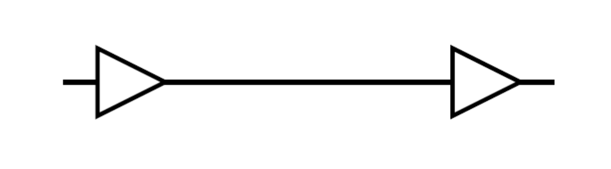

**Full Duplex**

- Data can be sent both directions at the same time (there may only be a single line).

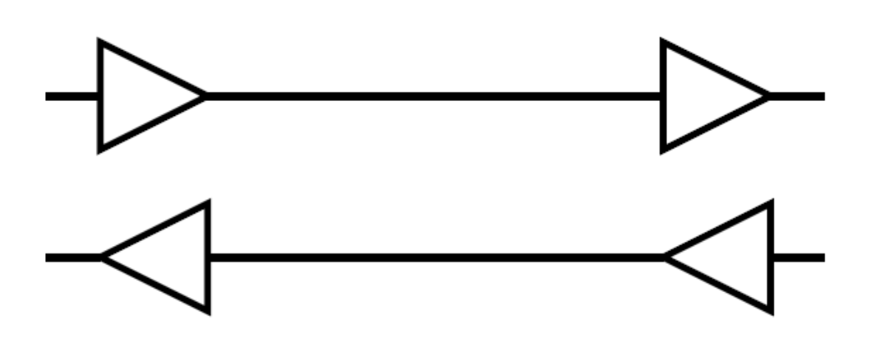

**Half Duplex**

- Data can be sent in both directions, but only in a single direction at a time.
- Only one person can talk at a single time.


**UART**

- UniversalAsynchronousReceiver/Transmitter
- Most commonly used form of serial communications (ie bit by bit) for micro controllers.
- One wire per direction (plus common ground).
- Asynchronous (TX and Rx need to use preset clock frequencies)

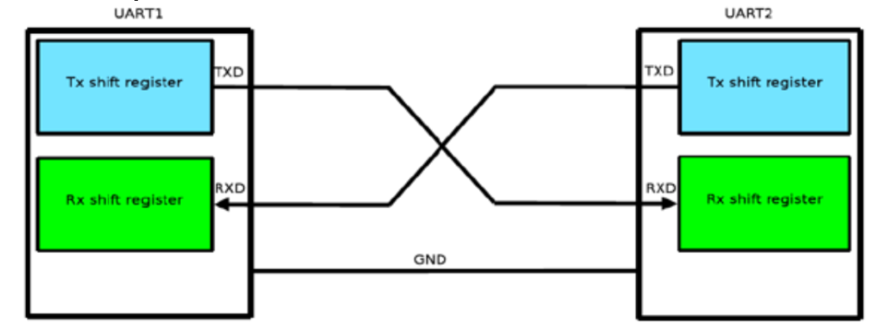

Above is an example of a `Full Duplex` system, as we can send and receive at the same time.

**Baud Rate**

- Since transmission is serial, the transmission speed is given in the maximum number of bits per second.
- Known as the Baud rate (max number of bit transitions per second).
- We need a start bit to indicate the start of the frame (also synchronises the receiver).
- We need stop bit(s) to indicate the end of the frame.
- We may also use a parity bit for error checking.
  - we need to have either an even or an odd number of 1's.

```c
// Receive a character from USART, blocks until char is received
int8_t usart1_getc(void)
{
  while(UCSR1A & (1 << RXC1 == 0)) continue;
  return UDR1;
}
```

```c
// transmit a character from USART blocks until the char can be sent
void usart1_putc(char ch)
{
  while(UCSR1A & (1 << UDRE1) == 0) continue;
  UDRT = ch;
}
```

##### Timers

These are extremely useful, to the point where pretty much all micro-controller's include
timers at this point in time.

On our micro controller, we have one 8-bit timer and another 16-bit timer, we can use
`separate prescaler's` and `Compare` mode (using two 8-bit `PWM channels`) the 16 bit timer
is a bit more fancy.

Example exam questions on `PWM Timers` can be found at [27:00](https://echo360.org.au/lesson/G_daf26e6b-127d-485c-ad13-eb692901ba33_3b73f99b-e9c9-4c73-a092-60087273ce90_2020-09-28T11:00:00.000_2020-09-28T11:55:00.000/classroom#sortDirection=desc)

---

#### C Compiler and Tool Chains

The **Preprocessor** rads the C source file, the header files and they expand `Macros`.

| GCC                                                                                                                                            | Toolchain                                 |
| ---------------------------------------------------------------------------------------------------------------------------------------------- | ----------------------------------------- |
| We use the `GCC` compiler (made by `GNU`), this is the C compiler that is used on most Unix operating systems _despite the name GNU Not Unix_. | 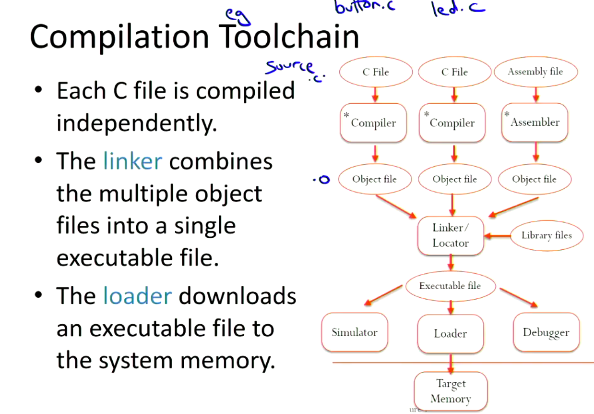 |

Makefile syntax

```make
# this is to build the `main.o` object file
main.o: depend1.h depend2.h depend3.h
  $(CC) -c $(CFLAGS) $< -o $@
```

The above shows a file to build, the dependency files that are used to build it, then the compiler
will build the `game.out` and create the `exe` file.

#### Git (info I don't know)

**Dealing with conflicts in Git**

When both users have the same lines, we need to manually change the values. (use git fugitive binds)
We can use `<Leader>gs` to get git status, then use `dv` on the conflict file to open the differences
in views, this will allow us to see one commit from each person, conflicts/changes will show in green
and red on both sides.

### Final Exam (Information)

**Format**

- two questions on computer architecture, two on Embedded systems
  - All of these are weighted evenly (25%)
- UC calculators are allowed
- grade of < 45% is considered a fail of the course.
    - Formal evaluation: ($TestPercent \times 0.2 + FinalPercent \times 0.5) \div 0.7 >= 45$

$$66.7 \times 0.2 + final \times 0.5) \div 0.7 > 45 where final >= 36.32$$

| Embedded systems content                    | Architecture content                |
|---------------------------------------------|-------------------------------------|
| 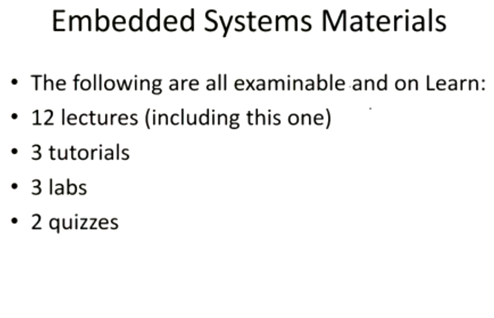         | 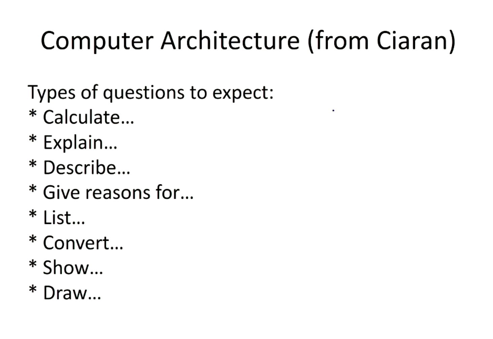 |
| <center> No cheat sheet available </center> | 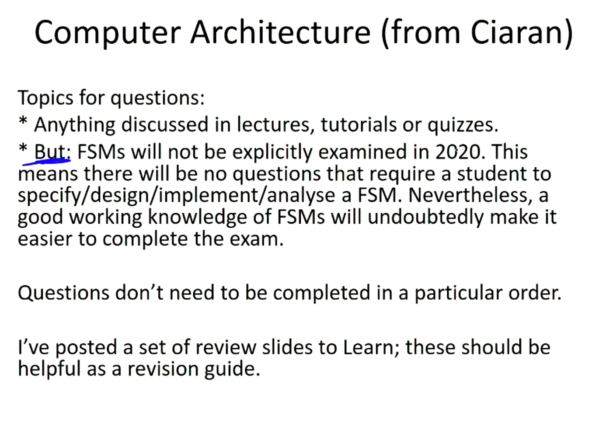 |

### Exam Study Question Answers

**2019 Exam (Question 1)**

If we have a selection of three options, and we are allowed to chose two of them, we use exponents
in order to find the number of permutations `M`, $M = Num_Selections^{N_Choices}$

If we need to have `100` different options, what is the minimum number of choices to create unique
codes for all `100` people? 

> We can find this out by finding the lowest exponent > 100 ($2^7$)

To preform 2 compliment on a number from decimal we do the following: Input `-41`, use 12-bit representation.

Convert number to binary 

> 41 : 000000101001 (12-bit as question specifies)

Next flip bits to get `1's Complement`

> 41 : 111111010110

Then finally add `1` to get `2's complement`

> Result: 111111010111 == -41

If we want to convert `Hexidecimal to Decimal` we can achieve this by using the following method:

Take `0x0AB` as an example, we know that `A` = 10, and `B` = 11, then multiply these by $16^{index}$

$$ 10 \times 16^1 + 11 \times 16^0 = 171_{10}$$ 

