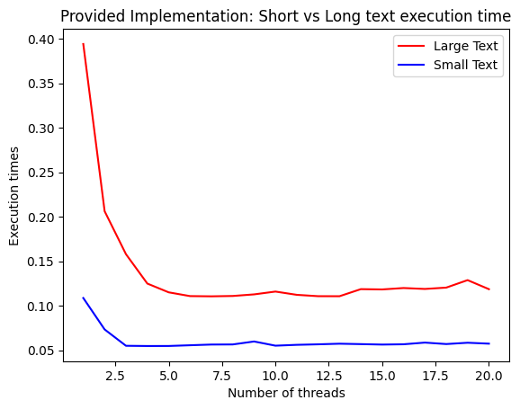

# ENCE360 Assignment: Multi-threaded HTTP downloader

Author: Jordan Pyott \
Student ID: 87433186

### Algorithm analysis

The algorithm found in the main routine of the `downloader.c` file (lines 175 and onwards) initially takes in a URL, the number of worker threads and an output directory as parameters to the program.

The program then creates a new directory with the name provided as an argument, the program then opens a file, spawns working threads and allocates memory to each worker.

From here the program starts its main event loop, this will run as long as we keep receiving a new line that has a successful code, then it will return the size of the line including a delimiter character but this returned size does not include a null terminator character. Upon receiving an end-of-file, the `getline()` function will return `-1` and break out of the loop.

While the event loop is running and a line is successfully received, if the last char of the received line is a newline character, we will set this character to the null terminator. The algorithm will then iterate a counter to indicate to the queue that we want to alert the next worker, we then place the process of getting the line into the concurrent queue for processing by using the `queue_put()` function. If the queue is full (we have more work then the number of workers allocated), the counter is de-incremented and the first task in the concurrent queue is processed and then the worker is waited. After the main event loop is terminated (there are no more lines in the file), their may still be some data left in the concurrent queue. There is then another secondary loop started, to check that if their is any work left (the counter is greater than 0), then process the task and wait the worker.

The final stages of the main routine is to free excess memory and workers and close the open file, finally the process terminates and the program has concluded.

### Performance Improvements

TODO: Write up performance improvements

### Performance analysis

Below is a comparison of the provided binary vs the assessment implementation were taken using the Lab computers and run a large download test and a small download test *(test files are included in `./report`)*. These were done using the provided script (`./analysis.py`) to run each test-case three times and take the average across a range of threads $T = \{1 < t < 20\}$, where $T$ is the set containing of test cases where $t$ is the number of threads used in that test case. The results can be seen in the figures below:

| Assessment Implementation | Provided Implementation |
| ------------------------- | ----------------------- |
|  |  |

As we can see from the figures above, both the `provided implementation` and the `assessment implementation` have an exponential fall off of execution times that appears to approaches an asymptote where the number of threads is no longer having a positive impact on speeding up the download times.

The figures from the `provided implementation` and the `assessment implementation` have almost identical curves, we see slightly more variation in the provided implementation, however it is important to note that these results are subject to change due to a number of factors, including connection speed and reliability, the available resources of the machine in use at the current time and the computers specifications, and this is likely to be the cause of slightly different run times.

#### Finding the optimal number of threads

From the figures shown earlier it appears that the optimal number of threads before large falloff is between 3-4 threads. This is due to the fact that between 3-4 threads the gradient of the above graph is approaching $45$ degrees, meaning that in this range of threads, we are getting the maximum ratio of benefit for the least resources used, this could have something to do with the number of available cores the lab machines CPU's have,as a machine running in perfect conditions (meaning no external processes running) would have an optimum (non-blocking) thread count when the number of threads used is the same as the number of cores on the CPU, as our data seems to indicate that around 3-4 threads is where our optimum point appears to lie, this could be a contributing factor in our findings as the lab computers are quad core computers.

It is important to note that while this may be the case from our data, this will not be the case on other machines. This is because different machines will have different number of CPU cores available. If the given CPU has more cores than than the lab computers, it is likely that its optimum thread count will be higher then that given by our data.
