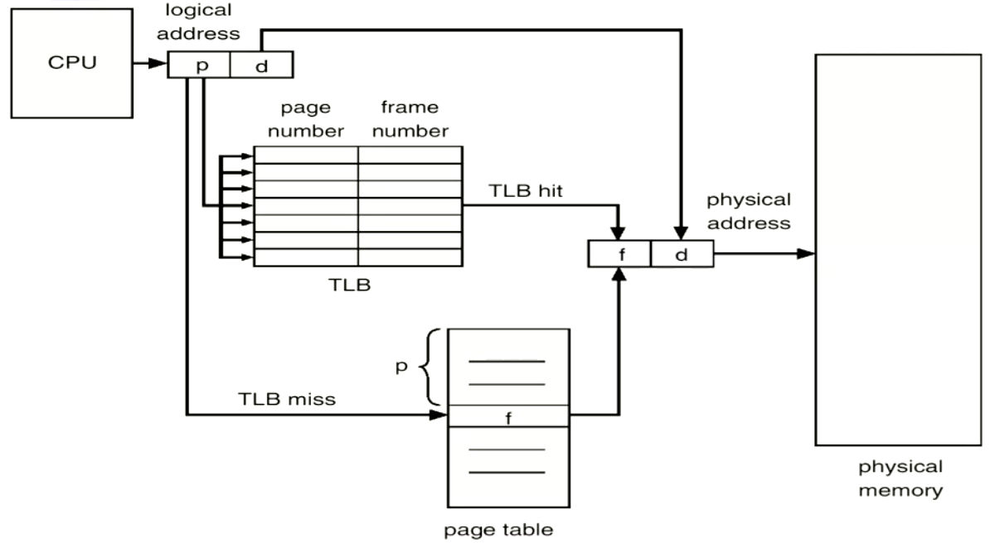

```{=tex}
\newpage
```
# Operating Systems

These notes are designed to be used in conjunction with the slide sets provided in the course, the slides will be more helpful for use in the labs *due to including code examples*, these notes will provide a good outline for studying for the final exam.

### Key

`THIS IS MY QUESTIONS?`

> NOTE: is a note to self

This is ordinary notes

> NOTE: remember to go over all questions outlined in the lectures that are \
> posed as similar to exam questions

## Topics

Lectures 1-8: Multiprocessing

## Course Information

The course covers core topics.

-   Introduction to operating systems
-   Processes and Threads
-   Pipes
-   Sockets
-   Deadlocks
-   Files and Directories
-   Input/output
-   Memory management - Caches
-   Memory management - Virtual memory
-   Virtualisation

**Grade structure**

Standard Computer science policy applies

-   Average 50% over all assessment items
-   Average at least 45% on all invigilated assessment items

Grading structure for course

-   Lab Test (20%)
-   Assignment (20%)
-   Lab quizzes (10%)
    -   Weekly Quiz Assessments
-   Final Exam (50%)
    -   Closed book and no calculator
    -   Cheat sheet Double sided A4

### Textbooks / Resources

-   Modern Operating systems - Andrew Tanenbaum
-   Xv6 - Online shorter method, lots of examples

> For information on these resources see the first lecture slides

## Readings

## Lectures

### Lecture One - Introduction to Operating Systems

**The beginning of computing**

-   Called the Analytical engine
-   Charles Babbage 1972-1871
-   Digital, programmable, *Turing complete*
-   Punch card IO
-   Unable to be engineered
-   Would be very slow
-   Ada Lovelace - worlds first programmer

**1st Generation computers**

In 1945 we moved on to hard-wired machines. These were just a plugged set of wires.

**2nd Generation computers**

Operating systems started to appear when systems were designed to be programmable, this came with programmed batch systems, they operated with one job at a time and had storage, this is the initial life of an operating system.

**3rd Generation computers**

-   Multiprogramming
    -   the ability to run multiple jobs at once
-   First real operating systems
    -   MULTICS/Unix/Linux, VMS and others

This bought the first initial need for security and segregation between users on the same machine.

**4th Generation computers**

This is the first view of **personal computers**, bringing the `BASIC` interpreter using Machine code, complexity hidden from the user, one program could be held in memory.

Usually had \~8 kb of memory to run the entire operating system.

Eventually got a GUI, use of mouse and the initial real world of what we call computers, could also store multiple applications in memory at once.

Then finally, we have modern day computers

-   Personal
-   Multiple applications at once
-   Modern OS, *(Linux, MacOS and Windows)*

**5th Generation computers**

Wearable devices, quantum computing and further AI development, we are not there yet!

**What is in a computer?**

-   CPU
-   Memory
-   Video Controller
-   Keyboard Controller
-   Optical disk controller
-   Hard disk controller

This is even a simplistic model, a computer really looks like this:

![Computer Model]

It is extremely difficult to have to write to all sectors of this without knowing its exact structure and expected input. This means that we need some interface to handle this for us. Hence, **operating systems**.

**Storage hierarchy**

![Storage hierarchy]

In order for the operating system to work, it needs to have some method of handling storage, and knowing where we are allowed to write to, and have some method of creating an interface or abstraction to solve writing issues.

**What is the main purpose of an operating system?**

-   Virtualization (sharing users)
    -   Time (CPU)
    -   Space (memory)
-   Concurrency
-   Persistence (I/O)
-   Protection
-   Hides complex details
-   Protects the machine from malicious code

**Core OS concepts**

These will be expanded throughout the lectures

-   Processes
-   System calls and kernel mode
-   Address spaces
-   Files and IO
-   The shell

**Typical process model**

-   Processes are normal, sequencial code
-   The schedular decides what runs and when
-   Alternative cooperative models exists

**OS API: System calls**

![System Calls]

These really work because the user has no direct access to the low level routines

-   OS runs in kernel mode with higher privileges
-   User mode system calls execute TRAP instructions
-   Hardware looks up the **Trap table** to find address

**Address spaces**

Modern operating systems have **Virtual Memory**

-   Multiple programs in memory at once
-   Idle memory can be paged and swapped to disk
-   Give an illusion of unlimited memory (*at a price*)

**Sample exam question**

Which of the following is NOT an operating system?

-   Linux
-   Windows
-   Android - NOT
    -   Is using Linux kernel
-   ROS - NOT
    -   Is using Linux kernel
    -   Is a set of libraries to use with an OS to make system calls
-   MacOS
-   DOS
-   iOS
-   Arduino - NOT
    -   Is a package

### Lecture Two - Processes and Threads (2.1, 2.2)

> NOTE: See lecture slides in order to find code examples of using threads and processes

#### Processes

**Program counter**

One program counter for each process, this allows us to keep processes independent and sequencial, this is the foundation of **multiprogramming**, the timer will interrupt a process and switch when its allocated time frame is done.

This is an example of **Pseudo parallelism**

![Process switching - Interruption]

*This is building up the stack*

**What is the stack?**

The stack is going to hold the context of what I am doing, it is a LIFO representation of all the local variables, function calls and procedure calls.

> This will be talked about further later

**Process Creation and Termination - Linux**

**Creation**

1.  System initialization
2.  Process creation system call
3.  User request to create a new process (shell)
4.  Initiation of a batch job

**Termination**

1.  Normal exit *voluntary*
2.  Error exit *voluntary*
3.  Fatal error *involuntary*
4.  Killed by another process *Involuntary*

**Linux Process Hierarchy**

-   Linux processes are a tree like structure of daemons and foreground processes
-   All processes belong to a parent *except the init process*
    -   Process group receives all signals from the creator
-   Running a program starts a new process
-   Windows has no concept of process hierarchy
    -   Process is independent of its creator
-   Each process has a process table
    -   we will need to save this table in order to store state of a specific process
    -   These are called process control blocks (PCB's)

![Create Process]

In the above block of code, the `fork()` function is being called to create our process. We then can see our process ID and the process is now a *clone of its parent* at the point of creation.

**The wait() function**

-   We can use wait in order to wait for any process to be stopped, we can also use `waitpid()` in order to check if a single process has stopped, this can be useful to detect crashes and log exits.

**The exec() function**

We can use the `exec()` to run a new process as a child of the current process.

This is extremely useful for re-directing output, for logging, helpful output and more versatile output to play with.

**Process summary**

-   A process is an independent resource group running a single program
-   Unix: all processes are created and owned by a parent
-   Forking a new process creates a clone of the parent *including the same program counter*
-   Exec\*(file...) replaces the current program context with the new program file contents
    -   Operations such as redirecting and piping output can be run before the program loads
-   The code in a process runs sequentially
    -   or, does it???

**Why concurrent applications?**

-   Allows parallelism of independent operations in a single program *that share common data*
-   Example: word processor (basic):
    -   Task 1: respond to user input (updating model)
    -   Task 2: reformat document when model changes
    -   Task 3: save periodically to disk
    -   Task 4: spell check

Concurrent applications will allow us to treat these as all independent tasks, treating these as processes will run into issues as they do not know when other processes have completed tasks this means we will have to use signals every time that we want to achieve something that requires information from another process. *we can do this, and will, but not today*.

We can use a **finite state machine**

![DIY Concurrency]

Instead of doing this with a finite state machine, we can use **Threads**

#### Threads

Threads have there own thread table, this is called a process data space, multiple threads can access the same process data space.

-   Threads have access to process data space
    -   but not direct access to each other
-   The thread is not a clone, it runs a callback function
-   Waits for completion
-   The order on the stack can vary as each thread has its own stack

![Threads vs Processes - code example]

**POSIX threads API**

-   Standard runtime library calls for managing threads:
    -   `pthread_create`
        -   creates a thread to execute a specified function
    -   `pthread_exit`
        -   Causes the calling thread to terminate without the whole process terminating
    -   `pthread_kill`
        -   sends a *kill* signal to a specified thread.
    -   `pthread_join`
        -   Causes the calling thread to wait for the specified thread to exit. Similar to `waitpid()` for processes
        -   Waits for the child thread to finish
        -   Generated by `pthread_join()` from `pthread_exit()` after the thread has exited
        -   Need to be vary careful about how you return values from a thread
        -   We need to return to the heap not the stack in order to make it global, note this will need to be freed
    -   `pthread_self`
        -   Returns the callers identity *The thread ID*
    -   `pthread_yeild`
        -   Yields the CPU to another thread
    -   There are many more calls available in the **man pages**

**Threads vs Processes**

-   Access to the same data makes communication easy
-   Very fast to create, can be fast to switch
-   Possible performance gains from switching withing a possible process
-   Can be spread across CPU's for further parallelisation
-   Difficult to write and debug the code
    -   Ordering issues
    -   Data access issues

**How are threads and processes implemented?**

-   Threads and processes can be implemented both at the User level and in the kernel.
    -   Threads and processes in the kernel are not run by the scheduler, nor handled in the user space

![User-level vs Kernal implementation]

### Lecture Three - Processes and Threads (2.3, 2.4, 2.5)

**Critical Regions**

-   Mechanism to provide "mutual exclusion" of critical regions
-   No two processes in critical region at the same time
-   No assumptions about CPU's

**Mutual Exclusion**

Four conditions to provide workable mutual exclusion:

-   No two processes simaltainously in critical region
-   No assumptions made about speeds or numbers of CPU's
-   No process running outside its critical region may block another process
-   No process must wait forever to enter its critical region

Non-solutions, these violate the above conditions

1.  Bocking process disables interrupts on CPU
2.  Lock variable, updated just before entering the critical region
3.  *strict alternation* (*lecture slide 6*)

-   Loops on block
-   What happens if one process is much slower than the other, or halts?
    -   Which condition is violated?

4.  *Peterson's solution*

-   Each process hands off the "turn" to the other process
-   Blocking occurs in the critical region only
-   Still "busy waiting" - prone to CPU "priority inversion problem"
-   Some systems reorder memory access
    -   Simpler solutions exist in hardware, this system is sometimes built into the CPU

**Block on wait - mutual exclusion**

-   Sends signals between process to wakeup the other process, we then sleep our own process
    -   Uses a counter, when it reaches 0, it sleeps itself and parses a signal to the other process
-   What happens when a wakeup signal is sent to a process that isn't asleep?
    -   This is because we are assuming that this is an atomic operation, however it is not,

**Semaphores - An actual used solution to solve mutual exclusion**

**Atomic** operations to raise or lower their value

> NOTE: fix this up from the slides

Implementation:

-   Setting lock by decrementing semaphore
-   Releases by incrementing semaphore

**POSIX thread implementation**

-   Mutex atomically locks/unlocks
    -   Uses for access to critical region

  Operation                     POSIX Threads
  ----------------------------- ----------------------------
  Create condition variable     `pthread_cond_init()`
  Destroy condition variable    `pthread_cond_destroy()`
  Block waiting for signal      `pthread_cond_wait()`
  signal and wake one thread    `pthread_cond_signal()`
  signal and wake all threads   `pthread_cond_broadcast()`

> NOTE: add code example from lecture slides

This is a good solution, however it falls apart when we are using Distributed CPU's, the solution to this is using **message passing**.

We can also use **Barriers** in order to solve synchronisation problems, this is the use of signals to wait for multiple threads to complete before we can continue executing on a particular thread.

**Readers and Writers**

-   Multiple readers can access the area at the same time
-   Writers require exclusive access
    -   All readers need to exit before the writer can gain the lock
    -   New readers may arrive while writer is waiting

> Is there a better solution to make this system more fair for the writer using Semaphores or Mutex's

### Lecture Four - Deadlocks, Starvation and Thread Patterns

We use semaphores such as `mutex`, in order to prevent deadlocks and starvation.

**How to make single-threaded code into multi-threaded code**

This is reasonably difficult to do, here are some of the issues:

-   Local variables are fine; global variables may need to be thread specific
    -   Some languages implement *thread_local* declarations (C++)
-   Libraries called may not be thread-safe
    -   Who consumes signals?
    -   Memory access needs to be atomic
    -   Can be solved via mutual exclusion libraries (locking)
    -   If they are thread safe, this will be outlined in the man pages
-   Kernel processes may not be thread-aware (stacks)

#### Thread Patterns

**Dispatcher/worker thread pattern**

-   Dispatcher thread handles incoming requests and farms out to pool of worker threads
-   Workers get woken to perform their task
-   Example of this layout is a Web Server

**Team/pool**

-   All team members are equal:
    -   wait for incoming requests and grab one to process
-   Managed pool: threads in pool created and destroyed by library
-   Can be specialised too (running different code)
    -   place inappropriate requests into an internal queue (to redirct to other threads)

**Pipeline**

-   Chain of consumer/producers
    -   Each thread consumes a request and produces a new one for the next thread
    -   Specialised threads designed to minimise latency

**pop-up threads**

-   Thread created when needed to handle new request
    -   starts a fresh thread, this is faster than context switching in threads

### Lecture Five - Signals and Pipes

#### Signals

Signals are a simple route of communication, that is primarily for exception handling, but there are also signals for other things

-   Fixed set of signals (Unix):
    -   `SIGINT`: The process is being interrupted; terminates quietly
    -   `SIGQUIT`: Forces the process to end and core dump
    -   `SIGILL`: FIXME - fill here
    -   `SIGSTOP`: which stops the process from executing (*This cannot be stopped*)
    -   `SIGKILL`: which kills the process (*This cannot be stopped*)

Signals are implemented in hardware (division by zero), handled by the OS, (file size limit exceeded), and is primarily handled by the user (via keystrokes)

Other processes such as a child process notifying its parent that it has terminated (`SIGCHLD`), or sending a signal.

-   Signal numbers range from {0, ..., 31}

    -   We will refer to these signals by name rather than reference code

-   uses `PID`: process or processes to receive a signal

-   if `pid = -1`: all processes user has permission over

    -   Elevated user (*such as sudo or root privileges*)
    -   All processes with same user ID

-   if `pid < -1`: All processes in *process group*

Multiple types of signals can be handled from one signal handler, `SIGCHLD` signal is sent to a parent process when one of it's child processes terminates.

Signal Overview:

-   They do not carry information
-   Participating processes must know each others `pid's`

#### Pipes

A pipe is nothing more than a byte stream.

Pipes allows one process to pass information to another process via a `pseudofile`

-   One-way queues that the OS kernel maintains in memory

-   Guaranteed to provide FIFO delivery of information

-   Two types: [futher info found here]

    -   Unnamed pipes
        -   Can only be used between two related processes *child/parent, child/child*
    -   Named pipes
        -   Once a named pipe is created, processes can `open(),` `read()` and `write()` them just like any other file. Unless you specify `O_NONBLOCK,` or `O_NDELAY,` on the open: opens for reading will block until a process opens if for writing.

-   Pipe properties:

    -   synchronised byte stream
    -   Operated as a bounded buffer with blocking
    -   Each pipe is one-way stream
    -   one to one mapping
    -   No way to test a pipe for data

**Code Example of an unnamed pipe**

``` c
#include <stdio.h>
#define READ 0
/* The index of the “read” end of the pipe */
#define WRITE 1
/* The index of the “write” end of the pipe */
char * phrase = “Stuff this in your pipe and smoke it”;

main ()
{
  int fd[2], bytesRead;
  char message [100]; /* parent processes message buffer */
  pipe ( fd ); /* Create an unnamed pipe */
  if ( fork ( ) == 0 ) /* Child Writer */
  {
    close (fd[READ]); /* Close unused end*/
    write (fd[WRITE], phrase, strlen ( phrase) +1); /* include NULL*/
    close (fd[WRITE]); /* Close used end*/
  }
  else
  {
    /* Parent Reader */
    close (fd[WRITE]); /* Close unused end*/ bytesRead = read ( fd[READ], message, 100);
    printf ( “Read %d bytes: %s\n”, bytesRead, message);
    close ( fd[READ]); /* Close used end */
  }
}
```

**Code Example of an named pipe**

``` c
/* Writer */

#include <stdio.h>
#include <sys/types.h>
#include <sys/stat.h>
#include <fcntl.h>
char * phrase = “Stuff this in your pipe and smoke it”;
int main () {
  int fd1; fd1 = open ( “mypipe”, O_WRONLY ); write (fd1, phrase, strlen ( phrase)+1 ); close (fd1);
}

/* Reader */

#include <stdio.h>
#include <sys/types.h>
#include <sys/stat.h>
#include <fcntl.h>
int main ()
{
  int fd1;
  char buf [100];
  fd1 = open ( “mypipe”, O_RDONLY ); read ( fd1, buf, 100 ); printf ( “%s\n”, buf ); close (fd1);
}
```

We can use `popen()` and `pclose()` macro functions in order to create a pipe, fork the child process and invokes the child in the shell and runs command (visit the man pages for more information).

Named pipes in the shell are created by the `mknod(), mkfifo()` commands/functions, can be accessed with name permissions.

Opening and closing using the standard `fopen/fclose`, each pipe is used as a buffer.

### Lecture Six - Sockets

  Stream Sockets          Datagram Sockets
  ----------------------- ---------------------------
  TCP                     UDP
  reliable delivery       unreliable delivery
  In-order guaranteed     no order guarantees
  connection-orientated   no notion of a connection
  bidirectional           can send or receive

![Phone Example: socket streams]

![Datagram Example: socket streams]

> Note this will not be locked at further, we will focus mostly on Socket streams (TCP)

**Networking basics**

-   Application layer
    -   Standard applications
    -   User applications
-   Transport layer - we will be looking at this more in-depth
    -   TCP
        -   Connection orientated
        -   Provides a reliable flow of data between systems
    -   UDP
        -   Clock server
        -   Ping
    -   Programming interface
        -   Sockets
-   Network layer
    -   IP
-   Link layer
    -   Device drivers

Webb protocols and services

-   All resources are identified by a URL, the URL has four parts
    -   Protocol
    -   Host
    -   Port
    -   Resources
-   Applications can refer to destination by name rather than IP
-   Within the communication domain sockets are referred to by address

![Sockets and ports]

**Establishing a connection**

1.  Client sends a request to the server by hostname and port number
2.  Server accepts the connection, creating a new socket bond to a different port

-   Common to service the actual connection in a separate thread/process

3.  The original server port is again ready to listen for other connection requests

-   We use Big Endian with networking byte order

![Socket descriptor and data structure]

![][1]

![Client, Server model]

> Next week we will delve into the code for this part of the course

### Lecture Seven - Socket Coding

![Simple socket client]

![Simple socket server]

> This lecture just goes over the code seen above and further examples, for further details on what this code does, consider visiting man pages or watch the lecture while implementing (this is reasonably familiar, however if I am battling to understand, refer to the lecture).

**Sockaddr**

Three different types of sockaddr:

-   Unix Domain sockets
-   Generic address
-   Internet domain sockets

### Lecture Eight - Scheduling

**Introduction to scheduling**

-   How to schedule a mixture of process behaviours?
-   How to best use resources?
-   What are we trying to optimise?
-   How are we going to make it fair?

**Systems and process types**

-   Nonpreemptive: Every job runs to completion
-   Preemptive: Jobs can be interrupted

**System types and scheduler requirements**

-   Batch
    -   No users waiting
    -   Nonpreemptive
-   Interactive
    -   User waiting
    -   User workstations/devices and *servers*
    -   Preemtion is essential
-   Real-time
    -   Dominated by periodic and need to meet deadline
    -   Process designed in advance to work together
    -   Can be nonpreemptive or preemptive depending on load

**Scheduling goals and policy**

All systems:

-   Fairness
-   Policy enforcement: seeing that stated policy is followed
-   Balance: Keeping all parts of system busy

Batch systems:

-   Throughput maximising
-   Turnaround time (minimise)
-   CPU utilization

Interactive systems:

-   Response time
-   Proportionality

Real-time systems:

-   Meeting deadlines
-   Predictability

**Scheduling in batch systems**

-   Requires knowledge of job lengths
-   Nonpreemptive
    -   Assumes some jobs arrive at the same time so can choose
-   Preemptive: shortest time to complete next
    -   Allows new short jobs to interrupt longer ones
-   Sometimes we use *First come first served (FCFS)* or *shortest job first (SJF)*

Incorporating I/O

-   Each CPU burst treated as a new job
-   Long job fills I/O

**Interactive Schedulers**

*Very complex*

Some solutions:

-   Round-robin scheduling *(simple solution)*
    -   Preemptive switch every $m$ seconds
    -   Assumes *equal importance*
    -   Can be dominated by process switching time
-   Priority scheduling with multiple queues
    -   Each queue only runs when higher empty
    -   Round robin scheduling of each level
    -   Lower queues can starve
        -   Answer: dynamic priority allocation
    -   Dynamic scheduling:
        -   New jobs start with highest priority
        -   Job using up its time slice downgraded
        -   Job *not* using time slice stays the same
        -   Essentially light tasks go to top, heavy CPU tasks go to bottom
        -   A better method is to replace rules two and three do downgrade based on how much CPU has been used *(# of slices)*, neutral strategic I/O
    -   Further tuning strategies
        -   Increase time period for lower priority jobs
        -   Calculate *ad hoc* priority based on past job times, weighted sum decaying over time $T = \frac{(T_0 + T_1)}{2}$
        -   User hints
        -   Scheduler parameters
-   Shortest process next
-   Guaranteed scheduling
-   Fair-share scheduling

**Schedule fairness**

-   Allocate CPU time per *user*, not per process
-   Track CPU usage and schedule accordingly
-   Lottery scheduling:
    -   Each user given $\frac{1}{n}$ tickets (priority adjusted)
    -   Distribute amongst processes
    -   Randomly select a ticket and schedule the owning process
    -   Can give tickets away
        -   e.g. client to server process

**Real-time scheduling**

![Real time scheduling]

-   Example: multimedia server
    -   Different periodicity (deadline) and processing time requirements
    -   How to schedule so deadlines always met?

**Rate monotonic scheduling**

-   Priority = 1/deadline frequency
-   Always runs highest priority process
-   strict conditions:
    -   Each process completes within period
    -   No inter-process dependencies

**Earlies deadline first**

-   Process with earlier deadline preempts the current process
    -   Relaxes the constant frequency requirement

> Note that RMS is load-dependent, EDF always works but we have to calculate deadlines (more complex)

**Policy vs Mechanism**

Separate what is allowed to be done with how it is done

-   A process knows which of its children threads are important and need priority
-   Scheduling algorithm parameterized
-   Parameters filled in by the user processes

### Lecture Nine: Deadlocks

**What is a deadlock?**

A set of processes is deadlocked if each process in the set is waiting for an event that only another process in the set can cause.

-   Usually the event is release of an exclusively held resource
-   None of the processes can:
    -   run
    -   release resources
    -   be awakened
-   **Resources:**
    -   Various sorts
        -   Physical devices: printers, tape drives
        -   Database/data structures: tables
        -   Locks (e.g. semaphores)
    -   Sequence of events: request, use, release
    -   Must wait if request is denied
    -   Two types:
        -   Preemptable, can be taken awar from a process with no ill effects
        -   Nonpreemptable: will cause the process to fail if taken away
-   **Four conditions for a deadlock:**
    -   Mutual exclusion condition: each resources assigned to one process.
    -   Hold and wait condition: process holding resources can request additional ones.
    -   No preemption condition: previously granted resources cannot be forcibly taken away.
    -   **Circular wait condition:** must be a circular chain of two or more processes, each is waiting for resources held by next member of the chain. *(this is the main condition)*
-   **Deadlock modeling**
    -   Modeled with directed graphs
        -   Resources `R` assigned to process `A`
        -   Process `B` is requested/waiting for resource `S`
        -   Process `C` and `D` are in deadlock over resources `T` and `U`

![Deadlocked Philosophers]

![Tracing a deadlock]

Because there is a circular dependency (at the end of the above trace), this means we now have a deadlock in the system.

**Deadlock Strategies**

-   Ostrich algorithm
    -   Ignores the problem
-   Detection and recovery
    -   Take action when detected
-   Dynamic avoidance
    -   Avoidance by scheduling
    -   careful resource allocation
-   Prevention
    -   Negate one of the four necessary conditions

**The Ostrich Algorithm**

-   Pretend there is no problem
-   Reasonable if:
    -   Deadlocks occur very rarely
    -   Cost of prevention is high
-   UNIX and Windows take this approach
-   Trade off between
    -   Frequency and seriousness of deadlock
    -   Cost/difficulty avoiding

**Deadlock detection**

-   Periodically chechs resources held and requested to look for impasses
    -   when resources requested
    -   every *n* minutes
    -   When CPU usage stalls
-   Takes steps to recover from deadlocks if detected
-   Practical limitations
    -   Requires visibility of process resource requirements
        -   Usually known to the resource scheduler
    -   Space-time expensive: order $O(Processes \times Resoures)$
        -   This is why most OS's avoid it

![Deadlock Detection]

![How deadlock detection works (finding cycles)]

![Detection: multiple resources]

Deadlock detection, only works on the currently evaluated processes, it does **not** look into future deadlocks in order to prevent them if they are going to occur.

![Example: Deadlock detection with multiple resources]

**Recovery from deadlock**

-   Preemption: take a resource from another process
-   Rollback
    -   checkpoint a process periodically
    -   use this saved state
    -   Restart the process if it is found deadlocked
-   Recovery through killing processes
    -   kill one of the processes in the deadlock cycle or *another resource holder*
    -   the other processes get its resources
    -   choose process that can be rerun from the beginning

**Deadlock Avoidance**

-   Tries to predict when deadlocks may occur
-   Checks required resources requested to determine how to avoid deadlocks
    -   Process scheduling: suspend one or more processes to avoid resource clash
    -   Resource scheduling: grant resources in a manner that avoids *unsafe state*
-   Strong assumptions make implementation difficult and impractical
    -   Requires visibility of process future resource requirements (*static scheduling*)
    -   Assumes resources requested will be *held to completion* (*most pessimistic outlook*)

![Resource state trajectories (2D)]

In order to map the availible resources in a way that we ensure that there are no deadlocks, comes down to a topology question, *can we allocate the resources in such a way that we avoid unsafe states?* We also make some assumptions, outlined in the figure below.

A state is considered **safe** if it can allocate all the resources to processes without locking.

![Safe and unsafe states]

**Bankers Algorithm**

This solves the problem, however it requires two major assumptions

-   Static number of processes
-   Known usage requirements

In a practical sense on an OS level, these are unrealistic assumptions to have, as it is impractical to have a static number of processes and we will not always know the usage of an individual process.

**Prevention: break one of the four conditions**

We could do one of the following:

-   Remove competition over resource
-   Don't allow additional resources to be requested
-   Allow processes to surrender resources
-   Avoid order issues

In practice it is difficult to break the four conditions for a deadlock.

**Deadlock Prevention: Attacking the hold and wait condition**

-   Require processes to request resources before starting
    -   A process not allowed to wait for further resources
-   Problems:
    -   May not know required resources at start of run
    -   also ties up resources other processes could be using
-   Dynamic variation: drop and reacquire
    -   Release all currently held resources
    -   Request all required (old and new)

### Lecture Ten & Eleven: File Systems

**The logical file system**

Essential requirements of long-term storage:

1.  Must store large amounts of data
2.  Information stored must survive the termination of the process using it
3.  Multiple processes must be able to access the information concurrently

Considerations:

1.  How do you find the information you want?

-   Find a file on disk
-   Find information within a file

2.  How do you control data file access by users
3.  How do you know which disk areas (blocks) are free?

**File structure**

-   The three kinds of files
    -   Byte sequence: no inherent structure (Operating Systems)
    -   Record sequence: fixed length records (not used)
    -   Tree: indexed records (some mainframes)

![Internal file struture]

**How do we access files?**

-   Sequential access
    -   Read all bytes/records from start
    -   Convenient when medium was mag tape
    -   Still relevant for small files and multimedia
-   Random access
    -   Bytes/records read in any order
    -   Essential for database systems and caching
    -   Two methods
        -   Read from a specified position
        -   Move file marker (seek), then read

Files were implemented using blocks, this is simple and efficient as we only need to know the starting block and the size of a file, (how many blocks it uses), However it rapidly becomes fragmented.

Windows approach: Now we use linked lists and file allocation tables:

![How these are implemented]

Unix approach: Using *i-nodes*

![How this is implemented]

The only downside to this is we can have variable length, and we will need to have a block of pointers for larger files

**File operations (API)**

-   Create
-   Delete
-   Open
-   Close
-   Read
-   Write
-   Append
-   Seek
-   Get attributes
-   Set attributes
-   Rename

**Directories**

> NOTE: Directories are handled in a tree structure (I am not copying this down, common knowledge)

Operations:

-   Create
-   Delete
-   Opendir
-   Closedir
-   Readdir
-   Rename
-   Link: *Talking about Referencing files/directories using symlinks*
-   Unlink

**Partitions**

Have the following:

-   Boot block
    -   Loads OS
-   Super block
    -   File/system information
-   Free space management
-   I-nodes
-   Root directory
-   Files and directories

**Implementing directories: name storage**

-   In-line space-inefficient
-   Names in heap: complex
-   Performance enhancements
    -   Hash table per directory (for large dirs)
    -   Cache frequent searches

**Shared files (linking)**

![Shared files (Linking)]

Problems:

-   Link is another directory entry to the same i-node
-   Deleting new directory entry creates ownership issues
-   Alternative: link is itself a file
    -   UNIX soft links
    -   Windows shortcuts

\<\<\<\<\<\<\< Updated upstream **File system performance: Disk drives**

![File system performance]

-   Disk time dominated by seeks
    -   5-10 ms to move between tracks (cylinders)
    -   5-10 ms to rotate to correct sector
    -   Read speed: 50-160 MB/sec

![Minimising disk seeks]

-   Allocate blocks in chunks
-   Allocate blocks physically close together (same cylinder)
-   Place i-nodes in the middle of the disk
-   Interleave i-nodes and file blocks in *cylinder groups*

**Log structured file systems**

-   Takes advantages of CPU and memory advancements in recent years
    -   Disk caches can be large
    -   increasing number of read requests from cache
    -   Most disk accesses will be writes
-   Structure the entire disk as a log
    -   Goal: maximise consecutive writes
    -   have all writes initially buffered in memory
    -   periodically write these to the *end* of the disk log
    -   when file opened, locate i-node, then finds block
        -   I-node map in memory
        -   Periodic cleaning to deal with deletes

![MS-DOS file system]

![UNIX file system] ##\# Lecture Eleven: Input/Output

**I/O Hardware device types**

-   Block
    -   Data stored in fixed size blocks
    -   Blocks addressed and read independently
-   Characters
    -   Generates or receives a character stream
-   Other
    -   Clocks are held on the IO bus

**Hardware devices and controllers**

-   Mechanical interface is low level
    -   Stream of bytes
-   OS deals with device controller
    -   Convert serial stream of blocks of bytes
    -   Perform error correction
    -   Copy to main memory

![Kernal I/O Structure]

**Memory mapped I/O**

-   Direct I/O: CPU accesses controller registers and data buffer separately from memory
    -   IN REG, PORT
    -   OUT PORT, REG
-   Memory-mapped I/O: map I/O ports to memory addresses
    -   Can perform I/O using standard languages
    -   Can perform same operations
    -   Easy to control access
-   Some drawbacks
    -   Caching needs to be disabled
    -   Requires second bus (for speed)

![Pentium architecture]

**Bus architectures**

-   Serial bus
    -   Single pair of wires for unidirectional data transmission
    -   USB ports, keyboard/mouse
-   Parallel bus
    -   multiple wires for high speed bi-directional data transfers
    -   disk drives, graphics cards

### Lecture Thirteen: Optimisation

**Sector Interleaving**

- Allows for time taken to flush buffer, types:
  * No interleave
  * Single interleave
  * Double Interleave

**Optimisation: disk arm scheduling**

- Read time:
  * Seek time (move arm to cylinder)
  * Rotational delay (time for sector to rotate under head)
  * Transfer time (time to read bits off of disk)
- Seek time dominates
- How does disk arm scheduling affect seek time?
  + With no optimisation: reads are done in sequence
  + We can optimise by caching data passing under the head(s)
- Algorithms to optimise seek time:
  * Shortest seek first
    - Stays in the middle
    - Can suffer from starvation
  * Elevator (SCAN)
    + Usually a little worse average seek time than SSF
      * But it is generally more fair and avoids starvation
    + C-SCAN has less variance (Circular scan)
    + Note: seek getting faster, rotational is not
  + RAID: Redundant array of independent disks
    + Typical layout: SCSI controller and disk pack
    + For Speed: read/write data from multiple drives in parallel


**Performance**

- I/O is a major factor in system performance
  - Demands CPU to execute device driver
  - Context switches due to interrupts
  - Data copying
  - Network traffic especially stressful

**Improving performance**

- Minimsie:
  * Context switches
  * Data copying (multiple buffering)
  * Interrupts
- Use DMA
- Balance CPU, memory, bus, I/O performance for highest throughput

**Sample Exam Questions**


### Lecture Fourteen: Caching for Faster Memory

**Caching**

- Memory *much* slower than processor
- Put faster `cache` close to CPU
- Assumes *locality of reference*

**Cache Entries**

- Cache line: fixed length (4-64 bytes)
- Valid bit
- Cache tag: Identifies address range
- Line contents:
  + `| Valid? | Dirty? | Tag | Data 1 | Data2 | Data3 | Data4 |`
- Address (bits):
  + `| Tag | (Line) | Byte offset |`

**Cache Flavours**

- Direct mapping
  * Address indicates where it is (fast)
  * Tag determines which memory block occupies the cache entry
  * Tag = lefthand bits of address
  * Line = next bits
  * Hit: cache tag field = tag bits of address
  * Miss: tag field $\neq$ tag bits of address
  * Is very fast to access, simple. However can be a poor use of space and has potential
  for thrashing
- Associative
  * Any cache line for any address
  * Address identified by tag
  * Cache entry is associated with address by the tag
    + Search all entries, OR
    + Comparator circuit for each cache line
    + Because of this, it is usually small and expensive
- Set associative
  * Combination of the two above
  * Direct-mapped set of smaller associative caches
  * $N-way$ cache: n associative entries per direct address map
    + Typically 2 way, 4 way or 8 way.

**Complication: Virtual memory**


- Programmer access *virtual addresses*
- Hardware translates to physical addresses
  * Memory management unit (MMU)
- Bus recieves the data from physical memory
- Bus transaction moves one or more bytes of data in from memory

**Cache Position**

- Physical vs Virtual addressing
  * Physical:
    + Address translated first (slower)
    + Context not required (unique)
  * Virtual:
    + In parallel with address translation
    + But: Context required (non-unique)
  * Hybrid:
    + Entries fetched from cache using virtual address
    + Later checked for hit (once address translated)

**Replacement policy**

- Cache miss  `evicts` an old entry
- Which cache entry to evict?
  * Direct mapping: no issue
  * Associative/set associative
    + RANDOM
    + FIFO
    + Least recently used
    + Least *frequently* used

**Write policies**

- Writing data in cache:
  * Write-through: always write  to memory (and cache)
  * Copy back/write back:
    + Write to memory when evicting (even if unchanged)
  * Write-deferred:
    + Mark updated cache entry as `dirty` (if unchanged)
    + Write out dirty entry on eviction
- Writing data not read:
  * Write allocation (assuming write done before read)
    * Bring missed entry into cache (vs just write in memory)

**Prefetching**

- Load next *n* lines of memory into cache
  * e.g. Video
- May write over needed data
- Memory traffic increases
- Processor may be idle during fetch
- Clever hardware can make worthwhile
  * Specialist caches e.g. Instruction trace cache
    + Instructions get decoded into micro instructions, if the same instruction
    is processed, they will fetch the micro instructions in the cache
    rather than re-computing.

**Optimising cache hits**

- Maximise cache hits by keeping data accesses contiguous
- Try to keep data within one line of cache
- Organise data to fit on a cache line
  * Maximises cache hit rate
- Organising data access `span` to fit in cache, this is called `loop blocking`

**Example exam question**


**Solution**

- 16 byte line/block size = 4 bits to address each byte
- 2-way associative means 32 bytes per set ($2 \times 16$)
- 16KB cache @ 32 bytes per set = 512 sets $(9 \ bits)$
  - $16KB/32B = \frac{2^{14}}{2^5} = 2^9 \ sets = 512 \ sets$
- 9 bits to represent set number leaves $3$ bits for tag
- Low $4$ bits = `offset` (to address each byte in a line/block)
- Next $9$ bits = `set number` (cache entry number)
- High $3$ bits = `tag` (block number in memory)

> Therefore the answer is A, as the tag is 3 bits, set number is 9 bits \
> and the offset is 4 bits. \
> a) WRITE[1010001011110100]

### Lecture Fifteen: Memory Management and Virtual Memory

**Problem One: Running multiple programs**

- More than one process running at a time
- Protection needed between address spaces
- Protection from operating system
- Address space small

**Solution One: Monoprogramming**

- OS fixed to low addresses
- Programs compiled/loaded with *fixed* address space
  * Per program/user
- Poor solution:
  * Only certain combinations of programs can be run
  * External fragmentation (wasted memory)
  * Operating systems *not protected*

**Solution Two: Swapping**

- We swap the user space memory between processes, therefore no program
is being run at the same time.

**Solution Three: Base-limit address**

- Virtual address space $\in \{0, p_{limit} - 1\}$
- Processor given $P_{base}$ and $P_{limit}$ when this process switched into context
- Hardware (CPU converts)
  * Address $A_p = A_V + P_{base}$
  * Trap if $A_p \geq P_{limit}$

**Base-limit Problems**

- Wasteful:
  * Entire process loaded
  * External fragmentation
- $P_{limit} dictates total address space size
  * Write small programs, OR
  * Manage memory yourself (write out intermediate results)

**The Manchester Solution: Standard Today**

- Divorce virtual address from physical memory
- Allow arbitrary address contiguous space
- Virtual address space *does not really exist anywhere*
  * Physical memory mapped to currently used portion of address space
  * The rest resides somewhere else


**Virtual Memory Paging**

- Divided into pages of $512-8192$ bytes
- MMU: Virtual page mapped to physical using *page table*
  * Specialised direct-mapped cache (no tag)
  * Cache index is virtual page number
  * Data in cache is physical page number
  * Add page number to low bytes of virtual address to get physical address
  * Treats physical memory as a fully-associative cache of the virtual address space


**Page table entry (PTE) contents**

Table Entry design:

```
) 
  Offset | 
  caching disabled | 
  Referenced | 
  Modified | 
  Protection | 
  Present/absent | 
  Page frame number 
)
```

- Usually 32 bits
- Looked up in hardware
- OS records where other pages can be found

**Address translation**

- High order virtual address indexes page table (Virtual page number)
- Page table entry contains physical page number
- Substituted to give physical address
- Problem: large address space
  * Linear page table not feasible for big address spaces
  * Use a *tree*:
    + Most virtual pages are empty/not used
    + Divide virtual space into page ranges
    + Add `page table descriptor` nodes 
      - Include nodes for resident pages only
    + Locality of reference assumed


**Translation Lookaside Buffer (TLB)**

- Cache of translations, stored in CPU/MMU (often the same)
- Look in TLB first, if failed, go to the page table
- Needs to know context:
  * Invalidate on context switch (common) OR
  * Store context too (e.g. process id, other)
  * Usually split instruction/data
- Small (8-64 entries), fully associative (parallel search), hard wired
  * Typically 99% hit rate



Note, the OS has to manage the TSB according to the CPU requirements. OS also
has to manage page table however it sees fit, this is not CPU dependant.

**Problem: Huge address spaces**

Virtual addressing means programs can get very large
- Hierarchical page table becomes too large

Solution: Invert the page table

- One page table for all processes
  * One entry per physical page
- If TLB misses, san inverted page table
- If not there (so not in memory), page fault occurs
- Decreases memory needed to store each page table, but increases time needed
to search the table when a page reference occurs
  * Solution: use a hash table (by virtual page number)

**Physical address space division**

- Some memory should not be cached (e.g. device registers)
- Some memory should not be mapped to virtual addresses
  * e.g. memory used by the kernal
- This means we don't have all of the physical memory available

**Page faults**

- Only a subset of the virtual address space can fit in memory (working set)
- Access to non-resident address (page) signals a `page fault` exception
- Instruction is `rolled back`
- Page fetched from disk, instruction executed again
  * Other work (processes) done during the wait


**Page replacement algorithms**

- Page faults forces choice
  * Make room for incoming page: which page must be removed
  * Modified pages must first be saved
  * Better not to choose an often used page
- Optimal strategy: replace page needed at the farthest point in future
  * Impossible!
  * Use fast approximation
- Each page has Reference bit, Modified bit
  * Bits which set when the page is referenced or modified
- Pages are classified as (Truth table):
  1. not referenced, not modified
  2. not referenced, modified
  3. referenced, not modified
  4. referenced, modified
- NRU removes page at random from lowest class set

### Lecture Sixteen: Multiprocessor Systems

**Why do we want multiprocessing?**

- More speed
  * 10 GHz clock: can travel 2cm between cycles
  * 100 GHz clock: 2mm
  * 1000 GHz clock: 0.2mm
  * Solution to approaching Moores law; more CPU's
- Rapid growth in high CPU parallelisable algorithms (deep learning)
* Internet turns world's PC's into a giant cluster (virtual super-computer)
* Sharing of resources (I/O devices and files)

**Types of multiprocessors**

- Multiprocessor: multiple CPU's or cores in a single machine, memory is shared between cores
- Multicomputer: multiple nodes connected by interconnect hardware *note nodes can be multi CPU/cores*

**Shared memory multiprocessors**

- Memory sharing; Two flavours
  * Uniform memory access (`UMA`): memory independent of CPU's
  * Non-uniform (`NUMA`): CPU's share their local memory
    + Single physical address space statically divided between processors
    + Local memory addressed quickly
    + Remote memory is more slow access via `STORE/LOAD` requests
    + Caching is optional
- Two methods of connecting `UMA` memory
  * Bus-based
  * Switched

**Caching with NUMA**

Directory based CC-NUMA: 

- Cache and memory distributed over the processor nodes
- Each node maintains a directory of where each cache line resides
- Memory request routed to the node responsible for that address range
  * Cached locally: return the value
  * Not cached: read from memory, send to requester, record the owning node
  * Cached elsewhere: record the new owning node, request old owner to pass on the value and invalidate cache

> The above cache ensures that there will only ever be one instance of the value within the cache, the previous user \
> of the cached value will be the current owner of said cached value

**Private OS per CPU**

- Statically divided memory
  * Share static read only OS code
  * Can reserve shared space for inter-process communication
  * Can allocate unevenly
- Very little resource sharing and communication
  * User has all processes allocated to one CPU

> This is not used anymore

**Master/Slave System**

- OS runs on master only
  * Handles system calls for all CPU's
- Solves most problems with previous model
  * Centralised load balancing
  * Dynamic memory allocation
  * Single copy of I/O buffers etc

**Symmetric multiprocessing (SMP)**

- Symmetric multiprocessing (SMP): one OS, multiple CPU's
  * OS data tables shared
  * CPU's all run user processes and OS
- OS resources locked by mutexes
  * OS split into critical regions
  * Care needed to avoid deadlocks

**Multiprocessor synchronisation**

- Atomicity fails: interrupts local to CPU
  - Bus locking
  - Peterson's protocol
- Problem: CPU implements spin lock waiting for the bus
  * Wastes CPU time spinning
  * Polling places heavy load on bus (or memory)
    + `NOT` fixed by caching (*cached line thrashes between two CPU's*)

**Reducing thrashing**

- Option 1: test the lock (read) first
- Option 2: exponential backoff (delay between polls, double on each fail)
- Option 3: Multiple lock copies (Requesting CPU creates new lock in linked list)
- Option 4: Switch processes (depends on switch vs lock wait time)

**Process (thread) time scheduling**

- Scheduling thread bursts across multiple CPU's: Centralised process list
  * Next thread of highest priority scheduled (same as single CPU)
- Smart scheduling: thread holding spin locks flagged for more time
- Affinity scheduling: allocate threads (not bursts) to CPU's to maximise cache use:
  * CPU schedules its own allocated process (threads)
  * Idle CPU can `steal` thread from another CPU

**Space and time: Gang scheduling**

- Reduce idle time: add time sharing to space scheduled processors
  * Problem: inter-process communication requires same time schedule
- Solution: *gang* scheduling:
  * Statically (space) schedule threads every $t$ cycles
  * I/O blocks until end of quantum only
  * Synchronised scheduling of related threads "*gang*"

**Multicomputers**

- Tightly coupled independent CPU's (no shared memory)
- Example: `National eScience Infrastructure (NeSI)`
  + These are huuuge computers, one of the computers is used
  to run the weather forecast for New Zealand.
- Key issue: interprocessor communication


**Message routing**

- Store-and-forward: each switch buffers a packet, then forwards it on
- Alternative: circuit switching:
  * First switch establishes path to the destination
  * Bits `pumped` to the destination; no buffering en route
  * `wormhole` routing: start sending sub-packets before route completed

### Lecture Seventeen: Multiprocessor Systems (continued)

**Network Interface**

- Network Processor:
  * Dedicated RAM: buffer between synchronous/asynchronous data access
  * Optional CPU: handles retries, multi-casting, compression, protection
    + Requires sync with main CPU
* Problem: multiple data copies - slows down transfer rate
  * Map interface buffer to user space (one process, or partition the buffer)
  * Separate network interface for kernel


**User level communication software**

- Message passing: send and receive (MPI)
- Remote procedure calls: execute code on remote CPU
  - Stub hides marshalling/unmarshalling of messages
    + `What is marshalling?`
  - Limitations to data types (static data structures and strongly typed)
- Distributed shared memory (DSM)
  - Emulation of true shared memory

**Distributed shared memory tuning**

- DSM evaluates shared memory across a network
  * Page not found locally triggers a fault, fetches from another node
  * Problem: it is SLOW
- Solution: minimise page transfers
  * Replicate pages, invalidate other copies on write or journal the changes
  * Increase the page size
    + Problem: false sharing (unrelated variables thrash between nodes)
    + Compiler optimises by grouping related variables

`what is thrashing?`

- Thrashing occurs when the system spends more time in `paging` instead of their execution
  * Note that in this context, `paging` refers to switching pages as in blocks of memory.

**Process scheduling**

- Goals: minimise wasted CPU cycles/communication, fairness to users
- Static scheduling
  * Graph-theoretic approach
  * Goal: minimise network traffic between nodes
- Dynamic scheduling: hands off process from overworked to underworked nodes
  a. Overlooked node asks for help
  b. Underworked node asks for work

**Distributed systems**

- Loosely coupled multi-computer system
  * Connected via internet
  * Different operating systems
  * Non-dedicated machines
- Most of the previous techniques don't apply
  * Computers cooperate via middleware (high-level communication abstraction)

**Document-based: The World Wide Web**

- Memory abstraction: web page
  * In cache: read locally
  * Not in cache/out of date: retrieve from another node
- Location-dependent naming

**File-based: global file system**

- Files spread over multiple nodes
- Two models of remote access
  * Upload/download: download a copy from the remote node, upload if any changes
    + Inefficient for random access
    + Synchronisation issues hen multiple writers
  * Remote access: reads and writes performed by remote node (RPC)
    + Potentially slower if a lot of I/O operations

**Distributed file system issues**

- File sharing semantics
  * Sequential consistency: propagate all writes immediately 
  * Session consistency: propagate file on close
    * Other readers see old copy
    * Multiple writers compete for final copy
  * Naming:
    * Machine+path easy to implement
    * Location-independent: allows load/space balancing
  * Directory structures
    * Remote mounting: different machines see different file systems
    * Global view: harder to implement

**Object-based: CORBA**


- Object request broker (ORB) routes requests to servers
- Interface definition (IDL) compiled into client stub
- Objects generated on server, returning a reference
- Communication details completely hidden
  * Type, location of server
  * Language of server code
  * Compression
  * Load balancing (object splitting, method forwarding)

**Coordination-based middleware**

- Process swap messages via a global pool (shared, virtual, associative memory)
- Linda (1983): read and write to a shared tuple space
  * Data objects are arbitrary tuples of values
  * Retrieved by pattern matching
- Publish/subscribe: publishers broadcast messages to subscribers on the network
  * Network-centric model:
    + Devices communicate via a `JavaSpace`
    + Devices requests a lookup service, receives a registration code
    + This supplies a proxy code for others to access it

**Summary of Multiprocessor Systems**

- Operating concept extended to inter-process communication
- Concepts and approaches depend on level of coupling:
  * Multiprocessor: shared memory
  * Multicomputer: Message passing
  * Distributed system: high level abstraction (files, objects, requests)
- Tuning decisions dominated by cost of communication

### Lecture Eighteen: Virtualisation

**What is virtualisation?**

- Multiple `virtual computers` on a physical machine
- Each has own copy of the operating system
  * May be different operating systems
- Has the following benefits:
  * Server consolidation
  * Application consolidation
  * Virtual hardware
  * Sandboxing and debugging 
  * Load balancing
  * Redundancy and failover
  * Software migration (mobility)
  * Software as an appliance
- Problems:
  * CPU's control what user and kernel mode can do:
    + Sensitive instructions can only be run in kernel mode
    + Privileged instructions trap when executed in user mode
    + Virtualisation requires all sensitive instructions to be privileged (not always the case)
  - Virtual machines:
    * Think they are running in kernel mode
    * Are actually running in user mode
  - Other resources also need to be shared
    * Memory 
    * I/O devices

**Virtualisation requirements**

Goal of Virtual Machines:

- Theorem One: Properties for a virtual machine monitor
  * Equivalence: A program running under the `VMM` should exhibit a behaviour identical to that
  demonstrated when running on an equivalent machine directly
  * Resource control: The `VMM` must be in complete control of virtualised resources
- Theorem Two: Formal analysis described through two theorems
  * A `VMM` may be constructed if the set of sensitive instructions for that computer is a subset of the set
  of privileged instructions. Non-privileged instructions must instead be executed natively.
  * A [computer] is recursively virtualisable if it is virtualisable and a `VMM` without
  any timing dependencies can be constructed for it.

**Hypervisors**

- AKA a virtual machine monitor (VMM)
- Type 1 hyper-visor: runs on bare machine (hardware assisted)
  * Runs on hardware
  * Requires VM extensions
    + Runs in a container
    + Hardware trap sensitive instructions and traps the hyper-visor
    + Hyper-visor emulates actual calls
- Type 2 hyper-visor: runs on another OS (Full virtualisation)
  * Runs on top of host operating system
    + Doesn't require hardware support (however *may* use it)
  * Sensitive instructions: **binary translation**
    + Scan binary for basic blocks (no branching)
    + Replace all sensitive instructions with call to hyper-visor trap function
    + Cached non-sensitive blocks run as fast as native code
    + Can be faster than hardware assisted (fewer traps)

> These days, most hyper-visors are going to be a combination of both type 1 and type 2 hyper-visors

**Paravirtualisation**

- Operating system modified (source code)
  - All sensitive instrucitons calls are replaced with hyper-visor calls
    + Essentially making hyper-visor a mini kernel
  - Guest OS is VM-aware, can act accordingly
  - Goal: OP-independent virtual machine interface (`VMI`)

VMI Linux:

- Hyper-visors supply a `VMI ROM`
- `VMIL` libraries provide system interface
  * If `VMI ROM` present, use it
  * otherwise native calls to hardware
- Almost zero performance overhead

**Virtualised memory: Page table shadowing**

- Naive solution: two translations performed for every memory address
  * Guest OS virtual -> guest OS physical (`VMM` virtual)
  * `VMM` virtual -> physical
- Shadow page tables: `VMM` traps translations
  * Guest OS translates virtaul address to (virtual) physical address
  * Hyper-visor OS performs further translation
    * Trap every reference or update to page tables
    * Maintain shadow page tables (one per guest VM)
    * Map guest OS virtual address to a real physical address and pass back to guest OS
  * Significant overhead incurred

**Loop unrolling**

- Unroll loops until branching is less than 10% of execution time
- Unroll hot (inner) loops to 16 or less iterations
- Reduces the number of conditional branch/jump instructions
- Maximises the user of branch target predictor (BTB)

Loop before unrolling:

```c
int x;
for (x = 0; x < 100; x++) {
  delete(x);
}
```

Loop after unrolling:

```c
int x;
for (x = 0; x < 100; x+=5) {
  delete(x);
  delete(x + 1);
  delete(x + 2);
  delete(x + 3);
  delete(x + 4);
}
```

**Vectorisation: SIMD**

- SIMD: Single instruction multiple data
  * Added special registers that hold multiple data items in a single register
  * Added instructions carry out a single operation in parallel


How is it done?

- Automatic vectorisation
  * Build statement dependency graph
  * Cluster into strongly connected components
  * Split strongly connected components and vecotrise where possible
- Compiler hints `pragma vector always`
- Write your own
  * Intrinsics
  * Assembler
- Problems to watch for: code must be loop-independent, straight line code

### Lecture Nineteen: Optimisation and Specific Operating Systems

> This continues from last lecture as we touched on it with SIMD


**Optimisation Approach (Intel)**

1. Measure baseline performance
2. Determine hotspots
3. Determine candidate hot loops
4. Measure potential benefits (Intel Advisor)
5. Implement recommendations
  * Code reorganisation, vectorisation hints and threading

**Intel Integrated Performance Primitives (IPP)**

- Optimised function libraries (including SSE) for:
  * Vector/matrix mathematics, signal processing, computer vision, speech recognition and data compression, Video, audio decoding

**Linux vs Windows**

Linux Philosophy:

Layers:

- User layer
  * Talks to layer below via user interface
  * handled in User Mode
- Standards utility programs (shell, editors, compilers)
  * talks to layer below via library interface
  * handled in User Mode
- Standard library (C standard lib)
  * handled in User Mode
  * talks to layer below via system calls
- Linux OS (memory and process management, file system)
  * handled in Kernel Mode
- Hardware
  * Handled by physical hardware and BIOS

Design choices:

- Monolithic
- Clear separation between kernel and user space
  * Standard library provides trap to kernel
- Windowing via user-mode X system
- Keep everything extremely small

Windows Philosophy:

- Higher functionality as part of OS
- Monolithic, layered design
  * Dynamic libraries access subsystem via API's
  * Native API wraps system calls
- Windows subsystem in kernel

The idea that windows opted for is to slowly remove items from the kernel
and implement them at the user level (however the user level is restricted,
as if this was not the case, it would be easy for users to break stuff).

As windows has tried to preserve backward compatibility, the `WIN32 API` has now
gotten massive, as it is a primary concern of Microsoft to preserve this for as long
as possible.

Linux Kernel Structure:

- Monolithic kernel sits on hardware
- Divided into *components*
- Generic abstract routines for common functions (e.g. I/O block handler)

Windows Kernel Structure:

- Much more structured and is layered.
- NTOS kernel layer: handles the user system calls 
- Has a library of named structures or classes, that are used as API objects
- Hardware abstraction layer: hides hardware specifics from the kernel level

Windows Subsystems:

- Functionality provided by subsystem processes
  * Started on loading of the program (if needed)
- Communicate via local procedure calls (`LPC`)

Linux Processes and Threads

- Task: internal representation of a runnable entity
- Process: created by forking another process
  * Forked: process contains copy of parent address space
  * Memory copy on write: pages shared until they differ
- Thread (Kernel): Two or more processes that share resources
- Clone mechanism allows control over sharing via `sharing_flags`:
  * VM: same address space (thread) vs own (process)
  * FS: share file system
  * FILES: share vs copy file descriptors
  * PID: old vs new process ID
  * PARENT: same sibling vs child
- Pthreads: user threads library

Windows processes and threads:

- Processes dont have parents, resource collection
- Job: arbitrary collection of processes
- Thread: schedule-able object
- Fiber: user-mode thread (many-to-many; rarely used)

Linux Scheduling:

- Thread based
- Three priority classes
  * Real-time FIFO (Highest)
  * Real-time round-robin
  * Time sharing (lowest)
- Active/expired
  * Tasks initially active
  * Move to expired when time expires
  * Swap pointers when all expired
    + This avoids starvation
- Priority based quanta
- Dynamic bonus
  * Penalised on wakeup
  * Pre-emptied/expired, rewarded


[Computer Model]: ./Diagrams/computer-model.png
[Storage hierarchy]: ./Diagrams/storage-hierarchy.png
[System Calls]: ./Diagrams/system-calls.png
[Process switching - Interruption]: ./Diagrams/process-switching.png
[Create Process]: ./Diagrams/create-process.png
[DIY Concurrency]: ./Diagrams/DIY-concurreny.png
[Threads vs Processes - code example]: ./Diagrams/thread-vs-process-code.png
[User-level vs Kernal implementation]: ./Diagrams/kernel-vs-user-level.png
[futher info found here]: http://www.cs.fredonia.edu/zubairi/s2k2/csit431/pipes.html
[Phone Example: socket streams]: ./Diagrams/phone-example.png
[Datagram Example: socket streams]: ./Diagrams/datagram.png
[Sockets and ports]: ./Diagrams/sockets-ports.png
[Socket descriptor and data structure]: ./Diagrams/socket-descriptor.png
[1]: ./Diagrams/client-server-model.png
[Client, Server model]: ./Diagrams/client-server-model-2.png
[Simple socket client]: ./Diagrams/simple-socket-example.png
[Simple socket server]: ./Diagrams/simple-socket-server.png
[Real time scheduling]: ./Diagrams/real-time-scheduling.png
[Deadlocked Philosophers]: ./Diagrams/deadlock-philosophers
[Tracing a deadlock]: ./tracing-deadlocks
[Deadlock Detection]: ./Diagrams/deadlock-detection
[How deadlock detection works (finding cycles)]: ./Diagrams/how-dd-works
[Detection: multiple resources]: ./Diagrams/detection-multiple-resources
[Example: Deadlock detection with multiple resources]: ./Diagrams/detection-example
[Resource state trajectories (2D)]: ./Diagrams/resource-state-trajectories
[Safe and unsafe states]: ./Diagrams/safe-unsafe-states
[Internal file struture]: ./Diagrams/internal-file-structure.png
[How these are implemented]: ./Diagrams/allocation-tables.png
[How this is implemented]: ./Diagrams/i-nodes.png
[Shared files (Linking)]: ./Diagrams/linking-files.png
[File system performance]: ./Diagrams/disk-drive-performance.png
[Minimising disk seeks]: ./Diagrams/disk-seeks.png
[MS-DOS file system]: ./Diagrams/msdos-filesystem.png
[UNIX file system]: ./Diagrams/unix-filesystem.png
[Kernal I/O Structure]: ./Diagrams/kernal-io.png
[Pentium architecture]: ./Diagrams/pentium-architecture.png
