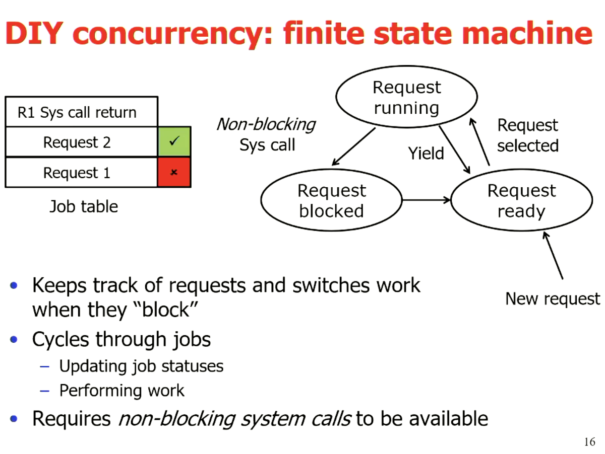
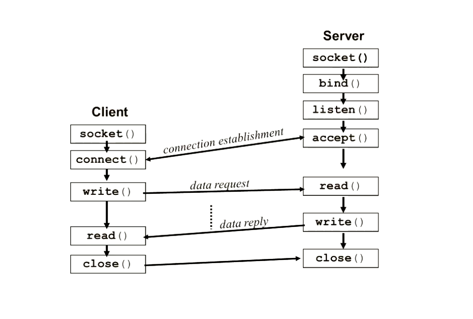

\newpage

# Operating Systems

These notes are designed to be used in conjunction with the slide sets provided in the course, the slides will be more
helpful for use in the labs _due to including code examples_, these notes will provide a good outline for studying for
the final exam.

## Topics

Lectures 1-8: Multiprocessing

## Course Information

The course covers core topics.

- Introduction to operating systems
- Processes and Threads
- Pipes
- Sockets
- Deadlocks
- Files and Directories
- Input/output
- Memory management - Caches
- Memory management - Virtual memory
- Virtualisation

**Grade structure**

Standard Computer science policy applies

- Average 50% over all assessment items
- Average at least 45% on all invigilated assessment items

Grading structure for course

- Lab Test (20%)
- Assignment (20%)
- Lab quizzes (10%)
  - Weekly Quiz Assessments
- Final Exam (50%)
  - Closed book and no calculator
  - Cheat sheet Double sided A4

### Textbooks / Resources

- Modern Operating systems - Andrew Tanenbaum
- Xv6 - Online shorter method, lots of examples

> For information on these resources see the first lecture slides

## Readings

## Lectures

### Lecture One - Introduction to Operating Systems

**The beginning of computing**

- Called the Analytical engine
- Charles Babbage 1972-1871
- Digital, programmable, _Turing complete_
- Punch card IO
- Unable to be engineered
- Would be very slow
- Ada Lovelace - worlds first programmer

**1st Generation computers**

In 1945 we moved on to hard-wired machines. These were just a plugged set
of wires.

**2nd Generation computers**

Operating systems started to appear when systems were designed to be programmable,
this came with programmed batch systems, they operated with one job at a time and
had storage, this is the initial life of an operating system.

**3rd Generation computers**

- Multiprogramming
  - the ability to run multiple jobs at once
- First real operating systems
  - MULTICS/Unix/Linux, VMS and others

This bought the first initial need for security and segregation between
users on the same machine.

**4th Generation computers**

This is the first view of **personal computers**, bringing the `BASIC` interpreter
using Machine code, complexity hidden from the user, one program could be held
in memory.

Usually had ~8 kb of memory to run the entire operating system.

Eventually got a GUI, use of mouse and the initial real world of what we call
computers, could also store multiple applications in memory at once.

Then finally, we have modern day computers

- Personal
- Multiple applications at once
- Modern OS, _(Linux, MacOS and Windows)_

**5th Generation computers**

Wearable devices, quantum computing and further AI development, we are
not there yet!

**What is in a computer?**

- CPU
- Memory
- Video Controller
- Keyboard Controller
- Optical disk controller
- Hard disk controller

This is even a simplistic model, a computer really looks like this:


It is extremely difficult to have to write to all sectors of this without knowing
its exact structure and expected input. This means that we need some interface to
handle this for us. Hence, **operating systems**.

**Storage hierarchy**


In order for the operating system to work, it needs to have some method of
handling storage, and knowing where we are allowed to write to, and have some
method of creating an interface or abstraction to solve writing issues.

**What is the main purpose of an operating system?**

- Virtualization (sharing users)
  - Time (CPU)
  - Space (memory)
- Concurrency
- Persistence (I/O)
- Protection
- Hides complex details
- Protects the machine from malicious code

**Core OS concepts**

These will be expanded throughout the lectures

- Processes
- System calls and kernel mode
- Address spaces
- Files and IO
- The shell

**Typical process model**

- Processes are normal, sequencial code
- The schedular decides what runs and when
- Alternative cooperative models exists

**OS API: System calls**


These really work because the user has no direct access to the low level routines

- OS runs in kernel mode with higher privileges
- User mode system calls execute TRAP instructions
- Hardware looks up the **Trap table** to find address

**Address spaces**

Modern operating systems have **Virtual Memory**

- Multiple programs in memory at once
- Idle memory can be paged and swapped to disk
- Give an illusion of unlimited memory (_at a price_)

**Sample exam question**

Which of the following is NOT an operating system?

- Linux
- Windows
- Android - NOT
  - Is using Linux kernel
- ROS - NOT
  - Is using Linux kernel
  - Is a set of libraries to use with an OS to make system calls
- MacOS
- DOS
- iOS
- Arduino - NOT
  - Is a package

### Lecture Two - Processes and Threads (2.1, 2.2)

> NOTE: See lecture slides in order to find code examples of using threads and processes

#### Processes

**Program counter**

One program counter for each process, this allows us to keep processes
independent and sequencial, this is the foundation of **multiprogramming**,
the timer will interrupt a process and switch when its allocated time frame is
done.

This is an example of **Pseudo parallelism**


_This is building up the stack_

**What is the stack?**

The stack is going to hold the context of what I am doing, it is a LIFO
representation of all the local variables, function calls and procedure
calls.

> This will be talked about further later

**Process Creation and Termination - Linux**

**Creation**

1. System initialization
2. Process creation system call
3. User request to create a new process (shell)
4. Initiation of a batch job

**Termination**

1. Normal exit _voluntary_
2. Error exit _voluntary_
3. Fatal error _involuntary_
4. Killed by another process _Involuntary_

**Linux Process Hierarchy**

- Linux processes are a tree like structure of daemons and foreground processes
- All processes belong to a parent _except the init process_
  - Process group receives all signals from the creator
- Running a program starts a new process
- Windows has no concept of process hierarchy
  - Process is independent of its creator
- Each process has a process table
  - we will need to save this table in order to store state of a specific process
  - These are called process control blocks (PCB's)


In the above block of code, the `fork()` function is being called to create our
process. We then can see our process ID and the process is now a _clone of its
parent_ at the point of creation.

**The wait() function**

- We can use wait in order to wait for any process to be stopped, we can also
  use `waitpid()` in order to check if a single process has stopped, this can
  be useful to detect crashes and log exits.

**The exec() function**

We can use the `exec()` to run a new process as a child of the current process.

This is extremely useful for re-directing output, for logging, helpful output and
more versatile output to play with.

**Process summary**

- A process is an independent resource group running a single program
- Unix: all processes are created and owned by a parent
- Forking a new process creates a clone of the parent _including the same program counter_
- Exec\*(file...) replaces the current program context with the new program file contents
  - Operations such as redirecting and piping output can be run before the program loads
- The code in a process runs sequentially
  - or, does it???

**Why concurrent applications?**

- Allows parallelism of independent operations in a single program _that share common data_
- Example: word processor (basic):
  - Task 1: respond to user input (updating model)
  - Task 2: reformat document when model changes
  - Task 3: save periodically to disk
  - Task 4: spell check

Concurrent applications will allow us to treat these as all independent tasks, treating these
as processes will run into issues as they do not know when other processes have completed tasks
this means we will have to use signals every time that we want to achieve something that requires
information from another process. _we can do this, and will, but not today_.

We can use a **finite state machine**



Instead of doing this with a finite state machine, we can use **Threads**

#### Threads

Threads have there own thread table, this is called a process data space,
multiple threads can access the same process data space.

- Threads have access to process data space
  - but not direct access to each other
- The thread is not a clone, it runs a callback function
- Waits for completion
- The order on the stack can vary as each thread has its own stack


**POSIX threads API**

- Standard runtime library calls for managing threads:
  - `pthread_create`
    - creates a thread to execute a specified function
  - `pthread_exit`
    - Causes the calling thread to terminate without the whole process terminating
  - `pthread_kill`
    - sends a _kill_ signal to a specified thread.
  - `pthread_join`
    - Causes the calling thread to wait for the specified thread to exit. Similar to `waitpid()` for processes
    - Waits for the child thread to finish
    * Generated by `pthread_join()` from `pthread_exit()` after the thread has exited
    * Need to be vary careful about how you return values from a thread
    - We need to return to the heap not the stack in order to make it global, note this will need to be freed
  - `pthread_self`
    - Returns the callers identity _The thread ID_
  - `pthread_yeild`
    - Yields the CPU to another thread
  - There are many more calls available in the **man pages**

**Threads vs Processes**

- Access to the same data makes communication easy
- Very fast to create, can be fast to switch
- Possible performance gains from switching withing a possible process
- Can be spread across CPU's for further parallelisation
- Difficult to write and debug the code
  - Ordering issues
  - Data access issues

**How are threads and processes implemented?**

- Threads and processes can be implemented both at the User level and in the kernel.
  - Threads and processes in the kernel are not run by the scheduler, nor handled in the user space


### Lecture Three - Processes and Threads (2.3, 2.4, 2.5)

**Critical Regions**

- Mechanism to provide "mutual exclusion" of critical regions
- No two processes in critical region at the same time
- No assumptions about CPU's

**Mutual Exclusion**

Four conditions to provide workable mutual exclusion:

- No two processes simaltainously in critical region
- No assumptions made about speeds or numbers of CPU's
- No process running outside its critical region may block another process
- No process must wait forever to enter its critical region

Non-solutions, these violate the above conditions

1. Bocking process disables interrupts on CPU
2. Lock variable, updated just before entering the critical region
3. _strict alternation_ (_lecture slide 6_)

- Loops on block
- What happens if one process is much slower than the other, or halts?
  - Which condition is violated?

4. _Peterson's solution_

- Each process hands off the "turn" to the other process
- Blocking occurs in the critical region only
- Still "busy waiting" - prone to CPU "priority inversion problem"
- Some systems reorder memory access
  - Simpler solutions exist in hardware, this system is sometimes built into the CPU

**Block on wait - mutual exclusion**

- Sends signals between process to wakeup the other process, we then sleep our own process
  - Uses a counter, when it reaches 0, it sleeps itself and parses a signal to the other process
- What happens when a wakeup signal is sent to a process that isn't asleep?
  - This is because we are assuming that this is an atomic operation, however it is not,

**Semaphores - An actual used solution to solve mutual exclusion**

**Atomic** operations to raise or lower their value

> NOTE: fix this up from the slides

Implementation:

- Setting lock by decrementing semaphore
- Releases by incrementing semaphore

**POSIX thread implementation**

- Mutex atomically locks/unlocks
  - Uses for access to critical region

| Operation                   | POSIX Threads              |
| --------------------------- | -------------------------- |
| Create condition variable   | `pthread_cond_init()`      |
| Destroy condition variable  | `pthread_cond_destroy()`   |
| Block waiting for signal    | `pthread_cond_wait()`      |
| signal and wake one thread  | `pthread_cond_signal()`    |
| signal and wake all threads | `pthread_cond_broadcast()` |

> NOTE: add code example from lecture slides

This is a good solution, however it falls apart when we are using Distributed CPU's, the solution to this is using
**message passing**.

We can also use **Barriers** in order to solve synchronisation problems, this is the use of signals to wait for multiple threads
to complete before we can continue executing on a particular thread.

**Readers and Writers**

- Multiple readers can access the area at the same time
- Writers require exclusive access
  - All readers need to exit before the writer can gain the lock
  - New readers may arrive while writer is waiting

> Is there a better solution to make this system more fair for the writer using Semaphores or Mutex's

### Lecture Four - Deadlocks, Starvation and Thread Patterns

We use semaphores such as `mutex`, in order to prevent deadlocks and starvation.

**How to make single-threaded code into multi-threaded code**

This is reasonably difficult to do, here are some of the issues:

- Local variables are fine; global variables may need to be thread specific
  - Some languages implement _thread_local_ declarations (C++)
- Libraries called may not be thread-safe
  - Who consumes signals?
  - Memory access needs to be atomic
  - Can be solved via mutual exclusion libraries (locking)
  - If they are thread safe, this will be outlined in the man pages
- Kernel processes may not be thread-aware (stacks)

#### Thread Patterns

**Dispatcher/worker thread pattern**

- Dispatcher thread handles incoming requests and farms out to pool of worker threads
- Workers get woken to perform their task
- Example of this layout is a Web Server

**Team/pool**

- All team members are equal:
  - wait for incoming requests and grab one to process
- Managed pool: threads in pool created and destroyed by library
- Can be specialised too (running different code)
  - place inappropriate requests into an internal queue (to redirct to other threads)

**Pipeline**

- Chain of consumer/producers
  - Each thread consumes a request and produces a new one for the next thread
  - Specialised threads designed to minimise latency

**pop-up threads**

- Thread created when needed to handle new request
  - starts a fresh thread, this is faster than context switching in threads

### Lecture Five - Signals and Pipes

#### Signals

Signals are a simple route of communication, that is primarily for exception handling, but there are also signals for other things

- Fixed set of signals (Unix):
  - `SIGINT`: The process is being interrupted; terminates quietly
  - `SIGQUIT`: Forces the process to end and core dump
  - `SIGILL`: FIXME - fill here
  - `SIGSTOP`: which stops the process from executing (_This cannot be stopped_)
  - `SIGKILL`: which kills the process (_This cannot be stopped_)

Signals are implemented in hardware (division by zero), handled by the OS, (file size limit exceeded), and is primarily handled by the
user (via keystrokes)

Other processes such as a child process notifying its parent that it has terminated (`SIGCHLD`), or sending a signal.

- Signal numbers range from {0, ..., 31}

  - We will refer to these signals by name rather than reference code

- uses `PID`: process or processes to receive a signal
- if `pid = -1`: all processes user has permission over
  - Elevated user (_such as sudo or root privileges_)
  - All processes with same user ID
- if `pid < -1`: All processes in _process group_

Multiple types of signals can be handled from one signal handler, `SIGCHLD` signal is sent to a parent process when one of it's child
processes terminates.

Signal Overview:

- They do not carry information
- Participating processes must know each others `pid's`

#### Pipes

A pipe is nothing more than a byte stream.

Pipes allows one process to pass information to another process via a `pseudofile`

- One-way queues that the OS kernel maintains in memory
- Guaranteed to provide FIFO delivery of information
- Two types: [futher info found here](http://www.cs.fredonia.edu/zubairi/s2k2/csit431/pipes.html)

  - Unnamed pipes
    - Can only be used between two related processes _child/parent, child/child_
  - Named pipes
    - Once a named pipe is created, processes can `open(),` `read()` and `write()` them just like any other file. Unless you specify `O_NONBLOCK,` or `O_NDELAY,` on the open: opens for reading will block until a process opens if for writing.

- Pipe properties:
  - synchronised byte stream
  - Operated as a bounded buffer with blocking
  - Each pipe is one-way stream
  - one to one mapping
  - No way to test a pipe for data

**Code Example of an unnamed pipe**

```c
#include <stdio.h>
#define READ 0
/* The index of the “read” end of the pipe */
#define WRITE 1
/* The index of the “write” end of the pipe */
char * phrase = “Stuff this in your pipe and smoke it”;

main ()
{
  int fd[2], bytesRead;
  char message [100]; /* parent processes message buffer */
  pipe ( fd ); /* Create an unnamed pipe */
  if ( fork ( ) == 0 ) /* Child Writer */
  {
    close (fd[READ]); /* Close unused end*/
    write (fd[WRITE], phrase, strlen ( phrase) +1); /* include NULL*/
    close (fd[WRITE]); /* Close used end*/
  }
  else
  {
    /* Parent Reader */
    close (fd[WRITE]); /* Close unused end*/ bytesRead = read ( fd[READ], message, 100);
    printf ( “Read %d bytes: %s\n”, bytesRead, message);
    close ( fd[READ]); /* Close used end */
  }
}
```

**Code Example of an named pipe**

```c
/* Writer */

#include <stdio.h>
#include <sys/types.h>
#include <sys/stat.h>
#include <fcntl.h>
char * phrase = “Stuff this in your pipe and smoke it”;
int main () {
  int fd1; fd1 = open ( “mypipe”, O_WRONLY ); write (fd1, phrase, strlen ( phrase)+1 ); close (fd1);
}

/* Reader */

#include <stdio.h>
#include <sys/types.h>
#include <sys/stat.h>
#include <fcntl.h>
int main ()
{
  int fd1;
  char buf [100];
  fd1 = open ( “mypipe”, O_RDONLY ); read ( fd1, buf, 100 ); printf ( “%s\n”, buf ); close (fd1);
}
```

We can use `popen()` and `pclose()` macro functions in order to create a pipe, fork the child process and invokes the child in the shell and
runs command (visit the man pages for more information).

Named pipes in the shell are created by the `mknod(), mkfifo()` commands/functions, can be accessed with name permissions.

Opening and closing using the standard `fopen/fclose`, each pipe is used as a buffer.

### Lecture Six - Sockets

| Stream Sockets        | Datagram Sockets          |
| --------------------- | ------------------------- |
| TCP                   | UDP                       |
| reliable delivery     | unreliable delivery       |
| In-order guaranteed   | no order guarantees       |
| connection-orientated | no notion of a connection |
| bidirectional         | can send or receive       |


> Note this will not be locked at further, we will focus mostly on Socket streams (TCP)

**Networking basics**

- Application layer
  - Standard applications
  - User applications
- Transport layer - we will be looking at this more in-depth
  - TCP
    - Connection orientated
    - Provides a reliable flow of data between systems
  - UDP
    - Clock server
    - Ping
  - Programming interface
    - Sockets
- Network layer
  - IP
- Link layer
  - Device drivers

Webb protocols and services

- All resources are identified by a URL, the URL has four parts
  - Protocol
  - Host
  - Port
  - Resources
- Applications can refer to destination by name rather than IP
- Within the communication domain sockets are referred to by address


**Establishing a connection**

1. Client sends a request to the server by hostname and port number
2. Server accepts the connection, creating a new socket bond to a different port

- Common to service the actual connection in a separate thread/process

3. The original server port is again ready to listen for other connection requests

- We use Big Endian with networking byte order




> Next week we will delve into the code for this part of the course

### Lecture Seven - Socket Coding


> This lecture just goes over the code seen above and further examples, for further details on what this code does, consider visiting man pages or watch the lecture while implementing
> (this is reasonably familiar, however if I am battling to understand, refer to the lecture).

**Sockaddr**

Three different types of sockaddr:

- Unix Domain sockets
- Generic address
- Internet domain sockets

### Lecture Eight - Scheduling

**Introduction to scheduling**

- How to schedule a mixture of process behaviours?
- How to best use resources?
- What are we trying to optimise?
- How are we going to make it fair?

**Systems and process types**

- Nonpreemptive: Every job runs to completion
- Preemptive: Jobs can be interrupted

**System types and scheduler requirements**

- Batch
  - No users waiting
  - Nonpreemptive
- Interactive
  - User waiting
  - User workstations/devices and _servers_
  - Preemtion is essential
- Real-time
  - Dominated by periodic and need to meet deadline
  - Process designed in advance to work together
  - Can be nonpreemptive or preemptive depending on load

**Scheduling goals and policy**

All systems:

- Fairness
- Policy enforcement: seeing that stated policy is followed
- Balance: Keeping all parts of system busy

Batch systems:

- Throughput maximising
- Turnaround time (minimise)
- CPU utilization

Interactive systems:

- Response time
- Proportionality

Real-time systems:

- Meeting deadlines
- Predictability

**Scheduling in batch systems**

- Requires knowledge of job lengths
- Nonpreemptive
  - Assumes some jobs arrive at the same time so can choose
- Preemptive: shortest time to complete next
  - Allows new short jobs to interrupt longer ones
- Sometimes we use _First come first served (FCFS)_ or _shortest job first (SJF)_

Incorporating I/O

- Each CPU burst treated as a new job
- Long job fills I/O

**Interactive Schedulers**

_Very complex_

Some solutions:

- Round-robin scheduling _(simple solution)_
  - Preemptive switch every $m$ seconds
  - Assumes _equal importance_
  - Can be dominated by process switching time
- Priority scheduling with multiple queues
  - Each queue only runs when higher empty
  - Round robin scheduling of each level
  - Lower queues can starve
    - Answer: dynamic priority allocation
  - Dynamic scheduling:
    - New jobs start with highest priority
    - Job using up its time slice downgraded
    - Job _not_ using time slice stays the same
    - Essentially light tasks go to top, heavy CPU tasks go to bottom
    - A better method is to replace rules two and three do downgrade based on how much CPU has been used _(# of slices)_, neutral strategic I/O
  - Further tuning strategies
    - Increase time period for lower priority jobs
    - Calculate _ad hoc_ priority based on past job times, weighted sum decaying over time $T = \frac{(T_0 + T_1)}{2}$
    - User hints
    - Scheduler parameters
- Shortest process next
- Guaranteed scheduling
- Fair-share scheduling

**Schedule fairness**

- Allocate CPU time per _user_, not per process
- Track CPU usage and schedule accordingly
- Lottery scheduling:
  - Each user given $\frac{1}{n}$ tickets (priority adjusted)
  - Distribute amongst processes
  - Randomly select a ticket and schedule the owning process
  - Can give tickets away
    - e.g. client to server process

**Real-time scheduling**


- Example: multimedia server
  - Different periodicity (deadline) and processing time requirements
  - How to schedule so deadlines always met?

**Rate monotonic scheduling**

- Priority = 1/deadline frequency
- Always runs highest priority process
- strict conditions:
  - Each process completes within period
  - No inter-process dependencies

**Earlies deadline first**

- Process with earlier deadline preempts the current process
  - Relaxes the constant frequency requirement

> Note that RMS is load-dependent, EDF always works but we have to calculate deadlines (more complex)

**Policy vs Mechanism**

Separate what is allowed to be done with how it is done

- A process knows which of its children threads are important and need priority
- Scheduling algorithm parameterized
- Parameters filled in by the user processes


### Lecture Nine: Deadlocks

**What is a deadlock?**

A set of processes is deadlocked if each process in the set is waiting for an event that only another process in the set can cause.

- Usually the event is release of an exclusively held resource
- None of the processes can:
  * run
  * release resources
  * be awakened
- **Resources:**
  - Various sorts
    * Physical devices: printers, tape drives
    * Database/data structures: tables
    * Locks (e.g. semaphores)
  - Sequence of events: request, use, release
  - Must wait if request is denied
  - Two types:
    * Preemptable, can be taken awar from a process with no ill effects
    * Nonpreemptable: will cause the process to fail if taken away
- **Four conditions for a deadlock:**
  * Mutual exclusion condition: each resources assigned to one process.
  * Hold and wait condition: process holding resources can request additional ones.
  * No preemption condition: previously granted resources cannot be forcibly taken away.
  * **Circular wait condition:** must be a circular chain of two or more processes, each is waiting for resources held by next member of the chain. *(this is the main condition)*
- **Deadlock modeling**
  * Modeled with directed graphs
    * Resources `R` assigned to process `A`
    * Process `B` is requested/waiting for resource `S`
    * Process `C` and `D` are in deadlock over resources `T` and `U`


Because there is a circular dependency (at the end of the above trace), this means we now have a deadlock in the system.

**Deadlock Strategies**

- Ostrich algorithm
  * Ignores the problem
- Detection and recovery
  * Take action when detected
- Dynamic avoidance
  * Avoidance by scheduling
  * careful resource allocation
- Prevention
  - Negate one of the four necessary conditions

**The Ostrich Algorithm**

- Pretend there is no problem
- Reasonable if:
  * Deadlocks occur very rarely
  * Cost of prevention is high
- UNIX and Windows take this approach
- Trade off between
  * Frequency and seriousness of deadlock
  * Cost/difficulty avoiding

**Deadlock detection**

- Periodically chechs resources held and requested to look for impasses
  * when resources requested
  * every *n* minutes
  * When CPU usage stalls
- Takes steps to recover from deadlocks if detected
- Practical limitations
  * Requires visibility of process resource requirements
    * Usually known to the resource scheduler
  - Space-time expensive: order $O(Processes \times Resoures)$
    * This is why most OS's avoid it


Deadlock detection, only works on the currently evaluated processes, it does **not** look into future deadlocks in order to prevent them if they are going to occur.


**Recovery from deadlock**

- Preemption: take a resource from another process
- Rollback
  * checkpoint a process periodically
  * use this saved state
  * Restart the process if it is found deadlocked
- Recovery through killing processes
  * kill one of the processes in the deadlock cycle or *another resource holder*
  * the other processes get its resources
  * choose process that can be rerun from the beginning

**Deadlock Avoidance**

- Tries to predict when deadlocks may occur
- Checks required resources requested to determine how to avoid deadlocks
  * Process scheduling: suspend one or more processes to avoid resource clash
  * Resource scheduling: grant resources in a manner that avoids *unsafe state*
- Strong assumptions make implementation difficult and impractical
  * Requires visibility of process future resource requirements (*static scheduling*)
  * Assumes resources requested will be *held to completion* (*most pessimistic outlook*)


In order to map the availible resources in a way that we ensure that there are no deadlocks, comes down to a topology question, *can we allocate the resources in such a way that we avoid unsafe states?* We also make some assumptions, outlined in the figure below.

A state is considered **safe** if it can allocate all the resources to processes without locking.


**Bankers Algorithm**

This solves the problem, however it requires two major assumptions

- Static number of processes
- Known usage requirements

In a practical sense on an OS level, these are unrealistic assumptions to have, as it is impractical to have a static number of processes and we will not always know the usage of an individual process.

**Prevention: break one of the four conditions**

We could do one of the following:

- Remove competition over resource
- Don't allow additional resources to be requested
- Allow processes to surrender resources
- Avoid order issues

In practice it is difficult to break the four conditions for a deadlock.

**Deadlock Prevention: Attacking the hold and wait condition**

- Require processes to request resources before starting
  * A process not allowed to wait for further resources
- Problems:
  * May not know required resources at start of run
  * also ties up resources other processes could be using
- Dynamic variation: drop and reacquire
  * Release all currently held resources
  * Request all required (old and new)


### Lecture Ten & Eleven: File Systems

**The logical file system**

Essential requirements of long-term storage:

1. Must store large amounts of data
2. Information stored must survive the termination of the process using it
3. Multiple processes must be able to access the information concurrently

Considerations:

1. How do you find the information you want?
  - Find a file on disk
  - Find information within a file
2. How do you control data file access by users
3. How do you know which disk areas (blocks) are free?

**File structure**

- The three kinds of files
  * Byte sequence: no inherent structure (Operating Systems)
  * Record sequence: fixed length records (not used)
  * Tree: indexed records (some mainframes)


**How do we access files?**

- Sequential access
  * Read all bytes/records from start
  * Convenient when medium was mag tape
  * Still relevant for small files and multimedia
- Random access
  * Bytes/records read in any order
  * Essential for database systems and caching
  * Two methods
    * Read from a specified position
    * Move file marker (seek), then read

Files were implemented using blocks, this is simple and efficient as we only need to know the starting block
and the size of a file, (how many blocks it uses), However it rapidly becomes fragmented.

Windows approach: Now we use linked lists and file allocation tables:


Unix approach: Using *i-nodes*


The only downside to this is we can have variable length, and we will need to have a block of pointers for larger
files

**File operations (API)**

- Create
- Delete
- Open
- Close
- Read
- Write
- Append
- Seek
- Get attributes
- Set attributes
- Rename

**Directories**

> NOTE: Directories are handled in a tree structure (I am not copying this down, common knowledge)

Operations:

- Create
- Delete
- Opendir
- Closedir
- Readdir
- Rename
- Link: *Talking about Referencing files/directories using symlinks*
- Unlink

**Partitions**

Have the following:

- Boot block
  * Loads OS
- Super block
  * File/system information
- Free space management
- I-nodes
- Root directory
- Files and directories

**Implementing directories: name storage**

- In-line space-inefficient
- Names in heap: complex
- Performance enhancements
  - Hash table per directory (for large dirs)
  * Cache frequent searches

**Shared files (linking)**


Problems:

- Link is another directory entry to the same i-node
- Deleting new directory entry creates ownership issues
- Alternative: link is itself a file
  * UNIX soft links
  * Windows shortcuts

<<<<<<< Updated upstream
**File system performance: Disk drives**


- Disk time dominated by seeks
  * 5-10 ms to move between tracks (cylinders)
  * 5-10 ms to rotate to correct sector
  * Read speed: 50-160 MB/sec


- Allocate blocks in chunks
- Allocate blocks physically close together (same cylinder)
- Place i-nodes in the middle of the disk
- Interleave i-nodes and file blocks in *cylinder groups*

**Log structured file systems**

- Takes advantages of CPU and memory advancements in recent years
  * Disk caches can be large
  * increasing number of read requests from cache
  * Most disk accesses will be writes
- Structure the entire disk as a log
  * Goal: maximise consecutive writes
  * have all writes initially buffered in memory
  * periodically write these to the *end* of the disk log
  - when file opened, locate i-node, then finds block
    + I-node map in memory
    + Periodic cleaning to deal with deletes


### Lecture Eleven: Input/Output

**I/O Hardware device types**

- Block
  * Data stored in fixed size blocks
  * Blocks addressed and read independently
- Characters
  * Generates or receives a character stream
- Other
  * Clocks are held on the IO bus

**Hardware devices and controllers**

- Mechanical interface is low level
  * Stream of bytes
- OS deals with device controller
  * Convert serial stream of blocks of bytes
  * Perform error correction
  * Copy to main memory


**Memory mapped I/O**

- Direct I/O: CPU accesses controller registers and data buffer separately from memory
  * IN REG, PORT
  * OUT PORT, REG
- Memory-mapped I/O: map I/O ports to memory addresses
  * Can perform I/O using standard languages
  * Can perform same operations
  * Easy to control access
- Some drawbacks
  * Caching needs to be disabled
  * Requires second bus (for speed)


**Bus architectures**

- Serial bus
  * Single pair of wires for unidirectional data transmission
  * USB ports, keyboard/mouse
- Parallel bus
  * multiple wires for high speed bi-directional data transfers
  * disk drives, graphics cards


