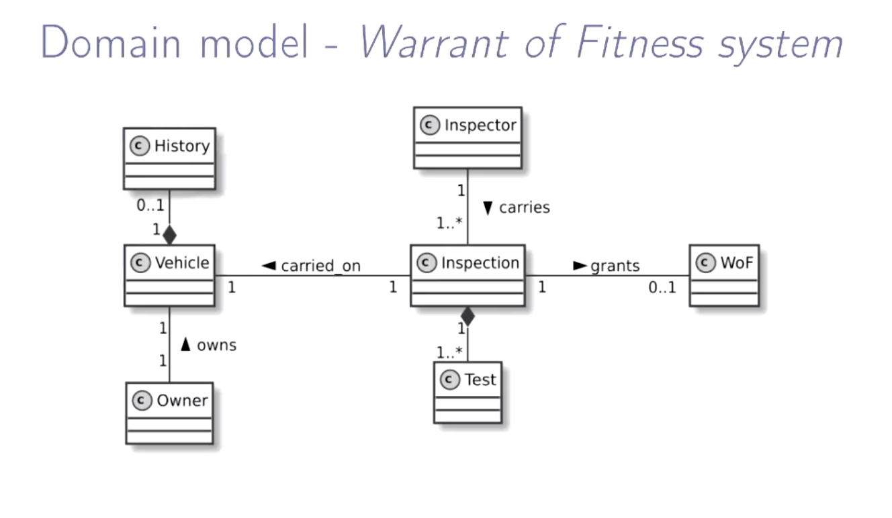
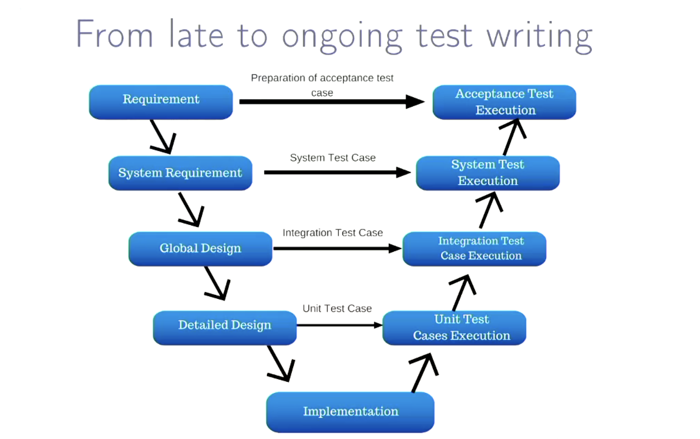
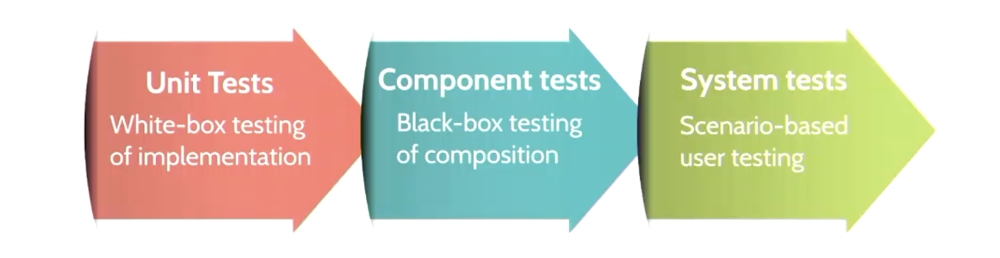
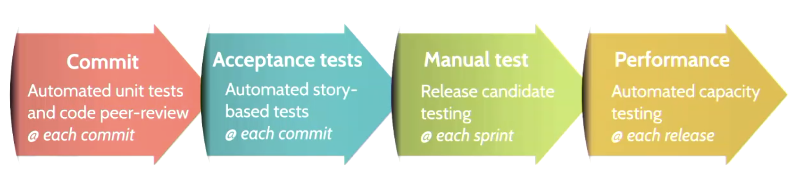
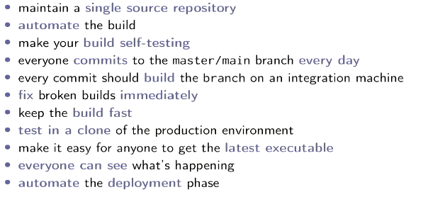
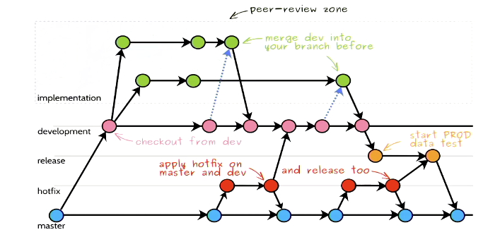

---
title: "Software Engineering II"
author: [Jordan Pyott]
date: "2021-05-06 17:02"
subject: "SENG301"
lang: "en"
titlepage: true
titlepage-color: "3C9F53"
titlepage-text-color: "FFFFFF"
titlepage-rule-color: "FFFFFF"
titlepage-rule-height: 2
...

\newpage

# Course Information

The Software Engineering (Part II) builds on the material introduced in SENG201 (Introduction to Software Engineering) and is intended as a companion course to SENG302 (Software Engineering Group Project).

In this paper, you will learn about software processes, including Agile Software Development (e.g., Scrum, Kanban), effective source code and documentation management, resilience engineering, acceptance testing, software metrics and software design principles.

At the end of each lecture it is expected to finish the prep slides before the next lecture

[Lecture Material](https://learn.canterbury.ac.nz/course/view.php?id=10576&section=3)

[Resources](https://learn.canterbury.ac.nz/course/view.php?id=10576&section=9)

[Assignment Submissions](https://learn.canterbury.ac.nz/course/view.php?id=10576&section=8)

## Course Outline

**Lectures outline**

Term 1 - Agile Software Development

- 23/02 Recap on software engineering methods
- 26/02 Scrum 101
- 02/03 (Agile) Requirement analysis
- 05/03 Scrum team management
- 09/03 Continuous integration
- 12/03 Continuous delivery
- 16/03 Testing and mocking
- 19/03 Resilience & reliability
- 23/03 Software quality metrics
- 26/03 Software architecture 101
- 30/03 User Experience 101

Term 2 - Object-oriented design principles

- 27-30/04 Generics & Collections
- 04-07/05 Object-oriented design
- 11-14/05 Design pattern I
- 18-21/05 Design pattern II
- 25-28/05 Design by contract
- 01-04/06 TBD

**Lab/tutorial outline** 

Term 1

- 01-03/03 Tutorial - Scrum (1)
- 08-10/03 Tutorial - Scrum (2) [Assignment 1]
- 15-17/03 Conceptual modelling and `JPA`
- 22-24/03 Acceptance testing with Cucumber
- 29-31/03 `Facking` and mocking with `Mockito`

Term 2 (Provisional, please check forum for latest updates)

- 03-05/05 Generics & Collections
- 10-12/05 Design
- 17-19/05 Design Patterns I
- 24-26/05 Design Patterns II
- 31-02/06 Design by Contract

**Assignments deadlines**

- 08-10/03 Assignment 1 - Scrum tutorial 2 (during lab time), self-enrol via group forming page
- 01/04 Assignment 2 - Reflection report
- 04/06 Assignment 3 - Acceptance testing and design patterns 

## Grades

- Assignment 1: Scrum tutorial    15%
- Assignment 2: Reflection report 5%
- Assignment 3: Coding assignment 20%
- Final Exam: 60%

\newpage

# Labs

\newpage

# Lectures

## Lecture One: Course kickoff and recap of software development methods

**SCRUM**

Scrum is a framework within which people can address complex adaptive problems, while productively
and creatively delivering products of the highest value. Scrum is a lightweight framework that helps
people and teams to generate value through adaptive solutions for complex problems, scrum was created
by `Ken Schwaber` and `Jeff Sutherland`.

Scrum is a method of generating agile development within a workplace/team, it does this by using adaptive
planning and works to achieve early delivery of the product in order to assess and improve the work flow within
a development team.

Here are the lead roles in a `SCRUM` environment workplace.

1. A Product Owner orders the work for a complex problem into a Product Backlog.
2. The Scrum Team turns a selection of the work into an Increment of value during a Sprint.
3. The Scrum Team and its stakeholders inspect the results and adjust for the next Sprint.
4. Repeat

Here is an [Overview of Scrum](https://www.scrum.org/resources/what-is-scrum) from Scrum.org.

## Lecture Two: Scrum software development framework

**The Five Values Of Scrum**

- Openness
- Focus
- Respect
- Courage
- Commitment

**Initial startup for scrum**

Some bootstrap effort is needed before starting

- start from a vision of the product
- refine its objectives
- discuss with the stakeholders, including the Product Owner, create an initial backlog with user stories
- agree on working mode and standards

`Scrum` and `Kanban` are quite different here

- `scrum` larger initial phase is needed before planning the first sprint
- `kanban` task-oriented, so faster start-up

**Part I - what are we going to do?**

- the PO presents highest priority stories or epics
- estimate the complexity of each story
- use previous velocity (i.e. number of points delivered previously)
- first draft of sprint backlog
- a sprint should be as coherent as possible

**Part II - how are we going to do it?**

- selected stories are broken down into tasks by the team
- tasks are described thouroughly (i.e. anyone can pick it up)
- estimations of tasks are set collaboratively, i.e. reaching a consensus
- the team knows the steps to implement each story 
- the team knows what each task needs to produce

## Lecture Three: Decipher users, their expectations and plan the work

**Scrum Roles**

Product Owner
- translates user demands into stories
- maintains and prioritises the list of things to do
- negotiates content of releases and timing with the team

Scrum master
- acts as a coach
- facilitates communication inside and outside the team
- represents managements, but protects team members

Team aka developers
- everyone is a developer
- everyone works on everything

Epic:
- large piece of work that may be implemented over many scrums

Story:
- a well defined piece of work
- confined within a sprint (unless too much is allocated)

Product backlog:
- contains tasks (stories)
- everything that still needs to be done
- maintained by PO
- some estimations may be missing

Sprint backlog:
- items that will be handled within our current sprint
- allocated from product backlog and estimated

## Lecture Four: Leadership, team work and accountability

**Dealing with Unplanned**
- Distinguish between development issues and bugs
    * issue: a problem identified at the latest before a review
    * bug: a problem discovered at the earliest during later regression tests 

**Dealing with impediments**
- Long meetings: stick to essential stakeholders and keep them time-boxed
- Illness: unavoidable, but refrain from ignoring it
- broken builds: implicit top priority for the whole team to fix it
- tools: always frustrating, but you need to fix it first
- third parties: even more frustrating, consider alternatives
- scope creep: pay special attention to review the stories and broken down tasks
- unreliable PO: learn how to deal with them
- team problems: retrospectives and seek for assistance
- external incentives: remember Scrum is about teamwork

## Lecture Six: Software architecture

The reason to model is in order to raise the abstraction level, this is what
we are trying to achieve in software engineering, because it is easier to work
on abstractions than to work and the ground level.

Representation are good (visual diagram), but you need the following:

- to understand the notation
- to understand the context and vocabulary
- the purpose of the model must be distinct and clear
- should be unambiguous

In computer science we use class diagrams and domain models (used in Lecture 3)

- Every organisation has their own rules
- They manipulate their own vocabulary and concepts
- concepts have relations to each others

Domain concepts *domain driven design*

- will be the one you logically manipulate
- will be the one you store in the database
- should be responsible for their states and logic *i.e. encapsulation*

These diagrams is to understand the concepts, not to have an implementation of the logic

Domain model example for a warrant of fitness system:

Architecture tactics

- Relating to one attribute or decision
- tackle one concern at a time

Architecture styles and design patterns

- offer re usability
- must be taken into account in the entire project
- may encompass multiple tactics 

Both are shaping the design of your system early

> NOTE: Architecture drift occurs quicker and more often than you might expect \
> Re-engineering may be impractical or painful to implement as a result of this

**README files**

- Explains the context and objectives
- Authors, contributors, versioning and other pointers
- specify deployment procedure, testing and dependencies
- describe content and refer to licensing

**Wiki pages**

- put your external analysis, wire frames, architecture, decisions
- manual tests
- keep them organised in categories
- keep it updated
- terms and conditions

## Lecture Seven: Staged and automated testing

Objectives of testing:

- Validation: demonstrate the software fulfils its requirements 
- Verification: identify erroneous behaviour of the system

**Unit testing**

Any piece of code should be tested

- every feature should be testable
- should fake or simulate human input and should be self sufficient
- *is hard because of the nature of code in a code-base*
- code assertion are primordial for regression tests (making sure old tests are still working as expected)
- explicit verification of pre/post conditions, (checking ranges of inputs)

**Component testing**

Testing of identifiable and isolated parts of a system

- hidden and interchangeable implementation

On top of being skeptical on input data

- Make components fail, check for differing failures
- Stress testing or message overflow
- If a call order exists, try to call operations in the other order

**System testing** 

Finally, the last stage of testing

- Integrate third-party components or systems
- Should be preformed by *dedicated* testers and surely not only by the developers

Scenario-based testing

- main usages, full interaction flows and should be modelled
- Start from graphical user interactions and go through to opposite end

Trace and record tests executions (wiki or spreadsheet)

- Input values, expected output and observed output
- meta data like who and when issues occur, and a tracking issue associated with this issues id

> Make sure that tests handle Null values, this is an extremely common mistake \
> cover invariant properties are valid, check incoming parameter's, assert are useful for regression testing 

**Acceptance testing**

User stories are always accompanied by acceptance criteria

- do you remember about INVEST?
- A story is a promise for a conversation, with examples of usage
- define application interfaces *isolating UI*
- use dependency injection, *inversion of control*
  - *Dependency injection: a technique in which an object receives another object that it depends on*
- Any `async` functions must be synchronous in order to test

Automating acceptance testing:

- use playback tools sometimes, *selenium, Serenity*
- testing directly on a GUI may be time consuming

As sprint reviews must be planned and prepared

- ensure all acceptance criteria are running as expected
- may need to rework some stories, avoid trying to fix nasty bugs last minute

## Lecture Eight: Ethics and resilience engineering

> NOTE: I am not sure how much of this will be assessed?

Because we are using artificial intelligence for almost everything now from
employment, academic integrity and almost anything else. Because of this as
software developers, it is important to contain our personal bias into account
when developing software.

A problem with almost all codes of ethics is that they try to put people into
boxes and categories, this is not always possible due to the individuality experienced
by a set of users.

The ethics behind things at the moment have blurred lines, e.g. for
self driving cars, is it ethical to prioritise life inside the car
rather than prioritise life outside the car.

The environmental impact of software development and maintaining software, 
block-chaining for example uses large amounts of power as we are constantly
generating new hashes (computationally difficult to do). Note, their is a
conversation that needs to be had about weighing up the pros and cons of this
development.

Don't catch unintentional errors in your code, due to the fact that this will
allow you to miss unintentional errors being parsed.

**Capacity management**

*Programmers waste enormous amounts of time thinking about, or worrying about
the speed of noncritical parts of their programs, and these attempts at efficiency
actually have a strong negative impact when debugging and maintenance are considered.
We should forget about small efficiencies, say about 97% of the time. A good programmer
will not be lulled into complacency by such reasoning, he will be wise to look carefully
at the critical code; but only after that code has been identified.*

- Design code in a way that it can be traced (using loggers)
- use threads carefully, *starvation and deadlocks are very bad*
- write dedicated tests and monitor logs

- Protection systems:
  - system specialised in monitoring the execution of another, trigger alarms or invoke corrective programs

- Multi version programming
  - concurrent computation
  - can be hardware with different items or providers
  - can be software with different development teams
  - mismatch detection with voting system
  - triple redundancy:
    - usually only one thing breaks at a time, if two cases are working correctly and a third is not, the problem is likely with the third

**Visibility**

- Programming contracts often define a *need-to-know* principle

**Validity**

- check formatting and domain of input values, including boundaries
- explicitly or regression testing

**Exceptions**

- NEVER EVER display the stack trace to the user (500 errors should be handled)
  - this is the easiest way to reverse engineer and hack into the server side system

Both client side checking and server side checking are necessary, you cannot handle
a request without both.

The four R's of resilience engineering plan:

- Recognition: how an attack may target an identified resource
- Resistance: possible strategies to resist to each thread
- Recovery: plan data, software and hardware recovery procedures
- Reinstatement: define the process to bring the system back

This means we should have **backup** and **reinstalling** procedures, that should be
specified on top of deployment.

## Lecture Nine: Continuous Integration

**The integration problem**:

This is the process of combining `units` into a product

- After you developed your part
- ... and tested on our side

**Phased Integration**:

Multiple variables, interfaces and technologies

- Global variables
- Different error-handling assumption
- Weak encapsulation

These are where and how we define environment variables for testing, *DO NOT ADD THESE TO THE REPO*

**Continuous Integration**:

*Working software is the primary measure of success*, If we cannot run and see it, it is **not** progress.

> This is when we have progress on our personal machine but it is not uploaded to any current repository

There are eXtreme programing principles that were outlined by Martain Fowler known as Fowler's Principles.

These are outlined here:

Managing repositories if it is handled in a Single source repository, this makes it easier to maintain, helps to be
`centralized` or use *subversion* and `distributed` *git* having two levels of commits. To be distributed means that
each person working on the task is allowed to maintain their own branch `feature branches`, to be centralized is to have a `main` branch
*maybe multiple main branches such as [dev, master, release]*. This helps with implementation, working in teams and 
streamlining development. *Once again Linus Torvalds has made our life easy*.

Figure 6 shows a development strategy that we will be using within our SENG302 project, this is a good idea as it includes
a release branch (only push to this at the end of each sprint), a dev branch (usually only modified after a story is fully
complete), story branches (only merged into dev when finished), master branch (updated from dev when dev is pushable).

