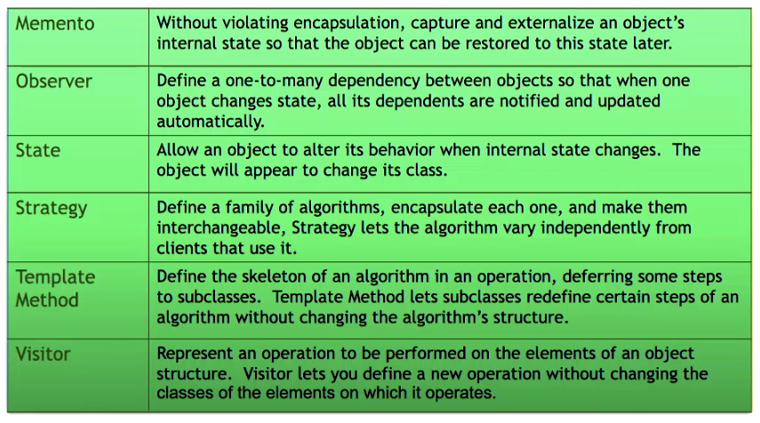

\newpage

# Course Information

The Software Engineering (Part II) builds on the material introduced in SENG201 (Introduction to Software Engineering) and is intended as a companion course to SENG302 (Software Engineering Group Project).

In this paper, you will learn about software processes, including Agile Software Development (e.g., Scrum, Kanban), effective source code and documentation management, resilience engineering, acceptance testing, software metrics and software design principles.

At the end of each lecture it is expected to finish the prep slides before the next lecture

[Lecture Material](https://learn.canterbury.ac.nz/course/view.php?id=10576&section=3)

[Resources](https://learn.canterbury.ac.nz/course/view.php?id=10576&section=9)

[Assignment Submissions](https://learn.canterbury.ac.nz/course/view.php?id=10576&section=8)

## Course Outline

**Lectures outline**

Term 1 - Agile Software Development

- 23/02 Recap on software engineering methods
- 26/02 Scrum 101
- 02/03 (Agile) Requirement analysis
- 05/03 Scrum team management
- 09/03 Continuous integration
- 12/03 Continuous delivery
- 16/03 Testing and mocking
- 19/03 Resilience & reliability
- 23/03 Software quality metrics
- 26/03 Software architecture 101
- 30/03 User Experience 101

Term 2 - Object-oriented design principles

- 27-30/04 Generics & Collections
- 04-07/05 Object-oriented design
- 11-14/05 Design pattern I
- 18-21/05 Design pattern II
- 25-28/05 Design by contract
- 01-04/06 TBD

**Lab/tutorial outline**

Term 1

- 01-03/03 Tutorial - Scrum (1)
- 08-10/03 Tutorial - Scrum (2) [Assignment 1]
- 15-17/03 Conceptual modelling and `JPA`
- 22-24/03 Acceptance testing with Cucumber
- 29-31/03 `Facking` and mocking with `Mockito`

Term 2 (Provisional, please check forum for latest updates)

- 03-05/05 Generics & Collections
- 10-12/05 Design
- 17-19/05 Design Patterns I
- 24-26/05 Design Patterns II
- 31-02/06 Design by Contract

**Assignments deadlines**

- 08-10/03 Assignment 1 - Scrum tutorial 2 (during lab time), self-enrol via group forming page
- 01/04 Assignment 2 - Reflection report
- 04/06 Assignment 3 - Acceptance testing and design patterns

## Grades

- Assignment 1: Scrum tutorial 15%
- Assignment 2: Reflection report 5%
- Assignment 3: Coding assignment 20%
- Final Exam: 60%

\newpage

# Labs

\newpage

# Lectures

## Lecture One: Course kickoff and recap of software development methods

**SCRUM**

Scrum is a framework within which people can address complex adaptive problems, while productively
and creatively delivering products of the highest value. Scrum is a lightweight framework that helps
people and teams to generate value through adaptive solutions for complex problems, scrum was created
by `Ken Schwaber` and `Jeff Sutherland`.

Scrum is a method of generating agile development within a workplace/team, it does this by using adaptive
planning and works to achieve early delivery of the product in order to assess and improve the work flow within
a development team.

Here are the lead roles in a `SCRUM` environment workplace.

1. A Product Owner orders the work for a complex problem into a Product Backlog.
2. The Scrum Team turns a selection of the work into an Increment of value during a Sprint.
3. The Scrum Team and its stakeholders inspect the results and adjust for the next Sprint.
4. Repeat

Here is an [Overview of Scrum](https://www.scrum.org/resources/what-is-scrum) from Scrum.org.

## Lecture Two: Scrum software development framework

**The Five Values Of Scrum**

- Openness
- Focus
- Respect
- Courage
- Commitment

**Initial startup for scrum**

Some bootstrap effort is needed before starting

- start from a vision of the product
- refine its objectives
- discuss with the stakeholders, including the Product Owner, create an initial backlog with user stories
- agree on working mode and standards

`Scrum` and `Kanban` are quite different here

- `scrum` larger initial phase is needed before planning the first sprint
- `kanban` task-oriented, so faster start-up

**Part I - what are we going to do?**

- the PO presents highest priority stories or epics
- estimate the complexity of each story
- use previous velocity (i.e. number of points delivered previously)
- first draft of sprint backlog
- a sprint should be as coherent as possible

**Part II - how are we going to do it?**

- selected stories are broken down into tasks by the team
- tasks are described thouroughly (i.e. anyone can pick it up)
- estimations of tasks are set collaboratively, i.e. reaching a consensus
- the team knows the steps to implement each story
- the team knows what each task needs to produce

## Lecture Three: Decipher users, their expectations and plan the work

**Scrum Roles**

Product Owner

- translates user demands into stories
- maintains and prioritises the list of things to do
- negotiates content of releases and timing with the team

Scrum master

- acts as a coach
- facilitates communication inside and outside the team
- represents managements, but protects team members

Team aka developers

- everyone is a developer
- everyone works on everything

Epic:

- large piece of work that may be implemented over many scrums

Story:

- a well defined piece of work
- confined within a sprint (unless too much is allocated)

Product backlog:

- contains tasks (stories)
- everything that still needs to be done
- maintained by PO
- some estimations may be missing

Sprint backlog:

- items that will be handled within our current sprint
- allocated from product backlog and estimated

## Lecture Four: Leadership, team work and accountability

**Dealing with Unplanned**

- Distinguish between development issues and bugs
  - issue: a problem identified at the latest before a review
  - bug: a problem discovered at the earliest during later regression tests

**Dealing with impediments**

- Long meetings: stick to essential stakeholders and keep them time-boxed
- Illness: unavoidable, but refrain from ignoring it
- broken builds: implicit top priority for the whole team to fix it
- tools: always frustrating, but you need to fix it first
- third parties: even more frustrating, consider alternatives
- scope creep: pay special attention to review the stories and broken down tasks
- unreliable PO: learn how to deal with them
- team problems: retrospectives and seek for assistance
- external incentives: remember Scrum is about teamwork

## Lecture Six: Software architecture

The reason to model is in order to raise the abstraction level, this is what
we are trying to achieve in software engineering, because it is easier to work
on abstractions than to work and the ground level.

Representation are good (visual diagram), but you need the following:

- to understand the notation
- to understand the context and vocabulary
- the purpose of the model must be distinct and clear
- should be unambiguous

In computer science we use class diagrams and domain models (used in Lecture 3)

- Every organisation has their own rules
- They manipulate their own vocabulary and concepts
- concepts have relations to each others

Domain concepts _domain driven design_

- will be the one you logically manipulate
- will be the one you store in the database
- should be responsible for their states and logic _i.e. encapsulation_

These diagrams is to understand the concepts, not to have an implementation of the logic

Domain model example for a warrant of fitness system:


Architecture tactics

- Relating to one attribute or decision
- tackle one concern at a time

Architecture styles and design patterns

- offer re usability
- must be taken into account in the entire project
- may encompass multiple tactics

Both are shaping the design of your system early

> NOTE: Architecture drift occurs quicker and more often than you might expect \
> Re-engineering may be impractical or painful to implement as a result of this

**README files**

- Explains the context and objectives
- Authors, contributors, versioning and other pointers
- specify deployment procedure, testing and dependencies
- describe content and refer to licensing

**Wiki pages**

- put your external analysis, wire frames, architecture, decisions
- manual tests
- keep them organised in categories
- keep it updated
- terms and conditions

## Lecture Seven: Staged and automated testing


Objectives of testing:

- Validation: demonstrate the software fulfils its requirements
- Verification: identify erroneous behaviour of the system


**Unit testing**

Any piece of code should be tested

- every feature should be testable
- should fake or simulate human input and should be self sufficient
- _is hard because of the nature of code in a code-base_
- code assertion are primordial for regression tests (making sure old tests are still working as expected)
- explicit verification of pre/post conditions, (checking ranges of inputs)

**Component testing**

Testing of identifiable and isolated parts of a system

- hidden and interchangeable implementation

On top of being skeptical on input data

- Make components fail, check for differing failures
- Stress testing or message overflow
- If a call order exists, try to call operations in the other order

**System testing**

Finally, the last stage of testing

- Integrate third-party components or systems
- Should be preformed by _dedicated_ testers and surely not only by the developers

Scenario-based testing

- main usages, full interaction flows and should be modelled
- Start from graphical user interactions and go through to opposite end

Trace and record tests executions (wiki or spreadsheet)

- Input values, expected output and observed output
- meta data like who and when issues occur, and a tracking issue associated with this issues id


> Make sure that tests handle Null values, this is an extremely common mistake \
> cover invariant properties are valid, check incoming parameter's, assert are useful for regression testing

**Acceptance testing**

User stories are always accompanied by acceptance criteria

- do you remember about INVEST?
- A story is a promise for a conversation, with examples of usage
- define application interfaces _isolating UI_
- use dependency injection, _inversion of control_
  - _Dependency injection: a technique in which an object receives another object that it depends on_
- Any `async` functions must be synchronous in order to test

Automating acceptance testing:

- use playback tools sometimes, _selenium, Serenity_
- testing directly on a GUI may be time consuming

As sprint reviews must be planned and prepared

- ensure all acceptance criteria are running as expected
- may need to rework some stories, avoid trying to fix nasty bugs last minute

## Lecture Eight: Ethics and resilience engineering

> NOTE: I am not sure how much of this will be assessed?

Because we are using artificial intelligence for almost everything now from
employment, academic integrity and almost anything else. Because of this as
software developers, it is important to contain our personal bias into account
when developing software.

A problem with almost all codes of ethics is that they try to put people into
boxes and categories, this is not always possible due to the individuality experienced
by a set of users.

The ethics behind things at the moment have blurred lines, e.g. for
self driving cars, is it ethical to prioritise life inside the car
rather than prioritise life outside the car.

The environmental impact of software development and maintaining software,
block-chaining for example uses large amounts of power as we are constantly
generating new hashes (computationally difficult to do). Note, their is a
conversation that needs to be had about weighing up the pros and cons of this
development.

Don't catch unintentional errors in your code, due to the fact that this will
allow you to miss unintentional errors being parsed.

**Capacity management**

_Programmers waste enormous amounts of time thinking about, or worrying about
the speed of noncritical parts of their programs, and these attempts at efficiency
actually have a strong negative impact when debugging and maintenance are considered.
We should forget about small efficiencies, say about 97% of the time. A good programmer
will not be lulled into complacency by such reasoning, he will be wise to look carefully
at the critical code; but only after that code has been identified._

- Design code in a way that it can be traced (using loggers)
- use threads carefully, _starvation and deadlocks are very bad_
- write dedicated tests and monitor logs

- Protection systems:

  - system specialised in monitoring the execution of another, trigger alarms or invoke corrective programs

- Multi version programming
  - concurrent computation
  - can be hardware with different items or providers
  - can be software with different development teams
  - mismatch detection with voting system
  - triple redundancy:
    - usually only one thing breaks at a time, if two cases are working correctly and a third is not, the problem is likely with the third

**Visibility**

- Programming contracts often define a _need-to-know_ principle

**Validity**

- check formatting and domain of input values, including boundaries
- explicitly or regression testing

**Exceptions**

- NEVER EVER display the stack trace to the user (500 errors should be handled)
  - this is the easiest way to reverse engineer and hack into the server side system

Both client side checking and server side checking are necessary, you cannot handle
a request without both.

The four R's of resilience engineering plan:

- Recognition: how an attack may target an identified resource
- Resistance: possible strategies to resist to each thread
- Recovery: plan data, software and hardware recovery procedures
- Reinstatement: define the process to bring the system back

This means we should have **backup** and **reinstalling** procedures, that should be
specified on top of deployment.

## Lecture Nine: Continuous Integration

**The integration problem**:

This is the process of combining `units` into a product

- After you developed your part
- ... and tested on our side

**Phased Integration**:

Multiple variables, interfaces and technologies

- Global variables
- Different error-handling assumption
- Weak encapsulation

These are where and how we define environment variables for testing, _DO NOT ADD THESE TO THE REPO_

**Continuous Integration**:

_Working software is the primary measure of success_, If we cannot run and see it, it is **not** progress.

> This is when we have progress on our personal machine but it is not uploaded to any current repository

There are eXtreme programing principles that were outlined by Martain Fowler known as Fowler's Principles.

These are outlined here:


Managing repositories if it is handled in a Single source repository, this makes it easier to maintain, helps to be
`centralized` or use _subversion_ and `distributed` _git_ having two levels of commits. To be distributed means that
each person working on the task is allowed to maintain their own branch `feature branches`, to be centralized is to have a `main` branch
_maybe multiple main branches such as [dev, master, release]_. This helps with implementation, working in teams and
streamlining development. _Once again Linus Torvalds has made our life easy_.


Figure 6 shows a development strategy that we will be using within our SENG302 project, this is a good idea as it includes
a release branch (only push to this at the end of each sprint), a dev branch (usually only modified after a story is fully
complete), story branches (only merged into dev when finished), master branch (updated from dev when dev is pushable).

## Lecture Ten: Usability, but more than that...

User experience encompasses many aspects

- Usability: meet users requirements
- Efficiency: no fuss, no bother
- Satisfactory: with simplicity and elegance

As a UX designer, you need empathy

- putting yourself in your users' shoes
- know about their prior knowledge and target knowledge
- understand their frustrations and desires

Basic tools for UI designers

- Inputs
- Forms
- Modals
- Infographics
- Pictures
- Whitespace

Use Wire frames, mock-ups and prototypes in order to design web applications and websites.
This allows for a point of comparison and stops you from loosing track of the original
design.

## Lecture Eleven: Design Principles - One

- Cohesion
  - Put things in the right place
  - Keep connections local, don't have to keep on getting from multiple locations
  - Reduces complexity
- Coupling
  - Value independence (low, loose, ...)
  - Value simplicity (simple interfaces)

> Principle: cohesion is good, coupling is bad

The one problem that makes computer science and software design is simply this: **complexity**
and the only real solution we have to this problem is **decomposition**

| Complexity      | Decomposition |
| --------------- | ------------- |
| Size            | Break up      |
| number of parts | hide parts    |
| connectedness   | decouple      |
| change          | abstract      |

**Methodologies to solve this problem**

1. Top-down approach
   - Functional decomposition
   - Stepwise refinement
   - Transaction analysis
2. Bottom-up
   - Combination of lower-level components
3. Nucleus-centered
   - Information hiding (Parnas)
   - Decide about critical core (algorithms) then build the interface around it
     - This is object orientation (the currently recommended approach)
4. Aspect-orientated
   - Separation of concerns

### Nucleus centred design

**Information hiding** (David Parnas)

- Identify design decisions with competing solutions (a choice of sorting algorithm)
- Isolate details behind interface
- Motivation for object orientation

The idea is if we build our idea of implementation, we have many things in common with all displays such as classes, polymorphism and interfaces.

**Decomposing complexity**

- Given a student class, where should we put the `display_student()` function?
  - Should it be contained within the class or not?
  - The idea is that if we are using `getter()` then we are putting information within the wrong class
    - This is an example of coupling
    - These should only be used if we need information in multiple places

**Hiding**

> NOTE: There is a distinction between encapsulation and hiding information

- Encapsulation: means drawing a boundary around something. It means being able to talk inside and outside of it
- Information hiding: is the idea that a design decision should be hidden from the rest of the system to prevent unintended coupling

Encapsulation is a programming language feature, information hiding is a design principle. Information hiding
should inform the way you encapsulate things, but of course it doesn't have to, they are NOT the same thing.

**Encapsulation leak**

```java
public class Student {
    private Set<Enrolement> enrolements;

    public Set<Enrolement> getEnrolements() {
        return enrolements;
    }
}
```

This is considered a bad idea, the better approach is to use the following

```java
public class Student {
    private Set<Enrolement> enrolements;

    public Set<Enrolement> getEnrolements() {
        // returns a copy of the collection, not the actual class itself
        return Collections.unmodifiableSet(enrolements);
    }
}
```

This is a better approach.

**Coping with change**

- Finding the solid bits.
  - Make them the framework of your program
  - Principle: encapsulate that which varies (expected to change)
- Find the wobbly bits.
  - Hide them away

**Hide design decisions**

- If you chose it, you should hide it
  - Data representations
  - Algorithms
  - IO formats
  - Mechanisms
  - Lower-level interfaces

This is not always the case, we are hard wiring information, this is where we can
use DAO's (Data access objects) in order to access objects. It is better to build an interface in order to
hide information.

**Decoupling**

Principle: we should use interfaces in order to hide information, the abstractions are going to be stable, this is because they are easier to maintain and easier to understand

## Lecture Twelve: Design Principles - Two

Principle: make your system open for extension, but closed for modification

We want to design our interfaces to stay the same, even if we change the information behind it.

**The Open-closed principle**

Software entities should be open for extension but closed for modification.


**Tell, don't ask**

- Decisions based entirely upon the state of an object should be made within the object itself
- Objects should tell each other what to do (via methods)
- This avoids asking for information from an object and then using it to make decisions about that object
- Encourages _keeping related data and behaviour together_

We should know the state of the object without having to ask the class for its information

**Keep the design simple**

- Aim for simplicity
- KISS (google more information about these terms)
- YAGNI (google more information about these terms)

If we are doing constant refactoring, this is a sign that you are over complicating
tasks, this defines our next principle

Principle: we shouldn't have to over-engineer our solutions

**The overarching principle**

Refactoring is a controlled technique for improving the design of an existing code base.
Its essence is applying series of small behaviour-preserving transformations, each of
which "to small to be worth doing". However the cumulative effect of each of these
transformations is quite significant. By doing them in small steps you reduce the risk of
introducing errors. You also avoid having the system broken while you are carrying out the restructuring-which
allows you to gradually redactor a system over an extended period of time.

The terms that have been outlined in the last few lectures now gives us some more
valuable language in order to describe ideas in object orientated design. Below is
an explanation of how these ideas are mapped to a class diagram.


**The yin and yang of OOP design**

Data or behaviour modelling?

- OO is data modelling
  - Focus on data internal to object
- OO is behaviour modelling
  - Focus on services to external world

> NOTE: UML is now the standard for modelling this information

### Inheritance: The Dark Side

**Inheritance Mistakes**

- Inheritance for implementation
- "Is a-role-of"
- Becomes
- Over-specialisation
- Violating the LSP

If a stack is inherited from a vector, it will have a bunch of properties that
a stack should not contain (such as adding to the middle of the vector, this is
because a property has been inherited from the vector class and that voids the
purpose of the stack).

Principle: favour composition over inheritance

**Is a-role-of**


What happens if a post-grad is acting as a lecturer?

How do we separate concerns?

_This is a case of favouring inheritance over composition_ having lower structure inheritance would solve this.

Principle: Inheritance is NOT dynamic, it should not be changing!

**Over-specialisation**

Programming to the interface (not to the direct object) will prevent us from going to the lowest level of a
hierarchy, this will allow us to not over-specialize to a specific object that does
not contain the correct parameters we are expecting.

**Liskov Substitution Principle**

If we have an object of type T and we are given an object of type S, and they
both extend an object O, then they should act similarly and should be mostly
swappable _this does not hold for abstract classes_.

Following this structure may have overwriting parent methods for some classes and
not others, this is not great as it violates this principle, there is _always_ a
better way to handle this, the substatution principle boils down to this **when we
expect a parent class, a child class should always act the same way**.

## Lecture Thirteen-1: Design Principles - Three

**Single responsibility**

- Every module or class should have responsibility over one part of the functionality only. That responsibility should be fully encapsulated
  - _this may be better to swap to two smaller classes_
- Responsibility = reason to change
- One class/module knows too much
- Typically found in controllers, initialization, etc.

**Interface segregation Principle**

- No client should be forced to depend on methods and interfaces that it doesn't use
- Risk of "white lies" in code
- Split interfaces into cohesive, smaller and more specific ones.
- Reduces to cleaner and smaller coupling
- Increases re-usability and possibly reducing future redundancy

**Dependency Inversion Principle**

1. High-level modules should not depend on low-level modules. _Both should depend on abstractions_
2. Abstractions should not depend on details. Details should _depend on abstractions_

This allows for scalability and extendibility and again **Reduces coupling** and reduces the amount of refactoring.

**Dependency Injection: achieving dependency inversion**

If we have some object that is hard coded, could be a high level interface or a lower-level development object.
We could achieve Dependency Injection through a constructor by eliminating dependencies from methods.


We should use the highest abstraction available to us (as this gives us the least dependencies). _Again using interfaces rather than concrete classes_

**SOLID Principles**

- The first five object orientated design principles
- By Uncle Bob (Robert Martin)

- Single Responsibility
- Open-closed principle
- Liskov substitution principle
- Interface segregation principle
- Dependency inversion

## Lecture Thirteen-2: Design patterns

Design patterns are a high-level abstraction that allows us to easily structure models into an easy to understand
and is a way of constructing _Literate Programming_.

Design patterns particularly the object orientated design allows for more code reuse, readability and allows
modeling to map to real world concepts through the use of objects.

**What is a design pattern**

- Distilled wisdom about a specific problem that occurs frequently in Object Orientated design
- A reusable _design_ micro-architecture
- The core of a design pattern is a simple class diagram with extensive explanation
- Patterns are _discovered_, as appose to written/invented
- Solution to common problems
- Imperfect mapping directly to software

We have three main types of design patterns, `Creational patterns`, `Structural patterns` and `Behavioral patterns`.

**Creational patterns**


**Structural Patterns**


**Behavioral Patterns**




## Lecture Fourteen: Design patterns - First look at specific patterns

A design pattern by definition is _A solution to a problem within a specified context_

In this segment we will go over some of the specific design patterns and some principles and lessons we can
take from these.

**The Iterator Pattern (Cursor)**

- Problem
  - Sequentially access the elements of a collection without exposing implementation
  - Allow for different types of traversals
  - Allow multiple traversals at the same time
- Solution
  - Move responsibility for traversal from the collection into an Iterator object. It knows current position and traversal mechanism
  - The collection creates an appropriate Iterator

**We need to use design patterns in order to achieve the following**

- Correctness
- Resources
- Structure
- Construction
- Usage
- Reducing coupling

Often when we are implementing design patterns, we are going to have to take trade offs for certain necessary
achievements we value within our project, it is important to be aware of these trade offs when choosing a
design pattern for your project.

It is impossible to have an _optimal_ solution, arguments can be made for which patterns are better than others
however it really comes down to **which design pattern is best for the situation**.

**The GOF style of documenting patterns**

- Name
- Intent
  - Brief synopsis
- Motivation
  - The context of the problem
- Applicability
  - Circumstances under which the pattern applies
- Structure
  - Class diagram of solution
- Participants
  - Explanation of the classes and objects and their roles
- Collaborations
  - Explanation of how the classes and objects cooperate
- Consequences
  - Discussion of impacts, benefits and costs to implementation
- Implementation
  - Discussion of techniques, traps and language dependent issues
- Sample code
- Known use cases
- Related patterns and comparison

**Documenting pattern instances**

- Map each participant in the GoF pattern to correspond element
- Interface/Abstract
- Concrete
- Association

Use these terms to map items from the model to our classes in our class diagrams.

**Singleton Pattern**

This pattern ensures that a class only has one instance and provide a global point of access to it

- Problem
    * Some classes should only have a single instance
    * How can we ensure someone doesn't construct another one 
    * How should other code find the one instance
- Solution
    - Make the *constructor private*
    - Use a *static attribute* in the class that holds *one instance*
    - Add a *static getter* For the instance

Here is a `UML` example of what an object might look like using this pattern.

| singleton              |
| ---                    |
| - uniqueInstance: Bool |
|========================|
| +$ getInstance()       |
| +$ EnrolementSystems() |


This is an example of a singleton object, that has static public methods and a private instance to check
if the class has already been instantiated, note this is a lazy implementation of this design pattern for
this class.


