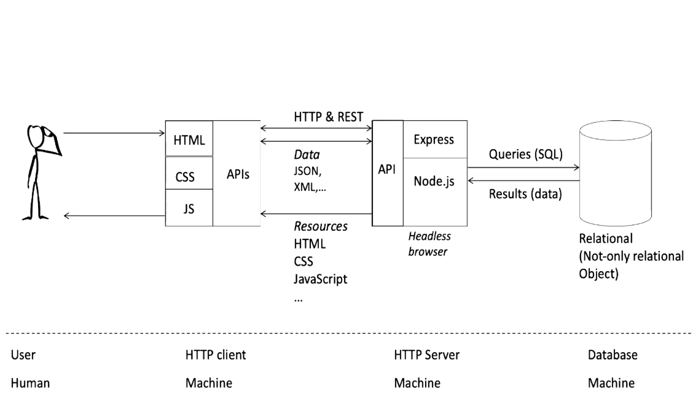
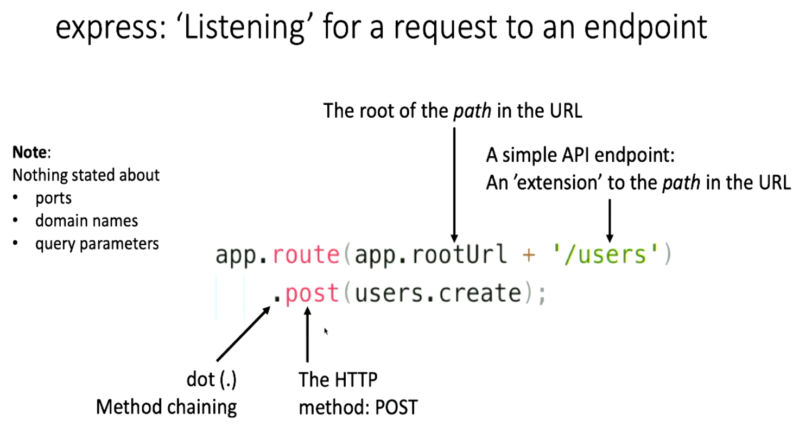
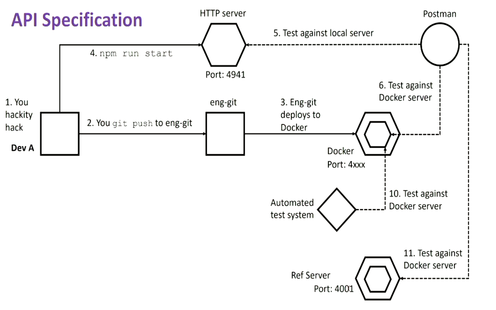
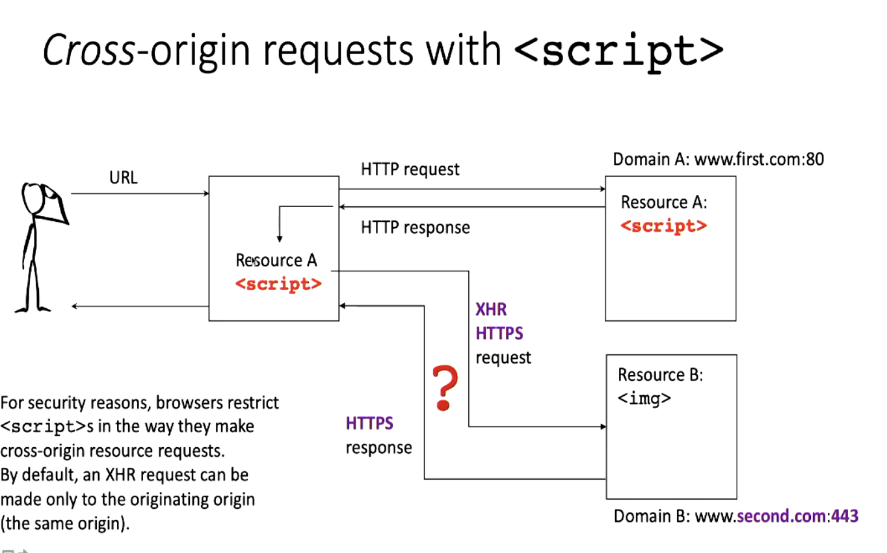
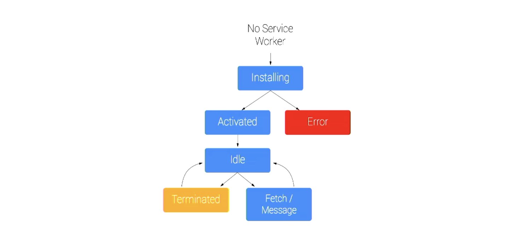

\newpage

# Course Information

This course explores web applications and the underlying distributed application architectures and technologies. Topics will include web fundamentals (HTML, HTTP, CSS, JavaScript), asynchronous events, data persistence, web application architectures, AJAX, web APIs, and web computing.

## Grading Structure

- Assignment One (25%)
  - No extension
- Mid-semester test (20%)
  - Wednesday 24 March, 7:00 pm
  - Topics
    - HTTP
    - REST API
    - JavaScript
    - Web databases
  - paper exam, closed book
  - 24 short answer questions
  - 2 hours (should take less)
- Assignment 2 (25%)
  - Compulsory lab in final week
  - No extension
- Exam (30%)
  - 2 hours

\newpage

# Lectures

##  Lecture One: Introduction to HTTP and JavaScript

**What is a web application?**

- Uses `HTTP` server to interact
- Runs in a web-browser
- Generally interacts with a server back-end

We will be using a restful approach to building our JavaScript web application's.

**Here is how we will structure a web-app**



In _Assignment One_ we will need to do the following

- Create `HTTP` server + application
- `HTTP` requests and response cycle
- `URL` e.g. protocol, path, endpoints, query parameters
- `HTTP` headers and body
  - Headers: e.g. using Cookies
  - Headers: e.g. `CORS`
  - Body e.g. `JSON` data
- `HTTP` methods e.g. `GET, PUT, DELETE`
- `HTTP` status codes e.g. `201`, `404`
- Authentication and authorization
- Asynchronous requests
- Database connectivity
- Conform to `API` specification
  - You will be given an `API` specification to implement

> NOTE: When we do the assignment we will all be assigned a port number to connect to on the test server

In _Assignment Two_ we will need to do the following

**HTTP Client**

- `HTML` + `CSS` + `JS` app
- Modern browser
- Implementing user story backlog
- Authentication and authorization
- Asynchronous requests
- `RESTful API` calls

`HTTP` messages are how data is exchanged between the server and the client, there are two types of
messages: _requests_ sent by the client to trigger a _response_ from the server.

`HTTP` messages are composed of a textual information encoded in `ASCII`, and span over multiple
lines. In `HTTP/1.1` and earlier versions of the protocol, these messages were **openly** sent across
the connection.

**Uniform Resource Identifiers (URI's)**

- A string of characters to identify (name, or name and location) resource.
- A `URL` is a `URI` that also specifies the means of acting upon or obtaining representation
- A `URN` is a historic `URI` term that has since been depreciated

- The `HTML` path is increasingly becoming an abstraction as unlike an `HTML` path, the ever more growing
  language `JavaScript` does not show the local path, and instead uses a server to generate the html that
  is being used to pass parameter calls for functions, id numbers, versioning information etc.

**Anchors**

- Anchors are used as bookmarks within a classic `HTML` file.

> NOTE: There are many `JS` libraries to achieve the above functionality, we will mostly be implementing
> these libraries rather than building this functionality from scratch.

As well as the `URL`, there are `HTTP` headers:

- General headers: required and additional
- Entity headers: applies to the body of the request
- Request headers
- Response headers
- Cookies are implemented within the header using `set-cookie: <...>`

We use headers and cookies in order to:

- Maintain session
- Personalise
- Track data (e.g. advertising)

**Header structures**

**Structure and example of `HTTP` requests**

```
HTTP-method SP Request-URL SP HTTP-Version CRLF

Request body...
```

**Example GET request**

```
GET /pub/blah.html HTTP/1.1
HOST: www.w3.org

Body of post (e.g. form fields; this is usually in the form of JSON data)
```

**HTTP Responses**

```
HTTP-Version SP Status-Code SP Reason-Phrase CRLF
Response body
```

**Successful response (GET/POST)**

```
HTTP/1.1 200 OK
Data: Mon, 04 Jul 2011 06:00:01 GMT
Server: Apache
Accept-Rangers: bytes
Content-Length 1240
Connection: close
Content-Type: test/html; charset=UTF-8

<HTML body>
```

**Response Codes**

- 1xx: Informational issues
- 2xx: Success
- 3xx: Redirections
- 4xx: Client error
- 5xx: Server error

> We will be using the Express Package in order to build our server, this will allow us to listen
> for requests on an endpoint, below is a diagram of how this might work:



**The body of an HTTP request**

- Three types of body data:
  - Single resource bodies: consisting of single file of known length, defined by the two headers `Content-Type` and `Content-Length`.
  - Single resource bodies: consisting of sing files of unknown length, encoded using chunks with `Transfer-Encoding`.
  - Multiple-resource bodies: consisting of multipart body, each containing a different section of information. These are relatively rare.

There are a number of `HTTP` verbs:

1. `GET`
2. `PUT`
3. `POST`
4. `DELETE`
5. `HEAD`
6. `PATCH`

**REST (Representational State Transfer)**

`REST` is a way for developers to use `HTTP` methods/verbs explicitly and consistently with the `HTTP` protocol
definition. `REST` and `CRUD` are used together, rest implies that we should only use these `HTTP` verbs ONLY when
we want to implement `CRUD`, we should not use these verbs for other tasks, `REST` implies that it is bad practice
to use `HTTP` methods in unconventional ways.

##### JavaScript Introduction

**JavaScript has the following things**

- Objects, methods and functions
- Expressions, statements and declarations
- Functions
  - Immediately invoked function expression
- Scoping issues
- Variables and (variable hoisting)
- Closures
- this keyword
- Method chaining (cascading
- `use strict`; mode
- Modularisation: export and require
- Node.js
- Asynchronous (event) handling
  - Callbacks, Promises Async/Await

**JavaScript is object orientated, however it is not strictly OOP**

- An object is a collection of properties and a property is an association between a name or key and a value
- A property can itself be an object
- A method is a function associated with an object or alternatively a method is a property that is a function
- Functions are first-class objects
- They can have properties and methods, just like an other object
- Unlike other objects, functions can be called
- Functions are, technically, function objects
- Functions can be called like a lambda function by putting () around the whole function
- Functions can be unnamed

**Expressions, statements and declarations**

- An expression produces a value
- A statement does not return a value
- Declarations are creations of net things
- JavaScript also has
  - Expression statements: where it expects a statement you can also write an expression
  - The reverse does not hold: you cannot write a statement where JavaScript expects an expression

Example of this in implementation:

```JavaScript
var result = function aFunction () {
    return -1
}
```

> This will assign result = aFunction(), it is NOT equal to -1 (in this case it is because there is no parameter being passed)

To execute a function immediately we can call it using the following syntax

```JavaScript
+function functionName () {
    console.log('Hello, World!')
} (); // These end brackets call the function immediately defined above
```

Anything defined within a function is within its scope, nested functions will contain the same
scope as the outer function.

> IMPORTANT NOTE: Functions will use the scope of where they are declared, not where they are called or implemented.

Using the following code will avoid these idiocies as they are blocked scoped:

```JavaScript
let x = 1;
const y = 2;
```

Use `this` keyword carefully, it references different objects depending on the context it is implemented in:

- In a browser it references the window
- in node.js it references a global object
- and in other context it works differently

Chaining functions can make your code more readable.

## Lecture Two: Asynchronous behaviour

A problem that we commonly face is when we have some set of actions, but we do not know in what
order these tasks/actions are going to be completed in. `JavaScript` is a single threaded language,
it has a single call stack, a heap and the message queue which records a list of messages to be processed and the associate callbakc
functions to execute.

It also has an event loop, this is the order of operations the heap is called in, understanding this
is crucial to understanding odd errors that may occur.

The term `Blocking` really just means, we don't want to fill the call stack, when we have blocking code is JS
it is just when the call stack is too full (a while loop if it is not running too long will not be blocking)

We need to structure our code into different modules, there are different ways of managing this.
Modular JavaScript files, we will be using the `CommonJS` approach.

`CommonJS:`

- One specification for managing module dependencies
- maps well to `Node.js`

We can use the `require()` function in order to use local modules, and we are able to install
external modules using the Node Package Manager (`npm`) _commands - install, upgrade, status, -v_

```javascript
// Syntax for require function
var importJson = require("./path/to/data.json");
```

We will use the `express` library as a public interface module to use the web.

## Lecture Three: data persistence with SQL, memory stores and Graph DB

**Using JSON data**

- JSON is a lightweight data-interchange format
- A syntax for serializing data, objects, arrays, numbers, strings
- Data only, does not support comments except as a data field
- Non specific to JavaScript
  - Was originally intended for data interchange between Java and JavaScript
- No versioning for JSON
  - Enables consistency
  - Data gets updated all the time, it means that the syntax will always remain stable
- JSON has many variants (maintained by different people)
  - JSON-T (template JSON)
  - Many other forms of JSON
- JSON rules:
  - All key-names are double-quoted
  - Values
    - Strings are double quoted
    - Non-strings are not quoted
  - Escape uses \
  - Works with a set of values contained (can be mapped to a large dictionary)

**Relational Databases**

- One of the few situations where a theoretical contribution led to use case in the industry
- Relational Model
  - Data is presented as relations
  - Collections of tables with columns and rows (tuples)
  - Each tuple has attributes
  - Unique key per row
  - Relational model is built off of Relational Calculus (formal notation of key points)
- ACID transactions
  - Atomicity: if one part of a transaction fails, then transaction fails
  - Consistency: the database is kept in a consistent state before and after transaction execution
  - isolation: one transaction should not see the effects of another in progress
  - Durability: ensures transactions, once committed, are persistent

**CAP Theorem**

- In distributed computing, choose two of:
  - Consistency - every read receives the most recent data
  - Availability - every read receives a response
  - Partition tolerance - system continues if network goes down
- Situation is actually more subtle than implied
- BASE
  - Give up consistency and instead get:
    - Basic Availability - through replication
    - Soft state - state of the system may change over time
    - Eventual consistency - the data will be consistent eventually

**Memory Data Store**

- Whole database stored in RAM
  - Very fast access
  - Useful for cached storage
- Key value store where the value can be complex data structure
  - Strings, Bit arrays, lists, sets, hashes
  - streams
  - binary safe keys
  - command set for optimized load, storing and changing data values
- Useful for logging

**Document Databases**

- Storing in local files (JSON/XML or any other unstructured data format)
- Tends to be stored with meta data (security, providence)
- Builds index from contexts and meta data
- storage of raw program types
- Complex data easily stored
- No need for costly schema
- Same data can be replicated (loads of redundancy)

**Graph Databases**

- Nodes: represent an entity
- Edge: represents relationship between nodes
- Properties: describe attributes of the node or edge
- Hyper graph: one edge can join multiple nodes

## Lecture Four: REST

A REST service has the following benefits

- Platform independent
- Language independent
- Standards based (runs on top of http)
- Can easily be used in presence of firewalls
- RESTful systems typically
  - communicate over HTTP
  - with the same HTTP verbs (GET, POST, PUT, DELETE)
- Use URL to navigate between the API instances

## Lecture Five: automated API testing

Note that for the assignments that we are assigned within this course, the
local port servers will be hosted via your local computer (and a database that
is port forwarded through the university), this is different from the test server
as the test server is set up using a docker container on a virtual machine with a
series of automated tests run on a server. This is what allows us to build on the
`eng-git` server with automated testing.

You can run the tests via local host if we change the deploy address to `localhost:9499`
or what ever the local port that is allocated.

**Differences between the logic on the server and localhost**

1. Why can your local `HTTP` server pass your postman tests and fail the automated
   server tests?
2. What problems arise when you use automated testing on the testing server

> These happen because of the raw number of requests that are being run onto the
> local my SQL services. This is just a factor of how the University has the testing
> server set up.

Here is a diagram for how the `API` specification manages requests to the test server:



Example of formatting routes for an HTTP request from `users.routes.js`
This is responsible for directing the endpoints to get the correct information
for an end user

```Javascript
const users = require("../controllers/users.controller");

module.exports = function (app) {
  app.route(app.rootUrl + "/users/login").post(users.login);
  app.route(app.rootUrl + "/users/logout").post(users.logout);
};
```

Here is an example of a controller for an HTTP Request from `users.controller.js`
This is where we handle all the logic for the request, checking inputs from the
request and then gets the SQL request from the model and then returns the response
to the user routes

```Javascript
const users = require("../models/users.model");
const tokenCreate = require("rand-token");
const passwords = require("../passwords");
const bcrypt = require("bcrypt");

exports.login = async function (req, res) {
  try {
    const email = req.body.email;
    const password = await passwords.hash(req.body.password);
    const token = tokenCreate.generate(32);
    if (
      !email.includes("@") ||
      email == undefined ||
      email.length < 1 ||
      password == undefined ||
      password.length < 1
    ) {
      res.status(400).send(`ERROR: Bad Request`);
    } else {
      const response = await users.loginAccount(email);
      if (response == null) {
        res.status(400).send(`ERROR: Bad Request`);
      } else if (
        (await bcrypt.compare(req.body.password, response.password)) == false
      ) {
        res.status(400).send(`ERROR: Bad Request`);
      } else if (
        (await bcrypt.compare(req.body.password, response.password)) == true
      ) {
        await users.setToken(token, response.id);
        res.status(200).send({
          userId: response.id,
          token: token,
        });
        return token;
      }
    }
  } catch (err) {
    console.log(err);
    res.status(500).send(`ERROR: Internal Server Error`);
  }
};

exports.logout = async function (req, res) {
  try {
    const token = req.header("X-Authorization");
    if (token == null || token == undefined) {
      res.status(401).send(`ERROR: Unauthorized`);
    } else {
      const response = await users.logoutAccount(token);
      if (response[0].affectedRows == 0) {
        res.status(401).send(`ERROR: Unauthorized`);
      } else {
        res.status(200).send();
      }
    }
  } catch (err) {
    console.log(err);
    res.status(500).send(`ERROR: Internal Server Error`);
  }
};
```

Here is an example of the model code for an HTTP request, this is responsible
for making the request to the SQL database.

```javascript
const db = require("../../config/db");

exports.loginAccount = async function (email) {
  try {
    const post = `select email, password, id from user where email='${email}'`;
    const conn = await db.getPool().getConnection();
    const [[response]] = await conn.query(post);
    conn.release();
    if (response == undefined) {
      return null;
    }
    return response;
  } catch (err) {
    return null;
  }
};

exports.logoutAccount = async function (token) {
  const update = `update user set auth_token=null where auth_token ='${token}'`;
  const conn = await db.getPool().getConnection();
  const response = await conn.query(update);
  conn.release();
  return response;
};
```

**Overfetching**

- You might download more information than you need

**Underfetching**

- You request less information that you need
- making multiple small requests when we could have made one larger request at less cost

## Lecture Six: GraphQL

GraphQL is a _specification_ for how you specify data (strong typing) and how you
go about querying that data.

There are some reference implementations of GraphQL specification found at
here: [GraphQL JavaScript Specification](https://github.com/graphql/graphql-js)

When using GraphQL A query returns a 200 response code even if the request errors
out. Errors are returned in user-defined fields, however Network errors can still return
500 and 400 error codes.

- GraphQL does not require you to think in terms of graphs
  - Though relational tables are useful for understanding
  - You think in terms of `JSON Objects` for a query
- Is not querying the database directly
  - Rather is a language specification for composing queries to a server
- Still requires some kind of pre-defined data and queries on the server-side
  - Objects, fields and allowable queries
  - But these pre-defined are more `atomic` in their nature

Chai and Mocha are two testing frameworks for JavaScript that we will be using
in this class.

We should use an Asynchronous approach for when we are creating testing:

- Mocha, Chai and Chai-HTTP can handle callbacks, Promises and async/await
- Don't get these mixed up in a given test
  - Avoid the use of `return` together with `done()`

Examples of defined tests can be found here: [Lecture timestamp: 1:15:55](https://echo360.org.au/lesson/G_0c1781e5-18d4-4145-8806-278aa32a3721_8cb25fb2-b0ca-42be-a65b-3d0d917c9027_2021-03-23T16:00:00.000_2021-03-23T17:55:00.000/classroom#sortDirection=desc)

The testing framework has similar testing functions to those seen in `Jest`:

- `beforeEach()`
- `before()`
- `after()`

More information can be found in the documentation with Chai and Mocha testing.

## Lecture 6: Security and Introduction to Web Clients

Note, incorporating security on a advanced level is not in the scope of the course,
the content covered here is more of a primer to encourage you to do your own reading
of security content.

\newpage

**OWASP: The Open Web Application Security Project**

This is an open source project that is about how to deal with security in web
development, further can be found on the `OWASP` website, but here is a summary.

| Top 10 Security issues                      |
| ---                                         |
| Injection                                   |
| Broken Authentication                       |
| Sensitive Data Exposure                     |
| Broken Access Control                       |
| XML External Entities (XXE)                 |
| Security Misconfiguration                   |
| Cross-Site Scripting (XSS)                  |
| Insecure De-serialization                   |
| Using Components with Known Vulnerabilities |
| Insufficent Logging and Monitoring          |

> Note: Some of these topics will be explained later throughout the course

One method to validate a field is to validate and re-validate.

An input field is likely to be validated on the client side, that an `IDNumber`
text field contains a number rather than a number on a malicious piece of code

Definitions:

- **Authentication:** Establish claimed identity
- **Authorisation:** Establish permission to act

We need to authenticate before we authorise a user. Authenticating a user means
to check if the user is valid, i.e. *correct user name and password*, to authorise
a user means to have the correct permissions i.e. *user is an administrator*

The bear minimum for a secure network is to use `HTTPS` (the HTTP protocol with SSL)

Steps to securing:

- Verify architecture
- Verify the implementation
- Follow guidelines from `OWASP`

> Note: JavaScript + Node does NOT EQUAL JavaScript + browser

When dealing with JavaScript in the browser, you are dealing with the user, client side
with indirect input and output via `HTML + CSS` and the `DOM`, when using JavaScript on 
the server side, we are interacting with inputs and outputting responses to the front end
data. *Another thing to realise is that a large number of npm packages won't work in you're
browser*.

## Lecture Seven: SPA's, Vue.js and Design patterns

Vue.js uses all three of the main client-side technologies `Javascript,
CSS, HTML`. One of the fundamental things that has changed in browser applications
is the movement towards single page applications (SPA's). This allows us to have
an improved user interaction because of the following reasons.

- Users want responsiveness and interactivity; improved user experience
  - Compare user experience with native and stand alone applications
- Managing the user interactions with a user is much more complex than managing interaction with a server

Single page applications are distinguished by their ability to redraw a small segment
of the user interface rather than redrawing the entire page, in Vue these are known as
`Vue Components`.

**Goals and Features of SPA's**

- Reduce server communication
- Data binding
- Content and representation (HTML, CSS, JS)
- Page navigation and routing within an SPA
  - routing represents the state of the application (often paired with a change of URL)
  - Managing page history
- CORS
- Asynchronous background fetching of data by using web sockets or XHR

**Design patterns**

**Separation of concerns**

- A design principle for separating software code into distinct sections, such that
each section addresses a separate concern
- A strategy for handling complexity
  - Classes, objects and methods
- Web computing
  - HTML
  - CSS
  - JavaScript

There are many different models and design patterns for code, `MVC, MVA, ...`.

**MVC Model**

- Multiple views
- Synchronized views
- Pluggable views and controllers
- Exchangeable look and feel

## Lecture Eight: Communicating with servers in SPAs

We use Asynchronous JavaScript and XML (AJAX) to retrieve data from the server
or send data to the server, whilst the user is interacting with your web page
on the browser.

The term `XMLHttpeRequest` is misleading as it refers to both XML and JSON
formatting, and can also refer to protocols other than HTTP. This process is
generally asynchronous, although it doesn't need to be asynchronous.

**Cross Origin Requests (CORS)**

Cross origin requests are set by the server, these act as a set of rules the
server defines onto the browser and client in order to allow them to interact
with the server. If the client does not follow these rules, the request will
result in a `CORS Error`.

The browser is responsible for enforcing cors errors, not the client itself.

COR's effectively restricts the use of headers by the client in order to restrict
the requests privileges of incoming clients. Here is an example of this:

{width=50%}

## Lecture Nine: Web Storage and Progressive Web Applications

**Web Storage**

- Cookies have limitations
  * Size limited to 4KB
  * Send to server with each request
  * sent back and forward between server and client
- HTML5 web storage
  * Allows up to approx 5MB
  * Two types:
    - Local Storage
    - Session Storage
  * Not more secure than cookies

**Local Storage**

- Stores *permanent* data for your site
- Stores data in key, value pairs
- Setters and getter functions
  * `localStorage.setItem(key, value);`
  * `localStorage.getItem(key);`

We need to meet users expectations (deleting local storage on logout), that
no information is saved after the user has left the website.

Pure JavaScript example:

```javascript
if(localStorage) {
  localStorage.setItem("first_name", "Jordan");
} else {
  alert("soory, the browser you are using does not support local storage");
}
```

Doing this in `Vue.js`

- can get local storage values in `mounted()`
- Should probably not set local storage on data change
- e.g. a `save` button and corresponding Vue method

**Session storage**

- stores temporary data for your site
- Deleted when the session ends
- same getters and setters as local storage

```javascript
if(sessionStorage) {
  sessionStorage.setItem("first_name", "Jordan");
} else {
  alert("soory, the browser you are using does not support session storage");
}
```

**IndexedDB**

- Web API for creating indexed NoSQL databases in browser for a web page
- Can create multiple object stores
- Primary keys
- Indexes
- CRUD requests are asynchronous using promises

**CacheStorage API**

- Stores pairs of request and response objects
- caches can be hundreds of megabytes
- Access cache with `const cache = await caches.open('my-cache');`
- Adding to cache:
  * `cache.add(new Request('./data.json'));`
  * can add multiple by supplying a list
  * can put: `cache.put('/test.json', new Response('{"foo": "bar"}'));`
- Retrieve from cache:
  * `const response = await cache.match(request);`

**Progressive Web Applications**

What is a progressive web app?

> It is essentially an app run within the browser, to mimick a native application
> (looks and feels like a ios/android app, however is effectively a browser instance.

By definition it needs to do the following:

- Originate from a Secure Origin
- Load while offline - *using cache to load page*
- Reference a Web App Manifest
  * name
  * short_name
  * start_url
  * display
  * icon (min 144x144 px .png)
- In HTML must link to manifest (same as linking CSS)

Service worker lifecycle

- Javascript that runs in background
- Must be started by the webpage



More information about Progressive Web Applications

- Web applications designed to appear to be installed as native applications
- Begin life in a browser tab
- Rely on service workers
  * Proxy servers that sit between web applications and the browser and network
  * notifications
  * background sync
  * JavaScript that:
    + Runs on its own thread: not blocking
    + Is headless (no access to DOM)
  * Rely on HTTPS, for security
  * Associated with specific server/website
- Mobile-friendly design
- Near-instant loading times
  * Interactive in less that 5 sec before service worker installed
  * Once Service workker installed, should load with max time ~2 seconds 
- Fluid animations

**Running SPA's on devices**

- Many forms of connection types
- All have browser, but also applications
- One option is to develop websites and native applications in parallel
- Alternative is progressive web applications
- Progressive web applications
  * on mobile, a progressive web app is smaller
  * Adaptable (no need for app store approvals when making changes)
  * Automatic updates
  * New operating systems
  * Faster, more efficient development

**Web Assembly**

- Binary code that is pre-compiled to Web Assembly (wasm) from other languages
- Ahead of time or just in time compilation of wasm in browser
- 2019 W3C recommendation
- Can be supporting technology for PWA, but designed for any high-performance web page

## Lecture Ten: Testing in Web Development

**Automating testing**

- Having 125 students implementing a server to an api spec is like:
  * having 125 companies implementing a reference specification
  * Example: Implementers of GraphGL Specfications
- Having 125 students implementing a client to interact via an api is like:
  * Having 125 companies developing products to interact with an ecosystem
  * Example: Customers of Google Maps API

## Lecture Eleven: Recap

> This lecture is just explaining the exam/end of year test.

Testing on:

- Be able to look at given client-side scripts and fill in gaps and explain
- Understand how JS changes HTML
- SPA's
- Vue.js
  * Be able to look at given vue scripts and fill in gaps/explain
  * Basics of Vue also learned in Labs 4-6
  * how to mount an element, template HTML and CSS styling and functional JS
- XML http requests
  * How to make an ASync requests
  * Concurrency in Javascript
  * AJAX
  * CORS
    * How it works
    * Headers - What are cors headers
    * Origin
  * Web sockets
    * Differences to HTTP
